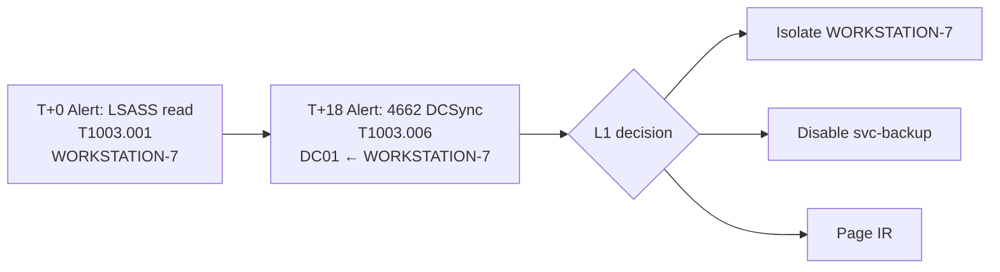
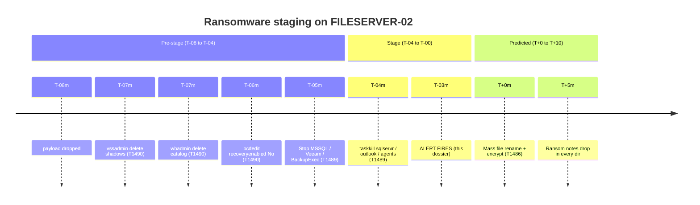
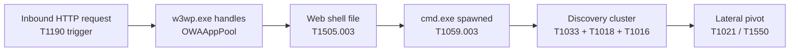
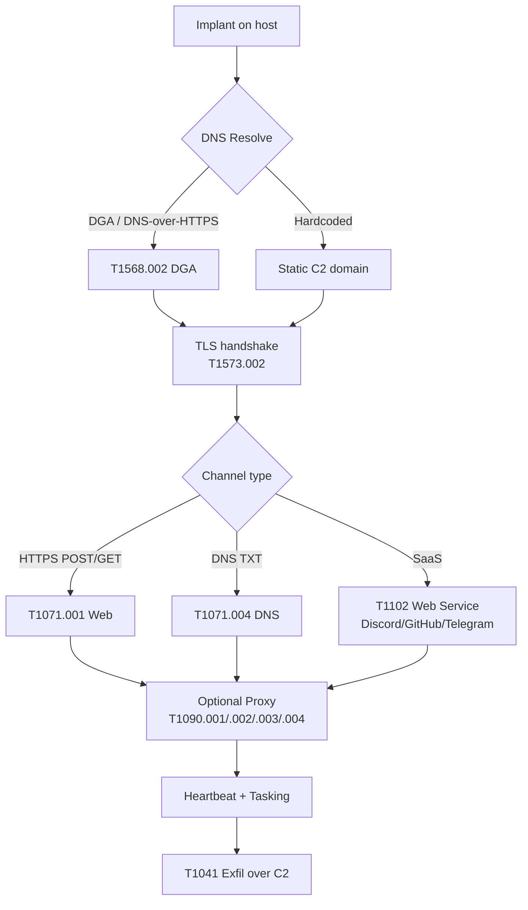
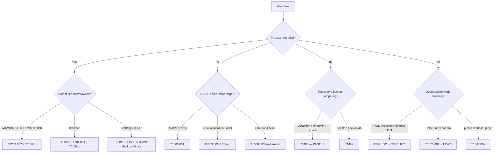

# Research Dossier: Common ATT&CK Techniques for L1 SOC Analysts

**Target module:** ION L1 *Alert Triage Fundamentals* — Module 8 (capstone). Authored at BTL1 / SANS GCIH equivalent depth, ~10,000 words across 4 reading lessons + 4 quiz lessons. ATT&CK reference baseline: **v15 / v16** (2024–2026 era; some technique pages were last revised in v14, and a small number of sub-tech IDs were renumbered when the sub-technique overhaul of 2020 propagated through later versions — flagged inline where relevant).

**Authoritative references used throughout:**
- `attack.mitre.org` (technique pages)
- `mitre-attack.github.io/attack-navigator/`
- `attack.mitre.org/resources/working-with-attack/` (data-source taxonomy)
- `lolbas-project.github.io` (LOLBAS)
- `gtfobins.github.io` (Linux equivalent)
- MITRE Engenuity Center for Threat-Informed Defense (CTID) — adversary emulation plans, top-techniques calculator, sensor mappings
- Red Canary *Threat Detection Report* (annual) — empirical "most-seen" technique frequencies
- CISA KEV catalogue (`cisa.gov/known-exploited-vulnerabilities-catalog`)
- ATT&CK STIX bundle (`github.com/mitre-attack/attack-stix-data`)

---

## 1. The ATT&CK framework, as an L1 sees it

ATT&CK is a knowledge base, not a methodology. It is a *catalogue* of adversary behaviour — what attackers do once they have access — organised into a grid that defenders can use to talk about coverage, detection, and threat-actor TTPs in a single shared vocabulary. For an L1 analyst, the framework is best understood as a **lookup table**: an alert fires, you map the alert to a technique ID, and that ID then unlocks a body of public knowledge about how the technique manifests, what telemetry betrays it, and what comes next in the kill chain.

### 1.1 The four-tier hierarchy

ATT&CK Enterprise organises adversary behaviour into four nested concepts:

- **Tactic** — the adversary's *goal* at a stage of an intrusion. Tactics answer **why** the adversary is performing an action. There are 14 enterprise tactics, each with a `TA####` identifier:
  - **TA0043** Reconnaissance
  - **TA0042** Resource Development
  - **TA0001** Initial Access
  - **TA0002** Execution
  - **TA0003** Persistence
  - **TA0004** Privilege Escalation
  - **TA0005** Defense Evasion
  - **TA0006** Credential Access
  - **TA0007** Discovery
  - **TA0008** Lateral Movement
  - **TA0009** Collection
  - **TA0011** Command and Control
  - **TA0010** Exfiltration
  - **TA0040** Impact

- **Technique** — *how* the goal is achieved. Each technique has a `T####` identifier (e.g. **T1059** Command and Scripting Interpreter).
- **Sub-technique** — a finer-grained variant of a technique, formatted as `T####.###` (e.g. **T1059.001** PowerShell). Sub-techniques were introduced in mid-2020 (the "sub-technique overhaul"); pre-2020 documentation often cites only the parent ID.
- **Procedure** — a specific *instance* of a technique, observed in real reporting. ATT&CK records procedures as `Group → Technique` or `Software → Technique` mappings with short narrative excerpts (e.g. *"Mustang Panda has used scheduled tasks for persistence."*). Procedures are *evidence*, not classification, and the cluster names rotate (a group may be re-attributed, merged, or split between vendors); cite the technique, not the actor, when in doubt.

A technique can belong to *multiple* tactics — `T1078 Valid Accounts` is simultaneously an Initial Access, Persistence, Privilege Escalation, and Defense Evasion technique, because the *same behaviour* serves four goals at four phases.

### 1.2 Matrices

Enterprise ATT&CK is a single conceptual matrix but is rendered per-platform:

- **Windows / macOS / Linux** — the three "endpoint" cuts.
- **Cloud** — broken into **Azure AD / Entra ID**, **Office 365**, **Google Workspace**, **SaaS**, **IaaS** sub-matrices. The cloud matrix has changed shape several times since 2020.
- **Network** (network-device techniques — routers, firewalls).
- **Containers** (Kubernetes, Docker).
- **ESXi** (added 2024, in v15 era; covers hypervisor-targeting ransomware behaviour).

Two sister knowledge bases exist:
- **ATT&CK for Mobile** (Android / iOS).
- **ATT&CK for ICS** (industrial control systems — different tactics list, e.g. *Inhibit Response Function*).

L1 SOC analysts on a typical enterprise queue work overwhelmingly inside Enterprise/Windows + Enterprise/Cloud.

### 1.3 ATT&CK Navigator

The Navigator (`mitre-attack.github.io/attack-navigator/`) is a browser-based grid view. A **layer** is a colour-coded overlay on the matrix, encoded as a JSON file. Common layer types:

- **Coverage layers** — your detection content mapped onto the matrix. "We have rules for technique X" → green; "no detection" → red.
- **Threat-actor layers** — every technique a tracked group has used, mapped onto the matrix.
- **Detection-coverage overlays** — combine rule coverage with observed adversary behaviour to identify *gaps where detection is missing for techniques the relevant adversary uses*.

L1s rarely *author* layers, but they will see them in handover documents and gap-analysis briefings. Recognise that the colours encode *coverage*, not *prevalence* — a green cell is "we can see it," not "it is happening now."

### 1.4 Versioning

ATT&CK ships major versions roughly twice a year. Notable inflection points:

- **v6 (2019)** — pre-sub-technique baseline.
- **v7 (mid-2020)** — sub-technique overhaul; many parent techniques split.
- **v9–v10 (2021)** — Cloud platform broken out; Data Source taxonomy redesigned.
- **v11–v12 (2022)** — campaigns added; ICS extended.
- **v14 (late 2023)** — assets, mobile structured detections.
- **v15 (early 2024)** — ESXi platform added; mitigation revisions.
- **v16 (late 2024) / v17 (2025)** — continued refinement; cloud matrix cleanup.

Authoring note: technique numbers are *sticky* but not immutable. A handful have been deprecated and replaced (e.g. several pre-2020 parent techniques became sub-techniques of a new parent). When citing, use the technique ID + name + ATT&CK version. The dossier targets v15–v16; flag in the published lesson that *"if a technique number doesn't render on attack.mitre.org, search the technique name — it may have been merged or renumbered."*

### 1.5 Authoritative references

- **Technique pages:** `attack.mitre.org/techniques/T####/` (and `/T####/###/` for sub-techniques).
- **Tactic pages:** `attack.mitre.org/tactics/TA####/`.
- **STIX bundle:** `github.com/mitre-attack/attack-stix-data` — programmatic source of truth.
- **Navigator:** `mitre-attack.github.io/attack-navigator/`.
- **CTID Top Techniques calculator** — frequency-weighted technique scoring.
- **Red Canary Threat Detection Report** — annual "most-seen" technique chart.

---

## 2. Reading an ATT&CK technique page like an L1 — worked example: T1059.001 PowerShell

URL: `attack.mitre.org/techniques/T1059/001/`

A technique page has a fixed structure. As an L1, you do not need to read the whole page on every alert; you need to know *where to jump*.

### 2.1 Description

The opening paragraph is plain English. For T1059.001: *"Adversaries may abuse PowerShell commands and scripts for execution."* Skim this only when the technique is unfamiliar.

### 2.2 Sub-techniques row

If the technique has sub-techniques (and most workhorse techniques do), the page lists them. T1059 has **.001 PowerShell**, **.002 AppleScript**, **.003 Windows Command Shell**, **.004 Unix Shell**, **.005 Visual Basic**, **.006 Python**, **.007 JavaScript**, **.008 Network Device CLI**, **.009 Cloud API**.

The sub-tech you cite *matters* — it determines the telemetry path. PowerShell (.001) lights up Sysmon EID 1 and the PowerShell operational log (EID 4103/4104); cmd (.003) lights up EID 1 with `cmd.exe`. A wrong sub-tech in the case metadata will mislead the next analyst.

### 2.3 Procedure examples

ATT&CK lists named *Groups* and *Software* that have used the technique. For T1059.001 the list runs to dozens of entries. *Useful when:* you suspect a specific actor and want a quick yes/no on whether PowerShell abuse is in their playbook. *Caveat:* procedures are public-reporting-derived, lag real activity, and use cluster names that rotate between vendors. **Do not cite a group name in case metadata unless the rule explicitly attributes it.**

### 2.4 Mitigations

Listed as `M####` IDs. For T1059.001:
- **M1042** Disable or Remove Feature or Program (Constrained Language Mode, AppLocker)
- **M1038** Execution Prevention
- **M1026** Privileged Account Management
- **M1049** Antivirus / Antimalware (AMSI)

L1s rarely *implement* mitigations, but knowing they exist informs the question *"why didn't this get blocked?"* — usually the answer is the mitigation isn't in place or has a gap.

### 2.5 Detections

The "Detection" section lists analytic patterns. For T1059.001: *"Monitor for execution of PowerShell with unusual command-line arguments such as `-EncodedCommand`, `-ExecutionPolicy Bypass`, `IEX`, `DownloadString`, …"*. This is the L1's most-used section after the description.

### 2.6 Data Sources / Data Components

Post-2021 ATT&CK uses a structured **Data Source → Data Component** taxonomy. For T1059.001:
- **Process: Process Creation** (Sysmon EID 1, Defender `DeviceProcessEvents`, ECS `process.*`)
- **Process: Process Metadata**
- **Module: Module Load** (PowerShell module / assembly load — EID 4103, Sysmon EID 7)
- **Command: Command Execution** (PowerShell EID 4104 script-block logging)
- **Script: Script Execution**

Map this to your stack:

| ATT&CK Data Component | Sysmon | Windows Event Log | Defender Advanced Hunting | ECS field |
| --- | --- | --- | --- | --- |
| Process: Process Creation | EID 1 | 4688 | `DeviceProcessEvents` | `process.command_line`, `process.parent.name` |
| Command: Command Execution | — | PowerShell 4104 | `DeviceProcessEvents` (CommandLine) | `process.command_line` |
| Module: Module Load | EID 7 | PowerShell 4103 | `DeviceImageLoadEvents` | `dll.name`, `process.executable` |

### 2.7 References

The footnotes link to public reporting. Useful for spinning up context fast on a novel technique; *not* useful for case metadata.

### 2.8 The L1 reading cadence — 30-second / 3-minute / 30-minute reads

Reading a technique page is rarely a single act. Three cadences:

- **30-second read** (you've seen this technique 50 times before, and you just need the technique ID + sub-tech ID for the case). Skim the page header. Confirm the sub-tech variant matches the alert artefact. Copy the ID into the case. Done.
- **3-minute read** (technique is familiar but the alert variant looks novel). Header → Sub-techniques row → Detection section → first three Procedure examples. The goal is to confirm "this is plausible" or to spot "this isn't the right technique — let me look at adjacent techniques."
- **30-minute read** (technique is unfamiliar; or the case has been escalated and you're writing a handover packet). Whole page, plus at least two of the cited references. Build a mental model of *why* the technique works, not just what it looks like. This is the kind of read you do during quiet hours, not in a queue at 14:32.

The error-state to avoid: a *zero-second read*, where the analyst pastes the technique ID from the alert title without verifying the sub-tech matches the artefact. Half of mis-classified cases trace to this. The 30-second discipline catches it.

### 2.9 Worked snippet: artefact → technique-page jump

**Alert artefact:**
```
process.parent.name = "WINWORD.EXE"
process.name        = "powershell.exe"
process.command_line = "powershell.exe -nop -w hidden -enc SQBFAFgAIAAoAE4AZQB3..."
```

**30-second read on T1059.001.** Sub-tech is unambiguously **PowerShell**. Note the `-enc` plus the `-w hidden` plus the `-nop`. The Detection section of T1059.001 explicitly calls out these flags. Tag the case with **T1059.001** + **T1027.010** (Command Obfuscation, because `-enc` carries an encoded payload). Done.

**3-minute read.** Verify parent-process tree. `WINWORD.EXE` as parent of `powershell.exe` is also covered by **T1204.002** (User Execution: Malicious File). Add it. Now the case carries three technique IDs, each precise; tiers 3 and 4 of ION's matcher will land cleanly.

---

## 3. Top Initial Access techniques (TA0001)

For each: *what it is*, *what telemetry betrays it*, *typical alert title*, *fingerprints*, *L1 triage moves*.

### 3.1 T1566 Phishing

Already covered in depth in Module 6. Sub-techniques: **.001 Spearphishing Attachment**, **.002 Spearphishing Link**, **.003 Spearphishing via Service** (LinkedIn / Teams / Discord / freemail), **.004 Spearphishing Voice** (vishing — IT-helpdesk impersonation calls).

L1 triage moves are covered in Module 6; here, recognise the technique-page lens and the sub-tech split.

### 3.2 T1190 Exploit Public-Facing Application

Adversary exploits a vuln on an internet-facing service (web app, VPN concentrator, file-transfer appliance). Recent canonical examples:
- **Log4Shell (CVE-2021-44228)** — JNDI lookup in logged input on a Java app.
- **MOVEit Transfer (CVE-2023-34362)** — SQLi → file theft, mass-exploited by Cl0p.
- **Citrix Bleed (CVE-2023-4966)** — session-token disclosure on NetScaler/ADC.
- **Ivanti Connect Secure chains (CVE-2023-46805 / CVE-2024-21887)**.
- **Confluence / Outlook NTLM-leak / Fortinet SSL-VPN** — the reliable rotation.

**Fingerprint.** Outbound shell from a process that *should not* spawn shells — `w3wp.exe` on IIS, `httpd` on Linux, `java` on Tomcat. The classic detection is a child of the web-server process with a command-line containing `whoami`, `cmd.exe /c`, or `bash -i`.

**ECS fields.** `process.parent.name = "w3wp.exe"`, `process.name in ("cmd.exe","powershell.exe","bash")`, `process.command_line` containing reconnaissance verbs.

**Cross-reference.** Always pivot to the **CISA KEV catalogue**. If the affected product/CVE is in KEV, treat as confirmed-exploitation pattern and escalate.

### 3.3 T1078 Valid Accounts

Stolen, leaked, or password-sprayed credentials used to log in legitimately. Sub-techniques: **.001 Default Accounts**, **.002 Domain Accounts**, **.003 Local Accounts**, **.004 Cloud Accounts**.

**Fingerprint.** Successful auth from anomalous source — geo, ASN, device fingerprint, time-of-day. In Entra ID: sign-in risk = *high*; in Defender for Identity: *Suspicious sign-in*.

**Telemetry.** EID 4624 with anomalous source IP, Entra `SignInLogs.RiskLevelDuringSignIn`, `SignInLogs.ResultType`. For .003 Local: EID 4624 Logon Type 2/10 from an unexpected workstation.

### 3.4 T1133 External Remote Services

RDP / VPN / Citrix / SSH / RDWeb / RD Gateway etc. exposed to the internet, accessed with valid (or weak) credentials.

**Fingerprint.** Successful RDP (Logon Type 10) from an external source IP; VPN concentrator log of new geo; SSH password auth where key auth is policy.

**L1 move.** Pivot to user history: *first time this user has logged in from this geo / this device / this hour?* If yes → escalate per Module 7.

### 3.5 T1195 Supply Chain Compromise

Sub-techniques: **.001 Compromise Software Dependencies and Development Tools** (npm/PyPI/Go module poisoning, dependency confusion), **.002 Compromise Software Supply Chain** (vendor-update-channel poisoning — SolarWinds, 3CX), **.003 Compromise Hardware Supply Chain**.

L1 rarely triages this directly — the alert that surfaces it is usually a downstream technique (suspicious child process, beacon traffic). Flag the term in case metadata only when an upstream advisory is in play.

### 3.6 T1199 Trusted Relationship

Access via a partner, contractor, MSP, or third-party tenant. The hallmark fingerprint is a service-principal or B2B-guest sign-in performing privileged actions outside its expected scope.

### 3.7 T1189 Drive-by Compromise

User browses a compromised or attacker-controlled site; browser exploit chain or social-engineered fake-update lure (the **SocGholish** pattern — fake "Chrome update" delivering a JS payload that runs `wscript`/`mshta`). Triage by parent-process tree: a script host child of a browser process is the giveaway.

---

## 4. Top Execution techniques (TA0002)

### 4.1 T1059 Command and Scripting Interpreter — the workhorse

Sub-techniques (most common in L1 queues):
- **.001 PowerShell** — encoded commands, AMSI bypasses, in-memory loaders.
- **.003 Windows Command Shell** — `cmd.exe /c` chains.
- **.005 Visual Basic** — `wscript.exe` / `cscript.exe` running `.vbs` or VBA macros.
- **.006 Python** — increasingly seen post-foothold on dev workstations.
- **.007 JavaScript** — `wscript.exe` running `.js`; HTML-smuggled SVG-with-JS.

**Suspicious-PowerShell vocabulary** (memorise; these are the high-signal substrings):
- `-EncodedCommand` / `-enc` (followed by base64)
- `-ExecutionPolicy Bypass` / `-ep bypass`
- `-NoProfile` / `-nop`
- `-WindowStyle Hidden` / `-w hidden`
- `IEX` (`Invoke-Expression`)
- `DownloadString` / `DownloadFile` / `Net.WebClient`
- `FromBase64String`
- `Invoke-Mimikatz`, `Invoke-PSExec`, `Invoke-WMIExec`
- `[Reflection.Assembly]::Load`
- AMSI bypass strings: `AmsiUtils`, `amsiInitFailed`

**KQL example (Defender Advanced Hunting):**

```kql
DeviceProcessEvents
| where Timestamp > ago(24h)
| where FileName =~ "powershell.exe" or FileName =~ "pwsh.exe"
| where ProcessCommandLine has_any ("-enc", "FromBase64String", "DownloadString", "IEX ", "Invoke-Expression", "amsi")
| project Timestamp, DeviceName, AccountName, InitiatingProcessFileName, ProcessCommandLine
| order by Timestamp desc
```

### 4.2 T1204 User Execution

**.001 Malicious Link**, **.002 Malicious File**. The Module-6 click-path joins ATT&CK here — the user double-clicks the document or shortcut, the macro/script executes, and the parent-process tree shows `WINWORD.EXE → cmd.exe → powershell.exe`. *"Suspicious child of WINWORD"* → almost always **T1204.002 → T1059.{001|003|005}**.

### 4.3 T1218 System Binary Proxy Execution — *Living Off The Land*

A signed Microsoft binary used to execute arbitrary code, evading allow-listing. Common sub-techniques:
- **.001 Compiled HTML File (chm)** — `hh.exe` opens an .hta-equivalent.
- **.003 CMSTP** — Connection Manager profile installer; abuses INF SCT scriptlets.
- **.005 Mshta** — `mshta.exe http://…/payload.hta`.
- **.007 Msiexec** — `msiexec /i http://…/x.msi /quiet`.
- **.010 Regsvr32** — `regsvr32 /s /u /n /i:http://…/x.sct scrobj.dll` (Squiblydoo).
- **.011 Rundll32** — `rundll32 javascript:"...".

**Reference:** the **LOLBAS project** (`lolbas-project.github.io`) catalogues every signed Windows binary with abuse potential, the technique IDs each maps to, and example invocations. GTFOBins is the Linux analogue. When you see an unusual command-line for a signed binary, LOLBAS first.

### 4.4 T1053 Scheduled Task/Job

**.005 Scheduled Task** on Windows. Both **execution** and **persistence**.
- **Event IDs:** 4698 (Task Created), 4702 (Task Updated), 4700 (Task Enabled).
- **Sysmon:** EID 1 with parent `svchost.exe -k netsvcs` (the host of the Schedule service).
- **Command line:** `schtasks /create /tn "..." /tr "..." /sc minute /mo 1 /ru SYSTEM`.

### 4.5 T1569 System Services

**.002 Service Execution** — PsExec class. SCM creates a service whose binary path is the payload, runs it as `LOCAL SYSTEM`, then deletes the service. Event 7045 (service installed) + service-name pattern (random 16-char strings, or the literal `PSEXESVC`) is the canonical fingerprint.

### 4.6 T1106 Native API

Direct calls into NT-level APIs (`NtCreateProcess`, `NtAllocateVirtualMemory`) bypassing higher-level wrappers — typical of in-memory loaders. Rare for L1 to read directly, but EDR alerts that name *"direct syscall"* or *"Heaven's Gate"* are this.

### 4.7 T1559 Inter-Process Communication

**.001 Component Object Model (COM)** — `MMC20.Application.ExecuteShellCommand` for lateral COM execution; Empire/Cobalt-Strike's `dcom`. **.002 Dynamic Data Exchange (DDE)** — historic Office DDE-formula payload (largely mitigated by patches but still seen on legacy estates).

---

## 5. Top Persistence techniques (TA0003)

### 5.1 T1547 Boot or Logon Autostart Execution

**.001 Registry Run Keys / Startup Folder** — the most common autostart vector. Watched paths:
- `HKLM\Software\Microsoft\Windows\CurrentVersion\Run` and `…\RunOnce`
- `HKCU\Software\Microsoft\Windows\CurrentVersion\Run`
- `%AppData%\Microsoft\Windows\Start Menu\Programs\Startup`

**Sysmon EID 13** (RegistryEvent — Value Set) is the primary signal. ECS path: `registry.path`, `registry.value`.

### 5.2 T1053.005 Scheduled Task — also persistence (see §4.4)

### 5.3 T1543 Create or Modify System Process

**.003 Windows Service** — service binary path points at the payload; survives reboot. **EID 7045**, **Sysmon EID 1** with parent `services.exe`.

### 5.4 T1136 Create Account

**.001 Local Account** — EID 4720 (User Account Created), 4732 (member added to local group).
**.002 Domain Account** — EID 4720 + 4728 on a DC.
**.003 Cloud Account** — Entra `Add user` audit event; Microsoft Graph `Directory.ReadWrite.All` operations.

### 5.5 T1098 Account Manipulation

**.005 Device Registration** — the Module 6 AiTM finisher: attacker registers a rogue device into the victim's Entra tenant to satisfy compliant-device conditional access.
**.003 Additional Cloud Roles** — assigning *Global Administrator* or *Privileged Role Administrator* to a captured account.
**.001 Additional Cloud Credentials** — adding an OAuth client secret or a certificate to a service principal (the "BEC backdoor").

### 5.6 T1574 Hijack Execution Flow

**.001 DLL Search Order Hijacking** — drop a malicious `version.dll` next to a vulnerable signed exe; Windows resolves the DLL from the exe directory before `System32`.
**.002 DLL Side-Loading** — same idea, but the carrier is a legitimate signed app (a common pattern with abused Cisco / antivirus / printer-utility binaries).

### 5.7 T1505 Server Software Component

**.003 Web Shell** — JSP/ASPX/PHP shell uploaded to a web server (China Chopper, Behinder, AntSword). Fingerprint: web-server process spawning a shell child (T1190 telemetry); short POST requests to a `.aspx` filename never seen before.

### 5.8 T1037 Boot or Logon Initialization Scripts

Logon/logoff scripts in Group Policy, `userinit` registry, AD logon-script attribute. Less common in modern estates but classic on Windows 7-era networks.

### 5.9 T1546 Event Triggered Execution

**.003 WMI Event Subscription** — a `__FilterToConsumerBinding` that fires on a system event, running a script. Detection is via WMI activity (Microsoft-Windows-WMI-Activity/Operational log, EIDs 5860–5861) plus `mofcomp` invocations.

---

## 6. Top Privilege Escalation techniques (TA0004)

- **T1068 Exploitation for Privilege Escalation** — kernel/driver exploit, BYOVD (*Bring Your Own Vulnerable Driver* — `gmer`, `RTCore64`, `kdmapper`-loadable drivers; the loaded-driver evidence is in EID 6 in Sysmon and the Code-Integrity log).
- **T1134 Access Token Manipulation** — **.001 Token Impersonation/Theft**, **.002 Create Process with Token**, **.005 SID-History Injection**.
- **T1055 Process Injection** — **.001 DLL Injection**, **.002 PE Injection**, **.003 Thread Execution Hijacking**, **.012 Process Hollowing**, **.004 Asynchronous Procedure Call**, **.011 Extra Window Memory** (the older EWMI vector). EDR alerts are the primary surface here. Sysmon EID 8 (CreateRemoteThread) and EID 10 (ProcessAccess with `0x1F0FFF` granted-access) are the classical signals.
- **T1548 Abuse Elevation Control Mechanism** — **.002 UAC Bypass**: `fodhelper.exe`, `eventvwr.exe`, `sdclt.exe` registry-hijack flavours.
- **T1078 Valid Accounts** — also privilege escalation when a low-priv account is found to have inherited admin rights through a misconfiguration.

---

## 7. Top Defense Evasion techniques (TA0005)

### 7.1 T1027 Obfuscated Files or Information

- **.002 Software Packing** — UPX or custom packers.
- **.006 HTML Smuggling** (Module 6) — JS-decoded blob constructed inside the browser.
- **.010 Command Obfuscation** — Invoke-Obfuscation patterns; `^` carets in cmd; `${var}` PowerShell tricks; concatenated strings; backtick-escapes.

### 7.2 T1070 Indicator Removal

- **.001 Clear Windows Event Logs** — `wevtutil cl Security`; EID 1102.
- **.003 Clear Command History** — `Clear-History`, `del %USERPROFILE%\AppData\Roaming\Microsoft\Windows\PowerShell\PSReadLine\ConsoleHost_history.txt`.
- **.004 File Deletion** — payload self-deletes on completion.
- **.006 Timestomp** — modifying file MAC times to evade timeline analysis.

### 7.3 T1562 Impair Defenses

- **.001 Disable or Modify Tools** — `sc stop Sense` (Defender for Endpoint sensor); `Set-MpPreference -DisableRealtimeMonitoring $true`; killing AV processes; tampering with the WMI subscriptions of EDR.
- **.002 Disable Windows Event Logging** — `Set-Service -Name EventLog -StartupType Disabled`; `Auditpol /set /category:* /success:disable /failure:disable`.
- **.004 Disable or Modify System Firewall** — `netsh advfirewall set allprofiles state off`.
- **.009 Safe Mode Boot** — boot into Safe Mode to bypass EDR (a documented ransomware affiliate move).

### 7.4 T1036 Masquerading

- **.001 Invalid Code Signature** — payload signed with a stolen / unauthorised cert, or self-signed posing as a known vendor.
- **.005 Match Legitimate Name or Location** — `svchost.exe` running from `%TEMP%`, `lsass.exe` running from `C:\Users\...`. The path is the giveaway, not the name.

### 7.5 T1218 — also defense evasion (LOLBAS — see §4.3)

### 7.6 T1112 Modify Registry

Catch-all for registry-based evasion: disabling LSA Protection, disabling AMSI providers, tampering with WDigest credential caching settings.

### 7.7 T1140 Deobfuscate/Decode Files or Information

The "second-stage" pattern — a small stager pulls a base64/AES-encrypted blob and decrypts it in memory. Telemetry: high-entropy strings in command lines, .NET reflective loads, AMSI-captured deobfuscated content.

### 7.8 T1497 Virtualisation/Sandbox Evasion

Malware checks for VM artefacts (`vmtoolsd`, `vboxservice`) or low resource counts before executing payload. Less directly L1-actionable but flagged in EDR triage notes.

---

## 8. Top Credential Access techniques (TA0006)

### 8.1 T1003 OS Credential Dumping

- **.001 LSASS Memory** — Mimikatz, `procdump -ma lsass.exe`, the **comsvcs.exe minidump trick** (`rundll32.exe C:\Windows\System32\comsvcs.dll, MiniDump <PID> lsass.dmp full`), `nanodump`, `pypykatz`. **Sysmon EID 10** (ProcessAccess) targeting `lsass.exe` with high granted-access (`0x1010` / `0x1F0FFF`) is *the* canonical fingerprint. Defender raises *"Suspicious access to LSASS"* alerts.
- **.002 Security Account Manager (SAM)** — local SAM hive copy via `reg save HKLM\SAM …` or VSS shadow copy.
- **.003 NTDS** — domain controller `ntds.dit` extraction (via VSS or `ntdsutil ifm`).
- **.006 DCSync** — abusing the Active Directory replication API (`DRSUAPI`) to request password hashes for any account from a DC. **EID 4662** with the `DS-Replication-Get-Changes` GUID (`1131f6aa-9c07-11d1-f79f-00c04fc2dcd2`) from a non-DC source is the canonical signal.
- **.008 /etc/passwd & /etc/shadow** — Linux credential dump.

### 8.2 T1110 Brute Force

- **.001 Password Guessing** — single account, many passwords.
- **.003 Password Spraying** — many accounts, few common passwords (one or two attempts per account to evade lockout).
- **.004 Credential Stuffing** — leaked-creds reuse.

**Telemetry:** EID 4625 (failed logon) clusters; Entra `SignInLogs` with high failure ratio; *one success following many failures from same source* = compromised.

### 8.3 T1555 Credentials from Password Stores

**.003 Credentials from Web Browsers** — tools like `LaZagne`, `WebBrowserPassView`, infostealers (RedLine, Raccoon, Lumma) targeting Chrome's `Login Data` SQLite + DPAPI master key.

### 8.4 T1539 Steal Web Session Cookie

The Module-6 AiTM payoff: cookies stolen from a phished session bypass MFA. Detection is downstream — the *use* of the cookie shows up as an Entra sign-in from a new device/IP.

### 8.5 T1056 Input Capture

**.001 Keylogging** — DLL hooks, raw input capture.

### 8.6 T1187 Forced Authentication

The Module-6 OPSEC trap: SMB-share UNC path or `.url` file with `IconFile=\\attacker\share\icon` causes the client to send NTLM hash to attacker. Catch with: outbound SMB (445) to non-trusted IP from a workstation.

### 8.7 T1558 Steal or Forge Kerberos Tickets

- **.003 Kerberoasting** — request TGS for SPN-bearing accounts, crack offline. **EID 4769** with Ticket Encryption Type `0x17` (RC4-HMAC) when the environment policy is AES-only is the signal; high-volume 4769 from a single workstation against multiple SPNs is also classic.
- **.004 AS-REP Roasting** — accounts with *"Do not require Kerberos preauth"* flag set; **EID 4768** with preauth-not-required.
- **.001 Golden Ticket** — forged TGT signed with `krbtgt` hash.
- **.002 Silver Ticket** — forged TGS signed with the service-account hash.

### 8.8 T1621 MFA Request Generation

Push-bombing: attacker holds valid creds and triggers many push-prompts hoping the user accepts. Entra: many sign-in attempts with `ResultType` indicating MFA was challenged in rapid succession from the same IP.

### 8.9 KQL — LSASS access pattern

```kql
DeviceEvents
| where Timestamp > ago(24h)
| where ActionType == "OpenProcessApiCall"
| where FileName =~ "lsass.exe"
| extend GrantedAccess = tostring(parse_json(AdditionalFields).GrantedAccess)
| where GrantedAccess in ("0x1010","0x1410","0x1438","0x143a","0x1f0fff","0x1fffff")
| where InitiatingProcessFileName !in ("MsMpEng.exe","SenseIR.exe","CSFalconService.exe","Sysmon.exe","WindowsDefender.exe")
| project Timestamp, DeviceName, InitiatingProcessFileName, InitiatingProcessCommandLine, GrantedAccess
| order by Timestamp desc
```

This query is the canonical "who is reading LSASS, that shouldn't be?" filter. The `InitiatingProcessFileName` exclusion list is the noisy-but-legitimate set; tune it for your endpoint security stack.

### 8.10 KQL — Kerberoasting signal

```kql
SecurityEvent
| where TimeGenerated > ago(24h)
| where EventID == 4769
| where TicketEncryptionType == "0x17"   // RC4-HMAC, downgrade
| where ServiceName !endswith "$"        // exclude machine-account TGS
| summarize tgs_count=count(), distinct_spns=dcount(ServiceName) by Computer, IpAddress, AccountName, bin(TimeGenerated, 10m)
| where tgs_count > 5 or distinct_spns > 3
| order by TimeGenerated desc
```

---

## 9. Top Discovery techniques (TA0007) — the *cluster* signal

Discovery alone is rarely a single high-severity alert — `whoami` is run on legitimate workstations every day. The **cluster** is the signal: 5–10 discovery commands within a few minutes from one user, on one host, often at an unusual hour. This is the classic "post-foothold orientation" minute.

| Technique | Sub | Typical commands |
| --- | --- | --- |
| T1087 Account Discovery | .001 Local | `net user`, `net localgroup` |
|  | .002 Domain | `net user /domain`, `Get-ADUser -Filter *` |
| T1018 Remote System Discovery | — | `net view`, `arp -a`, `nltest /dclist:` |
| T1083 File and Directory Discovery | — | `dir /s C:\Users`, `tree`, `Get-ChildItem` |
| T1057 Process Discovery | — | `tasklist`, `Get-Process` |
| T1016 System Network Configuration Discovery | — | `ipconfig /all`, `route print`, `arp -a` |
| T1033 System Owner/User Discovery | — | `whoami`, `query user` |
| T1069 Permission Groups Discovery | .001 Local | `net localgroup administrators` |
|  | .002 Domain | `net group "Domain Admins" /domain` |
| T1482 Domain Trust Discovery | — | `nltest /domain_trusts`, `Get-DomainTrust` (PowerView) |
| T1518 Software Discovery | .001 Security Software | `tasklist /v`, `Get-Service`, `Get-CimInstance Win32_Product` |

**KQL — discovery cluster within 5 min:**

```kql
let discovery_cmds = dynamic(["whoami","net user","net group","net localgroup","nltest","ipconfig","tasklist","arp","systeminfo","quser"]);
DeviceProcessEvents
| where Timestamp > ago(24h)
| where ProcessCommandLine has_any (discovery_cmds)
| summarize cmds=make_set(ProcessCommandLine), count() by DeviceName, AccountName, bin(Timestamp, 5m)
| where count_ >= 4
| order by Timestamp desc
```

---

## 10. Top Lateral Movement techniques (TA0008)

### 10.1 T1021 Remote Services

- **.001 RDP** — Logon Type 10, port 3389. Detection: 4624 LT10 from a non-jumpbox source.
- **.002 SMB / Admin Shares** — ADMIN$, C$, IPC$. Logon Type 3 to admin shares from a non-server source.
- **.003 Distributed Component Object Model (DCOM)** — `MMC20.Application`, `ShellWindows`, `ShellBrowserWindow` objects abused for remote execution.
- **.004 SSH** — `sshd` accepting password auth where keys are policy.
- **.005 VNC** — port 5900 with attacker tooling.
- **.006 Windows Remote Management (WinRM)** — port 5985/5986; `Enter-PSSession`, `Invoke-Command`. EID 4624 LT3 with logon process `WinRM` is the giveaway.

### 10.2 T1570 Lateral Tool Transfer

Copying tooling between hosts after initial pivot — `copy` to `\\host\C$\Users\Public\…`, `bitsadmin /transfer`, `certutil -urlcache`.

### 10.3 T1550 Use Alternate Authentication Material

- **.002 Pass-the-Hash** — NTLM hash reused without plaintext password. EID 4624 NTLM with Logon Type 9 / 3 from a non-DC source against an admin account is a strong signal.
- **.003 Pass-the-Ticket** — Kerberos TGT/TGS reuse.

### 10.4 T1210 Exploitation of Remote Services

EternalBlue (MS17-010), ProxyShell (Exchange), ZeroLogon (CVE-2020-1472), PrintNightmare (CVE-2021-34527).

---

## 11. Top Collection + Exfiltration + Impact techniques

### 11.1 Collection (TA0009)

- **T1005 Data from Local System** — recursive directory crawl + selective copy.
- **T1114 Email Collection** — Module 6's inbox-rule exfil pattern (.003 Email Forwarding Rule).
- **T1213 Data from Information Repositories** — SharePoint / Confluence / Teams / Jira: search-API abuse, mass-download.
- **T1560 Archive Collected Data** — **.001 with Utility** (`rar a -hp<password> out.rar C:\target`, `7z a -p`, `Compress-Archive`). The signal is a *utility seen rarely on the host* archiving from Documents/Desktop/network share into `%TEMP%` or `C:\PerfLogs`.

### 11.2 Exfiltration (TA0010)

- **T1041 Exfiltration Over C2 Channel** — exfil rides the same C2 path inbound for commands.
- **T1567 Exfiltration Over Web Service** — **.002 Cloud Storage** (Mega, Dropbox, OneDrive, Google Drive, Discord CDN, transfer.sh, anonfiles, file.io, gofile.io, bashupload). Fingerprint: `destination.domain` matches a public-file-host list AND `network.bytes` outbound is large.
- **T1048 Exfiltration Over Alternative Protocol** — **.003 over Unencrypted Non-C2** (raw FTP, SMB), **.001 over Symmetric Encrypted Non-C2** (DNS, ICMP tunnel — see Module 4).

### 11.3 Impact (TA0040) — ransomware behaviour

- **T1486 Data Encrypted for Impact** — the encryption phase. Signal: high CPU on cryptographic primitives, mass file-renaming with extension change, ransom-note files appearing in every directory.
- **T1490 Inhibit System Recovery** — `vssadmin delete shadows /all /quiet`, `wbadmin delete catalog -quiet`, `bcdedit /set {default} bootstatuspolicy ignoreallfailures`, `bcdedit /set {default} recoveryenabled no`. **This is the highest-priority L1 alert in this dossier.** Encryption is minutes away.
- **T1485 Data Destruction** — wiper malware (NotPetya, HermeticWiper, IsaacWiper); cloud-bucket purge.
- **T1489 Service Stop** — stopping SQL/Exchange/Veeam/backup-agent services so files can be encrypted; net stop / `Stop-Service` flurries against backup-related service names.
- **T1491 Defacement** — public-facing web defacement; less common on internal queues.

---

## 12. Top Command and Control techniques (TA0011)

- **T1071 Application Layer Protocol** — **.001 Web Protocols** (HTTP/HTTPS), **.002 File Transfer Protocols**, **.003 Mail Protocols**, **.004 DNS**.
- **T1573 Encrypted Channel** — **.002 Asymmetric Cryptography** (TLS) — almost every modern C2 today.
- **T1090 Proxy** — **.001 Internal Proxy**, **.002 External Proxy**, **.003 Multi-hop Proxy** (Tor / I2P), **.004 Domain Fronting** (less viable post-2018 CDN crackdown but still occasionally seen).
- **T1568 Dynamic Resolution** — **.002 Domain Generation Algorithms (DGA)**, **.003 DNS Calculation**.
- **T1102 Web Service** — abuse of legitimate services as dead-drops or live channels: GitHub Pages, Discord webhooks, Cloudflare Workers, Telegram, Pastebin, Slack workspaces, Notion. Detection is hard — the destination is *legitimately reachable* for everyone.
- **T1572 Protocol Tunneling** — DNS tunnelling (Module 4), ICMP tunnelling, SSH tunnelling.
- **T1219 Remote Access Software** — **AnyDesk**, **ScreenConnect** (ConnectWise Control), **TeamViewer**, **Atera**, **Splashtop**, **NetSupport**, **GoToAssist**, **LogMeIn**, **Action1**, **Tactical RMM**. Ransomware affiliates (notably Black Basta-aligned, BlackByte-aligned, Akira-aligned operators in 2023–2024 reporting; cluster names rotate, treat as advisory not pinned attribution) install these specifically because they're allow-listed.

### 12.1 What "beacon shape" means in practice

L1s hear "beacon" thrown around in network-detection alerts. The shape elements:

- **Periodicity** — packets to one destination at near-constant intervals (e.g. every 60 s ± 10 s jitter).
- **Size symmetry** — outbound POST sizes clustered around a small range (the heartbeat); inbound GET sizes mostly small with occasional larger responses (tasking).
- **Working-hours-agnostic** — beacons don't take weekends off; user-driven traffic does.
- **Sparse hostname diversity** — one host visiting one rare domain hundreds of times per day.

Module 4's network-telemetry lesson covers the detection mechanics; the ATT&CK lens is to recognise this as **T1071.001 + T1573.002** when the channel is HTTPS, **T1071.004 + T1572** when it rides DNS, or **T1102** when the destination is a legitimate SaaS surface used as a dead-drop.

### 12.2 The C2 domain-class tells

- **Newly Registered Domain (NRD).** Domain age < 7 days. Strongest single signal for T1071.001.
- **DGA family.** Algorithmic gibberish (`xkz92n3v.com`); often catchable by dictionary-vs-entropy classifier.
- **Typosquat of a real brand.** `mlcrosoft-update.com`, `adobeadmin-portal.io`. T1583.001 (Acquire Infrastructure: Domains) on the adversary side; on the defender side, just *suspicious resolution*.
- **Legitimate-SaaS dead-drop.** Discord webhook URL, GitHub Gist raw URL, Cloudflare Workers `*.workers.dev` subdomain, Telegram Bot API. T1102. Hardest to detect — the destination is allow-listed for everyone.
- **Bulletproof-host TLD.** `.top`, `.xyz`, `.icu`, `.click`, `.cn`, `.ru` carry disproportionately high abuse rates; not a determinant on their own but a useful weight.

---

## 13. Cross-cutting: techniques L1 will see in *every* ransomware case

The **modal ransomware-affiliate intrusion**, in ATT&CK shorthand:

```
[Initial Access]   T1566.001/.002 phishing  OR  T1078 valid creds  OR  T1190 edge-vuln
        ↓
[Execution]        T1059.001 PowerShell stager
        ↓
[Cred Access]      T1003.001 LSASS dump  +  T1110 brute force/spray
        ↓
[Lateral]          T1021.001 RDP  AND/OR  T1021.002 SMB  AND/OR  T1550.002 PtH
        ↓
[Discovery]        T1087 / T1018 / T1482 / T1069 / T1518 cluster
        ↓
[Persistence]      T1543.003 service  AND/OR  T1219 RMM tool install
        ↓
[Defense Evasion]  T1562.001 disable EDR  +  T1070.001 clear logs
        ↓
[Impact]           T1490 inhibit recovery  →  T1489 service stop  →  T1486 encryption
                                            (sometimes T1485 wiper as a chaser)
```

**Dwell time.** Median dwell across major incident-response retainer reports has been compressing — late-2010s figures of 60–90 days have given way to 2023–2024 medians of around **5–10 days** for ransomware-focused intrusions, with some "fast-flux" operators going from initial access to encryption in under 24 hours. *"Dwell is short"* should be the L1's mental prior. An alert that *looks like* an early step in the chain should not be deferred on the assumption *"we have weeks."*

For an L1, the lesson is: any one alert in this chain should *raise the index of suspicion* for the rest. If you triage an LSASS-read alert in isolation, you have done half the job — the next move is to pivot the same host/user across the next 30 minutes for evidence of T1021/T1550 lateral activity, and across the broader environment for any T1490 indicator.

### 13.1 The "where in the chain am I?" L1 self-check

When an alert lands, the analyst should *position* it in the chain. Three questions:

1. **What's likely behind this?** What earlier-stage techniques would plausibly precede this alert? If the alert is T1003.001 (LSASS read), behind it is almost certainly T1059.001 (the dumper was launched somehow) and behind that some flavour of T1078 / T1566 / T1190 (foothold).
2. **What's likely ahead of this?** What follow-on techniques does this alert make probable? T1003.001 → T1550 / T1558 / T1003.006 are the textbook follow-ons. T1547.001 (Run-key set) → next reboot the persistence fires; this is *passive* until that.
3. **How loud is the rest of the operator's expected behaviour?** If the chain implies T1021.002 (SMB lateral) is next, that's loud — 4624 LT3 events to admin shares are highly visible. If the chain implies T1219 (RMM install) is next, that's quiet — the install signature looks like a legitimate IT action.

The answer to (3) shapes the urgency of the *pivot* — quiet follow-ons demand pre-emptive containment because you may not detect them once they fire.

### 13.2 Why dwell compression matters for L1 cadence

Pre-2020 SOC playbooks were built around the assumption that an early-chain alert had days to weeks before the operator reached impact. That assumption is dead for the most-prevalent ransomware affiliates. A 2024-class operator is "land in the morning, encrypt by end-of-day" on a non-trivial fraction of intrusions — the SocGholish-style fake-update vector → Cobalt Strike loader → AD-recon → ESXi ransomware in under 12 hours is documented in multiple IR retainer reports.

The L1 implication: **early-chain alerts are not low-priority by virtue of being early**. The escalation framework from Module 7 should treat T1003.001, T1543.003, T1219 install, and T1490 as *page-IR* alerts on critical hosts, not "log a ticket and re-check tomorrow" alerts.

---

## 14. Cross-cutting: top techniques L1 will see in *cloud-native* incidents

The on-prem matrix is not the cloud matrix. The cloud-incident shorthand is different:

- **T1078.004 Valid Accounts: Cloud Accounts** — phished or stolen Entra/AWS/GCP credentials.
- **T1621 MFA Request Generation** — push-bombing.
- **T1556.006 Modify Authentication Process: Domain Federation Settings** — adding a rogue federated domain (the Solorigate / "MagicWeb"-class trick).
- **T1606.002 Forge Web Credentials: SAML Tokens** — *Golden SAML*: signing tokens with a stolen ADFS / token-signing key.
- **T1098.001 Additional Cloud Credentials** — adding an OAuth client secret or certificate to a service principal; the BEC backdoor.
- **T1098.003 Additional Cloud Roles** — granting *Global Administrator* / *Privileged Role Administrator* to a captured user.
- **T1098.005 Device Registration** — Module 6 AiTM finisher; satisfies compliant-device CA.
- **T1136.003 Create Account: Cloud Account** — net-new tenant user.
- **T1538 Cloud Service Dashboard** — recon via the portal UI (audit logs show *AAD portal* / Azure portal sign-ins outside normal admin hours).
- **T1526 Cloud Service Discovery** — `az resource list`, `Get-MgServicePrincipal`.
- **T1530 Data from Cloud Storage** — S3 / Azure Blob / GCS bucket enumeration and download.
- **T1485 Data Destruction (cloud-storage delete)** — bulk blob delete, S3 versioning bypass, KMS-key deletion (the "denial-of-restore" cloud-ransom pattern).

The primary telemetry surfaces are **Entra Sign-In Logs**, **Entra Audit Logs**, **Microsoft Graph Activity Logs**, **Defender for Cloud Apps**, **AWS CloudTrail**, **GCP Admin Activity / Cloud Audit Logs**.

### 14.1 Cloud-incident shorthand chain

The modal "BEC-into-tenant-takeover" pattern, in ATT&CK shorthand:

```
T1566.002 phishing link  →  T1539 cookie theft (AiTM)
                              ↓
T1078.004 cloud account sign-in (with stolen cookie)
                              ↓
T1098.005 device registration (compliant-device CA satisfied)
                              ↓
T1098.001 add OAuth secret OR T1098.003 add cloud role
                              ↓
T1114.003 inbox forwarding rule  +  T1213 SharePoint mass-pull
                              ↓
T1567.002 exfil to attacker-controlled cloud storage
```

Note the symmetry with the on-prem ransomware chain in §13: same shape (foothold → persistence → privilege → discovery → collection → exfil), different telemetry plane.

### 14.2 Cloud-side KQL — anomalous service-principal credential add

```kql
AuditLogs
| where TimeGenerated > ago(7d)
| where OperationName has "Update application – Certificates and secrets management"
   or OperationName has "Add service principal credentials"
| extend ActorUPN = tostring(InitiatedBy.user.userPrincipalName)
| extend AppDisplayName = tostring(TargetResources[0].displayName)
| project TimeGenerated, ActorUPN, AppDisplayName, OperationName, Result
| order by TimeGenerated desc
```

A spike in this signal — *especially* if `ActorUPN` is a non-admin user, or the targeted `AppDisplayName` is a high-privilege app like `Microsoft Graph PowerShell` — is the **T1098.001** fingerprint.

---

## 15. Mapping alerts → ATT&CK on the fly

This is the L1's daily reflex. Hear an alert title — *name* the technique. Worked translations the author can drill on:

| Alert title | Technique(s) | Reasoning |
| --- | --- | --- |
| *"Anomalous PowerShell encoded command"* | **T1059.001** + **T1027.010** | PowerShell sub-tech; `-enc` flag = command obfuscation |
| *"LSASS read by non-system process"* | **T1003.001** | OS Credential Dumping → LSASS Memory |
| *"Service created from binary in user-writable path"* | **T1543.003** + **T1036.005** | Service-create persistence; user-writable path = masquerade |
| *"Suspicious child of WINWORD"* | **T1204.002** + **T1059.{001\|003\|005}** | User opened malicious doc → script interpreter spawned |
| *"DCSync from non-DC source"* | **T1003.006** | Replication API abuse from a workstation = textbook DCSync |
| *"Inbox rule moves invoice keywords"* | **T1114.003** | Email forwarding/collection rule, Module 6 BEC |
| *"vssadmin delete shadows"* | **T1490** | Inhibit System Recovery — *page everyone* |
| *"Outbound to NRD via raw TLS"* | **T1071.001** + **T1573.002** | Web protocol C2 over TLS to newly-registered domain |
| *"Kerberos TGS request with RC4 enc-type"* | **T1558.003** | Kerberoasting downgrade |
| *"4624 NTLM logon type 9 from workstation"* | **T1550.002** | Pass-the-Hash signature |
| *"Disabled Defender via Set-MpPreference"* | **T1562.001** | Impair Defenses → Disable/Modify Tools |
| *"Run-key value added pointing to %AppData%\\…\\.exe"* | **T1547.001** + likely **T1036.005** | Autostart persistence with masquerading path |
| *"Suspicious download via certutil"* | **T1105** Ingress Tool Transfer + **T1218** (LOLBAS) | Signed-binary proxy execution / download |
| *"4698 task created with random name"* | **T1053.005** | Scheduled Task |
| *"Outbound to AnyDesk on workstation without ticket"* | **T1219** | Remote Access Software |

---

## 16. ECS / Sysmon / Defender Advanced Hunting field cheat sheet

Consolidated reference for technique-class → telemetry-pivot:

| Technique class | ECS / Sysmon / KQL pivot |
| --- | --- |
| Process execution (T1059, T1204, T1218) | `process.parent.name`, `process.command_line`; Sysmon EID 1; `DeviceProcessEvents` |
| LSASS read (T1003.001) | Sysmon EID 10 (ProcessAccess targeting `lsass.exe`, granted-access ≥ `0x1010`); Defender LSASS-access alert |
| Persistence — registry run keys (T1547.001) | `registry.path`, `registry.value`; Sysmon EID 13; Defender `DeviceRegistryEvents` |
| Persistence — service (T1543.003) | EID 7045; Sysmon EID 1 with parent `services.exe` |
| Persistence — scheduled task (T1053.005) | EID 4698 / 4702 / 4700; Sysmon EID 1 with parent `svchost.exe -k netsvcs` |
| Persistence — WMI subscription (T1546.003) | Microsoft-Windows-WMI-Activity/Operational EIDs 5860/5861 |
| Lateral — RDP (T1021.001) | EID 4624 LT10; EID 4625; network 3389 |
| Lateral — SMB admin shares (T1021.002) | EID 4624 LT3 to admin shares; share-access logging |
| Lateral — WinRM (T1021.006) | EID 4624 with logon process `WinRM` |
| Pass-the-Hash (T1550.002) | EID 4624 NTLM LT9 / LT3 from a non-DC source against admin account |
| Pass-the-Ticket (T1550.003) | EID 4768/4769 with anomalous source/encryption; Kerberos events from non-domain-joined source |
| Kerberoasting (T1558.003) | EID 4769 with RC4 enc-type when AES is policy; high TGS-volume from one source |
| AS-REP Roasting (T1558.004) | EID 4768 with preauth-not-required; user accounts flagged `DONT_REQ_PREAUTH` |
| DCSync (T1003.006) | EID 4662 with `DS-Replication-Get-Changes` GUID from non-DC source IP |
| Discovery cluster | `process.command_line` matches `whoami|net|nltest|ipconfig|tasklist|systeminfo|arp|quser|route|hostname|wmic` |
| Defense evasion — log clear (T1070.001) | EID 1102 (Security log cleared); EID 104 (System log cleared) |
| Defense evasion — disable Defender (T1562.001) | `DeviceProcessEvents` with `Set-MpPreference -DisableRealtimeMonitoring`; service-stop on `WinDefend` / `Sense` |
| C2 over HTTPS (T1071.001 + T1573.002) | `tls.server.ja3s`, `dns.question.name` newly-registered, beacon-shape (Module 4) |
| C2 over DNS (T1071.004 + T1572) | `dns.question.name` length / entropy / TXT-record volume; NXDOMAIN spikes |
| Exfil — cloud storage (T1567.002) | `destination.domain` matches mega/dropbox/transfer.sh/anonfiles/discord.com; large `network.bytes` outbound |
| Exfil — alternative protocol (T1048) | unusual outbound port, FTP/SMB egress |
| Inhibit recovery (T1490) | `process.command_line` matches `vssadmin delete|wbadmin delete|bcdedit.*recoveryenabled.*no|bcdedit.*bootstatuspolicy` |
| Encryption (T1486) | mass file-modification rate per-host; ransom-note filename patterns; `DeviceFileEvents` rename volume |
| RMM tool install (T1219) | process names `AnyDesk.exe`, `ScreenConnect.ClientService.exe`, `AteraAgent.exe`, `TeamViewer*.exe`; outbound to vendor cloud endpoints |

---

## 17. Worked end-to-end scenarios

### 17.1 Discovery-cluster fingerprint

**Alert:** `Process Discovery Cluster — 4 commands within 5 min on WORKSTATION-7`

**Artefact (Defender DeviceProcessEvents):**
```
2026-04-15T09:14:02Z  WORKSTATION-7  user: jsmith  cmd.exe  whoami
2026-04-15T09:14:18Z  WORKSTATION-7  user: jsmith  cmd.exe  net group "Domain Admins" /domain
2026-04-15T09:14:42Z  WORKSTATION-7  user: jsmith  cmd.exe  nltest /domain_trusts
2026-04-15T09:15:11Z  WORKSTATION-7  user: jsmith  cmd.exe  net view /domain
```

**ATT&CK mapping:** **T1033** (whoami) + **T1069.002** (Domain Admins enumeration) + **T1482** (domain trusts) + **T1018** (remote system discovery via `net view`).

**L1 reasoning.** No single command is alarming. The *cluster within ~70 s* is. A user does not run `nltest /domain_trusts` from a workstation as part of normal work. This pattern matches the first 60 s after a foothold.

**Action.** Pivot 30 min before for parent process — was this a powershell stager? Pivot 30 min after for any T1003/T1021. Escalate per Module 7's "behavioural cluster" criterion. Engage the user out-of-band to confirm context (do not alert them by email if a compromise is suspected).

```mermaid
gantt
    title Discovery cluster — 70-second window
    dateFormat HH:mm:ss
    axisFormat %H:%M:%S
    section WORKSTATION-7
    whoami (T1033)               :a, 09:14:02, 5s
    net group Domain Admins (T1069.002) :b, 09:14:18, 5s
    nltest /domain_trusts (T1482):c, 09:14:42, 5s
    net view /domain (T1018)     :d, 09:15:11, 5s
```



### 17.2 LSASS read → DCSync chain

**Alert 1 (T+0):** Defender — *"Suspicious access to LSASS by Mimikatz-like signature"* on `WORKSTATION-7`. Sysmon EID 10: `procdump.exe` accessing `lsass.exe` with granted-access `0x1F0FFF`.

**ATT&CK:** **T1003.001**.

**L1 pivot.** Within the next 30 min on the *same user/host*, search for:
- 4624 LT3/LT9 NTLM events sourced from `WORKSTATION-7` against admin accounts (PtH evidence, T1550.002).
- 4769 Kerberos TGS-Request bursts (forged ticket usage, T1558).
- 4662 with the replication GUID (DCSync, T1003.006).

**Alert 2 (T+18 min):** EID 4662 on `DC01` — `Object Type: domainDNS`, `Properties: {DS-Replication-Get-Changes-All}`, `Account Name: svc-backup`, `Source: WORKSTATION-7`.

**ATT&CK:** **T1003.006** — DCSync. The `svc-backup` account hash was dumped from LSASS in step 1 and is now being used to replicate domain-credential material.

**Action.** This is a *page everyone* pattern. Isolate `WORKSTATION-7` (Defender Live Response: `Isolate-Machine`). Disable `svc-backup`. Page IR. Do not wait for further alerts — the operator is one step from Tier-0 control of the domain.



### 17.3 Ransomware staging — *"vssadmin delete shadows"*

**Alert (T+0):** EDR — *"vssadmin used to delete shadow copies"* on `FILESERVER-02`.

**Artefact (Sysmon EID 1):**
```
ParentImage:    C:\Windows\System32\cmd.exe
Image:          C:\Windows\System32\vssadmin.exe
CommandLine:    vssadmin.exe delete shadows /all /quiet
User:           NT AUTHORITY\SYSTEM
IntegrityLevel: System
```

**Pivot — same host, prior 10 min:**
```
T-08m  cmd.exe  ←  payload.exe (entropy 7.9, signed: no)
T-07m  vssadmin.exe delete shadows /all /quiet     [T1490]
T-07m  wbadmin.exe delete catalog -quiet           [T1490]
T-06m  bcdedit.exe /set {default} bootstatuspolicy ignoreallfailures   [T1490]
T-06m  bcdedit.exe /set {default} recoveryenabled No                    [T1490]
T-05m  net.exe stop "MSSQLSERVER"                                       [T1489]
T-05m  net.exe stop "Veeam Backup Service"                              [T1489]
T-04m  net.exe stop "BackupExecAgentAccelerator"                        [T1489]
T-03m  taskkill.exe /F /IM "sqlservr.exe"                               [T1489]
```

**ATT&CK mapping:** **T1490** (multiple) + **T1489** (multiple). The *next* event in the predicted chain is **T1486** (mass encryption) — the operator has already stopped backup/DB services to release file locks, has neutered shadow-copy and recovery-mode restore, and is one command away from the encryption sweep.

**Time pressure.** From `vssadmin delete shadows` to "first ransom note" is typically **2–10 minutes** on a fileserver. There is no such thing as "monitoring" this alert; only acting on it.

**Action.** Network-isolate the host *now*. Page IR. Begin notifying owners of every business-critical share hosted on the fileserver. Do not wait to enrich.



### 17.4 Edge-vuln to web-shell — the T1190 fingerprint

**Alert (T+0):** *"Anomalous child process of w3wp.exe on EXCH-01"*. The IIS worker process has spawned `cmd.exe`.

**Artefact (Sysmon EID 1):**
```
ParentImage:    C:\Windows\System32\inetsrv\w3wp.exe
ParentCommandLine: c:\windows\system32\inetsrv\w3wp.exe -ap "MSExchangeOWAAppPool" ...
Image:          C:\Windows\System32\cmd.exe
CommandLine:    cmd.exe /c "whoami & hostname & ipconfig /all"
User:           IIS APPPOOL\MSExchangeOWAAppPool
IntegrityLevel: High
```

**ATT&CK mapping:** the chain is **T1190** Exploit Public-Facing Application (the `w3wp.exe` parent indicates web-app exploitation) → **T1505.003** Web Shell (almost certainly, given a long-lived OWA app pool spawning `cmd.exe`) → **T1059.003** Windows Command Shell + a discovery cluster (T1033 + T1018 + T1016 in the same line).

**L1 pivot.**
1. Cross-reference the parent process and the affected product (Exchange OWA) against the **CISA KEV catalogue**. If a recent OWA / Exchange CVE is in KEV, treat as confirmed-exploitation pattern.
2. Pull recent IIS access logs for `EXCH-01` filtered to the past 24 h, looking for: long single-line GET / POST requests to `.aspx` files in unusual paths (`/aspnet_client/`, `/owa/auth/`, deep `/ecp/` paths); base64 / `Cmd=` parameters; user-agents that aren't Outlook/OWA/native.
3. Search the OWA root folders (`C:\Program Files\Microsoft\Exchange Server\V15\FrontEnd\HttpProxy\owa\auth\`) for files dated within the past 7 days that aren't on the gold image — that's the web shell.
4. Pivot the source IP of the web-shell-touching requests across all internet-facing services to find the operator's current beachhead set.

**Action.** Isolate `EXCH-01`. Block the source IPs at the edge. Page IR — Exchange/edge-vuln intrusions usually have multiple footholds by the time the L1 sees the alert.



---

## 18. Mermaid-friendly visuals

The following blocks are ready to lift into the lessons.

### 18.1 ATT&CK matrix-style horizontal flow with most-common L1 techniques

```mermaid
flowchart LR
    IA[Initial Access<br/>T1566 Phishing<br/>T1190 Edge Vuln<br/>T1078 Valid Accts] --> EX[Execution<br/>T1059.001 PowerShell<br/>T1204.002 User Exec<br/>T1218 LOLBAS]
    EX --> PE[Persistence<br/>T1547.001 Run Key<br/>T1543.003 Service<br/>T1053.005 Scheduled Task]
    PE --> PR[Priv Esc<br/>T1055 Process Inj<br/>T1134 Token<br/>T1068 Exploit]
    PR --> DE[Defense Evasion<br/>T1027.010 Obfuscation<br/>T1562.001 Disable EDR<br/>T1070.001 Clear Logs]
    DE --> CR[Credential Access<br/>T1003.001 LSASS<br/>T1558.003 Kerberoast<br/>T1110 Brute Force]
    CR --> DI[Discovery<br/>T1087/T1018/T1482<br/>T1069 Groups<br/>T1518 Sec Soft]
    DI --> LM[Lateral Movement<br/>T1021.001 RDP<br/>T1021.002 SMB<br/>T1550.002 PtH]
    LM --> CO[Collection<br/>T1005 Local<br/>T1213 Repos<br/>T1560.001 Archive]
    CO --> C2[C2<br/>T1071.001 Web<br/>T1573.002 TLS<br/>T1219 RMM]
    C2 --> EXF[Exfiltration<br/>T1041 Over C2<br/>T1567.002 Cloud Stg]
    EXF --> IM[Impact<br/>T1490 Inhibit Recovery<br/>T1489 Service Stop<br/>T1486 Encrypt]
```



### 18.2 C2 lifecycle



### 18.3 Alert-title → ATT&CK technique decision tree



---

## 19. ION-specific notes

The author can weave these references in where natural — these are platform-specific callbacks that anchor the lesson in the ION daily workflow:

- **AlertPromptTemplate matcher tier (5-tier)** — ION matches alerts to LLM prompt templates by, in order: (1) `rule_id`, (2) regex on title/message, (3) **MITRE technique ID**, (4) **MITRE tactic ID**, (5) groups. Tiers 3 and 4 are exactly why the L1's ability to *correctly classify* the technique on a novel alert is operationally load-bearing — a wrong tactic at tier 4 sends a poorly-fitted prompt to Bob, which weakens the Bob verdict the analyst then has to read.
- **Case taxonomy carries technique IDs** — every ION case stores the ATT&CK technique mapping in metadata; every escalation packet generated by Module 7's workflow carries that mapping into the IR handover. A wrong technique propagates through the entire incident record.
- **Bob's verdict cites technique IDs** — Bob's reasoning text increasingly references ATT&CK technique IDs as part of the rationale (e.g. "*observed `vssadmin delete shadows` is consistent with T1490 Inhibit System Recovery, typically immediately preceding T1486*"). The L1 must read these fluently — the inability to mentally expand `T1490` into "ransomware-staging move" is a Bob-comprehension failure, not just a knowledge gap.
- **Case-similarity (pgvector)** — v0.10.4+ exposes `/cases/{id}/similar` against a pgvector HNSW index. A correctly-tagged technique ID amplifies similarity (cases with the same technique cluster together in embedding space too, but the explicit ID is the deterministic axis). Mis-tagged techniques fragment the cluster.
- **Future Skills consumption** — Bob will, in a near-future tier, accept Anthropic-format **SKILL.md** inputs. Skills authored against ATT&CK technique IDs (the proposed Bob 6th matcher tier) compose cleanly with everything above.

---

## 20. Common L1 ATT&CK-mapping mistakes (and how to avoid them)

These are the recurring failure modes seen in real-world L1 queues — the patterns that show up in retro-reviews of mis-classified or mis-prioritised tickets.

### 20.1 Citing the parent technique when a sub-technique fits

**Failure.** Tagging a case with `T1059` when the artefact unambiguously points at `T1059.001`. Tier 3 of ION's matcher resolves on technique ID *or* sub-tech ID — but downstream similarity search and Bob's prompting both lose precision when the sub-tech is dropped. **Fix.** If the artefact tells you which interpreter, cite the sub-tech.

### 20.2 Pinning a group/cluster name from a procedure example

**Failure.** Reading a procedure paragraph that says *"FIN7 has used …"* and writing *"FIN7-attributed activity"* into the case. Cluster attribution is a research-team output, not an L1 output, and cluster names rotate between vendors (the same operators are tracked as e.g. Carbanak / FIN7 / Sangria Tempest in different reports). **Fix.** Cite the technique. Let the case-similarity service and Bob suggest cluster context downstream.

### 20.3 Treating any one "discovery" command as high-severity

**Failure.** A single `whoami` fires a "discovery" rule; the analyst escalates without confirming a cluster. Most workstations run `whoami` daily inside legitimate scripts. **Fix.** Pivot for the *cluster window* (4+ discovery verbs in 5 min) before escalating; or accept that this is a low-confidence prior on its own.

### 20.4 Treating *any* discovery cluster as low-severity

**Failure.** The opposite mistake: the analyst sees a clustered run of `whoami` + `net group "Domain Admins" /domain` + `nltest /domain_trusts` and tags it "T1033 informational." A workstation user does not run `nltest /domain_trusts`. **Fix.** The *content* of the cluster matters; domain-trust + Domain-Admin enumeration is a strong post-foothold signal regardless of clustering volume.

### 20.5 Mis-classifying T1490 as "ransomware indicator, monitor"

**Failure.** *"vssadmin delete shadows"* tagged with T1490 and put in a queue for follow-up. **Fix.** T1490 is not a "monitor" alert. Encryption is minutes away. This is the single most consequential mis-classification an L1 can make.

### 20.6 Confusing "process injection alerts" with privilege escalation

**Failure.** Every T1055 alert tagged as Privilege Escalation regardless of context. T1055 is *primarily* a defense-evasion / process-context-cloak technique; it confers privilege only when injecting into a higher-integrity target. **Fix.** Look at the source and target processes. Same-integrity injection is evasion, not escalation; cross-integrity injection (medium → high, or user → SYSTEM) is escalation.

### 20.7 Tagging cloud activity with on-prem techniques

**Failure.** A successful Entra sign-in from a new geo tagged as `T1078` (parent) when `T1078.004` (Cloud Accounts) is the precise sub-tech. The on-prem matcher tier won't fire correctly on cloud-platform alerts, and the case-similarity index ends up mixing cloud and on-prem incidents. **Fix.** Cloud goes with the cloud sub-technique IDs; verify the platform list at the top of the technique page (`Platforms: Azure AD, Office 365, ...`).

### 20.8 Reading "Detection" patterns as "must-match" rather than "may-match"

**Failure.** ATT&CK's Detection section gives example analytic patterns. Analysts sometimes treat the absence of the literal example string as "this isn't the technique." **Fix.** The Detection patterns are illustrative. The technique is defined by *behaviour*, not by a specific command-line. `Set-MpPreference -DisableRealtimeMonitoring` is one of *many* T1562.001 manifestations.

---

## 21. Quiz-authoring scaffolding

The author will write 4 quiz lessons against this dossier. Quiz-kind diversity (per Module 2–7 standard): single-choice, multi-select, true/false, short-answer. Every quiz item should be answerable from the dossier; ambiguous items should be replaced or rewritten.

### 21.1 Sample stems (single-choice)

- *Which sub-technique describes a forged TGT signed with the krbtgt hash?* (A) T1558.002 Silver Ticket  (B) **T1558.001 Golden Ticket**  (C) T1558.003 Kerberoasting  (D) T1558.004 AS-REP Roasting.
- *An EID 4662 event with the DS-Replication-Get-Changes GUID, sourced from a workstation, maps most precisely to which technique?* (A) T1003.001  (B) T1003.002  (C) **T1003.006 DCSync**  (D) T1558.001.

### 21.2 Sample stems (multi-select)

- *Which of the following commonly appear in the T1490 staging chain on Windows? (Select all that apply.)* (A) **vssadmin delete shadows**  (B) **wbadmin delete catalog**  (C) **bcdedit /set recoveryenabled No**  (D) `whoami /priv`  (E) `Get-NetADUser -Filter *`.

### 21.3 Sample stems (true/false)

- *True or False: A T1055 process-injection alert is, by default, a privilege-escalation event.* — **False.** T1055 is primarily defense evasion; escalation depends on integrity-level differential between source and target.
- *True or False: ATT&CK technique IDs are stable across versions and never deprecate or merge.* — **False.** A small set has been renumbered or merged across versions.

### 21.4 Sample stems (short-answer)

- *List four distinct sub-techniques of T1059 that an L1 should recognise on Windows endpoints.* (Acceptable: any four of .001 PowerShell, .003 Windows Command Shell, .005 Visual Basic, .006 Python, .007 JavaScript.)
- *In one sentence, why is "vssadmin delete shadows" treated as a page-IR alert rather than a queue-and-monitor alert?* (Acceptable: it indicates the operator has staged for impact and encryption — T1486 — is typically minutes away.)

---

## Authoring gaps to verify

The author should sanity-check the following before the lesson freezes:

- **Sub-tech ID drift.** A small handful of sub-techniques have been renumbered or merged across ATT&CK versions (notably the early sub-tech overhaul of v7 and a cloud-matrix reshuffle around v10). The IDs in this dossier reflect v15/v16 baseline; if `attack.mitre.org` returns a different number for any cited ID, prefer the live page. **T1098.005 Device Registration** in particular has been renumbered/relocated across versions in some sources — verify the v15+ landing page.
- **Vendor event-ID nuance.** The Windows Event IDs cited (4624, 4662, 4698, 4769, 7045, 1102) are stable, but the *fields* and the *exact strings* in `LogonProcessName`, `EncryptionType`, `Properties`, etc. vary between Server 2016/2019/2022 and between native Windows logging vs Sysmon-augmented telemetry. The author should test the exact strings against the lesson's reference environment before committing screenshots.
- **Sysmon EID semantics.** Sysmon EID 10 (`ProcessAccess`) granted-access mask values (`0x1010`, `0x1F0FFF`) are heuristics, not absolutes — modern attackers tune their access masks to avoid the obvious values. Phrase them as "common" not "definitive."
- **ATT&CK v17 changes.** ATT&CK v17 (and any in-flight v18) may add platforms, deprecate techniques, or restructure the cloud matrix. The author should re-verify against the latest `attack.mitre.org` revision dropdown at lesson-bake time and flag any since-deprecated IDs.
- **Cluster names.** Every actor / campaign reference in this dossier is deliberately *not* pinned to a specific group name. Vendors rotate cluster names (Conti → Black Basta → ?, FIN6 / FIN7 / TA505 / Mustang Panda revisions are routine) and pinning a name into a lesson dates it within a year. Keep the technique-level claims; let Bob and the case-similarity surface the cluster.
- **Defender Advanced Hunting schema drift.** `DeviceProcessEvents` and `DeviceLogonEvents` columns are stable but new columns appear regularly. The `Initiating*` / `Process*` family of fields is the safe core; any column outside that core should be re-checked at lesson-bake time.
- **KEV catalogue.** The KEV catalogue is a moving target; CVEs in §3.2 are 2021–2024 canonical examples and *will* be supplemented (or partially-superseded) by 2025–2026 entries by the time the lesson lands. Treat the named CVEs as illustrative, not exhaustive.
- **Dwell-time figure.** The "5–10 day" median dwell figure (§13) is sourced from the consensus of major IR-retainer reports through 2024 and continues to compress. Verify against the most-recent Mandiant M-Trends / CrowdStrike Threat Hunting Report / Sophos Active Adversary Report at lesson-bake time.

---

*End of dossier.*
