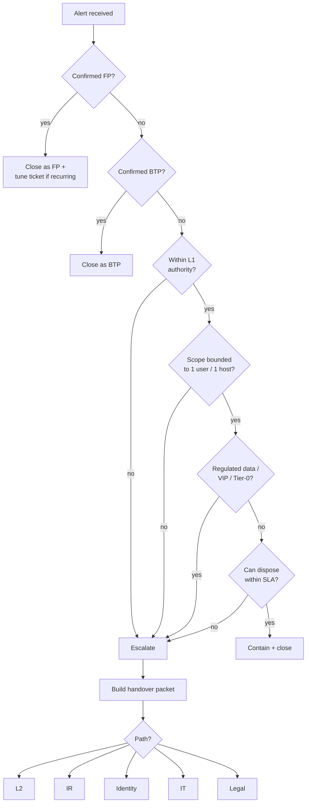
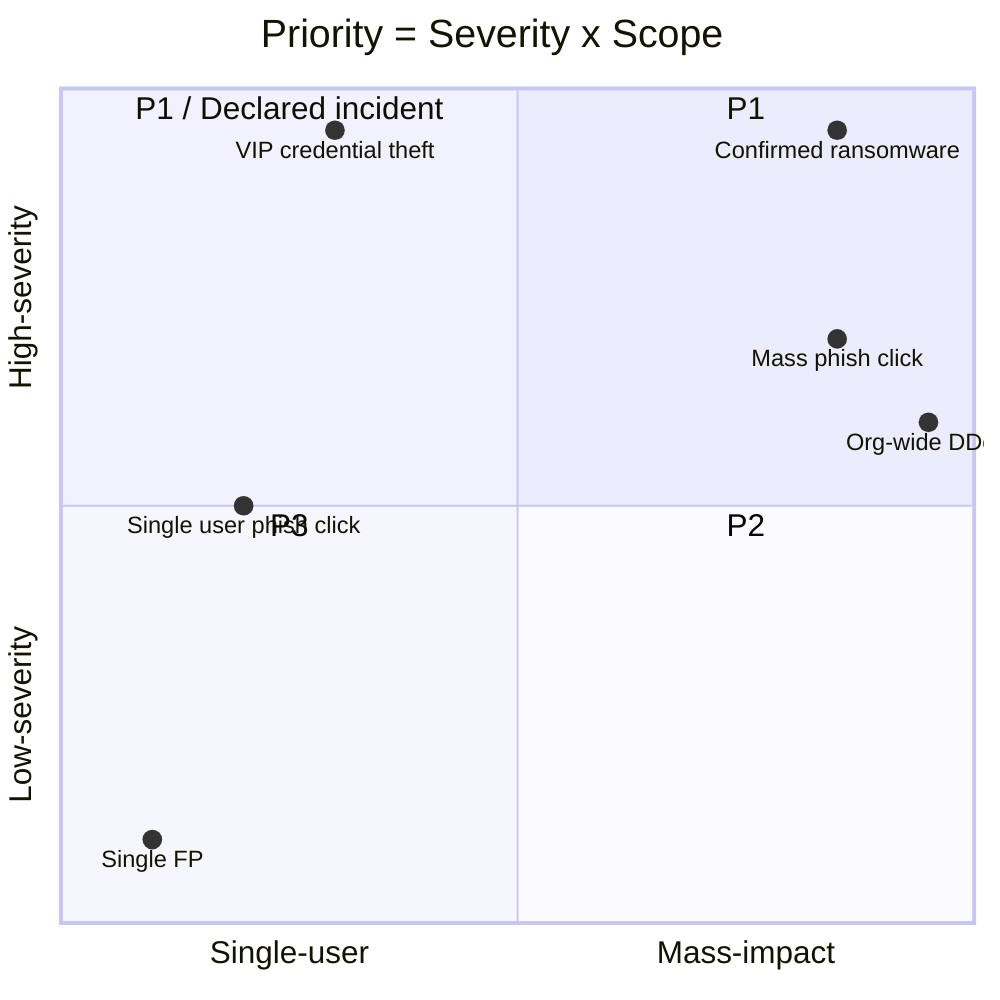
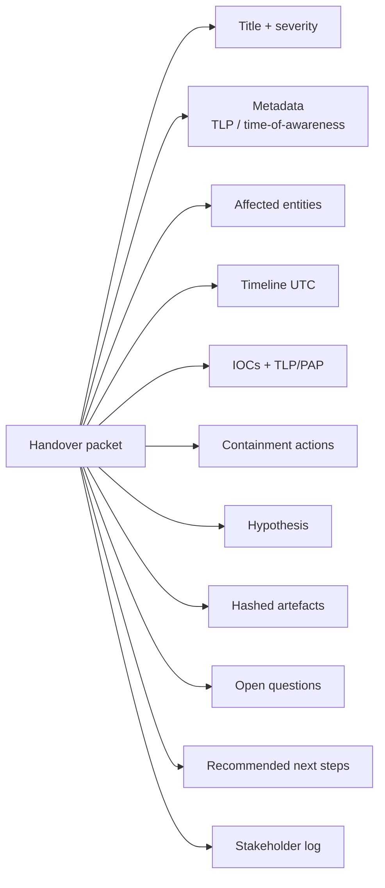
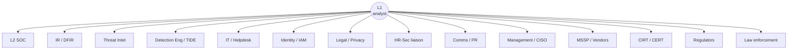
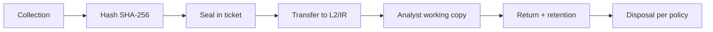

# Research Dossier — L1 SOC Module 7: Escalation Workflow

**Course:** L1 Alert Triage Fundamentals
**Module:** 7 of 8 (sits after Phishing Triage, before Common ATT&CK Techniques)
**Audience:** Junior SOC analyst, day-shift triage
**Authoring target:** 4 reading lessons (~2,000–3,000 words each) + 4 quiz lessons
**Depth bar:** BTL1 / SANS GCIH equivalent — worked scenarios, real ECS field paths, MITRE references, Mermaid diagrams, mixed-kind quiz items

---

## 1. Why escalation discipline matters

Every alert that reaches an L1 analyst is, at its core, a question: *does this need someone else's attention, and if so, whose?* The answer to that question — multiplied across thousands of alerts per shift, hundreds of analysts, dozens of teams — is the engine that determines whether a SOC functions or melts down. Escalation is not a side activity. It *is* L1 work.

A well-disciplined L1 understands two opposing failure modes and works to balance them:

**The cost of a false escalation.** A false escalation is one where L1 hands work to L2, IR, or another team that L1 should have closed themselves. Each false escalation:

- **Burns L2 cycles.** L2 analysts are the most expensive seat in the SOC and, in most teams, the bottleneck. Their day is finite. Every minute spent on a false-positive escalation is a minute *not* spent on a real intrusion already in dwell.
- **Erodes signal-to-noise on the L2 queue.** When L2 starts seeing 70% noise from L1, they read the queue with skepticism. A real escalation buried in noise is an escalation that gets dismissed.
- **Produces alert fatigue downstream.** "Boy who cried wolf" is not a metaphor in a SOC — it is an observable phenomenon. After enough false escalations, L2 anchors low on severity and *misses* a genuine high-severity event.
- **Distorts KPIs.** Escalation rate is a managed metric. False escalations inflate it artificially, hiding real coverage gaps and making detection-engineering work look more successful than it is.
- **Demoralises the analyst.** L1s who escalate everything stop learning to triage. They become a routing function, not analysts. Career growth stalls.

**The cost of a missed escalation.** A missed escalation is when L1 closes a ticket that should have moved up. Each one:

- **Delays containment.** If credential theft is misclassified as a benign sign-in, the attacker has another shift to move laterally. Mean time to contain (MTTC) is the metric most directly correlated with breach cost. (Verizon DBIR, IBM Cost of a Data Breach.)
- **Lengthens dwell time.** Dwell time — first-evidence to detection — is now industry-tracked. Mandiant M-Trends and Verizon DBIR publish global medians annually. A missed L1 escalation moves a clock that the rest of the org cannot un-move.
- **Widens blast radius.** An attacker with another four hours of unimpeded access compromises more accounts, exfiltrates more data, places more persistence.
- **Starts the regulatory clock late.** GDPR Article 33's 72-hour clock starts when the controller "becomes aware" of a personal-data breach. If L1 missed it, "awareness" is whenever the customer / partner / press informs you instead — and now the regulator sees both an incident and a notification failure.
- **Becomes a board-level event.** Missed L1 escalations turning into public breaches are how SOCs lose trust internally, lose budget, and lose people.

**The chokepoint principle.** L1 sits at the funnel's narrowest point. Bad escalation discipline degrades *everything* downstream: detection engineering, IR, threat intel, even external relationships with regulators and CIRTs. Good discipline is a force multiplier: an L1 who escalates the right 5% and closes the rest with confidence is worth far more than an L1 who escalates 30% indiscriminately or 0.5% over-conservatively.

**The honest L1 mindset.** The right framing is *"I am not the last line of defence, but I am the first line of judgement."* L1 isn't expected to know everything. L1 *is* expected to recognise when a situation has moved beyond what they can confidently dispose of, and to package the work cleanly for whoever takes it next.

---

## 2. The L1 escalate / contain / close decision

For any alert, L1 has three terminal dispositions:

1. **Close** — false positive, benign true positive (BTP), known-good behaviour, duplicate, or out-of-scope.
2. **Contain-and-close** — true positive, but L1 has authority and the action is bounded; L1 takes the action, documents it, and closes.
3. **Escalate** — beyond L1 authority, beyond L1 skill, or scope is too broad for the L1 to bound.

### Default escalation criteria (echoes from earlier modules)

If any of the following are present, escalate by default:

- **Confirmed credential exposure.** Adversary-in-the-Middle (AiTM) phishing kit harvest, token theft, password-spray success, OAuth illicit consent. (Module 6 set this up.)
- **EDR alert at "high" severity or above** — process-injection, LSASS access, suspicious child-of-Office, ransomware behaviour family, suspected lateral movement.
- **Lateral movement signals.** SMB/WMI/WinRM/RDP/PsExec/Impacket signatures from a non-admin source. WinRM (`winrm.exe`, port 5985/5986) from a workstation. (Module 3, Windows Event Logs.)
- **Multiple users / multiple hosts affected.** Anything at scale exits L1's per-ticket frame and needs a coordinator.
- **VIP user.** Executives, board members, anyone in the privileged-user list. The asset criticality alone changes the math.
- **Privileged-account activity outside change windows.** Domain admin sign-in from an unusual host, service account interactive logon (Logon Type 2 or 10), DCSync-like patterns.
- **Novel TTP.** Something L1 has not seen before *and* cannot explain in a paragraph.
- **SLA risk.** L1 will not be able to dispose of the ticket within tier SLA (see §3).
- **Cross-team action required.** Any action L1 cannot take alone — OAuth grant revoke beyond L1's authority, account lock that requires Identity, system reimage that requires IT.
- **Suspected data exposure.** Any sign that regulated or customer data may have left the boundary. Personal data triggers the GDPR clock; cardholder data triggers PCI; PHI triggers HIPAA.

### Contain-and-close criteria

Conversely, L1 should be confident closing the following with a documented disposition:

- Single-recipient phish that was blocked at gateway, never delivered.
- Phish delivered, *not* clicked (per URL telemetry), email purged, sender blocked.
- Confirmed false-positive on a known-noisy rule (with feedback flagged to detection engineering — see §5, the L1 → DE handoff).
- Benign user behaviour that matches a known pattern (developer running `psexec` in dev VLAN, sysadmin doing scripted maintenance during change window, security-team red-team exercise documented in calendar).
- Known-good admin-tool execution with corroborating evidence (ticket ID, change record, paired identity).
- Duplicate of an open higher-priority ticket (link, close as duplicate).

### When in doubt, escalate — *but*

The "when in doubt, escalate" rule is a safety net, not a strategy. The cost calculus says: **if you would escalate every alert that produced uncertainty, your escalation rate becomes meaningless and your L2 stops trusting you.** The discipline is to *narrow* the doubt: pull one more log, check one more enrichment, ask one more question. Then decide.

### Worked examples of the calculus

- **Alert: "Impossible travel — user signed in from London then Singapore in 8 minutes."** First check: corporate VPN egress map. If both IPs map to known VPN PoPs, this is benign. If one is a residential IP, this is escalate-grade (potential token theft).
- **Alert: "Powershell encoded command on developer workstation."** First check: command-line decode. If it's `Get-AzContext` or developer tooling, BTP. If it's `IEX (New-Object Net.WebClient).DownloadString(...)`, escalate immediately.
- **Alert: "Outbound DNS to a newly-registered domain."** First check: enrichment age, popularity, related-IP reputation. If it's a CDN edge that was registered yesterday, BTP; if it's a single host beaconing to an unranked domain every 60s with low jitter, escalate (C2 candidate).

---

## 3. Triage timeboxing

A SOC that does not timebox is a SOC that drifts. Timeboxing is the discipline of saying *"I will spend at most N minutes on this disposition; if I can't decide by then, the inability to decide is itself the signal."*

### SLA tiers and escalation triggers

Typical L1 SLA bands (these vary by SOC; the ION default is sane):

| Severity | Triage start | First-action SLA | Disposition target |
|---|---|---|---|
| **P1 / Critical** | ≤ 5 min | ≤ 15 min | ≤ 1 hour or escalate |
| **P2 / High** | ≤ 15 min | ≤ 30 min | ≤ 4 hours or escalate |
| **P3 / Medium** | ≤ 30 min | ≤ 1 hour | ≤ 8 hours or backlog |
| **P4 / Low** | ≤ 4 hours | best-effort | next business day |

A *slipping SLA is itself an escalation trigger*. If you started a P1 forty minutes ago and you don't have a verdict, you don't keep working — you escalate. The SLA exists to enforce this discipline; ignoring it is not heroism, it is mismanagement.

### The 80/20 of L1 disposition

Empirically, ~80% of L1 alerts dispose within 15 minutes (BTPs, dedupes, simple FPs). ~15% take 15–60 minutes (need enrichment, need a check). ~5% are genuine escalations. If your distribution is more like 50/40/10, you are either being overrun by noisy detections (a Detection-Engineering signal) or escalating when you shouldn't be.

### "Stuck — escalate" vs "stuck — research"

Two different stuck states:

- **Stuck because of authority** (e.g. you don't have the permission to revoke an OAuth grant) → escalate. The blocker is structural; more time won't change it.
- **Stuck because of skill / context** (e.g. you don't know how to read a certain log) → 15 more minutes of research, then escalate if still stuck. The blocker is knowledge; modest time may solve it.
- **Stuck because of scale** (more than one host / user, you can't bound the scope) → escalate. L2/IR exists to coordinate scope.
- **Stuck because of novelty** (a TTP you've never seen) → 10 minutes of OSINT (CTI, ATT&CK, vendor blogs), then escalate or close. Don't try to become a threat researcher mid-shift.

### Heuristics

- *"Could I justify this disposition to my shift lead in two sentences?"* If not, escalate.
- *"If I close this and it turns out to be real, what will the post-incident review find?"* If "L1 had X evidence and missed Y signal," escalate.
- *"Am I closing this because I'm confident, or because I want my queue clean?"* If the second, escalate.

---

## 4. Severity and priority classification

L1s rarely *set* organisational severity from scratch — most SOCs inherit it from the alert source (rule severity, SIEM scoring) — but L1s constantly *propose adjustments* in escalation handovers. Knowing the frameworks lets the L1 speak the language of the people they're escalating to.

### Severity scales

The most common SOC scale is five-tier:

| Severity | Common meaning |
|---|---|
| **Critical** | Confirmed business-impacting incident; widespread compromise or imminent data loss |
| **High** | Confirmed compromise of a single sensitive asset, or strong likelihood of widespread |
| **Medium** | Suspected compromise; investigation underway |
| **Low** | Possible compromise or low-impact policy violation |
| **Informational** | Logged for awareness; no action required |

**FIRST CSIRT services framework** ([first.org/standards/frameworks/csirts/csirt_services_framework_v2.1](https://www.first.org/standards/frameworks/csirts/csirt_services_framework_v2.1)) gives an industry-standard taxonomy of CSIRT services and incident handling, and is the source for many SOC severity conventions.

**CVSS adapted for incidents.** CVSS is a vulnerability score, not an incident score, but its lens — Confidentiality × Integrity × Availability impact, weighted by attack vector and complexity — adapts well: incident severity ≈ *impact-on-CIA × asset-criticality × likelihood-of-realisation × scope*. FIRST publishes CVSS v3.1 / v4.0 ([first.org/cvss](https://www.first.org/cvss)).

**ENISA Reference Incident Classification Taxonomy** ([enisa.europa.eu](https://www.enisa.europa.eu) — "Reference Incident Classification Taxonomy") — used heavily across EU CSIRTs. Categories: abusive content, malicious code, information gathering, intrusion attempts, intrusions, availability, information content security, fraud, vulnerable, other.

**NIST SP 800-61 Rev. 2** "Computer Security Incident Handling Guide" ([nvlpubs.nist.gov](https://nvlpubs.nist.gov/nistpubs/SpecialPublications/NIST.SP.800-61r2.pdf)) is the canonical US reference. Categories from §3.2: Denial of Service, Malicious Code, Unauthorized Access, Inappropriate Usage, Multiple Component, Other. Functional impact / information impact / recoverability are graded separately and combined.

**MITRE D3FEND** ([d3fend.mitre.org](https://d3fend.mitre.org)) and **RE&CT** ([atc-project.github.io/atc-react](https://atc-project.github.io/atc-react/)) catalogue defensive techniques and response actions; they don't drive severity directly but they're the vocabulary L2/IR use to describe response, and L1 should recognise the names.

### Priority

**Severity** answers *"how bad is this kind of incident?"* **Priority** answers *"how bad is this incident, on this asset, to this business, right now?"* Priority = severity × business context. Inputs:

- **Asset criticality.** A CRM sales workstation versus the domain controller versus the CEO's laptop are not the same asset, even if the alert text is identical.
- **Time of day / shift.** P2 at 09:00 Tuesday is a very different operational picture than P2 at 03:00 Sunday, when on-call must be paged.
- **Scope.** One user versus 50 users versus all users.
- **Regulatory exposure.** Regulated data class touched; jurisdiction; sectoral regime (PCI, HIPAA, NIS2, DORA).
- **Concurrent incident posture.** If three other P1s are open, a borderline P3 may need escalation purely for awareness.

### Worked priority matrix

```
Severity ↓ \ Asset class →   Workstation    Server     DC / Tier-0    VIP / Regulated
Critical                     P1             P1         P1             P1
High                         P2             P1         P1             P1
Medium                       P3             P2         P1             P1
Low                          P4             P3         P2             P2
```

L1 should *not* invent escalation criteria from this matrix; L1 should use it as a sanity check: if your alert is on a Tier-0 host and you classified it Medium-P3, you're miscalibrated.

### The blast-radius lens

Beyond severity, L1 should be able to articulate a *blast radius*:

- **Hosts affected** (count + criticality)
- **Users affected** (count + privilege level)
- **Data classifications touched** (Public / Internal / Confidential / Restricted; and the regulatory class — PII / PHI / PCI / IP)
- **Services touched** (customer-facing? internal-only?)
- **External entities touched** (partner orgs, customers, vendors)

Blast radius is what L2/IR cares about most when reading an L1 escalation.

### TLP marking

Revisit Module 5 (IOC Handling). Every escalation handoff should carry **TLP** ([first.org/tlp](https://www.first.org/tlp/)) — Traffic Light Protocol 2.0 markings: TLP:RED, TLP:AMBER+STRICT, TLP:AMBER, TLP:GREEN, TLP:CLEAR. Many escalations also carry **PAP** (Permissible Actions Protocol) markings, which limit what action a recipient may take with the indicator. Mismarking is itself an incident in some regulated contexts.

---

## 5. The escalation paths

The L1 sits at the centre of a routing topology. Each path has *who, when, how, what,* and *why.* L1 should know all of them, even if they only use 2–3 daily.

### L1 → L2 (the most common)

- **Why:** investigation requires deeper toolset, longer time, or specialist skill.
- **When:** any of the §2 criteria + L1 cannot bound scope or take terminal action.
- **How:** in-platform case escalation (ION case status open → escalated). Slack/Teams ping if P1.
- **What (handover packet):** see §6. Full timeline + IOCs + entities + hypothesis + open questions.
- **SLA:** L2 acknowledges within 15 min for P1, 1 hr for P2, 4 hr for P3.

### L1 → IR / DFIR (incident declared)

- **Why:** escalation has crossed from "investigate alert" into "manage incident lifecycle." Multiple workstreams now needed: containment, eradication, recovery, communications, evidence, lessons-learned.
- **When:** confirmed compromise of a Tier-0 asset, mass user impact, regulator clock starts, business-impact threshold crossed (loss-of-service, data exposure).
- **How:** in most SOCs, IR is invoked through a formal "incident declaration" — a named state change with paging, war-room creation, comms cadence start, exec-loop opened.
- **What:** all of the L2 packet plus a *declared incident scope* statement and an Incident Commander assignment.

### L1 → Threat Intel

- **Why:** novel campaign indicators that the org's CTI team should track / pivot on; or L1 needs enrichment that goes beyond standard tooling.
- **When:** you've seen a new TTP, a new infrastructure cluster, a new lure family.
- **How:** CTI ticket / Slack channel / TIP submission. ION's CTI integrations (OpenCTI, MISP) accept structured submissions.
- **What:** indicators with TLP/PAP, a one-paragraph narrative, links to source artefacts.

### L1 → Detection Engineering / TIDE

- **Why:** the rule that fired is broken (false-positive-rich), missing (you saw something the rule didn't catch), or needs tuning.
- **When:** any time L1 closes a ticket as FP from a rule that has produced ≥ N FPs this week (often N=3); any time L1 manually finds a pattern that should have alerted.
- **How:** detection-tuning ticket / TIDE rule-feedback / ION's tuning-proposal mechanism. **Important: this is a separate channel from L2 escalation.** Tuning is engineering work; investigation is L2 work; don't mix them.
- **What:** rule ID, observed pattern, suggested logic change, sample events.

### L1 → IT / Ops / Helpdesk

- **Why:** a non-security action is required — reboot, reimage, rebuild, patch, hardware swap.
- **When:** L1 has decided containment requires an action only IT can take. Coordinate with L2 first if escalation pending.
- **How:** ITSM ticket (ServiceNow / Jira / Zendesk) with security-incident link.
- **What:** what action, on what asset, by when, with what risk-acceptance / change-management implications.

### L1 → Identity / IAM team

- **Why:** OAuth-grant revocation, conditional-access change, MFA reset, privileged-access-review trigger, federation issue.
- **When:** confirmed token theft (revoke active sessions + refresh tokens), confirmed illicit OAuth consent (revoke grant + audit app), suspected federation abuse.
- **How:** IAM team ticket / on-call IAM page (P1 in working hours; P1 + page after-hours).
- **What:** affected user, affected app/grant ID, action requested, justification, approval thread.

### L1 → Legal / Compliance / Privacy

- **Why:** regulatory or contractual notification may be required; legal hold may need to be triggered; counsel may need to lead external communications.
- **When:** confirmed exposure of personal data, regulated data, customer data; potential law-enforcement involvement; potential litigation hold.
- **How:** privacy / legal escalation channel — typically Legal-IR liaison, with a high bar for what initiates contact (don't spam Legal with maybes).
- **What:** facts as known, data classes touched, jurisdictions involved, time of awareness, current containment status. **Especially: time of awareness** — this drives the GDPR/NIS2 clock.

### L1 → HR

- **Why:** confirmed insider threat, policy violation, suspected employee compromise where personnel action is in scope.
- **When:** insider data exfil suspected; shared-credentials-with-external; willful policy violation; suspected coercion / account-sale.
- **How:** HR-Security liaison (most orgs have one). *Never* L1 directly to a line HR rep.
- **What:** factual evidence only — no speculation about employee motive. Chain of custody matters here.

### L1 → Comms / PR

- **Why:** the incident is likely to surface publicly (press, customers, partners).
- **When:** typically *not* L1's call. Comms is engaged by IR or management. L1's job is to flag the *possibility* up the chain so Comms can be pre-positioned.
- **How:** via IR / management.
- **What:** scope, scale, sensitivity — Comms cares about reach and narrative, not technical detail.

### L1 → Management / CISO

- **Why:** policy threshold crossed, exec-stakeholder notification due, decision authority required (ransom, takedown, regulator engagement).
- **When:** P1 declared, regulator clock started, financial-impact threshold, board-level asset compromised.
- **How:** typically through shift lead → SOC manager → CISO chain. Page paths differ by org.
- **What:** the **3-line update** (see §8) plus the full ticket link.

### L1 → MSSP / vendor support

- **Why:** vendor product is the source of truth (CrowdStrike, SentinelOne, Microsoft, Mandiant) and you need their telemetry, expertise, or escalation.
- **When:** vendor-detected campaign, suspected vendor-tooling false-positive, need for vendor IR support, suspected zero-day in a vendor product.
- **How:** vendor support portal + vendor account team. Some products have integrated escalation (e.g., CrowdStrike Falcon Complete).
- **What:** their product's case ID, your ticket ID, full triage so far. Vendors hate being asked to start from zero.

### L1 → External CIRT / CERT

- **Why:** sector-coordinated indicators, national-significance event, sector-wide threat warning, regulator-mandated CIRT engagement.
- **When:** typically not L1-initiated; usually IR or Legal. L1 should know the major CIRTs exist and which jurisdictions they cover.
- **Reporting portals (key ones):**
  - **NCSC UK** — *Report a cyber incident* ([ncsc.gov.uk/section/about-this-website/report-incident](https://www.ncsc.gov.uk/section/about-this-website/report-incident)).
  - **CISA US** — *Report a Cyber Incident* ([cisa.gov/report](https://www.cisa.gov/report)). The Cyber Incident Reporting for Critical Infrastructure Act (CIRCIA) of 2022 progressively makes this mandatory for covered entities.
  - **FBI IC3** — *ic3.gov*, cybercrime reporting.
  - **BSI / CERT-Bund (Germany)**, **JPCERT/CC (Japan)**, **CERT-EU**, **ENISA** for EU coordination.

### L1 → Sector ISACs

- **FS-ISAC** — financial services
- **MS-ISAC** — multi-state US gov / SLTT
- **H-ISAC** — health
- **E-ISAC** — electricity / NERC
- **Auto-ISAC** — automotive
- **Aviation-ISAC** — aviation
- **Space-ISAC** — space sector

ISAC sharing is typically TLP-controlled and member-only. L1 generally consumes ISAC bulletins (via CTI), not produces submissions.

### L1 → Regulators (the timed clocks)

L1 doesn't push the button — Legal does — but L1 *triggers* the awareness moment. See §9 for full timeline detail.

### L1 → Law enforcement

- **Why:** suspected criminal activity (ransomware, extortion, suspected nation-state), potential criminal-referral. Chain of custody now matters absolutely.
- **When:** never L1's call alone. Legal + CISO + (often) outside counsel + IR. L1's role is preservation: *do nothing that could compromise a future criminal proceeding.*
- **Who (US):** FBI field office, IC3, USSS (financial cybercrime). **(UK):** NCA NCCU, Action Fraud (lower threshold), local police for individual victims. **(EU):** Europol EC3 via national contact.

---

## 6. The handover packet

This is the most practical part of the module — the artefact L1 produces every time they escalate. The author should provide a *template the analyst can copy into a ticket.* A good handover saves L2 thirty minutes; a bad one costs L2 ninety.

### Anatomy of a good handover

```
TITLE
  [12-word incident summary, severity-leading]
  e.g. "P1 — Confirmed AiTM token theft, 1 user (HR-Director), session active"

HEADER
  Severity (current / proposed):     P1 / P1
  Classification (NIST 800-61):      Unauthorized Access
  TLP:                               TLP:AMBER
  Time of awareness (UTC):           2026-04-28T09:14:02Z
  Reporter:                          alice@soc (L1)
  Detection source:                  Defender for Cloud Apps - "Suspicious inbox forwarding"

AFFECTED ENTITIES
  Users:     hr-director@corp.example   (object_id: 5d0c...)
  Hosts:     LAPTOP-HRD01                (computer_name, EDR id)
  Accounts:  AAD primary + 2 secondary OAuth grants
  IPs:       198.51.100.42 (attacker, ASN-...), 203.0.113.7 (victim, corp egress)
  Mailboxes: hr-director@corp.example
  Apps:      Microsoft Graph "MailRead.All" grant by app id 71b5...

TIMELINE (UTC, monotonic)
  09:02:11  user.signin       hr-director from 198.51.100.42, MFA-satisfied (token replay suspected)
  09:02:14  inbox.rule.create  "Move to RSS Subs" — pattern: subject CONTAINS "invoice"
  09:08:30  graph.token.use    MailRead.All from same IP
  09:11:55  alert.fired         DCA-1234 "Suspicious inbox forwarding"
  09:12:30  l1.assigned         alice
  09:14:02  l1.aware            alice opens case (TIME OF AWARENESS)
  09:18:40  l1.action           sign-ins audit pulled; 12 sessions in last 24h
  09:23:05  l1.action           inbox rule disabled (with L2 OK)
  09:24:00  l1.escalate         escalating to L2 + Identity

IOCS
  - 198.51.100.42 [ip-src] TLP:AMBER PAP:AMBER  (sighting: aad sign-in)
  - <token JTI>   [token]  TLP:RED   PAP:RED    (revoke pending Identity)
  - <app id>      [oauth]  TLP:AMBER PAP:AMBER  (grant: MailRead.All)
  - rule="Move to RSS Subs" + "invoice" [mailbox-rule] TLP:GREEN

CONTAINMENT ACTIONS TAKEN
  - 09:23:05  Inbox rule disabled (revertible; not deleted, kept for evidence)
  - 09:24:00  User notified by SOC duty manager (not by L1)
  - NOT TAKEN: token revoke (pending Identity); password reset (pending IT)

HYPOTHESIS
  AiTM token theft via reverse-proxy phish kit; attacker replayed session, set
  inbox rule for invoice fraud. Initial vector likely Tycoon/EvilProxy class
  based on TTP. Confidence: medium-high.

ARTEFACTS (hashed, attached)
  - signin_export_2026-04-28_0914Z.csv  sha256:7a3f...
  - inbox_rules_pre_disable.json        sha256:4e2c...
  - graph_audit_24h.json                sha256:9b81...
  - email_screenshot_phish_lure.png     sha256:c0f1...

OPEN QUESTIONS
  - Did the attacker exfiltrate from the mailbox? (need full Graph export — L2)
  - Are other users in same campaign? (need TI pivot on attacker IP — TI)
  - Is HR-Director's laptop compromised, or was the theft pure web? (need EDR — L2)

RECOMMENDED NEXT STEPS
  1. Identity: revoke all sessions + refresh tokens for hr-director; revoke OAuth grant
  2. L2: full M365 ediscovery on mailbox last 24h; pivot on IP / token
  3. IT: forced password reset post-revoke
  4. Legal: this user has PII access — preserve and assess GDPR Art.33 trigger

STAKEHOLDER LOG
  09:24  SOC duty manager notified (Slack #soc-shift)
  09:25  L2 paged (PagerDuty)
  09:26  Identity on-call paged (PagerDuty)
  Legal: NOT YET notified — proposing notification by 09:45 if data-touch confirmed
```

### Anatomy of a *bad* handover (counter-example)

```
TITLE
  Phishing alert
BODY
  user got phished, sign-in from weird ip, escalating to L2
```

This is unfortunately common. It is missing time of awareness, scope, IOCs, actions taken, hypothesis. L2 must redo all of L1's work.

### The 5-line vs 5-page question

A 5-line escalation is appropriate for:
- A clearly bounded P3/P4 where the next step is mechanical (e.g. "rule X false-positive #4 this week, please tune").
- A handover to a team that already has full context (e.g. "Identity, please revoke sessions for user X — full case in #incident-1234").

A 5-page escalation is appropriate for:
- Any P1 / declared incident.
- Anything Legal / regulator-adjacent.
- Anything that crosses 2+ teams.

The L1 must learn to recognise which.

### What L1 must *never* leave out

Even on a 5-line escalation, the irreducible minimum is:

1. Severity / proposed priority
2. Time of awareness (UTC)
3. Affected entity / scope
4. Action requested + why
5. Link to full evidence (case ID)

---

## 7. Chain of custody and evidence handling

L1 is not a forensic examiner. L1's role in chain of custody is *not to taint it.* The forensic discipline matters because some incidents end up in court, in regulatory inquiry, or in insurance claims — and evidence that was mishandled at the start cannot be salvaged later.

### Why it matters

- **Legal admissibility.** Evidence whose chain is broken may be inadmissible.
- **Regulatory inquiry.** ICO, FTC, sectoral regulators may request evidence; mishandling becomes its own finding.
- **Criminal-referral preservation.** Law enforcement requires defensible chain.
- **Insurance.** Cyber insurers increasingly demand evidence preservation as a claims condition.

### Hashing at collection

Every artefact pulled out of a system gets hashed *at collection time.* SHA-256 is the current default; SHA-1 / MD5 only as legacy corroboration, never alone. The hash goes into the ticket adjacent to the artefact, with collection time and collector identity. This binds the artefact to its capture moment.

### Source-of-truth principle

Don't edit originals. Work on copies. If you must inspect a `.eml`, copy it first; if you opened it in a viewer that may have triggered loading remote content (not typical of `.eml` viewers, but always for `.html` artefacts), record that fact in the timeline.

### RFC 3227 — order of volatility

[RFC 3227, "Guidelines for Evidence Collection and Archiving"](https://www.rfc-editor.org/rfc/rfc3227) — Brezinski & Killalea, IETF, Feb 2002 — is the canonical reference. Order of volatility (most volatile first):

1. Registers, cache
2. Routing table, ARP cache, process table, kernel statistics, memory (RAM)
3. Temporary file systems
4. Disk
5. Remote logging / monitoring data relevant to the system
6. Physical configuration, network topology
7. Archival media

For a SOC L1 the practical translation is: **don't shut down a host that L2/IR may want to image live.** Powering off destroys RAM, which is now where most modern malware actually lives (process injection, fileless, in-memory loaders).

### Time discipline

- All timestamps in UTC. *Always.* Local-time timestamps cause incident-reconstruction errors that take hours to untangle when sources span time zones.
- All log sources NTP-synced. Record any known clock skew in the ticket (e.g. `host A's clock is +12s ahead of UTC truth, per last NTP poll`).
- Monotonic timeline reconstruction: when two events have the same timestamp, record collection order or sub-second precision when available.

### Live-forensics vs containment trade-off

- **Containment first** if the host is actively exfiltrating or moving laterally.
- **Image first** if the host is contained at the network layer (isolation in EDR) and IR wants memory/disk.
- L1 is rarely the decision-maker here. L1's role is to *flag the trade-off* and *not unilaterally power-cycle* the box.

### Sealing and transfer

- **Sealed evidence** in regulated contexts means write-blocked acquisition, hash-verified, chain-of-custody form (paper or digital) with every transfer signed.
- **Ticket attachments** carry their own chain via the ticket system audit log — which is why ION's audit log is load-bearing for in-platform actions.
- **Retention policy** per evidence class. Don't delete artefacts during open investigation. Don't keep them past legal/policy retention.

### The L1's chain-of-custody rules of thumb

1. **Don't run unfamiliar tooling against a host without IR clearance.** Especially: DFIR tools (Volatility, KAPE, Velociraptor agents) — if these aren't already deployed and you aren't certified, don't.
2. **Don't shut down or reboot a machine that L2 may want live.** Network-isolate via EDR instead.
3. **Hash everything you pull out.** SHA-256 + collector + UTC timestamp + ticket ID.
4. **Keep originals; work on copies.**
5. **Document time skews.** Don't assume clocks are right.
6. **Don't share artefacts on channels with looser TLP than the marking requires.**

---

## 8. Communication discipline

### Channel hygiene

| Severity / context | Appropriate channels |
|---|---|
| P3/P4 routine | SOC ticket comments, team Slack/Teams |
| P2 high | SOC ticket + dedicated incident Slack/Teams channel |
| P1 critical | Incident channel + paging + voice bridge / war room |
| Sensitive (insider, legal) | Restricted channel + voice; never general Slack |
| Press-adjacent | Voice / in-person; minimal written trail outside Legal |

### The 3-line update

For execs and other non-technical stakeholders. Memorise the shape:

```
WHAT HAPPENED:  one sentence, plain English, no acronyms.
IMPACT:         one sentence on scope, users, services.
WHAT'S BEING DONE: one sentence on action + next checkpoint.
```

Example:
> WHAT HAPPENED: A senior staff member's email account was accessed by an attacker who stole a login session.
> IMPACT: One user; mailbox access only; no evidence of further spread; no customer data confirmed exposed yet.
> WHAT'S BEING DONE: Account locked, session revoked; forensics underway; next update at 10:30.

### Status-update cadence

| Severity | Cadence | Audience |
|---|---|---|
| P1 active | Every 15 min | Incident channel + execs (3-line) |
| P1 stable / contained | Every 30 min, then hourly | Incident channel |
| P2 active | Every 30–60 min | Incident channel |
| P3 | At disposition | Ticket comments |

The cadence is a *promise.* If you said "next update at 10:30," at 10:30 there must be an update — even if it's "no change since 10:00."

### Plain language

No SOC-internal acronyms in messages going beyond the SOC. "AiTM token theft" becomes "stolen login session." "DCSync" becomes "attacker reading password material from our identity system." Specific. Plain. No mystery.

### TLP and information sharing

What can be said where is determined by TLP. TLP:RED stays in the named room. TLP:AMBER+STRICT stays inside the immediate org. TLP:AMBER stays inside org + immediate clients. TLP:GREEN is community-shareable. TLP:CLEAR is public. (FIRST TLP 2.0, 2022.) Get this wrong and a "share" can become a TLP violation incident in itself.

### The "no surprises" rule

Escalate facts before they appear in a Slack thread, a press article, or a customer ticket. The rule: anyone whose seat in the org will hear about this *must* hear it from the SOC first.

---

## 9. External reporting timelines

L1 is not a lawyer. L1 *is* the person whose "time of awareness" starts these clocks, so L1 must know the clocks exist and how tight they are.

### GDPR Article 33 — Notification of a personal data breach to the supervisory authority

- Source: [Regulation (EU) 2016/679, Art. 33](https://eur-lex.europa.eu/eli/reg/2016/679/oj).
- Trigger: controller becomes aware of a personal data breach.
- Window: **without undue delay and, where feasible, not later than 72 hours after having become aware.**
- Exception: *unless the personal data breach is unlikely to result in a risk to the rights and freedoms of natural persons.*
- Article 34: notify data subjects without undue delay where the breach is likely to result in a *high* risk.
- Practical: L1 logs the time of awareness *exactly.* That timestamp may end up in a regulator filing.

### NIS2 Directive (EU 2022/2555)

- Source: [Directive (EU) 2022/2555, Art. 23](https://eur-lex.europa.eu/eli/dir/2022/2555/oj). In force from October 2024 (national transpositions varied).
- Applies to "essential" and "important" entities (sectoral list in Annex I/II).
- Reporting cascade:
  - **Early warning** to the CSIRT or competent authority **within 24 hours** of becoming aware of a significant incident.
  - **Incident notification** with initial assessment, severity and impact, indicators of compromise, **within 72 hours**.
  - **Final report within 1 month** (or progress report if not yet resolved).

### DORA (EU 2022/2554) — Digital Operational Resilience Act, financial sector

- Source: [Regulation (EU) 2022/2554](https://eur-lex.europa.eu/eli/reg/2022/2554/oj). Applicable from January 17, 2025.
- Major ICT-related incidents: initial / intermediate / final reports on prescribed timelines (see ESAs RTS / ITS for exact windows; the framework is similar in shape to NIS2).

### SEC Form 8-K Item 1.05 (US public companies)

- Source: SEC Final Rule, [17 CFR § 229.106 / Item 1.05 of Form 8-K](https://www.sec.gov/files/rules/final/2023/33-11216.pdf), effective Dec 18, 2023.
- Trigger: registrant determines a cybersecurity incident is **material**.
- Window: **disclose within 4 business days** of the materiality determination (with limited DOJ-led national-security delay).

### HIPAA Breach Notification Rule (US, healthcare)

- Source: [45 CFR §§ 164.400–414](https://www.ecfr.gov/current/title-45/subtitle-A/subchapter-C/part-164).
- Breach affecting **≥ 500 individuals**: notify HHS *without unreasonable delay and in no case later than 60 calendar days* after discovery; notify affected individuals; notify prominent media in the state if affecting > 500 in a state/jurisdiction.
- Breach affecting **< 500**: maintain a log; submit annually to HHS within 60 days of end of calendar year.

### US state breach-notification laws

All 50 states + DC + several territories now have laws. California (CCPA / CPRA), New York (SHIELD Act), Massachusetts 201 CMR 17, Texas, Illinois (BIPA for biometric), etc. Windows vary (frequently "without unreasonable delay," some 30/45/60 day caps). A state-by-state regulatory map is too granular for this module — flag *the existence* and the time pressure.

### UK regulations

- **UK GDPR + DPA 2018** — equivalent of EU GDPR, ICO is the supervisory authority.
- **NIS Regulations 2018** (post-Brexit version of original NIS Directive) — ICO/competent authorities, OES/RDSP scope.
- **NCSC reporting** — voluntary for most; mandatory for some sectors. NCSC publishes "Report a cyber incident" portal.

### Sector / vertical

- **PCI-DSS** — incident notification to acquirer, card brands, and forensics on prescribed windows. PCI Forensic Investigator (PFI) engagement requirements for significant cardholder-data exposure.
- **TSA security directives** (US) — pipelines (post-Colonial Pipeline 2021), aviation, rail. **Within 24 hours** of identifying a cybersecurity incident.
- **FERC / NERC CIP** — bulk-electric system; CIP-008 reporting to E-ISAC and DOE within 1 hour of determination.
- **CIRCIA (US)** — Cyber Incident Reporting for Critical Infrastructure Act 2022; final rule under CISA defines covered entities and (proposed) **72-hour** reporting + **24-hour** ransom-payment reporting. Phased in.

The takeaway for L1: **the moment you become aware** is the moment a clock may have started. *Document it precisely.*

### Mermaid: external-reporting clock

```mermaid
gantt
    title External-reporting clocks (selected)
    dateFormat  HH
    axisFormat  +%Hh
    section NIS2
    Early warning (24h)        :nis1, 00, 24h
    Incident notification (72h):nis2, 00, 72h
    Final report (30d)          :nis3, 00, 720h
    section GDPR
    Art.33 notify SA (72h)      :gdpr, 00, 72h
    section SEC 8-K
    Item 1.05 disclosure (4 bd) :sec, 00, 96h
    section HIPAA
    Breach >=500 (60d)          :hipaa, 00, 1440h
```



---

## 10. National CERT and ISAC relationships

### National CERTs (the ones L1 should recognise)

- **NCSC (UK)** — National Cyber Security Centre, part of GCHQ. Sector-agnostic. Active Cyber Defence programmes. *ncsc.gov.uk.*
- **CISA (US)** — Cybersecurity and Infrastructure Security Agency, part of DHS. Successor to US-CERT/ICS-CERT. Operates KEV catalogue, runs the Joint Cyber Defense Collaborative. *cisa.gov.*
- **BSI / CERT-Bund (DE)** — Bundesamt für Sicherheit in der Informationstechnik. *bsi.bund.de.*
- **ANSSI / CERT-FR (FR)** — Agence nationale de la sécurité des systèmes d'information.
- **JPCERT/CC (JP)** — sector-agnostic Japanese CERT.
- **AusCERT / ACSC (AU)** — Australian Cyber Security Centre.
- **CCCS (CA)** — Canadian Centre for Cyber Security.
- **CERT-EU** — EU institutions.
- **ENISA** — EU agency for cybersecurity; coordination, not direct response.

These cooperate via FIRST ([first.org](https://www.first.org)) and (for a subset) the Five Eyes intelligence-sharing community.

### ISACs (key ones)

| ISAC | Sector |
|---|---|
| FS-ISAC | Financial services |
| MS-ISAC | US state, local, tribal, territorial gov |
| H-ISAC | Health |
| E-ISAC | Electricity / NERC |
| Auto-ISAC | Automotive |
| Aviation-ISAC | Aviation |
| Space-ISAC | Space |
| WaterISAC | Water utilities |
| ND-ISAC | National Defense |
| REN-ISAC | Higher education / research |
| Retail-ISAC | Retail |
| MFG-ISAC | Manufacturing |

ISAC sharing is TLP-controlled and member-only. L1 typically *consumes* ISAC bulletins via the org's CTI feed; production and submission is normally TI's job.

### Reporting portals (cheat sheet)

| Portal | URL | Purpose |
|---|---|---|
| CISA | cisa.gov/report | US incident reporting |
| FBI IC3 | ic3.gov | US cybercrime |
| NCSC UK | ncsc.gov.uk | UK incident reporting |
| Action Fraud (UK) | actionfraud.police.uk | UK consumer/SME fraud |
| ICO (UK) | ico.org.uk | UK data protection breach |
| EDPB / national DPAs | edpb.europa.eu | EU GDPR breaches |

### What to share

TLP-conformant indicators, pattern descriptions, and impact summaries. **Never PII unless legally required.** Pseudonymise users (`hr-director@<redacted>` → `<user-A>`) when sharing externally.

---

## 11. ION-specific escalation conventions

The author should lean on these without inventing brand-new ION features.

### Case state machine

ION cases progress: **open → investigating → escalated → closed**. The transition `investigating → escalated` is the natural moment for the handover packet to be finalised. `closed` requires a `CaseClosureReason` — which aligns with the closure-vs-escalation taxonomy of this module: closures are categorised, escalations carry forward.

### Bob (the AI analyst service user)

Bob produces a verdict + confidence on most alerts. When Bob's verdict is `escalate` with **high** confidence, it's a strong nudge but never an authority — the L1 still owns the disposition. When Bob's verdict is `close` with **high** confidence and the L1 disagrees, L1 should escalate *and flag the disagreement* (it's a tuning signal for Bob's prompt template / tier).

### The ticker strip

Critical alerts that have been open without a case for **N minutes** surface on the ticker. The ticker is *itself* an escalation trigger: an L1 who walks into the SOC and sees a 3-hour-old critical on the ticker has an immediate handover-or-explain duty.

### Audit log = automatic chain of custody (in-platform)

Every action in ION is audited — actor, timestamp, action, target. For in-platform actions this means chain of custody is automatic. For *out-of-platform* actions (an analyst running a CLI command on a workstation), L1 must record the action manually in the case timeline.

### CaseClosureReason taxonomy

Closure reasons align with this module's escalate / contain / close framing. L1 should pick the closure reason carefully — it feeds AIFeedback ledger and per-template scorecards (Tier-1 training foundation).

### AlertPromptTemplate matcher tiers

When escalating, L1 should be able to name *which prompt template tier* matched the alert (rule_id → regex → MITRE technique → tactic → groups). This information is gold for Detection Engineering.

---

## 12. Worked end-to-end scenarios

### Scenario A — Confirmed AiTM with token theft

**Alert:** Defender for Cloud Apps "Suspicious inbox forwarding" on `hr-director@corp.example`.

**Triage (08:14–08:30 UTC):**

- L1 alice opens case at 08:14:02Z (records as time of awareness).
- Sign-in audit: 08:02:11 sign-in from `198.51.100.42` (Bulgaria, residential ASN). MFA-satisfied. Token issued.
- Inbox-rule audit: 08:02:14 new rule "Move to RSS Subs" matching subject CONTAINS "invoice" → move to RSS Subscriptions folder + mark read.
- Graph audit: 08:08:30 `MailRead.All` exercise from same IP.
- L1 hypothesises: AiTM (Tycoon/EvilProxy class) → token replay → invoice-fraud staging.

**Decisions:**
- Severity: P1. Asset criticality: HR-Director (PII access).
- Escalation paths required: **L2** (forensics), **Identity** (revoke), **IT** (forced password reset post-revoke), **Legal** (PII exposure assessment).

**Handover packet:** see template in §6.

**Actions L1 takes (within authority):**
- Disables (does not delete) the inbox rule, with L2 acknowledgement, at 08:23:05Z.
- Hashes signin-export, inbox-rules JSON, Graph audit JSON, screenshot of phish lure (recovered from user's inbox).
- Notifies SOC duty manager at 08:24Z.
- Pages L2 + Identity at 08:25Z + 08:26Z.

**Actions L1 does NOT take:**
- Token revoke (Identity authority).
- Password reset (IT, post-revoke).
- User notification (duty manager handles, with talking-points from L1).
- Legal contact (proposes 08:45Z trigger if data-touch confirmed).

**Regulatory consideration:**
- Personal data: yes (HR-Director's mailbox includes employee data).
- GDPR Art.33 clock: 08:14:02Z (time of awareness) + 72h. Legal will determine whether risk-to-rights threshold is met.

### Scenario B — Suspected insider data exfil

**Alert:** DLP alert — large outbound transfer to personal cloud-storage domain by user `engineer-sam@corp.example`. Engineer Sam is on a known-departing list (HR notified L2 last week).

**Triage:**

- L1 bob opens case. Time-of-awareness recorded.
- Confirms volume: 4.7 GB to personal Dropbox, in 14 minutes, at 23:42 local on a Sunday.
- Pulls EDR process ancestry on engineer-sam's laptop: confirms `Dropbox.exe` invoked, file paths from `\Projects\<repo>` (source code).
- Pulls badge data: engineer-sam was *not* on premises; remote VPN session.

**Decisions:**
- Severity: P1 (suspected insider IP exfil).
- Escalation paths: **L2** (technical forensics), **HR** (personnel action), **Legal** (litigation hold), **possibly Law Enforcement** (later, via Legal).

**Critical L1 disciplines:**
- **Don't tip off the suspect.** No user notification. No password reset that might alert. Account left active under monitoring (with L2/IR/Legal call).
- **Chain of custody is paramount.** Hash every artefact at collection. Don't run anything that modifies system state.
- **Handover packet is fact-only.** No speculation about employee motive.
- **HR-Security liaison only.** Not direct to a line HR rep. Not on a general Slack channel.

**Stakeholder routing:**
- L2 + IR (incident commander).
- HR-Security liaison (factual brief).
- Legal (litigation hold; preservation order on email, laptop, badge data, VPN logs).
- IT (do *not* reimage the laptop; preserve in current state; image with write-blocker if Legal directs).
- Comms / management: notified by IR/CISO; L1 does not engage.
- Law enforcement: a Legal-led decision; L1's role is preservation.

### Scenario C — Mass phishing with ≥ 50 confirmed clicks

**Alert:** SIEM correlation rule fires: "Mass phishing campaign — 50+ users clicked URL pointing to `corp-login.auth-portal[.]xyz` in the last 30 minutes."

**Triage:**

- L1 carla opens case at 14:02Z.
- Confirms domain registered yesterday, hosted on attacker IP cluster, mimics corp-login page (visual clone).
- Sign-in audit: 17 of 50+ users have completed MFA-satisfied sign-ins in the post-click window. Token theft confirmed for at least 17.
- Pattern: AiTM kit + automated post-auth follow-up. Multiple inbox rules already created by automation across affected mailboxes.

**Decisions:**
- Severity: P1 / declared incident.
- IR engaged immediately.
- Escalation paths: **IR (incident commander)**, **L2 (forensics squad)**, **Identity (mass revocation)**, **IT (mass password reset)**, **Legal (regulator clock)**, **Comms (likely public-facing)**, **CTI (campaign IoCs)**, **Detection Engineering (rule was late — tune)**, **MSSP / Microsoft (vendor support)**.

**Time-pressure interaction:**
- 17+ users with PII access → GDPR Art.33 likely triggered. 72-hour clock from 14:02Z = next-Wednesday 14:02Z. Legal informed at 14:15Z.
- Org is an EU "essential entity" under NIS2 → 24-hour early warning to CSIRT due by tomorrow 14:02Z.
- Org is a US-listed public company → SEC 8-K Item 1.05 *materiality determination* is the trigger, not awareness; counsel will assess. 4 business days from materiality determination.

**Mass action:**
- Identity executes mass session/refresh-token revoke for the 17 confirmed + a precautionary list of all 50+ clickers.
- IT executes forced password reset for the same population.
- Comms drafts customer-facing statement (held; not sent without IR/CISO/Legal sign-off).
- CTI publishes internal IOC bulletin (TLP:AMBER+STRICT) and prepares ISAC submission (TLP:AMBER, pseudonymised).
- DE opens a tuning ticket (rule fired late; root cause: 30-minute correlation window too long).

This scenario shows how a single L1 ticket cascades into **9 escalation paths** within the first hour. L1's discipline is to package the initial handover so L2/IR can run the cascade — not to try to run it themselves.

---

## 13. Mermaid-friendly visuals

The lesson author should embed at least the following diagrams.

### a. Escalation decision tree



### b. Severity × scope priority matrix



### c. Handover packet anatomy



### d. Multi-team escalation routing



### e. External-reporting clock timeline

```mermaid
gantt
    title External clocks (illustrative; verify per-jurisdiction)
    dateFormat HH
    axisFormat +%Hh
    section NIS2
    24h early warning   :a1, 00, 24h
    72h notification    :a2, 00, 72h
    section GDPR Art.33
    72h to SA           :b1, 00, 72h
    section SEC 8-K
    4 bd from materiality :c1, 00, 96h
    section HIPAA >=500
    60d notify          :d1, 00, 1440h
```



### f. Chain-of-custody flow



### g. Communication cadence Gantt

```mermaid
gantt
    title Status-update cadence by severity
    dateFormat HH:mm
    axisFormat %H:%M
    section P1 active
    Update q15min            :p1a, 00:00, 15m
    Update q15min            :p1b, after p1a, 15m
    Update q15min            :p1c, after p1b, 15m
    section P1 stable
    Update q30min            :p1d, after p1c, 30m
    Update q30min            :p1e, after p1d, 30m
    section P2 active
    Update q60min            :p2a, 00:00, 60m
    Update q60min            :p2b, after p2a, 60m
```



---

## Appendix A — Quiz seed material

The author needs four quiz lessons. Material seeds:

### Single-choice candidates

1. *An alert fires for an EDR detection on a Tier-0 domain controller. The L1 has investigated for 25 minutes and is uncertain about disposition. The P2 disposition SLA is 4 hours. Which is the best next action?*
   - A) Continue researching for up to 4 hours.
   - B) Close as suspected FP and tune the rule. ❌
   - C) Escalate to L2 with a partial handover packet now. ✅ (asset criticality + uncertainty + Tier-0)
   - D) Reassign to overnight shift.

2. *Per RFC 3227, which of the following should be collected first?*
   - A) Disk image. ❌
   - B) Memory contents (RAM). ✅
   - C) Archived backup tapes. ❌
   - D) Network topology diagram. ❌

3. *A controller becomes aware of a personal-data breach at 14:00 UTC on Monday. Per GDPR Art.33, by when must the supervisory authority be notified (assuming risk-to-rights threshold is met)?*
   - A) 14:00 UTC Wednesday — 48 hours. ❌
   - B) 14:00 UTC Thursday — 72 hours. ✅
   - C) End of the calendar month. ❌
   - D) Within 4 business days. ❌ (that's SEC 8-K)

### Multi-select candidates

4. *Which of the following are valid contain-and-close criteria at L1? (select all that apply)*
   - Single-recipient phish blocked at gateway. ✅
   - Confirmed FP on a known-noisy rule. ✅
   - Lateral-movement WMI from a workstation. ❌
   - Privileged sign-in outside change window. ❌
   - Benign admin tool with corroborating change record. ✅

5. *Which fields are mandatory in even a minimal handover packet? (select all)*
   - Severity / proposed priority. ✅
   - Time of awareness (UTC). ✅
   - Speculation about employee motive. ❌
   - Affected entity / scope. ✅
   - Action requested + why. ✅

### True/False candidates

6. *L1 should always shut down a compromised host to stop the attacker.* — **False.** Powering off destroys RAM, which IR may need for memory forensics. Network-isolate via EDR instead.

7. *NIS2 requires a 24-hour early warning AND a 72-hour incident notification AND a 1-month final report.* — **True.**

8. *The 3-line update should include "what happened, impact, what's being done."* — **True.**

9. *The GDPR 72-hour clock starts at the time of the incident, not at time of awareness.* — **False.** Art.33 starts at "becoming aware."

### Short-answer candidates

10. *Give two situations in which L1 should escalate to Identity rather than to L2 first.* — OAuth-grant revocation post-illicit-consent; mass session/refresh-token revoke after AiTM token theft confirmed.

11. *Why should L1 not delete an inbox rule that an attacker created, even when removing it for containment?* — Evidence preservation / chain of custody. Disable rather than delete; preserve original for L2/IR/Legal.

12. *Name three external bodies that may need to be contacted for a confirmed personal-data breach affecting EU citizens, and the rough time pressure each imposes.* — Supervisory authority (GDPR Art.33, 72h); affected data subjects (Art.34, "without undue delay" if high risk); CSIRT under NIS2 if essential/important entity (24h early warning + 72h notification).

13. *Why is "time of awareness" a load-bearing field in the handover packet?* — It starts the regulatory clocks (GDPR 72h, NIS2 24/72/30, etc.) and is the timestamp regulators will hold the org to.

---

## Appendix B — References for the author to cite

- NIST SP 800-61 Rev. 2 — *Computer Security Incident Handling Guide.* Cichonski, Millar, Grance, Scarfone. 2012. https://nvlpubs.nist.gov/nistpubs/SpecialPublications/NIST.SP.800-61r2.pdf
- RFC 3227 — *Guidelines for Evidence Collection and Archiving.* Brezinski & Killalea, IETF, 2002. https://www.rfc-editor.org/rfc/rfc3227
- FIRST CSIRT Services Framework v2.1. https://www.first.org/standards/frameworks/csirts/csirt_services_framework_v2.1
- FIRST TLP 2.0. https://www.first.org/tlp/
- FIRST CVSS v3.1 / v4.0. https://www.first.org/cvss
- ENISA Reference Incident Classification Taxonomy. https://www.enisa.europa.eu
- MITRE ATT&CK. https://attack.mitre.org
- MITRE D3FEND. https://d3fend.mitre.org
- ATC RE&CT. https://atc-project.github.io/atc-react/
- GDPR Art.33 / Art.34. Regulation (EU) 2016/679. https://eur-lex.europa.eu/eli/reg/2016/679/oj
- NIS2 Directive Art.23. Directive (EU) 2022/2555. https://eur-lex.europa.eu/eli/dir/2022/2555/oj
- DORA. Regulation (EU) 2022/2554. https://eur-lex.europa.eu/eli/reg/2022/2554/oj
- SEC Form 8-K Item 1.05 / 17 CFR § 229.106. SEC Final Rule 33-11216, 2023. https://www.sec.gov/files/rules/final/2023/33-11216.pdf
- HIPAA Breach Notification Rule, 45 CFR §§ 164.400–414. https://www.ecfr.gov/current/title-45/subtitle-A/subchapter-C/part-164
- CIRCIA 2022 (US). CISA implementing rulemaking. https://www.cisa.gov/circia
- NCSC UK reporting. https://www.ncsc.gov.uk/section/about-this-website/report-incident
- CISA reporting. https://www.cisa.gov/report
- FBI IC3. https://www.ic3.gov

---

*End of dossier.*
