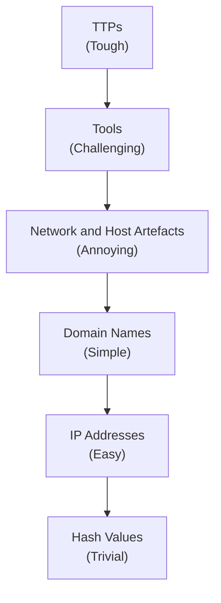
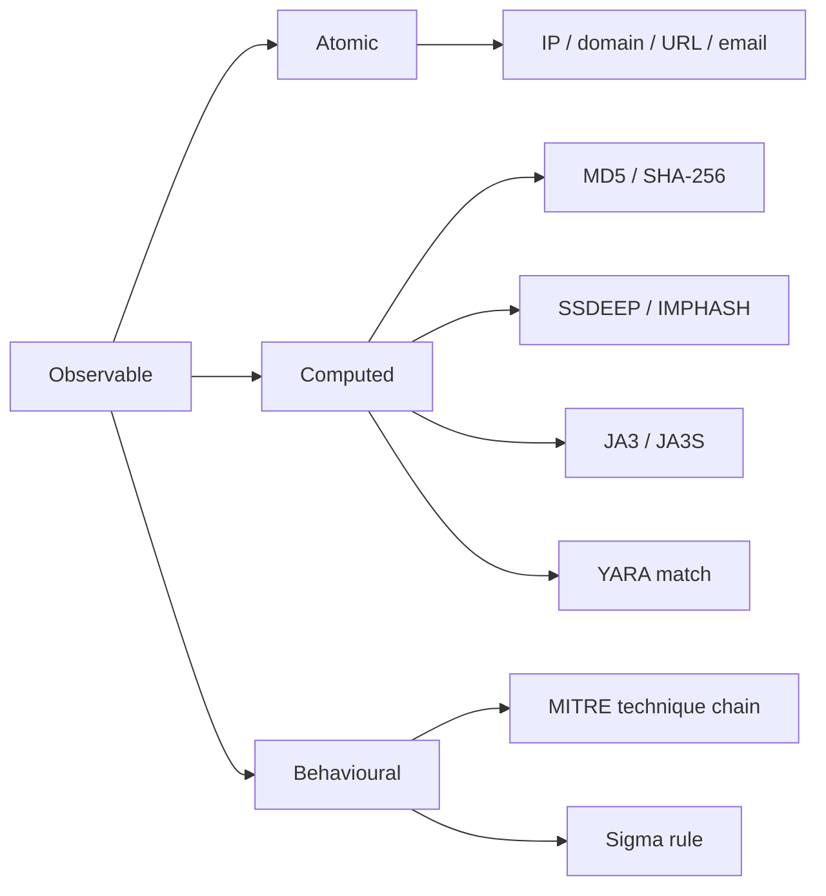
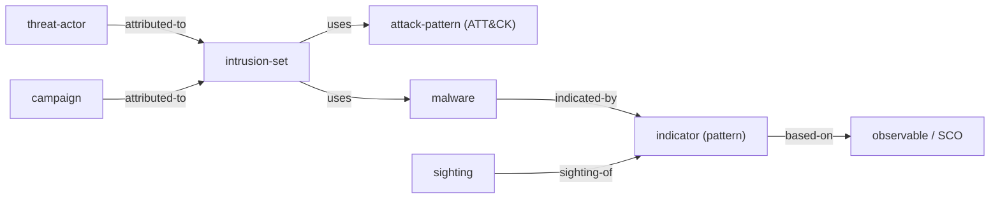
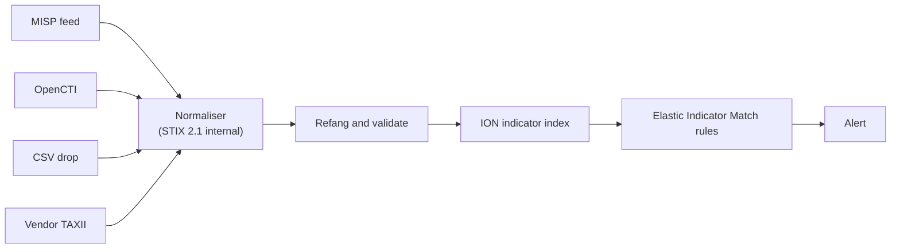
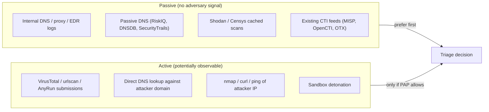
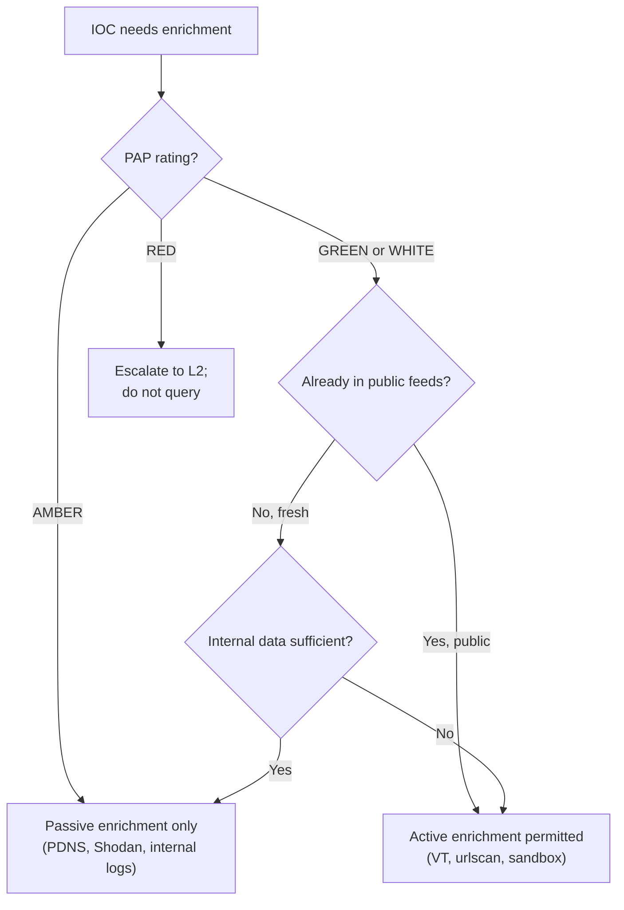
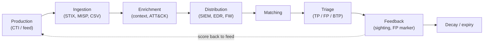
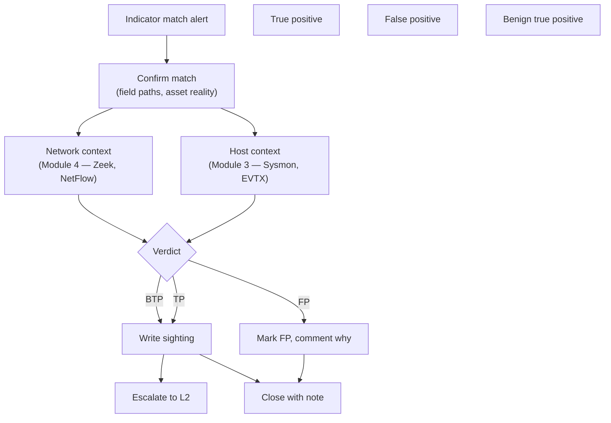

# Module 5: IOC Handling for L1 SOC Analysts — Curriculum Dossier

---

## 1. Module Overview

Indicators of Compromise (IOCs) are the connective tissue of a Security Operations Center (SOC). They are the concrete, machine-matchable values — a SHA-256 file hash, a domain, an IP address, a TLS fingerprint — that turn human-written threat intelligence into automated detection. Without IOCs, threat intelligence is a PDF report nobody acts on. Without threat intelligence, IOCs are unlabelled strings that the SIEM has no reason to alert on. Module 5 sits squarely in that join.

For a Tier 1 (L1) analyst, IOC handling is a daily, hourly activity. Every triaged alert involves at least one observable: a hash that fired against an EDR allowlist, an IP that matched a watchlist, a domain that surfaced in DNS logs. The L1's job is to take that observable, confirm whether it represents a real intrusion, enrich it with context the detection engine did not have, and either escalate it to L2 or close it with a documented reason. Doing this well requires more than knowing how to copy a hash into VirusTotal. It requires understanding the indicator's *origin*, its *reliability*, its *durability*, and the *operational risks* of the lookups you perform on it.

This module assumes you have completed Module 3 (Windows Event Logs and Sysmon) and Module 4 (Network Telemetry: Zeek, NetFlow, PCAP, ECS network fields). Those two modules taught you where observables live in your environment. Module 5 teaches you what to do when an observable arrives from outside (a feed, a report, a peer SOC) and needs to be matched against your environment, and equally what to do when an observable surfaces inside your environment and needs to be matched against external knowledge.

The big-picture concepts you will leave with:

- The taxonomy of IOC types and which are cheap or expensive for an attacker to change (David Bianco's Pyramid of Pain).
- The standard formats for sharing IOCs (STIX 2.1, MISP, OpenIOC) and how they are tagged for distribution (TLP, PAP).
- The reputation and enrichment ecosystem (VirusTotal, AbuseIPDB, URLhaus, ThreatFox, OTX, Shodan, Censys, passive DNS) — and the OPSEC pitfalls of using it carelessly.
- The IOC lifecycle inside ION/Elastic from ingestion through matching, sighting, and decay.
- A defensible decision process for when to enrich actively versus passively, when to escalate, and when to record a false-positive.

By the end, you should be able to look at any indicator in any case and answer four questions: where did this come from, how reliable is it, what will it cost the adversary if I burn it, and what is safe to do with it next.

---

## 2. Module Learning Objectives

By the end of Module 5, an L1 analyst will be able to:

1. Classify an observable into the correct IOC type (atomic, computed, behavioural) and place it on the Pyramid of Pain.
2. Read a STIX 2.1 indicator object and extract its pattern, validity window, and labels.
3. Interpret a MISP event's attributes, objects, tags, and TLP/PAP markings without help.
4. Apply Traffic Light Protocol (TLP) and Permissible Actions Protocol (PAP) correctly when deciding whether to share, query, or actively probe an indicator.
5. Choose between active enrichment (VirusTotal, sandbox detonation) and passive enrichment (passive DNS, Shodan cached data) based on OPSEC risk.
6. Defang and refang IOCs correctly when writing case notes or copying into queries.
7. Trace an IOC through the ION lifecycle: ingestion -> indicator index -> match rule -> alert -> sighting -> decay.
8. Build KQL queries that match hashes, IPs, domains, and URLs against ECS-mapped fields in Elastic.
9. Submit a sighting back to MISP/OpenCTI and mark a false-positive in a way that improves rather than degrades the feed.
10. Justify, in writing, every active lookup performed during a triage — what was queried, what was learned, and what risk it incurred.

---

## 3. Lesson 1 — IOC Types and the Pyramid of Pain

### 3.1 The vocabulary problem

Three terms get used interchangeably in vendor literature but mean different things in formal threat intelligence work:

- **Observable** — a measurable property of an entity. A file's SHA-256, an IP address, a process name. An observable is not malicious by itself; it is just data.
- **Indicator** — an observable plus the *context that says it is suspicious*. The same SHA-256 becomes an indicator when it is labelled "Emotet payload, observed 2025-09-12, TLP:GREEN."
- **IOC (Indicator of Compromise)** — informal industry shorthand for "indicator." Some authors restrict "IOC" to indicators that mean an intrusion has *already happened* and reserve "IOA" (Indicator of Attack) for behavioural patterns that suggest an intrusion is *in progress*. In this course we use "IOC" in the broad sense unless explicitly noted.

Mandiant's older taxonomy splits indicators three ways, and it is still a useful mental model:

- **Atomic indicator** — cannot be broken down further without losing meaning. Example: an IP address `203.0.113.45`. You can't divide it; the octets alone don't help.
- **Computed indicator** — produced by running an algorithm over data. Example: a SHA-256 hash, a fuzzy hash (SSDEEP), a YARA rule's match against bytes, an import-table hash (IMPHASH).
- **Behavioural indicator** — a chain of atomic and computed indicators bound together by a description. Example: "Office process spawns powershell.exe with a base64-encoded command line that resolves a freshly registered .top domain." This is the territory of MITRE ATT&CK techniques and the top of the Pyramid of Pain.

### 3.2 Catalogue of IOC types

The L1 will see, in roughly descending order of frequency:

**File hashes.** Cryptographic digests of file content.
- *MD5* (128-bit) — fast, broken for collisions, still ubiquitous in legacy feeds. Don't trust MD5 alone for unique identification of a hostile sample.
- *SHA-1* (160-bit) — also collision-broken (SHAttered, 2017), still common.
- *SHA-256* (256-bit) — current default. Use this where you can.
- *SSDEEP* (Context-Triggered Piecewise Hashing, CTPH) — a fuzzy hash that produces similar values for similar files. Lets you say "this dropper is 78% similar to a known sample" rather than "they share zero bytes."
- *IMPHASH* (Import Hash) — MD5 of a Windows PE's import-table function names in order. Two unrelated builds of the same malware family often share an IMPHASH because they import the same DLLs in the same order. Not a primary identifier, but excellent for clustering.

**Network atomic indicators.**
- *IPv4 / IPv6 addresses* — cheap for an attacker to change (one click in a cloud console).
- *Domain names* — slightly more expensive (registration time, money, possibly KYC).
- *URLs* — full path; very specific, very brittle. A campaign that changes its phishing path defeats URL IOCs trivially.
- *Email addresses and email subjects* — for phishing campaigns. Brittle.

**Host artefacts.**
- *Mutex names* — malware often creates a named mutex to avoid running twice on the same host. The mutex name (e.g. `Global\\__M_E_Z__`) can be a strong indicator if the attacker hardcodes it.
- *Registry keys* — persistence locations like `HKCU\\Software\\Microsoft\\Windows\\CurrentVersion\\Run\\` plus a specific value name.
- *Named pipes* — Cobalt Strike beacons historically used `\\.\\pipe\\msagent_*` patterns.
- *Service names, scheduled task names, parent-child process pairs.*

**TLS / certificate artefacts.**
- *Certificate SHA-1 / SHA-256 thumbprints.*
- *JA3 / JA3S* — fingerprints of TLS Client Hello / Server Hello (cipher suite list, extensions, elliptic curves). Identifies *the TLS stack* used by the client or server, which is often distinctive for malware families. JA4 is the modern successor; the principle is the same.

**Pattern-based indicators.**
- *YARA rules* — pattern-matching language for files (and now memory and process attributes). A YARA rule is itself an indicator: if a file matches, it is flagged.
- *Sigma rules* — generic detection language for log-based detections; compiled into KQL/SPL/EQL by tools.
- *Suricata / Snort signatures* — network-layer rules.

**Adversary-level indicators.**
- *MITRE ATT&CK Techniques and Sub-techniques* — e.g. T1566.001 (Spearphishing Attachment).
- *Tactics* — e.g. TA0001 Initial Access.
- *Tools / malware family names* — Emotet, Cobalt Strike, AsyncRAT.
- *Threat actor / intrusion set names* — used cautiously; attribution is hard.

### 3.3 The Pyramid of Pain

David Bianco published the Pyramid of Pain in 2013. It ranks indicator types by how much it costs an adversary to change them after they are detected. The higher you push the adversary, the more your detections actually disrupt their operation rather than just inconveniencing them.



Reading top-down, here is what each tier costs the adversary to change, and what an L1 does with that observable.

**Hash values — Trivial.** The adversary recompiles, repacks, or just flips a byte and the hash changes. SHA-256 IOCs from a feed are usually stale within hours of a fresh campaign. The L1 still uses them — exact-match hits on a known-bad hash are usually high-confidence true positives — but should not assume hash-based detection covers the family.

**IP addresses — Easy.** A new VPS costs cents. Cloud-hosted attacker infrastructure rotates daily. The L1 still pivots on IPs (who else talked to it, when, how much), but treats IP-based IOCs as short-shelf-life.

**Domain names — Simple.** A new domain costs about ten dollars and ten minutes. Slightly more friction than an IP because domain registration leaves traces and reputation can build (or burn) over weeks. The L1 enriches domains with passive DNS to learn what IPs they have resolved to historically.

**Network and host artefacts — Annoying.** Mutex names, named pipes, registry keys, User-Agent strings, JA3 fingerprints, specific HTTP header orders. Changing these requires the adversary to modify their tooling source. The L1 escalates artefact hits faster because they tend to indicate a tool-family match rather than a specific campaign.

**Tools — Challenging.** "Cobalt Strike beacon detected" or "Mimikatz signature matched" forces the adversary to find or build a different tool. That is real engineering time. The L1 treats tool-level matches as genuinely high-severity.

**TTPs — Tough.** Behavioural patterns — "PowerShell child of WINWORD with encoded command, network beacon to a freshly-registered domain over port 443 every 60 seconds plus jitter." Detecting at the TTP level forces the adversary to redesign their operation. L1s rarely write TTP-level detections, but they consume them: every Sigma rule, every Elastic rule built on `process.parent.name` plus `process.command_line` regex is a TTP-level detector.

### 3.4 Trade-offs: precision, durability, false-positive rate

Move up the pyramid and you gain *durability* (the IOC keeps catching the adversary across campaigns) but lose *precision* (more benign things look the same). Move down and you gain precision (a SHA-256 match is unambiguous) but lose durability (the hash dies the next compile).

False-positive rates roughly invert with the pyramid:
- Hash IOCs: near-zero FP rate. If `file.hash.sha256` matches a known-bad value, it almost always is.
- IP/domain IOCs: moderate FP rate. Shared hosting, CDNs, parked domains, ad networks.
- Artefact IOCs: noticeable FP rate. A legitimate admin tool may use the same registry key.
- Tool IOCs: variable FP rate. Penetration testers run Cobalt Strike too.
- TTP IOCs: highest FP rate. PowerShell-from-Office is also how some line-of-business apps work.

This is why a mature SIEM uses a *layered* approach — hashes catch the known things cheaply, TTP rules catch the unknown things expensively.

### 3.5 Observable taxonomy — diagram



### 3.6 Quiz — Lesson 1

**Q1 (single-choice).** An adversary's command-and-control IP address is published as an IOC by a CTI feed at 09:00. By 11:00 the same campaign uses a new IP. Which Pyramid of Pain tier best explains why the feed degraded so quickly?

- A. Tools
- B. Network artefacts
- C. IP addresses
- D. TTPs

`correct: C`
Explanation: IP addresses are the second-from-bottom tier. They are trivially cheap for an adversary to swap out, which is exactly why IP-based IOCs have short useful lives.

**Q2 (multi-select).** Which of the following are *computed* indicators rather than atomic ones? (Select all that apply.)

- A. SHA-256 hash of a file
- B. Source IP address `198.51.100.7`
- C. JA3 fingerprint
- D. SSDEEP fuzzy hash
- E. Email subject "URGENT: Invoice overdue"

`correct: A, C, D`
Explanation: Hashes and TLS fingerprints are produced by running an algorithm over data, so they are computed. An IP and an email subject are atomic — they are values you read directly, not derive.

**Q3 (true/false).** Detecting at the TTP layer of the Pyramid of Pain is the cheapest detection an SOC can deploy because behavioural patterns are easy to express in KQL.

`correct: false`
Explanation: TTP-level detection is the most expensive to build and maintain — it requires deep environment knowledge and tends to produce more false positives. It is valuable because it inflicts the highest cost on the adversary, not because it is cheap to write.

---

## 4. Lesson 2 — IOC Formats, Sharing, and Threat Intel Platforms

### 4.1 Why a format matters

If every CTI team writes IOCs in their own spreadsheet, no SIEM can ingest them at scale. The community converged on standards so that an indicator produced in one organisation can flow into another organisation's SIEM in minutes. The dominant standards an L1 will see are STIX 2.1 (the OASIS standard), MISP (the de facto OSS exchange), and a long tail of CSV/IDS-rule drops. ION ingests all three.

### 4.2 STIX 2.1

**STIX** stands for Structured Threat Information eXpression. STIX 2.1 is an OASIS standard that represents threat intelligence as a graph of typed JSON objects. The categories an L1 needs to recognise:

- **SDO — STIX Domain Objects.** The "things" in the graph. Examples include:
  - `indicator` — a pattern that, if matched, means something bad.
  - `malware` — a malware family or instance.
  - `threat-actor` — an individual or group conducting the activity.
  - `attack-pattern` — usually maps to a MITRE ATT&CK technique.
  - `identity` — a victim, a sector, or the source organisation.
  - `campaign` — a set of activities sharing intent and time window.
  - `intrusion-set` — a named group of behaviours; broader than a campaign.
  - `vulnerability`, `course-of-action`, `tool`, `report`.

- **SRO — STIX Relationship Objects.** The edges in the graph.
  - `relationship` — typed link, e.g. `(indicator) indicates (malware)` or `(threat-actor) uses (attack-pattern)`.
  - `sighting` — "I saw this indicator in my environment at this time" (more on sightings in Lesson 4).

- **SCO — STIX Cyber Observables.** The raw observable types: `file`, `ipv4-addr`, `domain-name`, `url`, `email-addr`, `process`, `network-traffic`. SCOs are referenced from indicator patterns and from sightings.

- **Bundle.** A wrapper object that carries a collection of SDOs/SROs/SCOs together. STIX is shared as bundles over **TAXII** (Trusted Automated eXchange of Intelligence Information), the companion transport protocol.

A minimal STIX 2.1 indicator looks like this:

```json
{
  "type": "indicator",
  "spec_version": "2.1",
  "id": "indicator--6f3c7b2e-4a1d-4e8a-9f2c-7b1c2a8e9d44",
  "created": "2026-03-14T08:12:00.000Z",
  "modified": "2026-03-14T08:12:00.000Z",
  "name": "Emotet dropper hash, March 2026 wave",
  "indicator_types": ["malicious-activity"],
  "pattern_type": "stix",
  "pattern": "[file:hashes.'SHA-256' = 'a3f1c9b8e2d4a7f6b5c8e1d2a3f4b5c6d7e8f9a0b1c2d3e4f5a6b7c8d9e0f1a2']",
  "valid_from": "2026-03-14T08:00:00.000Z",
  "valid_until": "2026-06-14T08:00:00.000Z",
  "labels": ["malicious-activity"]
}
```

What an L1 reads off this object:
- **`pattern`** — a STIX pattern expression. The square brackets and dotted accessors mean "any object of type `file` whose `hashes.'SHA-256'` equals this value." Patterns can combine multiple observables with `AND`, `OR`, `FOLLOWEDBY`, and time qualifiers.
- **`valid_from` / `valid_until`** — the validity window. After `valid_until` passes, the indicator is considered expired (see decay in Lesson 4).
- **`indicator_types` / `labels`** — taxonomy tags drawn from open vocabularies.
- **`id`** — a stable UUID-suffixed identifier you can quote in case notes.

### 4.3 MISP

**MISP** (Malware Information Sharing Platform) is an open-source platform originally built by CIRCL (Luxembourg) and now maintained by a community. It predates STIX 2.x's maturity and has its own data model that maps onto, but is not identical to, STIX. The L1 vocabulary:

- **Event** — the top-level container, like an "incident report." An event has a date, a threat level, an analysis maturity, an info field (the human title), and a list of attributes/objects/tags.
- **Attribute** — a single observable plus category and type. Categories include "Network activity," "Payload delivery," "Persistence mechanism." Types include `ip-dst`, `domain`, `sha256`, `email-src`. Each attribute has an `to_ids` flag that says "yes, push this to detection systems" versus "this is contextual only."
- **Object** — a structured grouping of attributes that belong together — for example a `file` object bundling filename, size, MD5, SHA-1, SHA-256, and SSDEEP. Objects come from a published library of templates.
- **Tag** — free-form labels, but most SOCs follow vocabularies like TLP (`tlp:green`), PAP (`PAP:AMBER`), MITRE ATT&CK (`mitre-attack-pattern:T1566.001`), and adversary group names.
- **Galaxy** — curated knowledge-base entries (threat actors, malware families, ransomware variants) attached to events as semantic tags.

A minimal MISP attribute as JSON:

```json
{
  "type": "domain",
  "category": "Network activity",
  "to_ids": true,
  "value": "cdn-update[.]example",
  "comment": "C2 domain for March 2026 dropper wave",
  "Tag": [
    {"name": "tlp:green"},
    {"name": "PAP:AMBER"},
    {"name": "misp-galaxy:malpedia=\"Emotet\""}
  ]
}
```

When this is ingested into ION, the value gets refanged (`cdn-update.example`), the `to_ids: true` flag means it is eligible for the indicator match index, the TLP tag governs how the L1 may share it, and the PAP tag governs whether active enrichment is allowed.

### 4.4 OpenIOC (legacy)

Mandiant's **OpenIOC** is an XML schema introduced around 2011, predating STIX. It is still occasionally encountered in older Mandiant/FireEye reports and incident-response toolkits. It expresses indicators as nested boolean conditions over Indicator Items (file MD5, registry key, process name). New CTI work uses STIX 2.1; an L1 who sees OpenIOC should know it exists and convert to STIX/MISP through a tool rather than read it by hand.

### 4.5 CSV and IDS-rule drops

Not all sharing happens through structured platforms. Common informal formats:
- **CSV files** with one IOC per row plus minimal columns (type, value, first-seen, source).
- **Suricata / Snort signatures** — text rules that match network traffic. Distributed via Emerging Threats Open and similar feeds.
- **YARA rules** — text rules that match file contents or memory.
- **Sigma rules** — YAML-based detection language that compiles to your SIEM's query language.
- **EDR-specific signatures** — vendor-proprietary formats.

ION consumes CSVs through a simple ingestion job and treats Suricata/YARA rules as detection content, not as IOCs in the indicator-match sense.

### 4.6 Traffic Light Protocol (TLP) 2.0

**TLP** governs *who you are allowed to share an indicator with*. FIRST published TLP 2.0 in 2022; it superseded TLP 1.0's "TLP:WHITE" with "TLP:CLEAR" and added "TLP:AMBER+STRICT."

- **TLP:CLEAR** — share without restriction. Public.
- **TLP:GREEN** — share with the community of peers and partners, but not publicly. Do not post on a public blog or social media.
- **TLP:AMBER** — share within your organisation and with clients/customers on a need-to-know basis.
- **TLP:AMBER+STRICT** — share within your organisation only. Do *not* share with clients or external partners.
- **TLP:RED** — do not share beyond the individuals on the original recipient list. No internal redistribution.

For an L1, the practical rule: the highest TLP marking of any source contributing to a case sets the ceiling for what you can quote in tickets, in chat, and in handovers. If a TLP:RED report named the C2 domain you are now triaging, you cannot paste the report's text into the case — you can record the indicator value (which is in your environment anyway) but not the source's narrative.

### 4.7 Permissible Actions Protocol (PAP)

**PAP** governs *what you are allowed to do with the indicator* — particularly, whether you may take actions that an adversary could observe.

- **PAP:WHITE** — any action permitted, including public sharing and active probing.
- **PAP:GREEN** — actions visible to peers permitted; no public exposure.
- **PAP:AMBER** — passive actions only against the indicator. No active probes, no submissions to public sandboxes, no VirusTotal hash lookups against the indicator if the lookup is observable.
- **PAP:RED** — passive actions only, and only within the recipient organisation. No queries that touch attacker infrastructure or any third-party service the attacker might monitor.

The cardinal rule: **PAP:RED means you do not curl, ping, traceroute, dig, nslookup, VirusTotal-search, urlscan-submit, or sandbox-detonate the indicator.** All of those are visible to an adversary who is watching their own infrastructure or who has VirusTotal Intelligence (paid tier) and a hunting rule on hashes that look like theirs. Tipping the adversary that you've spotted them turns a quiet investigation into a race.

PAP and TLP are independent. An indicator can be TLP:GREEN, PAP:RED — meaning you can share it with peers but you must not actively probe it. Always read both tags.

### 4.8 OpenCTI as a reference implementation

**OpenCTI** is an OSS threat intelligence platform built on STIX 2.1. It is what ION integrates with for enriched intel storage. From the L1's perspective, OpenCTI exposes:
- An **indicators feed** browsable by type, label, and confidence.
- An **observable lookup** — paste an IP or hash and see whether OpenCTI knows it, with full STIX context (related malware, threat actors, reports).
- A **sightings view** — every time the OpenCTI-known indicator was matched somewhere.
- **Reports** — narrative documents linked to the SDOs they cite.

ION pulls from OpenCTI on a schedule and pushes sightings back. The L1 generally interacts via ION's UI, but knowing OpenCTI is the upstream truth source helps when an indicator's context looks thin.

### 4.9 Defanging and refanging

When IOCs are pasted into emails, Slack, or PDF reports, raw values like `http://evil.example/login.php` get auto-linkified by mail clients and chat apps. Someone clicks. To prevent that, the community defangs IOCs by inserting characters that break parsers but are trivially reversible by humans and ingestion code:

| Original | Defanged |
| --- | --- |
| `http://` | `hxxp://` |
| `https://` | `hxxps://` |
| `evil.example` | `evil[.]example` |
| `192.0.2.1` | `192[.]0[.]2[.]1` |
| `attacker@example.test` | `attacker[@]example[.]test` |

**Refanging** is the inverse — converting a defanged string back to its real form before ingestion. ION's intel ingester refangs on import; the L1 should defang manually whenever pasting an IOC into a place a human might click. A reasonable habit: any IOC that goes into a case note, ticket, email, or chat message gets defanged. Any IOC that goes into a query gets refanged.

### 4.10 STIX object relationships — diagram



### 4.11 Intel ingestion flow into ION — diagram



### 4.12 Quiz — Lesson 2

**Q1 (single-choice).** A peer SOC sends you an email tagged "TLP:AMBER, PAP:RED" listing five domains tied to a current intrusion. Which of the following is permitted?

- A. Submitting one of the domains to urlscan.io to see if anyone else has scanned it.
- B. Searching internal DNS logs for any of the domains.
- C. Forwarding the email to a public security mailing list to ask if anyone else has seen it.
- D. Curl-ing one of the domains from a SOC analyst workstation to confirm it resolves.

`correct: B`
Explanation: PAP:RED forbids any action that touches attacker infrastructure or any third-party service the adversary might watch. Internal log searches are passive and stay inside your perimeter, so they are allowed. The other three options either expose the indicator publicly or actively probe it.

**Q2 (multi-select).** Which of these are STIX Domain Objects (SDOs)? (Select all that apply.)

- A. `indicator`
- B. `relationship`
- C. `malware`
- D. `attack-pattern`
- E. `sighting`

`correct: A, C, D`
Explanation: SDOs are the "things" in the STIX graph (indicator, malware, attack-pattern, threat-actor, etc.). `relationship` and `sighting` are SROs (STIX Relationship Objects) — the edges that connect SDOs.

**Q3 (true/false).** Defanging an IOC like `evil[.]example` changes its meaning, so a SIEM rule that ingests the defanged value will fail to match real traffic.

`correct: true`
Explanation: A SIEM matches the literal string. Defanged values must be refanged on ingestion before being placed into the indicator index, otherwise no real DNS query for `evil.example` will hit the rule.

---

## 5. Lesson 3 — Reputation Services, Enrichment, and OPSEC

### 5.1 What enrichment is for

The detection rule that fired tells you *that* an observable matched. Enrichment tells you *what the observable is*: who else has seen it, when it appeared, what malware family it is associated with, what the IP's hosting reality looks like, what the domain's resolution history is. Without enrichment, an L1 can only repeat the rule's verdict back at the case. With enrichment, the L1 can decide whether the rule was right.

The catch: the act of looking can be observed. Nearly every popular reputation service is monitored — by abuse researchers, by competing CTI teams, and (this is the OPSEC trap) sometimes by the adversary themselves. Lesson 3 teaches the toolkit and the discipline of when to use which tool.

### 5.2 VirusTotal

**VirusTotal** (VT, owned by Google/Chronicle) is an aggregator. You submit a file, hash, URL, IP, or domain; VT returns a verdict from ~70 antivirus and threat-intel engines, plus structured metadata.

What to read on a VT result page:

- **Detection ratio** — e.g. "32/72." Useful at a glance, deeply unreliable for fresh samples. The first hours of a malware campaign typically show 0/72 because vendors haven't analysed the sample yet.
- **Vendor verdicts** — individual engine names. Treat reputable engines as data points, not as ground truth. Do not blind-trust a single vendor name; cross-reference.
- **First Submission / Last Submission / Submission Names.** First-submission timestamp is genuinely informative. If a hash was first submitted to VT 3 minutes before your alert fired, you are watching a fresh campaign. Submission filenames hint at the lure language and naming pattern.
- **Behaviour tab** — sandbox detonation results, including dropped files, network connections, registry changes, command-line arguments, mutexes. This is gold for quickly understanding what a sample does.
- **Relations / Graph** — what other files, URLs, domains, IPs are associated with this hash through prior submissions. Helps build the campaign picture.
- **Comments** — community annotations. Researchers often tag samples with malware family names or campaign IDs here. Variable quality.
- **Files containing this hash, files with this signer, similar files (vhash, ssdeep)** — pivot points.

**Free vs paid.** The public VT web UI gives you the verdict and basic metadata. **VT Intelligence** (paid) gives advanced search, Retrohunt (run a YARA rule against VT's full corpus historically), Livehunt (notify on future matches), and API quotas suitable for automation. The L1 normally uses the free tier through the SOC's shared account or an integration like ION's enrichment panel.

### 5.3 AbuseIPDB

**AbuseIPDB** is a community-driven IP reputation database. Users submit reports of abusive IPs (SSH brute force, web scraping, exploitation attempts) with categories and timestamps. The IP page shows:

- **Confidence of Abuse** — a score from 0 to 100 based on volume, recency, and reporter diversity.
- **Reports timeline** — categorised abuse reports.
- **ISP / domain / usage type** — basic geolocation and ASN data.

What "confidence of abuse" really means: it reflects *what other community members reported*, not a deep analysis. A high score is a strong signal that the IP has been a nuisance somewhere recently. A low score means *nothing has been reported*, not *the IP is clean*. Fresh attacker infrastructure has low scores until it is burned.

### 5.4 abuse.ch services

**abuse.ch** is a Swiss non-profit that runs several free, open feeds widely used by the community. The L1 should know:

- **URLhaus** — a feed of malicious URLs distributing malware. Submitted by researchers, automation, and partner SOCs. Each entry has a URL, status (online/offline), threat (e.g. `malware_download`), and tags.
- **ThreatFox** — a feed of IOCs tied to live malware families, with the family name attached. Excellent for hash, IP, domain enrichment with attribution.
- **MalwareBazaar** — a sample-sharing platform. Researchers upload samples; you can download (with caveats and ethical responsibilities).
- **Feodo Tracker / SSL Blacklist** — narrower feeds focused on banking-trojan C2 IPs and malicious certificates.

These feeds are typically TLP:CLEAR; querying them is generally safe from a TLP standpoint. Nonetheless, the OPSEC question of "could the adversary be watching these feeds for their own infrastructure" still applies.

### 5.5 AlienVault OTX

**AlienVault OTX** (Open Threat Exchange, now part of LevelBlue) is a community-curated platform centred on **pulses** — themed collections of IOCs published by researchers. A pulse has a title, description, references, tags, and a list of indicators. Quality varies enormously: some pulses are excellent published research, others are auto-generated from honeypots with no analysis. Treat as one data source among many; check the pulse author and read the description before trusting.

### 5.6 Shodan and Censys

**Shodan** and **Censys** are passive scan databases. They continuously scan the public IPv4 (and parts of IPv6) space, recording open ports, banners, TLS certificates, HTTP responses, and inferred software. For an L1, the value is:

- Confirming what services an attacker IP exposes — is it a generic VPS, a known proxy service, a Cobalt Strike Team Server with the default 50050 banner exposed?
- Pivoting on TLS certificates — find every IP that presents a particular self-signed cert.
- Finding clusters — Shodan/Censys queries like `ssl.cert.subject.cn:"example.test" port:443` can reveal sibling infrastructure.

Crucially, Shodan/Censys data is **passive from your perspective** — you are reading their database, not scanning the target yourself. The scan happened earlier from the platform's own infrastructure. This is the right tool when you need infrastructure intelligence without touching the adversary.

### 5.7 Passive DNS

**Passive DNS (PDNS)** services collect DNS responses observed in the wild — never queries from your network specifically, but DNS responses seen by sensors at recursive resolvers around the world. The L1 uses PDNS to answer questions of the form:

- *What IPs has `cdn-update.example` resolved to in the last 90 days?*
- *What domains have ever resolved to `192.0.2.45`?*
- *When did this domain first appear in DNS?*

This matters operationally: at the moment your alert fired, the malicious domain may have been resolving to one IP, and by the time you investigate, it points elsewhere. PDNS lets you reconstruct the resolution at alert time.

Major PDNS sources include RiskIQ/Microsoft Defender Threat Intelligence (formerly PassiveTotal), Farsight DNSDB (now part of DomainTools), SecurityTrails, and CIRCL's free PDNS (limited but useful). All are passive — you query a database of past observations; the adversary cannot see you query.

### 5.8 The OPSEC trap

Here is the cardinal mistake every L1 must learn to avoid:

> *You see a fresh, never-before-seen domain in an alert. You paste it into VirusTotal to "see what VT knows." VT now records that submission. The adversary, who has VT Intelligence and a Livehunt rule on their own infrastructure, gets a notification: "your domain just got searched." They burn the domain, rotate to new infrastructure, and your investigation is dead.*

This is real. Adversaries with sufficient operational maturity monitor public reputation platforms for first-submission events on their infrastructure. Submitting a sample, hash, URL, or domain to VT, urlscan, AnyRun, Hybrid Analysis, or any public sandbox is an *active* action — even though no traffic touches the attacker's servers, the platform itself becomes a side-channel.

This is precisely what PAP:RED is designed to forbid. It is also why a careful L1 prefers passive enrichment when stealth matters:

- Passive DNS instead of `dig` or `nslookup` against the domain.
- Shodan/Censys cached banners instead of `nmap` against the IP.
- Internal DNS logs, proxy logs, NetFlow, and conn.log instead of any external query.
- VT search by hash *only when the hash is already known to VT and your search adds no new information* — i.e. the hash is in a public report. If you are not sure, don't.

The general principle: every external lookup is an action you cannot undo. Treat it as one.

### 5.9 Worked example — fresh C2 domain

Scenario: at 10:14 an Elastic alert fires for an internal workstation making a DNS request to `cdn-update[.]example`. The domain is not in any of your feeds. You have to decide what to do.

**Step 1 — Internal data first.** Always. This is free and invisible to the adversary.
- DNS logs (Module 3 callback, plus Module 4 DNS via Zeek): how many hosts queried this domain, when did the queries start, what types (A, AAAA, TXT)?
- Proxy / web gateway logs: did anything fetch HTTP(S) to it? What URI paths, what response sizes?
- Zeek `conn.log` (Module 4): outbound connections to whatever IP it resolved to — duration, bytes, frequency. C2 beaconing has telltale low-byte, high-regularity patterns.
- EDR: which process on the workstation initiated the resolution? (Sysmon Event ID 22 DNS query, Module 3 callback.)

**Step 2 — Passive external.**
- Passive DNS: when did this domain first appear in any sensor? What IPs has it resolved to? Are those IPs already on any of your watchlists?
- Whois (technically active, but most modern whois lookups go to registry servers and are not adversary-visible): registration date, registrar, registrant if not privacy-protected.
- Shodan/Censys for the IPs returned by PDNS: what services run there? Is it a VPS provider you have seen abused before?

**Step 3 — Decide on active enrichment.**
- Read the case's PAP marking. If your CTI source rated this PAP:RED, stop here and escalate to L2 with what you have.
- If PAP:AMBER, internal-only investigation continues. No external active queries.
- If PAP:GREEN or unmarked and your SOC's policy allows, you may submit *only the domain name string* to VT — not the URL, not the IP, and never a sample. Even this is observable.
- If PAP:WHITE, all options are open.

**Step 4 — Document.** In the ION case:
- Every query you ran (internal and external).
- Every external service you touched, with timestamps.
- The PAP rating you applied and why.
- Your verdict and confidence.

This audit trail matters when L2 or L3 takes over, when retrospectives ask whether you tipped the adversary, and when the CTI team writes the after-action report.

### 5.10 Active vs passive sources — diagram



### 5.11 OPSEC enrichment decision tree



### 5.12 Quiz — Lesson 3

**Q1 (single-choice).** A SHA-256 hash for an unknown payload was published in a reputable public CTI report this morning, with TLP:GREEN and PAP:GREEN markings. Submitting that hash to VirusTotal is:

- A. Forbidden — any submission tips the adversary.
- B. Permitted — the hash is already public via the report; a VT search adds no new operational signal.
- C. Forbidden — TLP:GREEN means no external systems.
- D. Permitted only if you upload the file as well.

`correct: B`
Explanation: TLP governs sharing, PAP governs actions. PAP:GREEN allows queries that do not produce *new* operational exposure, and a hash already published in a public report is no longer revealing anything. Confusing TLP and PAP is a common mistake — TLP:GREEN does not block external queries.

**Q2 (multi-select).** Which of the following are *passive* enrichment sources from the analyst's perspective? (Select all that apply.)

- A. Querying Farsight DNSDB for historical resolutions of a domain.
- B. Submitting a fresh domain to urlscan.io.
- C. Searching Shodan for cached scan data on an IP.
- D. Running `dig +short` against the attacker domain from your laptop.
- E. Searching internal Zeek `dns.log` for the domain.

`correct: A, C, E`
Explanation: PDNS, Shodan cached data, and internal log searches do not generate any signal an adversary could observe. urlscan submissions and direct `dig` queries against the attacker domain are active.

**Q3 (true/false).** A "0 / 72" detection ratio on VirusTotal for a fresh sample reliably means the file is benign.

`correct: false`
Explanation: A 0/72 verdict is common for the first hours of a fresh campaign because vendor signature engines have not yet analysed the sample. Detection ratio is a lagging indicator and must never be used as sole evidence of benignity.

**Q4 (short-answer).** In one or two sentences, name a specific OPSEC risk of submitting a suspicious binary as a *file* (not just its hash) to VirusTotal during triage of a suspected targeted intrusion.

`correct: An adversary with VirusTotal Intelligence can subscribe to first-submissions matching their own samples (by YARA rule, by imphash, or by similarity) and will be alerted that their malware was just submitted by an unknown party — which signals the intrusion has been detected. The submission also makes the file available to other Intelligence subscribers, including the adversary if they are paying.`
Explanation: Sample uploads are far more revealing than hash searches because they expose the file itself plus a fresh-submission timestamp. PAP:RED and PAP:AMBER explicitly forbid this for live targeted intrusions; even on PAP:GREEN, an L1 should escalate to L2/CTI before uploading samples.

---

## 6. Lesson 4 — IOC Lifecycle, Matching in ION, and Expiry

### 6.1 The lifecycle, end to end

An indicator does not appear from nowhere and live forever. It moves through stages, and an L1 sees it at every stage:

1. **Production.** A CTI team — internal or external — observes activity, extracts observables, adds context (malware family, kill-chain phase, MITRE techniques, validity window), and publishes as a STIX bundle, MISP event, or feed entry.
2. **Ingestion.** ION (or any TIP/SIEM) pulls the bundle on a schedule, normalises it to its internal representation, refangs values, validates types, and writes the indicator to the indicator index.
3. **Enrichment.** The indicator is decorated with cross-references — links to the malware SDO, the threat-actor SDO, ATT&CK techniques, prior sightings, related observables. Some of this happens at ingest; some happens lazily on first match.
4. **Distribution.** The indicator is pushed to detection engines: Elastic Indicator Match rules, EDR watchlists, firewall blocklists, web proxy filters.
5. **Matching.** A piece of telemetry — a hash in a process event, an IP in a conn.log row, a domain in a DNS request — joins to the indicator and produces an alert.
6. **Triage.** The L1 takes the alert and classifies it as true positive (TP), false positive (FP), or benign true positive (BTP — "yes, the indicator matched, but the activity was authorised, e.g. red team test, sanctioned scanner").
7. **Feedback.** The L1 records a sighting, an FP marker, and any analyst notes. This data flows back to the TIP and contributes to the indicator's score.
8. **Decay / expiry.** Based on age, sightings, and explicit `valid_until`, the indicator's confidence drops over time. Eventually it leaves the active matching index.

### 6.2 IOC lifecycle — diagram



### 6.3 Indicator decay and expiry

Different IOC types have very different lifespans:

- **Hashes.** A SHA-256 of a malware sample is functionally permanent — that exact byte sequence will always be malicious. Hashes are not auto-expired by most TIPs. They may be archived once the family is dead, but rarely deleted. A hash from 2017 will still match the same file in 2027.
- **IPs.** Cloud IPs rotate fast. A common policy is **30 days** of active matching after last sighting; after that, the IP decays out of the indicator-match index but stays queryable for retrospective analysis. If sightings keep coming, the timer resets.
- **Domains.** More variable. A domain registered specifically for malicious use (a typosquat of a brand, a DGA seed) might stay malicious for the lifetime of that registration; common policies are **90 days to 1 year** for dedicated malicious domains. A compromised legitimate domain (e.g. a hacked WordPress site serving malware for two weeks) needs a *shorter* expiry, not longer — once the owner cleans up, continuing to alert on the domain is harmful.
- **URLs.** Often very short-lived — phishing kits move within hours or days. Policies of **7–30 days** are common.
- **TTPs and YARA rules.** No expiry; reviewed periodically as malware families evolve.

**MISP's "decaying indicators" model** assigns each indicator a base score (e.g. 80) and a decay function (linear, exponential, sigmoid) parameterised by half-life. As time passes without sightings, the score drops; on each sighting, the score gets a boost. Once the score drops below a threshold (commonly 25), the indicator stops being pushed to detection engines but remains in the database for historical lookup.

**OpenCTI's `valid_until`** is simpler: the indicator has an explicit end-of-life timestamp, after which it is no longer "live." STIX 2.1's `valid_from` / `valid_until` map directly onto this.

ION combines both ideas: STIX-derived `valid_until` is honoured if present, otherwise type-based defaults apply (hashes never decay, IPs decay 30 days from last sighting, domains decay 90 days from last sighting, URLs decay 14 days from last sighting). Sightings reset the timer.

### 6.4 Matching IOCs in ION/Elastic

In an Elastic-based stack like ION, indicators are written into a dedicated index pattern, often `logs-ti_*` or similar. Detection runs through **Indicator Match** rules: a rule that joins source events against the indicator index at search time and fires when a field of the source event equals a field of the indicator.

A simplified mental model of an Indicator Match rule:

> For every event in `logs-endpoint-*` or `logs-network-*` in the last N minutes, check whether `event.field` equals `indicator.field` for any indicator in `logs-ti_*` whose `valid_from` ≤ now ≤ `valid_until`. If yes, raise an alert with both records joined.

Field paths the L1 will recognise from Module 3 (host) and Module 4 (network), in **ECS** (Elastic Common Schema):

| Source side | Indicator side | What's matched |
| --- | --- | --- |
| `file.hash.sha256` | `threat.indicator.file.hash.sha256` | A file's SHA-256 |
| `process.hash.sha256` | `threat.indicator.file.hash.sha256` | The hash of the running executable |
| `source.ip` / `destination.ip` | `threat.indicator.ip` | An IP address either side of a connection |
| `dns.question.name` | `threat.indicator.url.domain` | DNS query name |
| `url.full` | `threat.indicator.url.full` | Full URL |
| `tls.client.ja3` | `threat.indicator.tls.client.ja3` | JA3 fingerprint |

Sample KQL queries an L1 might run for ad-hoc hunting (not the rules themselves, but the queries you'd run when triaging):

```kql
file.hash.sha256 : "a3f1c9b8e2d4a7f6b5c8e1d2a3f4b5c6d7e8f9a0b1c2d3e4f5a6b7c8d9e0f1a2"
```

```kql
destination.ip : "203.0.113.45" and event.category : "network"
```

```kql
dns.question.name : "cdn-update.example" or dns.question.name : "*.cdn-update.example"
```

```kql
url.full : "http://198.51.100.10/login.php" or
url.domain : "cdn-update.example"
```

When an Indicator Match rule fires, the resulting alert document carries both the source event and the matched indicator under `threat.indicator.*`. The L1 reads the alert and can immediately see *which* indicator matched, *which* feed it came from, and *what* context (malware family, ATT&CK technique) was attached.

For deep field-path detail on network telemetry — `source.ip`, `destination.port`, `network.bytes`, `dns.question.*`, `tls.*` — refer back to Module 4. For host-side fields — `process.executable`, `process.parent.name`, `file.path`, `registry.key` — refer back to Module 3.

### 6.5 Sightings

A **sighting** in STIX 2.1 is an SRO that says "this indicator was matched in my environment at this time, this many times, by these systems." When an L1 confirms a true-positive match, ION writes a sighting back to OpenCTI (or MISP) on the L1's behalf, populated with:
- The indicator referenced (`sighting_of_ref`).
- The count of matches.
- `first_seen` / `last_seen` timestamps.
- An `observed_data_refs` linking to the SCOs that matched (without exposing internal hostnames or user identities upstream).
- Optionally, a `confidence` score.

Why this matters:
- **For your own SOC**, sightings are the data that lets the team measure feed efficacy. "Feed X has produced 247 sightings in the last 90 days, of which 82% were TPs" is a number you can manage on. "Feed Y has produced 4 sightings, all FP" is a candidate for retirement.
- **For the producing CTI team or community**, sightings are validation that their work catches things in real environments. A MISP event with 12 sightings reported back is more trusted than one with zero. Sightings shape what the CTI community prioritises.
- **For decay**, sightings reset (or boost) the indicator's score, keeping useful indicators alive.

The L1 typically does not write sightings by hand; ION generates them on alert classification. The L1's job is to classify accurately.

### 6.6 False-positive markers

Marking an alert FP in ION does three things:
1. Closes the case with reason "False Positive."
2. Decrements the indicator's confidence score in the local TIP cache.
3. Optionally pushes an FP marker upstream to MISP/OpenCTI as a negative sighting.

**Why aggressive FP marking matters.** An indicator that generates daily FP alerts costs the SOC analyst hours every week. Worse, it teaches analysts to mute or ignore alerts from that source — which is how real intrusions go missed. If you find yourself acknowledging the same FP for the third time, escalate the *indicator* (not just the alert) to the CTI team or the senior analyst. Either:
- The indicator is wrong (a benign IP is in the feed).
- The matching context is too broad (matching a CDN-shared IP without scoping to specific traffic).
- The detection rule is wrong (matching a non-load-bearing field).

Within days, FP fatigue erodes a feed's credibility across the team. Aggressive, specific FP marking — with notes that explain why — is how a feed stays trustworthy.

### 6.7 Worked example — IOC hit triage end to end

**Scenario.** At 09:14 on a Wednesday, your ingestion job pulls a fresh CTI feed update. Among the indicators is a SHA-256 hash:

```
b1c2d3e4f5a6b7c8d9e0f1a2b3c4d5e6f7a8b9c0d1e2f3a4b5c6d7e8f9a0b1c2
```

— labelled "Initial-stage dropper for the March 2026 wave; TLP:GREEN, PAP:AMBER, valid_until 2026-06-14, indicates malware:Emotet, attack-pattern:T1566.001."

At 11:02 the same morning, an Elastic Indicator Match rule fires on workstation `WKS-04127`:

```json
{
  "@timestamp": "2026-04-29T11:02:14.318Z",
  "host.name": "WKS-04127",
  "user.name": "j.doe",
  "process.executable": "C:\\Users\\j.doe\\Downloads\\invoice_apr29.exe",
  "process.hash.sha256": "b1c2d3e4f5a6b7c8d9e0f1a2b3c4d5e6f7a8b9c0d1e2f3a4b5c6d7e8f9a0b1c2",
  "process.parent.name": "explorer.exe",
  "threat.indicator.file.hash.sha256": "b1c2d3e4f5a6b7c8d9e0f1a2b3c4d5e6f7a8b9c0d1e2f3a4b5c6d7e8f9a0b1c2",
  "threat.indicator.name": "Initial-stage dropper for the March 2026 wave",
  "threat.feed.name": "internal-cti-feed-1",
  "event.kind": "alert"
}
```

Triage walkthrough:

**(a) Confirm the hit.** The alert document carries both `process.hash.sha256` and `threat.indicator.file.hash.sha256` — they match, the rule joined correctly. Sanity-check: is the user real? Is `WKS-04127` a managed asset? (Yes, both — verified in the asset DB.) Is the path plausible? `C:\Users\j.doe\Downloads\invoice_apr29.exe` looks like a downloaded payload from an email lure.

**(b) Sysmon context — Module 3 callback.** Pivot to Sysmon for `WKS-04127` around `2026-04-29T11:02:00Z` ± 5 minutes. Look for:
- Sysmon ID 1 (Process Create) for that hash — confirm parent (`explorer.exe` from the alert; consistent with a user-double-click rather than a parent Office app).
- Sysmon ID 11 (FileCreate) for the executable — when did it land on disk?
- Sysmon ID 15 (FileCreateStreamHash) — was a `Zone.Identifier` ADS attached, indicating it was downloaded from the internet?
- Sysmon ID 22 (DnsQuery) shortly after process start — any suspicious DNS resolutions?

**(c) Network context — Module 4 callback.** Pivot to Zeek for `WKS-04127` from process-start time onward:
- `dns.log` — any new domains queried by the host within seconds of `invoice_apr29.exe` starting?
- `conn.log` — outbound connections, especially repeated short-byte connections to a single destination (beaconing).
- `http.log` / `ssl.log` — what is the JA3? Does the SNI match a known C2 family?

If you find a clean dropper-to-C2-beacon chain (process executes -> DNS query for a fresh domain -> outbound TLS to that resolved IP every 60 seconds -> moderate jitter), this is a high-confidence true positive.

**(d) Classify.** TP. The hash matched, the parent process is consistent with user-initiated execution, the network behaviour is consistent with the malware family the indicator labels (Emotet).

**(e) Sighting.** ION writes a sighting back to OpenCTI: `sighting_of_ref: indicator--<id>`, count 1, first_seen and last_seen `2026-04-29T11:02:14Z`. The local indicator's score is boosted; the upstream feed gets the sighting count incremented.

**(f) Escalate.** Because this is initial-access malware on a user workstation with confirmed C2 beaconing, escalate to L2 with:
- The case ID.
- The hash and the indicator UUID.
- The asset (`WKS-04127`) and user (`j.doe`).
- The C2 domain and IP observed in conn.log.
- The chain of Sysmon events.
- The MITRE techniques observed (T1566.001 spearphishing attachment if email is the source; T1204.002 user execution; whatever C2 protocol techniques apply, e.g. T1071.001 web protocols).
- Recommended containment (isolate host via EDR, reset user creds).

Total triage time, with practice and the data already in ION: 10–20 minutes. The lesson: the IOC match was the entry point, not the answer. Modules 3 and 4 fed the answer.

### 6.8 IOC match-then-investigate workflow — diagram



### 6.9 Quiz — Lesson 4

**Q1 (single-choice).** An IP-address indicator was last sighted in your environment 45 days ago, and your ION expiry policy is "30 days since last sighting." What is the indicator's current state?

- A. Deleted from the system.
- B. Still being actively pushed to detection engines.
- C. Decayed out of the active match index but retained for historical lookup.
- D. Permanently tombstoned and never queryable.

`correct: C`
Explanation: The standard decay model retires an indicator from active matching once the policy threshold is exceeded, but keeps it queryable for retrospective hunting. It is not deleted, and it is not still actively matching.

**Q2 (multi-select).** Which Elastic ECS field paths would correctly match a hash-type IOC against host telemetry? (Select all that apply.)

- A. `file.hash.sha256`
- B. `process.hash.sha256`
- C. `destination.ip`
- D. `dns.question.name`
- E. `process.parent.hash.sha256`

`correct: A, B, E`
Explanation: Hash-bearing fields under ECS live on `file`, `process`, and `process.parent`. `destination.ip` is for IP indicators; `dns.question.name` is for domain indicators.

**Q3 (single-choice).** A SHA-256 indicator was published 3 years ago tied to a long-dormant malware family. What is the most appropriate decay treatment?

- A. Auto-delete after 90 days regardless of type.
- B. Retain indefinitely; cryptographic hashes do not naturally decay.
- C. Apply the same 30-day decay used for IP indicators.
- D. Remove it once a single FP is recorded.

`correct: B`
Explanation: A SHA-256 of a known malicious sample never becomes benign — the byte sequence either is or is not malware. Decay policies apply mostly to IPs, domains, and URLs.

**Q4 (true/false).** Aggressively marking false positives on a feed is harmful because it makes the feed appear less reliable than it really is.

`correct: false`
Explanation: The opposite is true. Aggressive, specific FP marking surfaces broken indicators and broken matching contexts so the CTI team can fix them. Failing to mark FPs is what breaks a feed — alert fatigue erodes trust and trains analysts to miss real intrusions.

---

## 7. Glossary

- **IOC (Indicator of Compromise).** Observable plus context indicating malicious activity. Used loosely; in this course, encompasses both classical IOCs and behavioural IOAs.
- **Observable.** A measurable property of an entity (file hash, IP, domain). Not malicious by itself — pure data.
- **Indicator.** An observable plus the context that says it is suspicious or malicious, typically packaged in STIX as an `indicator` SDO.
- **Atomic indicator.** Cannot be broken down without losing meaning. An IP, an email address, a hash.
- **Computed indicator.** Produced by running an algorithm over data. SHA-256, SSDEEP, IMPHASH, JA3, YARA matches.
- **Behavioural indicator.** A pattern composed of multiple atomic and computed indicators tied together by a description; usually a MITRE ATT&CK technique chain.
- **Pyramid of Pain.** David Bianco's 2013 model ranking indicator types by the cost imposed on the adversary when those indicators are detected.
- **STIX (Structured Threat Information eXpression).** OASIS standard for representing threat intelligence as typed JSON objects (SDO/SRO/SCO).
- **TAXII.** Companion transport protocol to STIX for exchanging bundles between platforms.
- **MISP (Malware Information Sharing Platform).** Open-source threat intelligence platform; the de facto OSS exchange.
- **OpenCTI.** OSS threat intelligence platform built on STIX 2.1; ION's reference upstream TIP.
- **OpenIOC.** Mandiant's legacy XML schema for indicators, predating STIX 2.x.
- **TLP (Traffic Light Protocol).** FIRST standard governing *who* an indicator may be shared with: CLEAR, GREEN, AMBER, AMBER+STRICT, RED.
- **PAP (Permissible Actions Protocol).** Governs *what actions* may be taken against an indicator: WHITE, GREEN, AMBER, RED.
- **Sighting.** A STIX 2.1 SRO recording that a given indicator was observed in your environment at a given time.
- **False-positive marker.** Annotation that an alert (and the underlying indicator+context) was a non-event; reduces confidence and feeds back into decay.
- **Decay.** The progressive loss of confidence in an indicator over time without sightings; eventually causes the indicator to leave active matching.
- **IMPHASH.** MD5 of a Windows PE's import-table function names in order; a clustering aid for malware families.
- **SSDEEP.** Context-Triggered Piecewise Hash; a fuzzy hash that produces similar values for similar files.
- **JA3 / JA3S.** Fingerprints of a TLS Client Hello / Server Hello composition; identifies the TLS stack of the client/server.
- **Defanging.** The convention of breaking IOCs in shareable text (`hxxp://`, `evil[.]example`) so mail/chat clients do not auto-linkify.
- **Refanging.** The inverse of defanging; restoring real values before query/ingest.
- **Passive DNS (PDNS).** A database of DNS responses observed in the wild, queryable for historical resolutions; enrichment without adversary signal.
- **Active enrichment.** External lookups that may be observable to the adversary or to platforms the adversary monitors.
- **IOC feed.** A scheduled stream of indicators from a CTI source (MISP, OpenCTI, vendor TAXII, abuse.ch, OTX, internal CTI).
- **Kill-chain phase.** Stage of an intrusion (recon, weaponisation, delivery, exploitation, installation, command-and-control, actions on objectives) — used as a label on indicators.

---

## 8. References / Further Reading

- David Bianco — "The Pyramid of Pain" (original blog post): https://detect-respond.blogspot.com/2013/03/the-pyramid-of-pain.html
- OASIS — STIX Version 2.1 specification: https://docs.oasis-open.org/cti/stix/v2.1/stix-v2.1.html
- OASIS — TAXII Version 2.1 specification: https://docs.oasis-open.org/cti/taxii/v2.1/taxii-v2.1.html
- MISP Project — official documentation: https://www.misp-project.org/documentation/
- MISP — Decaying Indicators model: https://www.misp-project.org/2019/05/14/Decaying-Indicators-Of-Compromise.html/
- OpenCTI — official documentation: https://docs.opencti.io/
- FIRST — Traffic Light Protocol (TLP) 2.0 standard: https://www.first.org/tlp/
- abuse.ch — landing page (URLhaus, ThreatFox, MalwareBazaar, Feodo Tracker, SSL Blacklist): https://abuse.ch/
- VirusTotal API documentation: https://docs.virustotal.com/
- AbuseIPDB: https://www.abuseipdb.com/
- AlienVault OTX (LevelBlue Open Threat Exchange): https://otx.alienvault.com/
- Shodan: https://www.shodan.io/
- Censys: https://search.censys.io/
- MITRE ATT&CK — Enterprise Matrix: https://attack.mitre.org/matrices/enterprise/
- MITRE ATT&CK Navigator: https://mitre-attack.github.io/attack-navigator/
- Elastic Common Schema (ECS) — Threat fields: https://www.elastic.co/guide/en/ecs/current/ecs-threat.html
- Blue Team Level 1 (BTL1) — Threat Intelligence chapter (Security Blue Team): https://www.securityblue.team/why-btl1
- SANS FOR578 — Cyber Threat Intelligence: https://www.sans.org/cyber-security-courses/cyber-threat-intelligence/
- CIRCL — Passive DNS: https://www.circl.lu/services/passive-dns/
- DomainTools / Farsight DNSDB: https://www.domaintools.com/products/farsight-dnsdb/
- urlscan.io: https://urlscan.io/
- Mandiant — OpenIOC (legacy reference): https://github.com/mandiant/OpenIOC_1.1
agentId: a2e8e27b014261a99 (use SendMessage with to: 'a2e8e27b014261a99' to continue this agent)
<usage>total_tokens: 44138
tool_uses: 0
duration_ms: 401061</usage>