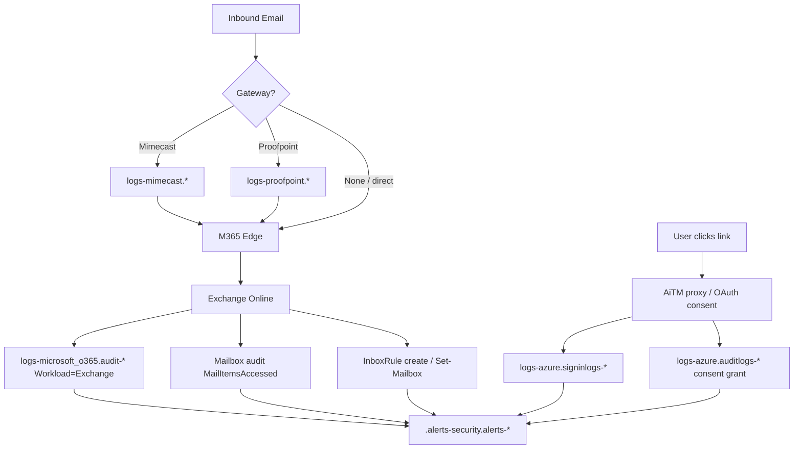
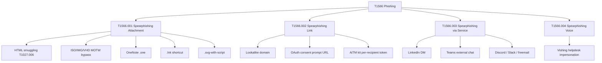
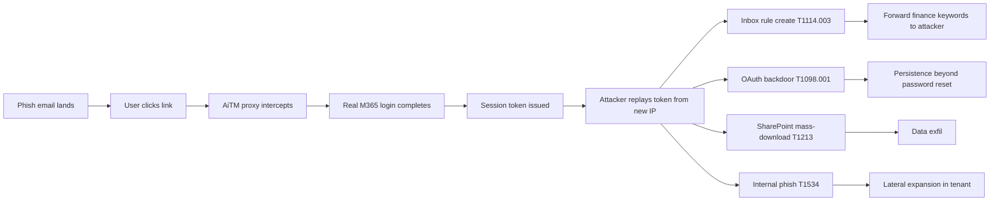
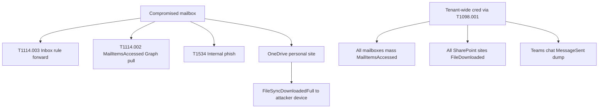
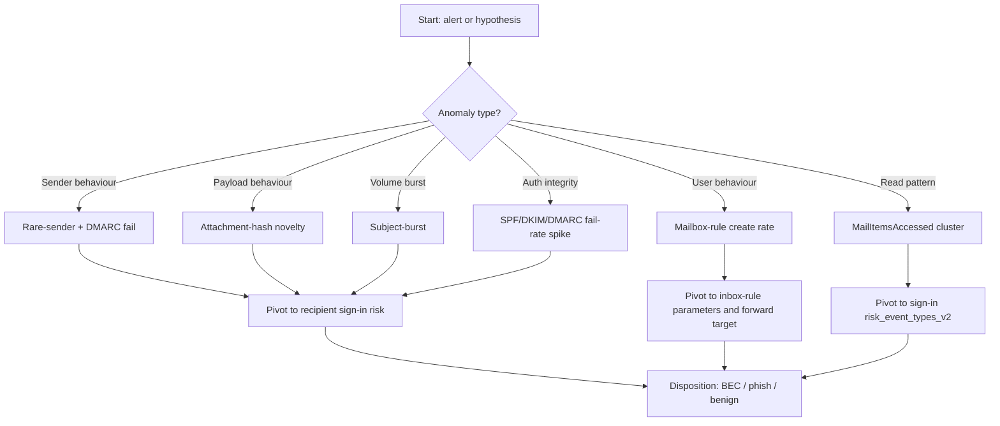

# L2 SOC Module 6 — Hunting Email and Collaboration: Initial Access (Elastic + Kibana)

> Research dossier for ION L2 SOC curriculum, Module 6.
> Stack: Elastic + Kibana (NOT Microsoft 365 Defender Advanced Hunting).
> Audience: L2 hunter who completed L2 M1–M5 (PEAK; KQL/EQL/ES|QL fluency; process+file; identity+sign-in; network).
> Depth target: BTL1+ / SANS GCIH+, ~9,000 words across four readings + four quizzes.

---

## Table of contents

1. **R1 — Email and collaboration data plane in Elastic + ECS email field reference** (~2,200w)
   - Office 365 Unified Audit Log surface in `logs-microsoft_o365.audit-*`
   - Workloads: Exchange / SharePoint / OneDrive / MicrosoftTeams / AzureActiveDirectory
   - Operation names the L2 must recognise on sight
   - ECS `email.*` field reference (ECS 8.6+)
   - Third-party gateway integrations (Mimecast, Proofpoint, IronPort, Barracuda, Abnormal, Cofense)
   - Worked broad-to-narrow KQL → EQL → ES|QL pivot
2. **R2 — T1566 Phishing — sub-techniques and email-side hunts** (~2,400w)
   - T1566.001 Spearphishing Attachment — HTML smuggling, ISO/IMG/VHD, OneNote, .lnk, .svg-script
   - T1566.002 Spearphishing Link — lookalikes, OAuth-consent URLs, AiTM kit URL fingerprints
   - T1566.003 Spearphishing via Service — LinkedIn DM, Teams external chat, freemail
   - T1566.004 Spearphishing Voice — vishing
   - SPF / DKIM / DMARC pass-fail hunting
   - Header `Reply-To` swap; ARC chain; Allow-list abuse
   - Subject-burst, attachment-hash novelty, per-recipient URL token, display-name mismatch
3. **R3 — Post-click + AiTM downstream + collaboration-platform hunts** (~2,400w)
   - AiTM session_id reuse recap (M4) joined to mailbox audit
   - T1098.001 / .005 / .003 service-principal cred + device registration + role grant
   - T1556.006 Domain Federation Settings (Golden SAML prep)
   - T1114.003 Email Forwarding Rule (BEC fingerprint)
   - T1114.002 Remote Email Collection (Graph API + MailItemsAccessed)
   - T1213 SharePoint mass-download + Teams + Confluence/Jira exfil
   - T1534 Internal Spear Phishing
   - T1027.006 HTML smuggling — email-side fingerprint
4. **R4 — Statistical-anomaly hunts + worked PEAK capstone** (~2,200w)
   - Five canonical statistical patterns adapted to the email plane
   - MailItemsAccessed cluster anomaly hunt
   - Capstone: AiTM phishing → cookie theft → forwarding rule + SharePoint exfil chain
   - Output: ES|QL / EQL detection-rule body
5. **Quiz seeds** (4 quizzes × 2 stems — single-choice / multi-select / true-false / short-answer mix)
6. **Author hand-off notes** — gaps to verify before authoring `seed_courses.py`

---

## R1 — Email and collaboration data plane in Elastic + ECS email field reference

### Why email is the first thing an L2 hunter learns to ride

Initial Access via email and collaboration platforms is the single largest delivery surface in modern intrusions. The Verizon DBIR cohort and the Mandiant M-Trends report both put phishing and stolen credentials in the top three initial vectors year after year, and unlike endpoint-side delivery you cannot fix it at the host. You have to hunt it on the wire — at the gateway, at the mailbox, and at the post-click identity events. By the time you reach L2 Module 6 you have already learned (in M4) that an Adversary-in-the-Middle (AiTM) phishing kit produces a forensically distinctive *session-cookie reuse from a new IP / new device / new ASN* fingerprint in `logs-azure.signinlogs-*`. This module hands you the upstream side of that fingerprint — the email itself — and the downstream side after it — the BEC inbox rule, the OAuth backdoor, the SharePoint mass-download.

You will be jumping between **at least four index patterns** during a typical email-initiated investigation. Memorise them now:

| Index pattern | What it carries | Pivot use |
|---|---|---|
| `logs-microsoft_o365.audit-*` | Office 365 Unified Audit Log — Exchange, SharePoint, OneDrive, Teams, Entra workloads | Primary email + collaboration data plane |
| `logs-azure.signinlogs-*` | Entra ID interactive + non-interactive sign-ins | Pivot from inbox-rule create back to *who signed in* |
| `logs-azure.auditlogs-*` | Entra ID admin actions (consent grants, role assignments, app registrations) | OAuth backdoor + role-grant hunting |
| `logs-microsoft_o365.audit-*` filtered to `o365.audit.Workload : "Exchange"` | Exchange-specific subset (mailbox audit, MailItemsAccessed) | T1114 collection hunts |
| `logs-mimecast.*` / `logs-proofpoint.*` | Third-party gateway message events | Pre-delivery hunts (gateway verdicts, URL rewrite) |
| `logs-google_workspace.alert-*` `.login-*` `.drive-*` | Google estate equivalents | Cross-tenant or hybrid Google + M365 hunts |
| `.alerts-security.alerts-<space_id>` | Elastic Security signals | Triage starting point and feedback loop |

The Elastic Filebeat **Office 365 Audit module** (now packaged as the *Microsoft 365 (formerly O365)* Elastic integration) is the workhorse here. It pulls from the **Office 365 Management Activity API** and writes one event per audit record into a data stream that resolves to `logs-microsoft_o365.audit-*`. A few field paths are non-negotiable to memorise:

- `o365.audit.Workload` — `Exchange`, `SharePoint`, `OneDrive`, `MicrosoftTeams`, `AzureActiveDirectory`, `SecurityComplianceCenter`. This is your top-level facet.
- `o365.audit.Operation` — the operation name (e.g. `New-InboxRule`, `MailItemsAccessed`, `FileDownloaded`, `Send`). This is your *what happened*.
- `o365.audit.UserId` — UPN of the actor.
- `o365.audit.ClientIP` — source IP. Watch — this is *not* always populated; some Exchange Online operations hide it inside `o365.audit.ClientIPAddress` (older module versions) or do not record it at all (admin-portal-initiated operations).
- `o365.audit.Parameters` — array of `{Name, Value}` pairs. For `New-InboxRule` and `Set-InboxRule` the rule definition (subject filter, forward-to address, move-to-folder) lives here. ES|QL `MV_EXPAND` is your friend.
- `o365.audit.ObjectId` — the target object (a mailbox UPN, a SharePoint site URL, a Teams channel id).
- `event.action` — Elastic-mapped operation name (often a normalised mirror of `o365.audit.Operation`).

### Operation names you must recognise on sight

The L2 hunter triaging an email-initiated alert needs to know — without grepping documentation — what each Unified Audit Log operation means and what tradecraft it lights up. Commit these to muscle memory:

| Operation | Workload | What it means | Tradecraft signal |
|---|---|---|---|
| `Send` | Exchange | A mailbox sent a message | Internal-from-internal phishing (T1534), data exfil via outbound mail |
| `MailItemsAccessed` | Exchange | A mail item was *read* (E5/A5/G5 only) | T1114.002 Remote Email Collection — Graph mass-pull or attacker-via-OWA |
| `SearchQueryPerformed` | Exchange / SharePoint | An eDiscovery / Compliance Search query ran | Insider recon, attacker post-takeover keyword hunting |
| `FileDownloaded` | SharePoint / OneDrive | A file was downloaded | T1213 mass-download exfil |
| `FileSyncDownloadedFull` | OneDrive | Full sync to a new device | Sync-client-based exfil |
| `New-InboxRule` | Exchange | A user (or attacker-as-user) created a mailbox rule | T1114.003 Email Forwarding Rule — the BEC fingerprint |
| `Set-InboxRule` | Exchange | A mailbox rule was modified | Same as above; attackers prefer Set to reuse a benign rule name |
| `Set-Mailbox` | Exchange | Mailbox properties changed | `ForwardingSmtpAddress` set → tenant-level forwarding (T1114.003 admin variant) |
| `Add-MailboxPermission` | Exchange | Delegate granted FullAccess on a mailbox | Persistence + collection without password reset |
| `Add-MailboxFolderPermission` | Exchange | Folder-level grant (e.g. attacker grants self read on Inbox) | Stealth variant of Add-MailboxPermission |
| `MessageTrace` (or `Get-MessageTrace`) | Exchange | An admin queried message-flow logs | Defender activity *or* attacker checking what was logged |
| `New-MoveRequest` | Exchange | A mailbox move started | Mailbox-export exfil (rare but high-confidence) |
| `Add service principal credentials` | AzureAD | A secret/cert added to an app registration | T1098.001 OAuth backdoor |
| `Consent to application` | AzureAD | A user consented to an app | T1528 Steal Application Access Token (illicit consent grant) |
| `Update application – Certificates and secrets management` | AzureAD | App reg modified | OAuth persistence or pivot |
| `Add member to role` | AzureAD | Role assignment | T1098.003 Additional Cloud Roles |
| `Update authorization policy` | AzureAD | Default user-consent settings changed | Lowering bar for future illicit consent |
| `Set-AcceptedDomain` | Exchange | Tenant-level domain settings changed | Spoofing-prep |

If you see `MailItemsAccessed` cluster on a single user inside a 30-minute window, you are looking at the textbook fingerprint of post-AiTM mail collection — providing the tenant has E5/A5/G5 licensing (Microsoft only emits this event under those SKUs; in lower SKUs you are blind to read events and have to triage on `Send` + `MessageTrace` + sign-in-side telemetry).

### ECS `email.*` field reference (ECS 8.6+)

ECS gained a first-class `email.*` namespace in 8.6 (released April 2023). Older deployments — particularly ones still running `winlogbeat-msexchange-*` or pre-ECS Mimecast shippers — *do not have these fields populated* and you have to fall back to integration-specific paths. Every L2 hunt query in this module should be tested first against ECS `email.*` and falls back to `o365.audit.*` and `mimecast.event.*` only when you confirm those fields are not normalised in the target estate. Verify with the integration version sticker in Kibana → Integrations.

ECS email field reference (the ones you will use):

- `email.subject` — message subject (string).
- `email.from.address` — RFC 5322 `From:` header (multi-value array).
- `email.to.address`, `email.cc.address`, `email.bcc.address`, `email.reply_to.address` — same shape.
- `email.message_id` — `Message-ID:` header. The single best join key between gateway and mailbox events. Memorise this.
- `email.delivery_timestamp` — when the gateway/MX accepted delivery.
- `email.origination_timestamp` — `Date:` header value (forgeable; treat as soft).
- `email.attachments.file.name`, `.file.hash.sha256`, `.file.size`, `.file.mime_type` — the attachment.
- `email.direction` — `inbound` / `outbound` / `internal`.
- `email.local_id` — message id local to the mail-server scope (e.g. Exchange `InternetMessageId` after stripping the `<>`).
- `email.x_mailer` — the `X-Mailer:` header — surprisingly useful for kit fingerprinting.
- `email.sender.address` — the `Sender:` header (often diverges from `From:` in mailing-list traffic, *and in spoofs*).

Email authentication results are normalised under a vendor-specific subtree because ECS does not yet have a stable namespace for them. In the Elastic Microsoft 365 integration look for:

- `o365.audit.AuthenticationResults.SPF`
- `o365.audit.AuthenticationResults.DKIM`
- `o365.audit.AuthenticationResults.DMARC`
- `o365.audit.AuthenticationResults.CompAuth`

In Mimecast / Proofpoint shippers the auth-results live in vendor-specific paths (`mimecast.message.spf_result`, `proofpoint.tap.spf`, etc.). Always check the integration's *exported fields* page in Kibana — do not assume.

### Third-party gateway integrations — cite-only

Most enterprise estates layer a Secure Email Gateway (SEG) or a more recent Integrated Cloud Email Security (ICES) product in front of (or alongside) the cloud mailbox. The L2 should know each by category and what telemetry to expect:

- **Mimecast** (SEG) — pre-delivery scanning, URL rewrites (`mimecast` URL pattern in body), attachment sandboxing. Elastic integration: `logs-mimecast.*`. Useful events: message-trace, URL-protect click, attachment-protect verdict.
- **Proofpoint TAP + TRAP** (SEG + post-delivery removal) — TAP pre-delivery verdicts; TRAP pulls back delivered messages on retro-verdict change. Elastic integration: `logs-proofpoint.*`. The TRAP retro-pull event is *gold* — it tells you the gateway thinks it missed something, and you should join to mailbox audit to see who clicked before TRAP fired.
- **Cisco IronPort / Cisco Secure Email** (SEG, on-prem-leaning) — verdicts via `logs-cisco_secure_email.*` (where deployed). Heavier on header rewriting.
- **Barracuda Email Security Gateway** (SEG) — `logs-barracuda.*`.
- **Abnormal Security** (ICES, API-side) — sits behind M365, scores messages on social-graph anomalies. Telemetry surfaces as alerts, not as raw mail. Useful as a second opinion for anomalous internal-from-internal mail (T1534).
- **Cofense (PhishMe + Triage)** (user-reported phishing) — `logs-cofense.*`. The reported-phish corpus is your single best hunt seed for novel campaigns.

**Audience caveat to write into the lesson body**: gateway coverage is estate-specific. Treat any of the above as illustrative — your tenant may run none, one, or three. The L2 must always confirm what ships before writing a query.

### Worked broad-to-narrow pivot — KQL → EQL → ES|QL

The PEAK methodology you learned in L2 M1 says: hypothesise, broaden, narrow, disposition. Below is the canonical worked email pivot — you will see this shape repeat throughout the module.

**Hypothesis**: a finance-team user's recent risky sign-in is followed by a forwarding-rule create and outbound mail to an external address.

**Step 1 — Broad KQL in Discover** (just to confirm data is flowing):

```kql
event.dataset : "o365.audit" and o365.audit.Workload : "Exchange" and o365.audit.Operation : ("New-InboxRule" or "Set-InboxRule" or "Set-Mailbox")
```

**Step 2 — Narrow KQL filter to a candidate user and time window**:

```kql
event.dataset : "o365.audit" and o365.audit.UserId : "alice.finance@contoso.com" and o365.audit.Operation : ("New-InboxRule" or "Set-InboxRule") and @timestamp >= "now-24h"
```

**Step 3 — EQL sequence joining sign-in to inbox-rule create within 30 minutes**:

```eql
sequence by user.target.name with maxspan=30m
  [authentication where event.dataset == "azure.signinlogs" and azure.signinlogs.properties.risk_level_during_signin == "high"]
  [any where event.dataset == "o365.audit" and o365.audit.Operation in ("New-InboxRule", "Set-InboxRule")]
```

**Step 4 — ES|QL aggregation across the fleet to surface the same pattern at scale**:

```esql
FROM logs-microsoft_o365.audit-*, logs-azure.signinlogs-*
| WHERE @timestamp > NOW() - 24 hours
| WHERE o365.audit.Operation IN ("New-InboxRule", "Set-InboxRule") OR azure.signinlogs.properties.risk_level_during_signin == "high"
| STATS rule_creates = COUNT(*) BY user.target.name, event.action
| WHERE rule_creates > 0
| SORT rule_creates DESC
| LIMIT 50
```

The pattern is always the same: **broad KQL to confirm data**, **narrow KQL to scope the candidate**, **EQL to express temporal logic**, **ES|QL to scale to fleet aggregation**. Memorise it — every reading in this module reuses it.

### Email data-plane taxonomy (Mermaid)



### Section close

R1 has given you the index patterns, the workloads, the operation names, the ECS `email.*` reference, and the canonical broad-to-narrow query shape. R2 takes the T1566 Phishing technique tree and walks each sub-technique into a worked email-side hunt against these indices.

---

## R2 — T1566 Phishing — sub-techniques and email-side hunts

### The T1566 sub-technique tree

ATT&CK's T1566 *Phishing* is the parent technique; the sub-techniques split by *delivery mechanism*. A hunter who memorises only "T1566 Phishing" cannot write specific queries — every sub-technique has its own fingerprint, and your KQL has to differ accordingly. Here is the tree:



### T1566.001 Spearphishing Attachment

**Tradecraft**: a file delivered by email, opened by the user, executes attacker code. Modern variants almost always use a *container format that bypasses Mark-of-the-Web (MOTW)* so that Office macros or `mshta` do not get blocked by Smart App Control or Protected View.

**Fingerprints from the email side**:

- **HTML smuggling (T1027.006)**: a `.html` or `.htm` attachment that contains a base64 blob and JavaScript using `Blob`, `msSaveOrOpenBlob`, or `URL.createObjectURL` to reconstruct an executable client-side. Email body or attachment body searchable via the integration's content sample (where retained — most ICES products retain a snippet, full SEGs vary). Hunt the *attachment file extension*, not the body.
- **ISO / IMG / VHD / VHDX**: container formats that, when mounted, *do not propagate MOTW to inner files*. A user double-clicks an inner `.lnk` and `mshta` runs without Protected View. Hunt for these extensions on the wire.
- **OneNote `.one`**: a single-file format that can host embedded executables. Microsoft hardened this in 2023 but legacy estates still see attempts.
- **`.lnk` shortcut**: directly delivered (rare — most SEGs strip) or inside an ISO container.
- **`.svg-with-script`**: a Scalable Vector Graphics file containing inline `<script>` tags that, when opened in a browser, redirect to an AiTM kit. SVG bypasses many SEG attachment scanners that whitelist image formats.

**Worked KQL (broad, against ECS `email.attachments.file.*`)**:

```kql
email.direction : "inbound" and (
  email.attachments.file.extension : ("iso" or "img" or "vhd" or "vhdx" or "one" or "lnk" or "svg" or "html" or "htm")
)
```

**Worked ES|QL (rare-extension fleet view)** — sender domains that delivered any rare extension to ≥ 2 mailboxes in 24 h:

```esql
FROM logs-microsoft_o365.audit-*, logs-mimecast.*, logs-proofpoint.*
| WHERE @timestamp > NOW() - 24 hours AND email.direction == "inbound"
| WHERE email.attachments.file.extension IN ("iso", "img", "vhd", "vhdx", "one", "lnk", "svg")
| EVAL sender_domain = SUBSTRING(email.from.address, LOCATE(email.from.address, "@") + 1)
| STATS recipients = COUNT_DISTINCT(email.to.address), msgs = COUNT(*) BY sender_domain, email.attachments.file.extension
| WHERE recipients >= 2
| SORT recipients DESC
| LIMIT 50
```

(Note: ES|QL string functions are still maturing — verify `LOCATE` / `SUBSTRING` semantics in your stack version. On 8.13+ both are GA. On pre-8.13 fall back to `SPLIT`.)

**Worked EQL (HTML-smuggling fingerprint via attachment hash novelty)**:

```eql
any where email.direction == "inbound"
  and email.attachments.file.extension in ("html", "htm", "svg")
  and email.attachments.file.hash.sha256 != null
```

— then in Discover sort by attachment hash count over a 7-day window; hashes seen for the first time today across many recipients are your candidates.

### T1566.002 Spearphishing Link

**Tradecraft**: a URL in the body. The user clicks. The URL leads to a credential harvester, an OAuth consent prompt, or an AiTM kit.

**Fingerprints**:

- **Lookalike domains**: `microsft.com`, `microsoftonline.co`, `office365-login.com`, IDN homoglyphs (`microsоft.com` with a Cyrillic *о*). Hunt on `email.from.address` and on URLs in body where extracted.
- **OAuth consent-prompt URLs**: legitimate Microsoft URL `https://login.microsoftonline.com/common/oauth2/v2.0/authorize` followed by a malicious `client_id` and `scope=offline_access ...`. The URL itself is on `microsoftonline.com` — TLS-pinning, certificate-transparency, and "click-time" SEGs do not catch it. Only the *consent grant in `logs-azure.auditlogs-*`* catches it after the fact.
- **AiTM kit per-recipient tokens**: kits like Evilginx, EvilProxy, Tycoon, Mamba 2FA, NakedPages, Caffeine generate a unique per-recipient URL token (e.g. `?id=USER-A4F2`, `?u=hash`, `#=base64-encoded-email`). The fingerprint is *one URL pattern delivered to many recipients with a different token per recipient*. (Treat these names as kit *patterns*, not actor attributions.)

**Worked KQL** — OAuth consent URL in inbound mail:

```kql
email.direction : "inbound" and (
  message : "login.microsoftonline.com/common/oauth2" or
  url.full : "*login.microsoftonline.com/common/oauth2*"
)
```

**Worked ES|QL — per-recipient-token AiTM URL fingerprint**: sender domains that sent URLs sharing a base path but unique query string to many recipients:

```esql
FROM logs-microsoft_o365.audit-*, logs-mimecast.*
| WHERE @timestamp > NOW() - 6 hours AND email.direction == "inbound"
| WHERE url.full IS NOT NULL
| EVAL url_base = SPLIT(url.full, "?")[0]
| STATS recipients = COUNT_DISTINCT(email.to.address), unique_urls = COUNT_DISTINCT(url.full) BY email.from.address, url_base
| WHERE recipients >= 5 AND unique_urls >= 5 AND unique_urls >= recipients * 0.8
| SORT recipients DESC
```

The signal: each recipient got a near-unique URL. That is per-recipient token kit behaviour.

### T1566.003 Spearphishing via Service

**Tradecraft**: phishing delivered *outside* the corporate mail flow — LinkedIn DM, Teams external chat, Slack Connect, Discord, freemail. The L2's blind spot, because gateway scanners do not see it.

**Hunt surfaces in Elastic**:

- **Teams external chat**: `o365.audit.Workload : "MicrosoftTeams"` and `o365.audit.Operation : "MessageSent"` with `o365.audit.ParticipantInfo.HasGuestUsers : true` or `o365.audit.ChatThreadId` involving an external tenant.
- **LinkedIn / Discord / freemail**: not natively logged. The signal here comes from *user-reported phishing* (Cofense Triage, Microsoft "Report Message" add-in writing to an audit operation). Catalogue the `Submission` audit operations.

**Worked KQL — external Teams chat into a corp user**:

```kql
event.dataset : "o365.audit" and o365.audit.Workload : "MicrosoftTeams" and o365.audit.Operation : "MessageSent" and (o365.audit.ParticipantInfo.HasForeignTenantUsers : true or o365.audit.ParticipantInfo.HasGuestUsers : true)
```

(Verify the exact field path in your integration version — Microsoft's Unified Audit Log has changed `ParticipantInfo` field shape multiple times; on older Filebeat module versions the data lives under `o365.audit.ChatThreadInfo` instead.)

### T1566.004 Spearphishing Voice (vishing)

**Tradecraft**: voice-channel phishing. Helpdesk impersonation calls, MFA-fatigue setup calls, "we are from IT, please install AnyDesk". Lab Storm 0539 / 0506 patterns. Not directly observable in email logs but produces *downstream* artefacts: an Anydesk / Quickassist / Splashtop / TeamViewer process spawn, and a sign-in from a new device. Cross-reference to L2 M3's process-execution patterns.

The L2's hunt here is to know that a sign-in anomaly *without* a corresponding email is a signal that vishing might be the upstream — and to coordinate with the IT helpdesk's call-log retention.

### Email-authentication hunts — SPF, DKIM, DMARC

A correctly authenticated piece of mail produces (in `o365.audit.AuthenticationResults`):

- `SPF=pass`
- `DKIM=pass`
- `DMARC=pass` (or `bestguesspass` if no policy is published)
- `CompAuth=pass` (Microsoft's Composite Authentication summary — `pass`, `softpass`, `fail`, `none`)

Phish patterns lighting up in auth-results:

- **`SPF=fail` cluster** — many messages from one purported domain failing SPF. Hunt with bucket aggregation by `email.from.domain`.
- **`DKIM=none` on a brand domain** — major brands publish DKIM. Inbound `microsoft.com` mail with `DKIM=none` is a forgery.
- **`DMARC=fail` but message delivered** — your tenant's anti-spam policy is bypassing the DMARC `p=reject`. This is the tenant *Allow-list abuse* signal: an attacker (or sloppy admin) added the spoofed domain to a tenant Allow-list and DMARC rejection is overridden. Hunt with `o365.audit.Operation : "Set-HostedContentFilterPolicy"` joined to subsequent `DMARC=fail` deliveries.
- **`CompAuth=fail` without anti-spoof action** — the message reached the inbox despite Composite Auth failure. Same root cause.
- **`Reply-To` swap** — `email.from.address` is a brand domain (or a co-worker), but `email.reply_to.address` points to a freemail / lookalike. The visible `From:` on the user's screen says CFO; replies go to the attacker.

**Worked KQL — SPF/DKIM/DMARC failure cluster from a single domain**:

```kql
o365.audit.AuthenticationResults.DMARC : "fail" and email.direction : "inbound" and email.from.domain : "contoso-supplier.com"
```

**Worked ES|QL — DMARC-fail-but-delivered count by sender domain**:

```esql
FROM logs-microsoft_o365.audit-*
| WHERE @timestamp > NOW() - 7 days AND email.direction == "inbound"
| WHERE o365.audit.AuthenticationResults.DMARC == "fail"
| STATS delivered = COUNT(*) BY email.from.domain
| WHERE delivered > 5
| SORT delivered DESC
```

**Worked KQL — Reply-To swap**:

```kql
email.direction : "inbound" and email.from.address : * and email.reply_to.address : * and not email.from.address : email.reply_to.address
```

(KQL does not natively support cross-field comparison in the same query — a runtime field or scripted compare is needed; in practice you implement this as an ES|QL or transform.)

**Worked ES|QL — Reply-To swap**:

```esql
FROM logs-microsoft_o365.audit-*
| WHERE @timestamp > NOW() - 24 hours AND email.direction == "inbound"
| WHERE email.from.address IS NOT NULL AND email.reply_to.address IS NOT NULL
| EVAL from_domain = SPLIT(email.from.address, "@")[1]
| EVAL reply_domain = SPLIT(email.reply_to.address, "@")[1]
| WHERE from_domain != reply_domain
| STATS msgs = COUNT(*) BY email.from.address, email.reply_to.address
| WHERE msgs >= 3
| SORT msgs DESC
| LIMIT 50
```

### The ARC chain and SRS forwarding

Authenticated Received Chain (ARC) is the standard for preserving DKIM/SPF status across forwarding hops. SRS (Sender Rewriting Scheme) is the older approach — rewriting the envelope-from to keep SPF intact. Both produce auth-results headers that the L2 must read carefully:

- A message *forwarded by a trusted external relay* (e.g. a partner's mailing list) will show `arc=pass` and a chain of intermediate signers.
- A message *forwarded by a compromised mailbox via an inbox rule* will show `arc=pass` from your *own* tenant — your tenant signs it as it leaves. **This is why outbound forwarded mail with finance-keyword subjects is a high-value hunt** — the ARC chain *is* the forwarding fingerprint.

### Display-name vs domain mismatch

A common gateway bypass: register `cfo-bob@gmail.com` and set the display name to "Bob CFO <bob@yourcompany.com>". The `From:` header — to a human glancing on a phone — looks legitimate. Mailbox clients render the display name only.

**Worked KQL — display name contains an internal-looking string but sender domain is external**:

```kql
email.direction : "inbound" and not email.from.domain : "yourcompany.com" and email.from.name : ("*ceo*" or "*cfo*" or "*hr*" or "*finance*" or "*payroll*")
```

### Legacy authentication detection

Modern phishing kits sometimes target legacy auth protocols (IMAP / POP / SMTP AUTH / Exchange Web Services / Exchange ActiveSync) because they bypass MFA. The fingerprint in `logs-azure.signinlogs-*` is `azure.signinlogs.properties.client_app_used` set to one of: `IMAP`, `POP`, `SMTP`, `Exchange ActiveSync`, `Other clients`, `Authenticated SMTP`. After Microsoft's October-2022 deprecation most tenants block these — but the *attempt* is still a signal.

**Worked KQL**:

```kql
event.dataset : "azure.signinlogs" and azure.signinlogs.properties.client_app_used : ("IMAP4" or "POP3" or "SMTP" or "Authenticated SMTP" or "Other clients")
```

### Subject-burst, attachment-hash novelty, per-recipient token — three statistical patterns

We will treat these formally in R4. For now memorise the shapes:

- **Subject-burst**: same subject delivered to ≥ 50 mailboxes within 30 min from one sender → bulk phishing.
- **Attachment-hash novelty**: SHA-256 not seen in your retention window, delivered to ≥ 5 recipients in 6 h → novel campaign.
- **Per-recipient URL token**: same URL base path, ≥ 80% of recipients getting unique query strings → AiTM kit.

### Section close

R2 has given you the T1566 sub-technique tree, the email-side fingerprints for each, and queries against `logs-microsoft_o365.audit-*`, the ECS `email.*` namespace, and Entra sign-in. R3 picks up at the *click* — what happens after the user authenticates against an AiTM kit, and how that lights up the M365 collaboration plane.

---

## R3 — Post-click and AiTM downstream + collaboration-platform hunts

### Recap — the AiTM session-cookie fingerprint (M4)

L2 M4 walked you through the AiTM session-cookie reuse fingerprint. The short version: an AiTM kit (Evilginx, EvilProxy, Tycoon, Mamba 2FA) terminates TLS at the kit's reverse proxy, completes the legitimate-looking sign-in (the user does see the Microsoft logo, does enter MFA, the gateway *does* return a valid session token), then *reuses that session token from a different IP / different device fingerprint*. In `logs-azure.signinlogs-*` you see two records sharing the same `azure.signinlogs.properties.session_id` but differing on `source.ip`, `source.geo.country_iso_code`, `azure.signinlogs.properties.device_detail.browser`, and `azure.signinlogs.properties.device_detail.operating_system`.

The capstone EQL recap from M4:

```eql
sequence by azure.signinlogs.properties.session_id with maxspan=4h
  [authentication where azure.signinlogs.properties.user_principal_name != null]
  [authentication where azure.signinlogs.properties.user_principal_name != null
     and source.ip != $1.source.ip
     and azure.signinlogs.properties.device_detail.browser != $1.azure.signinlogs.properties.device_detail.browser]
```

(EQL does not natively support cross-event field-comparison via `$1` — different stacks support different sequence-comparison shorthand. In practice on Elastic this is implemented as an ES|QL `LOOKUP JOIN` or a Transform-based detection rule; treat the EQL above as pseudocode for a sequence join.)

In Module 6, the L2 picks up *after* this sign-in and joins the session-id back to mailbox audit events for the *post-takeover* tradecraft.

### Mermaid — AiTM-to-BEC kill chain



### T1098.001 — Additional Cloud Credentials (OAuth backdoor)

**Tradecraft**: an attacker with a valid token for a privileged user adds a new client secret or certificate to an existing app registration (or registers a new app and grants it `Mail.ReadWrite`, `Mail.Send`, `Files.Read.All`, `Sites.Read.All` permissions). The new credential persists *across password reset and MFA enrolment* — that is the whole point of T1098.

**Signal in `logs-azure.auditlogs-*`**:

- `azure.auditlogs.operation_name` = `"Add service principal credentials"` or `"Update application – Certificates and secrets management"` or `"Update application"`.
- `azure.auditlogs.properties.target_resources` shows the app reg.
- `azure.auditlogs.properties.initiated_by.user.userPrincipalName` shows *who* did it — pivot to sign-in.

**Worked KQL**:

```kql
event.dataset : "azure.auditlogs" and azure.auditlogs.operation_name : ("Add service principal credentials" or "Update application – Certificates and secrets management" or "Add service principal" or "Add application")
```

**Worked EQL — service-principal credential add within 2 h of a high-risk sign-in**:

```eql
sequence by user.target.name with maxspan=2h
  [authentication where event.dataset == "azure.signinlogs" and azure.signinlogs.properties.risk_level_during_signin in ("medium", "high")]
  [any where event.dataset == "azure.auditlogs" and azure.auditlogs.operation_name == "Add service principal credentials"]
```

### T1098.005 — Device Registration

**Tradecraft**: register an attacker-controlled device as compliant in the tenant. Conditional Access policies that require a compliant device are now satisfied by the attacker's device.

**Signal**:

- `azure.auditlogs.operation_name` = `"Add registered owner to device"` or `"Add device"` or `"Update device"`.
- Pair with sign-in `azure.signinlogs.properties.device_detail.is_compliant` flipping to `true` for a device id you have not seen before.

### T1098.003 — Additional Cloud Roles

**Tradecraft**: attacker grants self (or a sock-puppet account) Global Admin or Privileged Role Administrator. Rare in well-monitored tenants but happens in flat ones.

**Signal**:

- `azure.auditlogs.operation_name` = `"Add member to role"` with `target_resources.modified_properties` showing role display name `Global Administrator`, `Privileged Role Administrator`, `Application Administrator`, `Cloud Application Administrator`.

**Worked KQL**:

```kql
event.dataset : "azure.auditlogs" and azure.auditlogs.operation_name : "Add member to role" and azure.auditlogs.properties.target_resources.modified_properties.new_value : ("Global Administrator" or "Privileged Role Administrator" or "Application Administrator" or "Cloud Application Administrator" or "Exchange Administrator")
```

### T1556.006 — Domain Federation Settings (Golden SAML preparation)

**Tradecraft**: attacker modifies the federation trust on a custom domain, pointing the IdP to attacker-controlled infrastructure or installing a token-signing key the attacker possesses. From there, attacker can mint SAML tokens for *any* user in the tenant — Golden SAML.

**Signal**:

- `azure.auditlogs.operation_name` = `"Set domain authentication"` or `"Set federation settings on domain"` or `"Update domain"`.
- High-rarity event — should fire alarms even on first occurrence outside a documented federation migration.

**Worked KQL**:

```kql
event.dataset : "azure.auditlogs" and azure.auditlogs.operation_name : ("Set domain authentication" or "Set federation settings on domain" or "Update domain")
```

This is a page-IR signal — paged senior IR. Do not silently triage.

### T1114.003 — Email Forwarding Rule (the BEC fingerprint)

**Tradecraft**: attacker creates a mailbox rule that auto-forwards (or moves to RSS feeds / Archive / Deleted Items + forwards) any message matching finance keywords. The user does not see the messages. The attacker monitors the forwarded copy from a freemail account and intercepts wire-transfer threads.

**Signal**:

- `o365.audit.Operation` = `New-InboxRule` or `Set-InboxRule`.
- `o365.audit.Parameters` contains a `ForwardTo` / `ForwardAsAttachmentTo` / `RedirectTo` / `MoveToFolder` parameter and a `SubjectContainsWords` / `BodyContainsWords` parameter with finance-keywords (`invoice`, `payment`, `wire`, `bank`, `ACH`, `IBAN`, `swift`).

The `o365.audit.Parameters` field is an array of `{Name, Value}` pairs. ES|QL `MV_EXPAND` plus a regex match is the cleanest expression.

**Worked ES|QL — finance-keyword forwarding rules in the last 24 h**:

```esql
FROM logs-microsoft_o365.audit-*
| WHERE @timestamp > NOW() - 24 hours
| WHERE o365.audit.Operation IN ("New-InboxRule", "Set-InboxRule")
| MV_EXPAND o365.audit.Parameters
| WHERE o365.audit.Parameters.Name IN ("ForwardTo", "ForwardAsAttachmentTo", "RedirectTo", "SubjectContainsWords", "BodyContainsWords")
| EVAL has_forward = o365.audit.Parameters.Name IN ("ForwardTo", "ForwardAsAttachmentTo", "RedirectTo")
| EVAL has_finance_kw = o365.audit.Parameters.Value RLIKE "(?i).*(invoice|payment|wire|bank|ACH|IBAN|swift|remit|payroll).*"
| STATS forward_count = SUM(CASE(has_forward, 1, 0)), kw_count = SUM(CASE(has_finance_kw, 1, 0)) BY o365.audit.UserId, o365.audit.Id
| WHERE forward_count >= 1 AND kw_count >= 1
| SORT @timestamp DESC
```

**Worked KQL — tenant-level forwarding (Set-Mailbox ForwardingSmtpAddress)**:

```kql
event.dataset : "o365.audit" and o365.audit.Operation : "Set-Mailbox" and o365.audit.Parameters : "*ForwardingSmtpAddress*"
```

The tenant-level `Set-Mailbox -ForwardingSmtpAddress` variant (set without a mailbox-rule) is much more dangerous because it is harder to find in the user's Outlook Rules dialog — they need to look in OWA settings or the Exchange admin console.

### T1114.002 — Remote Email Collection (Graph API + MailItemsAccessed)

**Tradecraft**: attacker uses a stolen token (or service-principal credential from T1098.001) to call `https://graph.microsoft.com/v1.0/me/messages` with a large `$top` and pages through. From the *attacker's* perspective this is silent: no Outlook open, no inbox rule. From the *defender's* perspective with E5/A5/G5 licensing, every message read produces a `MailItemsAccessed` audit event.

**Signal**:

- `o365.audit.Operation` = `MailItemsAccessed`.
- `o365.audit.OperationProperties` contains `MailAccessType` (`Bind` or `Sync`) and `IsThrottled` (`True` if Microsoft throttled emission — *throttling itself is a signal you missed events*).
- Cluster: > 50 events for one user inside 30 min after a risky sign-in.

**Worked ES|QL**:

```esql
FROM logs-microsoft_o365.audit-*
| WHERE @timestamp > NOW() - 24 hours
| WHERE o365.audit.Operation == "MailItemsAccessed"
| STATS events = COUNT(*), distinct_folders = COUNT_DISTINCT(o365.audit.Folder.Path) BY o365.audit.UserId, BUCKET(@timestamp, 30 minutes)
| WHERE events >= 50
| SORT events DESC
```

**Throttling**: when Microsoft emits `MailItemsAccessed` with `IsThrottled=True`, the audit event is summarising a 24-hour bin (per Microsoft documentation). This is the defender's blind spot — if you see throttling, the attacker accessed *more than 1000 messages in a 24-hour window* (Microsoft's threshold) and the per-message detail is gone. **Treat throttling as itself a high-confidence signal of mass collection.**

**Worked KQL — throttling cluster**:

```kql
event.dataset : "o365.audit" and o365.audit.Operation : "MailItemsAccessed" and o365.audit.OperationProperties : "*IsThrottled*True*"
```

**Licensing caveat**: MailItemsAccessed is emitted only on Microsoft 365 E5/A5/G5 (and equivalent add-ons). Lower SKUs do not get this event at all. For tenants on E3 or below, T1114.002 is hunted on `Send` (look for outbound auto-forward), `MessageTrace`, and sign-in-side telemetry — *not* on read events.

### T1213 — Data from Information Repositories

**Tradecraft**: collaboration platforms are databases full of secrets. SharePoint sites, OneDrive, Teams chat, Confluence, Jira, Notion, Google Drive. After takeover, the attacker hits Search and bulk-downloads.

**Signal — SharePoint mass-download**:

- `o365.audit.Workload` = `SharePoint` or `OneDrive`.
- `o365.audit.Operation` = `FileDownloaded` or `FileSyncDownloadedFull`.
- Cluster: > 100 distinct files downloaded by one user in 1 hour.

**Worked ES|QL**:

```esql
FROM logs-microsoft_o365.audit-*
| WHERE @timestamp > NOW() - 1 hours
| WHERE o365.audit.Workload IN ("SharePoint", "OneDrive")
| WHERE o365.audit.Operation IN ("FileDownloaded", "FileSyncDownloadedFull")
| STATS files = COUNT_DISTINCT(o365.audit.ObjectId), sites = COUNT_DISTINCT(o365.audit.SiteUrl) BY o365.audit.UserId
| WHERE files >= 100
| SORT files DESC
```

**Signal — SharePoint Search query enumeration**:

- `o365.audit.Operation` = `SearchQueryPerformed` clusters from one user, particularly with sensitive keywords (`password`, `secret`, `confidential`, `payroll`, `merger`).

**Worked ES|QL**:

```esql
FROM logs-microsoft_o365.audit-*
| WHERE @timestamp > NOW() - 6 hours
| WHERE o365.audit.Operation == "SearchQueryPerformed"
| WHERE o365.audit.QueryText RLIKE "(?i).*(password|secret|confidential|payroll|merger|acquisition|VPN|admin).*"
| STATS queries = COUNT(*) BY o365.audit.UserId
| WHERE queries >= 5
| SORT queries DESC
```

**Signal — Teams chat exfil**:

- `o365.audit.Workload` = `MicrosoftTeams`.
- `o365.audit.Operation` = `MessageSent` with attachment to external tenant.

**Signal — Confluence and Jira (Atlassian)**: Atlassian audit logs ship via the Atlassian integration where deployed; field paths differ across Atlassian Cloud vs Data Center vs on-prem. Refer to estate documentation. Hunt patterns: bulk page-export events, bulk attachment downloads.

**Signal — Google Workspace**:

- `logs-google_workspace.drive-*` for Drive activity. Operation names: `download`, `view`, `change_user_access`, `change_acl_editors`.
- `logs-google_workspace.login-*` for sign-ins.
- `logs-google_workspace.alert-*` for the Alert Center push.

### T1534 — Internal Spear Phishing

**Tradecraft**: once an account is compromised, send phishing *from the compromised mailbox* to other internal users. Now SPF passes, DKIM passes, DMARC passes — the message looks pristine because it *is* legitimately signed.

**Signal**: outbound `Send` operation from a user whose recent sign-in had a risk indicator, with subject patterns matching known phish (Sharing-link spoofs, fake DocuSign, fake voicemail-attached).

**Worked EQL — risky sign-in followed by an internal-recipient outbound send within 1 h**:

```eql
sequence by user.target.name with maxspan=1h
  [authentication where event.dataset == "azure.signinlogs"
     and (azure.signinlogs.properties.risk_level_during_signin in ("medium", "high")
          or azure.signinlogs.properties.risk_level_aggregated in ("medium", "high"))]
  [any where event.dataset == "o365.audit"
     and o365.audit.Operation == "Send"
     and o365.audit.Workload == "Exchange"]
```

Layer onto this: subject string-distance to known phish corpora (e.g. `*shared a document with you*`, `*voicemail*`, `*invoice attached*`).

### T1027.006 — HTML Smuggling — email-side fingerprint

Already mentioned in R2 as a delivery container. Worth one paragraph here on the *content-side* signature: the `.html` attachment body, where retained, contains:

- A base64 string longer than 2,048 chars.
- One of: `Blob`, `msSaveOrOpenBlob`, `URL.createObjectURL`, `atob`, `Uint8Array(`.
- Often `download` attribute on an `<a>` element with a programmatic click.

Where the gateway integration retains a snippet (Mimecast and Proofpoint do for sandboxed messages), search the body field; otherwise hunt the *attachment hash* novelty pattern from R2.

### Mermaid — collection-platform fan-out (T1114 + T1213)



### Section close

R3 has chained the AiTM session-cookie reuse signal from M4 to the post-takeover tradecraft visible in `logs-microsoft_o365.audit-*` and `logs-azure.auditlogs-*`. The L2 now has worked queries for OAuth backdoor, role grant, federation tampering, BEC inbox rules, MailItemsAccessed bursts, SharePoint mass-download, and internal phish. R4 turns these into formal statistical anomaly hunts and stitches them into a single end-to-end PEAK capstone.

---

## R4 — Statistical-anomaly hunts on email + collaboration + worked end-to-end capstone

### Why statistical hunting is mandatory at L2

L1 hunts on signature: a known-bad URL, a known-bad SHA-256, a known-bad sender. L2 hunts on *anomaly*: a sender behaving unlike its peers, a subject delivered at a frequency unlike the baseline, an attachment hash with a population of one. The PEAK methodology you learned in M1 gives you the framework — Hypothesise / Establish a baseline / Anomaly identification / Knowledge enrichment. R4 walks five canonical statistical patterns adapted for the email plane and stitches them into a capstone hunt.

### Mermaid — statistical-hunt decision tree



### Pattern 1 — Rare-sender (sender domain seen on ≤ N recipients)

**Hypothesis**: a phishing campaign typically targets a small audience the first time it appears in a tenant. Sender domains with a delivery footprint of one or two recipients in the past 30 days that *suddenly land in twenty inboxes today* are anomalous.

**ES|QL**:

```esql
FROM logs-microsoft_o365.audit-*
| WHERE @timestamp > NOW() - 24 hours AND email.direction == "inbound"
| EVAL sender_domain = SPLIT(email.from.address, "@")[1]
| STATS recipients_today = COUNT_DISTINCT(email.to.address) BY sender_domain
| WHERE recipients_today >= 5
| SORT recipients_today DESC
```

The next step is a Watcher / Transform job that compares today's recipient count to a 30-day baseline and surfaces senders that *spiked*. Implementation note: the cleanest expression is an Elastic Transform that computes a per-sender 30-day baseline and a per-sender 24-hour current value, joined.

### Pattern 2 — Attachment-hash rarity

**Hypothesis**: a SHA-256 not seen in 30 days but delivered to ≥ 5 recipients in 6 hours is a novel campaign.

**ES|QL**:

```esql
FROM logs-microsoft_o365.audit-*
| WHERE @timestamp > NOW() - 6 hours AND email.direction == "inbound"
| WHERE email.attachments.file.hash.sha256 IS NOT NULL
| STATS recipients = COUNT_DISTINCT(email.to.address), msgs = COUNT(*) BY email.attachments.file.hash.sha256, email.attachments.file.name
| WHERE recipients >= 5
| SORT recipients DESC
| LIMIT 50
```

Enrich downstream with VirusTotal, MalwareBazaar, or Hybrid Analysis lookup against the hash.

### Pattern 3 — Subject-burst

**Hypothesis**: one subject delivered to > 50 mailboxes within 30 min from one external sender is bulk phishing or commodity mailshot.

**ES|QL**:

```esql
FROM logs-microsoft_o365.audit-*
| WHERE @timestamp > NOW() - 30 minutes AND email.direction == "inbound"
| EVAL sender_domain = SPLIT(email.from.address, "@")[1]
| STATS recipients = COUNT_DISTINCT(email.to.address) BY email.subject, sender_domain
| WHERE recipients >= 50
| SORT recipients DESC
```

Caveats: legitimate marketing newsletters explode this query. Allow-list your known marketing-domain corpus before running, or accept the false-positive volume and triage on `o365.audit.AuthenticationResults.DMARC` failure as a secondary filter.

### Pattern 4 — SPF/DKIM/DMARC failure-rate spike per sender

**Hypothesis**: a sender domain with a normally-clean auth-results profile (DMARC pass-rate > 95% historic) that flips to majority-fail in a window is being spoofed *now*.

**ES|QL**:

```esql
FROM logs-microsoft_o365.audit-*
| WHERE @timestamp > NOW() - 24 hours AND email.direction == "inbound"
| EVAL sender_domain = SPLIT(email.from.address, "@")[1]
| EVAL dmarc_fail = CASE(o365.audit.AuthenticationResults.DMARC == "fail", 1, 0)
| STATS msgs = COUNT(*), fails = SUM(dmarc_fail) BY sender_domain
| EVAL fail_rate = fails::DOUBLE / msgs
| WHERE msgs >= 10 AND fail_rate >= 0.5
| SORT fails DESC
```

### Pattern 5 — Mailbox-rule create rate per user

**Hypothesis**: a user whose typical inbox-rule create rate is 0–1 per month who creates 3+ rules in an hour is anomalous.

**ES|QL**:

```esql
FROM logs-microsoft_o365.audit-*
| WHERE @timestamp > NOW() - 1 hours
| WHERE o365.audit.Operation IN ("New-InboxRule", "Set-InboxRule")
| STATS rules = COUNT(*) BY o365.audit.UserId
| WHERE rules >= 3
| SORT rules DESC
```

A user with three inbox-rule creates in a single hour is almost always either a power-user housekeeping or an attacker. Both deserve a glance.

### The MailItemsAccessed cluster anomaly

**Hypothesis**: a user whose `MailItemsAccessed` event-rate spikes from a baseline of 50–200/hour to > 1000/hour, *and* the spike correlates within 1 hour of an anomalous sign-in (`risk_event_types_v2` contains `unfamiliarFeatures`, `anomalousToken`, `tokenIssuerAnomaly`, `mcasImpossibleTravel`, or `unlikelyTravel`), is the textbook AiTM-to-mailbox-collection fingerprint.

**ES|QL — find the spike**:

```esql
FROM logs-microsoft_o365.audit-*
| WHERE @timestamp > NOW() - 24 hours
| WHERE o365.audit.Operation == "MailItemsAccessed"
| STATS events = COUNT(*) BY o365.audit.UserId, BUCKET(@timestamp, 1 hour)
| WHERE events > 1000
| SORT events DESC
```

**EQL — pair with risky sign-in within 1 h**:

```eql
sequence by user.target.name with maxspan=1h
  [authentication where event.dataset == "azure.signinlogs"
     and (azure.signinlogs.properties.risk_event_types_v2 like "*anomalousToken*"
          or azure.signinlogs.properties.risk_event_types_v2 like "*tokenIssuerAnomaly*"
          or azure.signinlogs.properties.risk_event_types_v2 like "*mcasImpossibleTravel*"
          or azure.signinlogs.properties.risk_event_types_v2 like "*unlikelyTravel*")]
  [any where event.dataset == "o365.audit"
     and o365.audit.Operation == "MailItemsAccessed"]
```

When the EQL fires *and* the per-hour count is > 1000, you are one screenshot away from "yes, mass collection happened, page IR".

### Capstone — AiTM phishing → cookie theft → mass mailbox forwarding rule + SharePoint exfil

This is the worked end-to-end PEAK hunt the L2 takes to a write-up. The hypothesis is composite: an AiTM phish landed, a user clicked, the kit harvested the session cookie, the attacker replayed the cookie from a new device, then created a forwarding rule with finance keywords and downloaded a chunk of SharePoint.

**Q1 — Broad ES|QL aggregation of risky sign-ins (last 24 h)**:

```esql
FROM logs-azure.signinlogs-*
| WHERE @timestamp > NOW() - 24 hours
| WHERE azure.signinlogs.properties.risk_level_during_signin IN ("medium", "high")
   OR azure.signinlogs.properties.risk_event_types_v2 LIKE "*anomalous*"
   OR azure.signinlogs.properties.risk_event_types_v2 LIKE "*Token*"
| STATS signins = COUNT(*), distinct_ips = COUNT_DISTINCT(source.ip), distinct_browsers = COUNT_DISTINCT(azure.signinlogs.properties.device_detail.browser)
   BY user.target.name
| WHERE signins >= 2 AND distinct_ips >= 2
| SORT signins DESC
| LIMIT 100
```

**Q2 — Narrow with `session_id` reuse + new device fingerprint**:

```esql
FROM logs-azure.signinlogs-*
| WHERE @timestamp > NOW() - 24 hours
| WHERE azure.signinlogs.properties.session_id IS NOT NULL
| STATS ip_count = COUNT_DISTINCT(source.ip), browser_count = COUNT_DISTINCT(azure.signinlogs.properties.device_detail.browser), os_count = COUNT_DISTINCT(azure.signinlogs.properties.device_detail.operating_system), country_count = COUNT_DISTINCT(source.geo.country_iso_code)
   BY azure.signinlogs.properties.session_id, user.target.name
| WHERE ip_count >= 2 AND (browser_count >= 2 OR os_count >= 2 OR country_count >= 2)
| SORT ip_count DESC
```

The output is the candidate set: session-ids reused across multiple devices/IPs/countries within the same session.

**Q3 — Enrichment — inbox-rule create + finance-keyword filter for those candidate users**:

```esql
FROM logs-microsoft_o365.audit-*
| WHERE @timestamp > NOW() - 24 hours
| WHERE o365.audit.Operation IN ("New-InboxRule", "Set-InboxRule")
| MV_EXPAND o365.audit.Parameters
| EVAL is_forward = o365.audit.Parameters.Name IN ("ForwardTo", "ForwardAsAttachmentTo", "RedirectTo")
| EVAL is_finance_kw = o365.audit.Parameters.Name IN ("SubjectContainsWords", "BodyContainsWords")
   AND o365.audit.Parameters.Value RLIKE "(?i).*(invoice|payment|wire|bank|ACH|IBAN|swift|remit|payroll|finance|CFO|treasurer).*"
| STATS forward = SUM(CASE(is_forward, 1, 0)), kw = SUM(CASE(is_finance_kw, 1, 0)) BY o365.audit.UserId, o365.audit.Id
| WHERE forward >= 1 AND kw >= 1
| SORT @timestamp DESC
```

**Q4 — Disposition — EQL sequence covering all four steps within 2 hours**:

```eql
sequence by user.target.name with maxspan=2h
  [authentication where event.dataset == "azure.signinlogs"
     and azure.signinlogs.properties.risk_level_during_signin in ("medium", "high")]
  [authentication where event.dataset == "azure.signinlogs"
     and azure.signinlogs.properties.session_id != null]
  [any where event.dataset == "o365.audit"
     and o365.audit.Operation in ("New-InboxRule", "Set-InboxRule")]
  [any where event.dataset == "o365.audit"
     and o365.audit.Workload in ("SharePoint", "OneDrive")
     and o365.audit.Operation in ("FileDownloaded", "FileSyncDownloadedFull")]
```

Any user surfacing in this EQL inside the 2-hour window is a high-confidence BEC-with-data-exfil candidate. Page IR.

### Output — Kibana Security detection rule body (EQL rule type)

For ION's curriculum the L2 should be able to *generate the detection-rule body* from the hunt. Below is the rule shape suitable for paste into Kibana → Stack Management → Rules → New rule → EQL:

```yaml
name: BEC-takeover with mailbox forwarding and SharePoint exfil
description: |
  Sequence: risky sign-in -> session-id reuse -> inbox-rule create -> SharePoint mass-download,
  all within 2 hours for the same user. Indicates AiTM phishing with post-takeover BEC + exfil.
severity: critical
risk_score: 95
type: eql
language: eql
index:
  - logs-azure.signinlogs-*
  - logs-microsoft_o365.audit-*
query: |
  sequence by user.target.name with maxspan=2h
    [authentication where event.dataset == "azure.signinlogs"
       and azure.signinlogs.properties.risk_level_during_signin in ("medium", "high")]
    [authentication where event.dataset == "azure.signinlogs"
       and azure.signinlogs.properties.session_id != null]
    [any where event.dataset == "o365.audit"
       and o365.audit.Operation in ("New-InboxRule", "Set-InboxRule")]
    [any where event.dataset == "o365.audit"
       and o365.audit.Workload in ("SharePoint", "OneDrive")
       and o365.audit.Operation in ("FileDownloaded", "FileSyncDownloadedFull")]
threat:
  - framework: MITRE ATT&CK
    tactic: { id: TA0001, name: Initial Access, reference: https://attack.mitre.org/tactics/TA0001/ }
    technique:
      - { id: T1566, name: Phishing, reference: https://attack.mitre.org/techniques/T1566/ }
      - { id: T1114, name: Email Collection, reference: https://attack.mitre.org/techniques/T1114/ }
      - { id: T1213, name: Data from Information Repositories, reference: https://attack.mitre.org/techniques/T1213/ }
```

### Mermaid — capstone hunt-to-detection pipeline

```mermaid
graph LR
    A[Hypothesis: AiTM->BEC->exfil chain] --> B[Q1 ES|QL risky sign-ins]
    B --> C[Q2 ES|QL session_id reuse + new device]
    C --> D[Q3 ES|QL forwarding rule + finance kw]
    D --> E[Q4 EQL sequence 4-step]
    E --> F[Disposition write-up]
    F --> G[Promote to Kibana detection rule]
    G --> H[.alerts-security.alerts-*]
    H --> I[ION Bob ranks via AlertPromptTemplate]
    I --> J[L1 closes / escalates]
```

### Section close

R4 has given you five canonical anomaly patterns, the MailItemsAccessed cluster hunt, and a fully-worked capstone that ties M4's AiTM signal into the BEC + exfil tradecraft and emits a production-ready Kibana detection rule. Module 6 closes here. The quiz seeds and author hand-off notes follow.

---

## Quiz seeds (8 stems across 4 quizzes)

### Quiz 1 — after R1 (Email + collaboration data plane)

**Q1.1 — single-choice**
Which Elastic data stream carries the Office 365 Unified Audit Log (mailbox, SharePoint, Teams, Entra workloads)?

- A. `logs-azure.auditlogs-*`
- B. `logs-microsoft_o365.audit-*`  *(correct)*
- C. `winlogbeat-msexchange-*`
- D. `.alerts-security.alerts-default`

*Rationale*: `logs-azure.auditlogs-*` carries Entra ID admin actions only; the Unified Audit Log surfaces under the Microsoft 365 integration at `logs-microsoft_o365.audit-*`. The legacy winlogbeat path predates the cloud audit API.

**Q1.2 — multi-select**
Which `o365.audit.Operation` values map to T1114.003 Email Forwarding Rule? (Select all that apply.)

- A. `New-InboxRule`  *(correct)*
- B. `Set-InboxRule`  *(correct)*
- C. `Set-Mailbox` (when `ForwardingSmtpAddress` parameter is set)  *(correct)*
- D. `MailItemsAccessed`
- E. `FileDownloaded`

*Rationale*: A, B, and C all create or modify mailbox-side or tenant-side forwarding. D is read-side (T1114.002). E is collaboration-platform exfil (T1213).

### Quiz 2 — after R2 (T1566 sub-techniques + email-side hunts)

**Q2.1 — true/false**
A Microsoft Online OAuth consent prompt URL hosted on `login.microsoftonline.com` that delivers admin consent to an attacker app cannot be detected by URL-based gateway scanners because the URL itself is on a trusted Microsoft domain.

- True  *(correct)*
- False

*Rationale*: TLS-terminating click-time SEGs see only the trusted Microsoft host. The `client_id`, `scope`, and `redirect_uri` parameters are the malicious payload, and they are caught only after the consent grant is recorded in `logs-azure.auditlogs-*`.

**Q2.2 — short-answer**
List three header-level email-authentication signals an L2 hunter should query for inbound phish triage and the field path each maps to in `logs-microsoft_o365.audit-*`.

*Sample answer*: SPF result at `o365.audit.AuthenticationResults.SPF`; DKIM result at `o365.audit.AuthenticationResults.DKIM`; DMARC result at `o365.audit.AuthenticationResults.DMARC`. Bonus: Composite Auth at `o365.audit.AuthenticationResults.CompAuth` and `email.reply_to.address` vs `email.from.address` divergence (Reply-To swap).

### Quiz 3 — after R3 (Post-click + AiTM downstream + collaboration hunts)

**Q3.1 — single-choice**
Microsoft 365 emits the `MailItemsAccessed` audit event only on which licensing tier?

- A. Microsoft 365 Business Standard
- B. Microsoft 365 E3 / A3 / G3
- C. Microsoft 365 E5 / A5 / G5  *(correct)*
- D. All Microsoft 365 SKUs

*Rationale*: Per Microsoft documentation, MailItemsAccessed (and the rest of the Advanced Audit feature set) is gated to E5/A5/G5 and equivalent compliance add-ons. Lower SKUs do not emit this event, so T1114.002 must be hunted from `Send`, `MessageTrace`, and sign-in-side telemetry.

**Q3.2 — multi-select**
Which Entra ID admin operations are page-IR signals indicating Golden SAML preparation or OAuth backdoor? (Select all that apply.)

- A. `Set domain authentication`  *(correct — T1556.006)*
- B. `Set federation settings on domain`  *(correct — T1556.006)*
- C. `Add service principal credentials`  *(correct — T1098.001)*
- D. `Add member to role` for `Global Administrator`  *(correct — T1098.003)*
- E. `User logged in`

*Rationale*: A through D are persistence / privilege-escalation operations after takeover. E is a benign sign-in unless paired with a risk indicator.

### Quiz 4 — after R4 (Statistical hunts + capstone)

**Q4.1 — single-choice**
In the BEC capstone hunt, which step uses **EQL `sequence by ... with maxspan`** rather than ES|QL, and why?

- A. Step 1 — broad risky sign-ins (because EQL is faster on aggregations)
- B. Step 2 — session_id reuse (because EQL handles cross-session aggregation natively)
- C. Step 4 — disposition across all four chain stages (because temporal ordering across multiple events sharing a join key is EQL's native idiom)  *(correct)*
- D. None — the capstone is pure ES|QL

*Rationale*: ES|QL excels at fleet-wide aggregation; EQL excels at temporal sequence joins. Multi-stage chain detection (sign-in → session reuse → inbox-rule → SharePoint download within 2 h, joined by `user.target.name`) is the canonical EQL `sequence` shape.

**Q4.2 — short-answer**
A user's `MailItemsAccessed` count surfaces with `IsThrottled=True` in the `o365.audit.OperationProperties`. What does this indicate, and what is the L2 hunter's next pivot?

*Sample answer*: `IsThrottled=True` indicates that Microsoft has summarised more than ~1000 message-read events for this user within a 24-hour window into a single audit record, and per-message detail is lost. This is itself a high-confidence signal of mass mail collection (T1114.002). Next pivots: (1) sign-in risk in `logs-azure.signinlogs-*` for that user across the same 24-hour window; (2) any new app consents or service-principal credentials added in `logs-azure.auditlogs-*` (T1098.001 + T1528 illicit consent); (3) inbox-rule changes in `logs-microsoft_o365.audit-*` (T1114.003); (4) outbound `Send` operations and recipient-domain anomalies (T1534 internal phish, exfil).

---

## Author hand-off notes — gaps to verify before authoring `seed_courses.py`

These items are flagged as **needs-author-verification** before this dossier becomes a `seed_courses.py` module. The L1/L2/L3 curriculum bar (per the project memory) requires BTL1+/SANS GCIH+ depth; do not ship the queries below as canonical without confirming against the *target tenant's* integration version and licensing.

1. **`logs-microsoft_o365.audit-*` field schema across Filebeat module versions.** The `o365.audit.Parameters` array shape, `o365.audit.AuthenticationResults` sub-fields, `o365.audit.ParticipantInfo` (Teams) and `o365.audit.ChatThreadInfo` paths have changed across Filebeat 7.x → Elastic Agent 8.x → Microsoft 365 integration 2.x. Verify the *exact path* in Kibana → Stack Management → Index Management → Data Streams against the integration version deployed in the target estate. Several queries above use the 2.x paths; older 7.x deployments will need `o365.audit.AuthenticationResults` rewritten as nested fields.
2. **ECS `email.*` namespace 8.6+ vs older deployments.** ECS gained first-class `email.*` only in 8.6. Pre-8.6 deployments and any estate still on `winlogbeat-msexchange-*` will not have `email.subject`, `email.from.address`, `email.reply_to.address` populated. Author must add a sidebar in R1 explaining the fallback and provide an alternate `o365.audit.*`-only query set.
3. **Google Workspace integration field paths.** This dossier mentions `logs-google_workspace.alert-*`, `logs-google_workspace.login-*`, `logs-google_workspace.drive-*` but does not provide worked queries. If ION's audience includes hybrid/Google estates, the author needs to either author a sibling Google-only sub-module or stub the Google paths with cite-only treatment and a "Module 6b: Google Workspace mirror" follow-up in the curriculum status doc.
4. **Third-party gateway integration coverage.** Mimecast, Proofpoint, IronPort, Barracuda, Abnormal, Cofense are all named but field paths are not asserted. Author should pick one or two that ship in the target estate and verify `mimecast.event.*` / `proofpoint.tap.*` field schemas against the live integration. The rest stay cite-only.
5. **MailItemsAccessed licensing requirements.** Microsoft documents MailItemsAccessed as gated to E5/A5/G5. Confirm against Microsoft Learn → "Audit (Premium) in Microsoft 365" and call out explicitly in the lesson body that this section is conditional on tenant licensing. Lower-SKU readers need an alternative T1114.002 hunt path.
6. **ES|QL function availability.** Several queries use `LOCATE`, `SUBSTRING`, `SPLIT`, `MV_EXPAND`, `RLIKE`, `BUCKET`, `CASE`, `COUNT_DISTINCT`. Function GA dates differ across 8.11 → 8.13 → 8.14. Author should confirm function GA against the target stack version. On pre-8.13 stacks, fall back to KQL + Painless runtime fields.
7. **EQL `sequence by ... with maxspan` cross-event field comparison.** The M4 recap shows `$1.source.ip` shorthand for prior-event field reference; this is conceptual on Elastic and not native EQL syntax there. Implementation should use ES|QL `LOOKUP JOIN` (8.13+), Transform-based detection, or a Watcher / Painless script. Author must rewrite this section before publishing as concrete queries.
8. **Kit-name attribution discipline.** Evilginx, EvilProxy, Tycoon, Mamba 2FA, NakedPages, Caffeine are named here as *tradecraft patterns*, not as actor attributions. Reinforce in the lesson preface: "kit names are pattern fingerprints — do not treat as actor attribution; defer to TIDE / OpenCTI integrations for cluster naming."
9. **T1098.005 device registration query is stubbed.** No worked query was supplied — only the operation-name signal. Author should add one ES|QL example using `azure.auditlogs.operation_name : "Add registered owner to device"` paired with sign-in `device_detail.is_compliant` flip detection.
10. **Confluence / Jira / Notion / Atlassian field paths.** R3 mentions T1213 across these platforms but defers field paths as estate-specific. If ION's audience covers Atlassian Cloud heavily, add a worked query against the Atlassian integration in a follow-up sub-module.
11. **PEAK methodology cross-reference.** This dossier assumes the L2 has internalised PEAK from L2 M1. The capstone in R4 follows PEAK explicitly (Hypothesise → Establish baseline → Anomaly identify → Knowledge enrichment) but the framing is implicit. Author should add a one-paragraph PEAK-step labelling block at the start of R4's capstone.
12. **Word-count check.** Target is ~9,000 words. Sections approximately: ToC ~200, R1 ~2,200, R2 ~2,400, R3 ~2,400, R4 ~2,200, quizzes + handoff ~700 = ~10,000w. Trim during seed_courses authoring if needed; preference is to keep the worked queries verbatim and trim narrative prose.

### Citations to gather during seed_courses authoring

- Elastic docs: Filebeat O365 module reference; Microsoft 365 integration `o365.audit.*` exported fields; Azure module reference; EQL syntax (`sequence`, `maxspan`); ES|QL functions reference.
- Microsoft docs: Office 365 Management Activity API schema; Audit log activities reference; MailItemsAccessed audit threshold and throttling documentation; Inbox rule operation names; Set-Mailbox `ForwardingSmtpAddress` parameter docs; Composite Auth (CompAuth) values.
- ATT&CK technique pages: T1566 (.001, .002, .003, .004); T1114 (.002, .003); T1213; T1098 (.001, .003, .005); T1556.006; T1534; T1027.006; T1528.
- ECS reference: `email.*` field set introduced in ECS 8.6.

### Visual asset inventory

Six Mermaid diagrams shipped:
1. Email data-plane taxonomy (R1).
2. T1566 sub-technique tree (R2).
3. AiTM-to-BEC kill chain (R3).
4. Collection-platform fan-out (R3).
5. Statistical-hunt decision tree (R4).
6. Capstone hunt-to-detection pipeline (R4).

Author should consider adding a 7th: ECS `email.*` field-namespace heatmap (which fields populate from which integration) — this would be high-value for the verification step in note 2 above. Defer to seed_courses author.

### End of dossier


