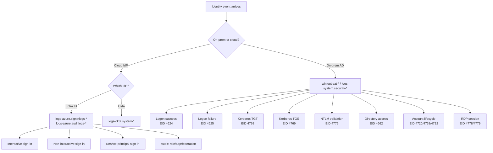
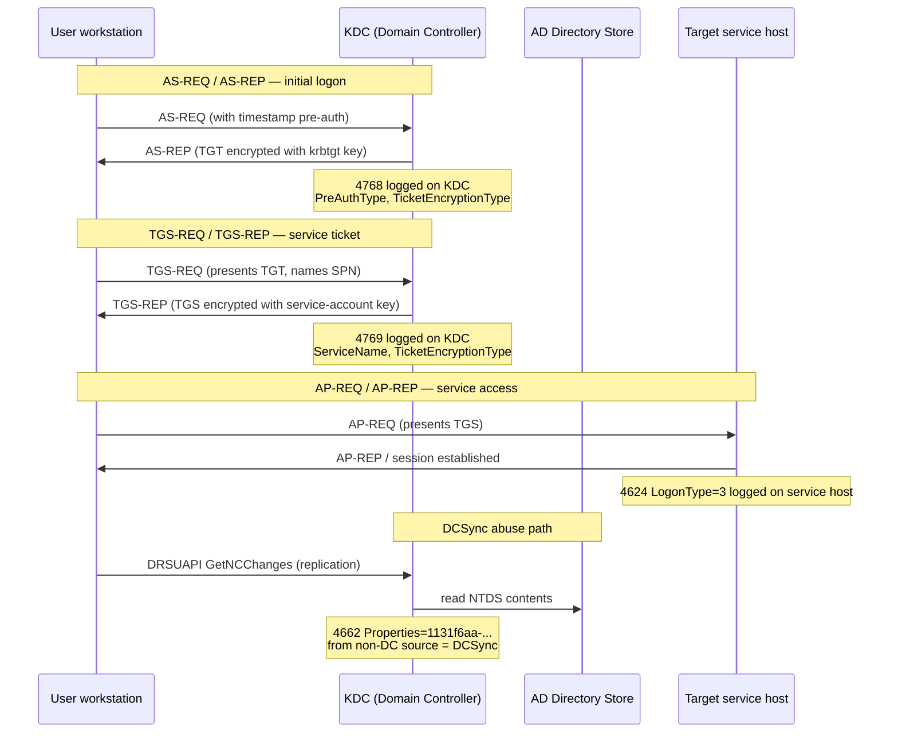
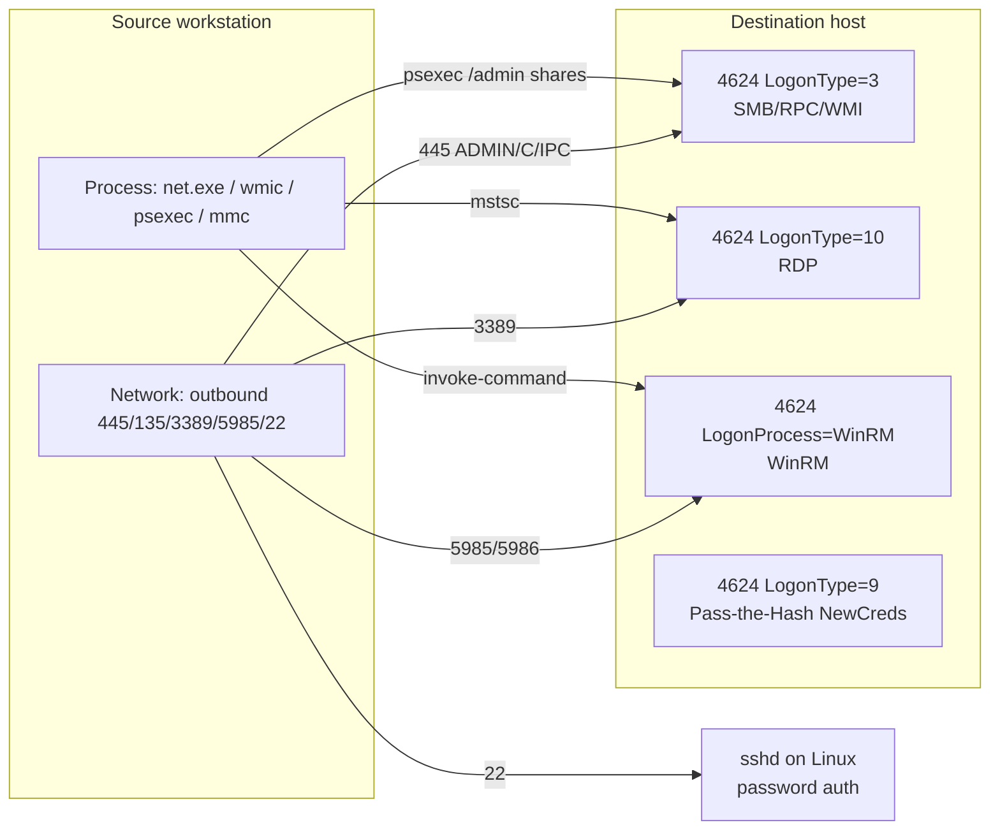
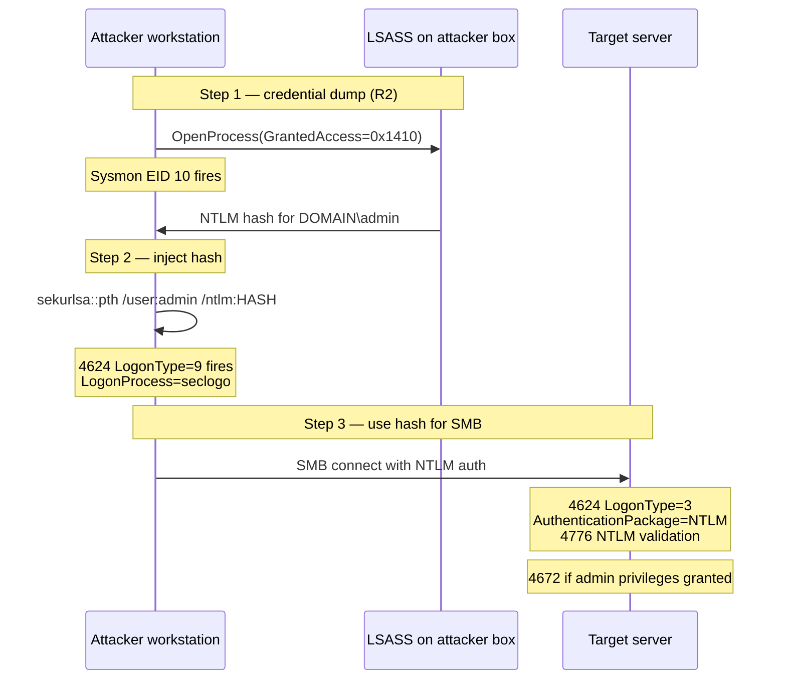
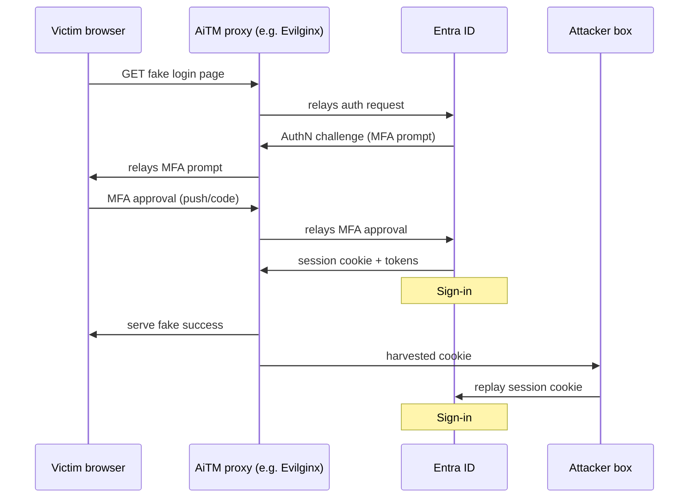
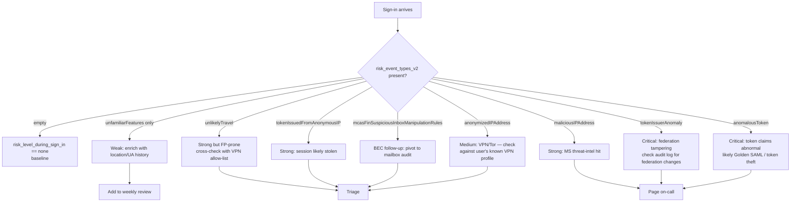

# L2 Module — Hunting Identity and Sign-in Events

**Credential Access (TA0006) + Lateral Movement (TA0008) on the Elastic Stack**

> Research dossier for an L2 SOC analyst training module on the ION platform.
> Stack scope: Elasticsearch + Kibana, ECS field paths, KQL/EQL/ES|QL.
> Audience: L2 hunters who have completed L2 M1 (PEAK), L2 M2 (KQL/EQL/ES|QL), L2 M3 (process+file events).
> Depth bar: BTL1+/SANS GCIH+. ~9,000 words across four reading lessons + four quiz lessons.

---

## Table of contents

- **R1** — The identity-event data plane in Elastic + the auth-event ECS reference
- **R2** — Credential Access (TA0006): top techniques and their EQL+ES|QL fingerprints
- **R3** — Lateral Movement (TA0008): top techniques and their fingerprints
- **R4** — Cloud-identity hunts (Entra/Azure AD), AiTM signals, and the worked end-to-end capstone
- **Quiz seeds** — 4 quizzes x 2 sample stems (single-choice / multi-select / true-false / short-answer)
- **Author hand-off notes** — gaps to verify

---

## R1 — The identity-event data plane in Elastic + the auth-event ECS reference

### Diagram — auth-event taxonomy



### Why identity is the centre of every modern intrusion

In L2 M3 you learned to hunt on `logs-endpoint.events.process-*` and `logs-endpoint.events.file-*`. Those telemetries answer "what ran where" and "what changed on disk." They do not answer the harder question: *who was the principal*, and *was that principal really the human whose name is in `user.name`*? Every credential-access and lateral-movement technique is an attempt to answer "no" to that second question — to make the SIEM record the wrong principal, or the right principal from the wrong workstation, or a token that was minted somewhere it should not have been.

That is why this module spends an entire reading on data-plane fluency before touching technique-level hunts. If you cannot tell apart a logon-type 3 from a logon-type 9 at sight, you cannot triage Pass-the-Hash. If you cannot read a Kerberos TGS request, you cannot triage Kerberoasting. If you do not know that an Entra ID `risk_event_types_v2` of `unfamiliarFeatures` is far weaker than `tokenIssuerAnomaly`, you will waste hours on the wrong false positives.

The good news: the auth-event landscape is small. Across on-prem AD and cloud Entra you only need to fluently recognise about 12 event IDs and roughly 15 Entra sign-in / audit field paths. Memorise these and you will read 95% of identity hunts cold.

### The four indices an L2 hunter must own

Elastic's identity story is split across four index patterns. Each has different field naming, different ingest path, and different latency. Treat them as four distinct sensors.

| Index pattern | Source | Key event surface | Latency typical |
|---|---|---|---|
| `winlogbeat-*` | Winlogbeat shipping native Windows Security log | EID 4624/4625/4768/4769/4662/4720/4738/4776/4778/4779 | seconds |
| `logs-system.security-*` | Elastic Agent Windows integration (system module) | Same EIDs as winlogbeat, ECS-normalised differently | seconds |
| `logs-azure.signinlogs-*` | Filebeat / Elastic Agent Azure module | Entra ID interactive + non-interactive sign-ins | 5–20 minutes |
| `logs-azure.auditlogs-*` | Filebeat / Elastic Agent Azure module | Entra audit events: role assignments, app consent, federation changes | 5–20 minutes |
| `logs-okta.system-*` | Elastic Agent Okta integration | Okta system log (auth, push, factor, policy) | 1–5 minutes |
| `logs-endpoint.events.process-*` | Elastic Defend (endpoint integration) | Credential-dump tooling invocations (mimikatz, procdump, comsvcs.dll) | seconds |
| `.alerts-security.alerts-<space_id>` | Elastic Security detection engine | Signals fired by your Kibana detection rules | seconds |

You will pivot across these indices during a single hunt. A typical lateral-movement chain begins on `logs-azure.signinlogs-*` (initial Entra sign-in from new IP), pivots to `winlogbeat-*` (the on-prem 4624 / 4768 that follow once the user lands at their workstation via VPN or Hybrid AD Join), and finally lands on `logs-endpoint.events.process-*` to confirm the credential-dump tool ran on the destination host.

ECS gives you a common spine across all of them. `user.name`, `user.domain`, `source.ip`, `host.name`, `event.action`, `event.category`, and `event.outcome` are present in every index. The vendor-specific fields hang off a vendor namespace: `winlog.event_data.*` for native Windows logs, `azure.signinlogs.properties.*` for Entra, `okta.event.*` for Okta. When you write a cross-source hunt, anchor on ECS for joins; reach into the vendor namespace for the discriminators.

### Native Windows Security log — the 12 event IDs you must read at sight

Microsoft documents these under "Audit Account Logon Events" and "Audit Logon Events" in the Windows security audit reference. Bookmark the page; we will only summarise.

**Event ID 4624 — An account was successfully logged on.** This is the workhorse. Every successful logon, interactive or not, fires a 4624 on the destination machine. The most load-bearing field is `winlog.event_data.LogonType`. Memorise these:

| LogonType | Meaning | Why a hunter cares |
|---|---|---|
| 2 | Interactive | Console keyboard logon. Should be rare on servers. |
| 3 | Network | SMB/RPC/WMI/share access. Most common type, also the noise floor. |
| 4 | Batch | Scheduled task. Often tied to a service identity. |
| 5 | Service | Service starting under an account. |
| 7 | Unlock | Console unlock from screen lock. |
| 8 | NetworkCleartext | Cleartext credentials over the wire — IIS basic auth, etc. Treat as anomalous. |
| 9 | NewCredentials | `runas /netonly` — a process is using *different* network credentials. Strong Pass-the-Hash signal. |
| 10 | RemoteInteractive | RDP. |
| 11 | CachedInteractive | Cached credentials at logon (laptop offline). |

`winlog.event_data.LogonProcessName` and `winlog.event_data.AuthenticationPackageName` add detail. `Negotiate` then `Kerberos` is a normal domain logon; `NTLM` package on a member server logon to a domain account is a yellow flag worth pivoting on. `WinRM` as the logon process is your PowerShell-remoting / WS-Management lateral movement signal.

**Event ID 4625 — An account failed to log on.** Mirror of 4624 with `winlog.event_data.SubStatus` carrying the reason. `0xC000006A` is wrong password; `0xC0000064` is user does not exist; `0xC0000234` is account locked. Cluster these by `source.ip` for password-spray; cluster by `user.name` for account-targeted brute force.

**Event ID 4768 — A Kerberos authentication ticket (TGT) was requested.** Fires on the KDC (your domain controller). Ticket-granting tickets are issued at user logon. Field discriminators: `winlog.event_data.TicketEncryptionType` (`0x12` = AES256, `0x11` = AES128, `0x17` = RC4-HMAC, `0x18` = DES — yes, still seen), `winlog.event_data.PreAuthType` (`0` = no pre-auth → AS-REP roasting candidate, `2` = standard timestamp pre-auth). `winlog.event_data.IpAddress` is the requester. Enrich `host.name` against your DC inventory.

**Event ID 4769 — A Kerberos service ticket (TGS) was requested.** Fires on the KDC every time a user requests a service ticket for a SPN. The Kerberoasting fingerprint lives here: `winlog.event_data.ServiceName` is the target SPN, `winlog.event_data.TicketEncryptionType: 0x17` when policy mandates AES means the requester downgraded to RC4 to make the ticket crackable offline. Volume from one source against many SPNs is the cluster shape.

**Event ID 4662 — An operation was performed on an object.** Directory-services audit. Two field paths matter: `winlog.event_data.Properties` (the GUID of the AD attribute or extended right being accessed) and `winlog.event_data.AccessMask`. The DCSync fingerprint is `Properties` containing the replication GUID `1131f6aa-9c07-11d1-f79f-00c04fc2dcd2` (DS-Replication-Get-Changes) or `1131f6ad-9c07-11d1-f79f-00c04fc2dcd2` (DS-Replication-Get-Changes-All) from a source that is *not* a domain controller. By default 4662 is noisy; you may need a SACL on the domain object to surface useful records.

**Event ID 4776 — The computer attempted to validate the credentials for an account (NTLM).** When NTLM is used (legacy app, member-server local-account auth, cached creds offline), 4776 fires on the validating machine. `winlog.event_data.PackageName` is `MICROSOFT_AUTHENTICATION_PACKAGE_V1_0`. Bursts of 4776 with status `0xC000006A` to a single account is NTLM brute-forcing.

**Event ID 4720 — A user account was created.** `winlog.event_data.TargetUserName` is the new account; `winlog.event_data.SubjectUserName` is who created it. Pair with 4732 (added to local group) and 4728 (added to global group) and 4756 (added to universal group) for privilege-escalation chains.

**Event ID 4738 — A user account was changed.** `winlog.event_data.PasswordLastSet` matters; a change to `(never)` or any change at all on a sensitive account requires triage.

**Event IDs 4778 / 4779 — A session was reconnected to / disconnected from a Window Station.** RDP reconnect/disconnect. Pair with 4624 logon-type 10 to track full RDP sessions including resume-from-disconnect.

**Event ID 4624 with logon type 9 specifically.** Mentioned above but worth its own emphasis. NewCredentials means a process running as user A is making outbound network connections as user B. Mimikatz `sekurlsa::pth` does exactly this. If you see logon-type 9 on a workstation where the SourceUserName is a privileged account and `winlog.event_data.LogonProcessName` is `seclogo`, escalate.

### Entra ID sign-in logs — `azure.signinlogs.*`

The cloud half. Entra exposes interactive and non-interactive sign-ins, plus service-principal sign-ins, via Azure Monitor diagnostic settings, which Filebeat / Elastic Agent's Azure module ingests into `logs-azure.signinlogs-*`. Schema lives under `azure.signinlogs.properties.*`. Fields the L2 must read at sight:

| Field | What it tells you |
|---|---|
| `azure.signinlogs.properties.user_principal_name` | The signing user (UPN, e.g. alice@corp.com) |
| `azure.signinlogs.properties.app_display_name` | Which app/service was being signed into |
| `azure.signinlogs.properties.client_app_used` | `Browser`, `Mobile Apps and Desktop clients`, `Exchange ActiveSync`, `IMAP`, etc. Legacy auth = red flag. |
| `azure.signinlogs.properties.authentication_requirement` | `singleFactorAuthentication` vs `multiFactorAuthentication` |
| `azure.signinlogs.properties.authentication_details` | Array of factors used; check `authenticationStepResultDetail` for `previouslySatisfied` |
| `azure.signinlogs.properties.risk_level_during_sign_in` | `none` / `low` / `medium` / `high` / `hidden` — Entra ID Protection's call |
| `azure.signinlogs.properties.risk_event_types_v2` | Array of risk-detection types — see decision tree below |
| `azure.signinlogs.properties.correlation_id` | Joins a sign-in across token-issuance and resource-access events |
| `azure.signinlogs.properties.session_id` | The cookie/refresh-token session — **the AiTM key** |
| `azure.signinlogs.properties.device_detail.browser` | UA-derived; e.g. `Chrome 120.0.0` |
| `azure.signinlogs.properties.device_detail.operating_system` | `Windows10`, `iOS`, `MacOs`, etc. |
| `azure.signinlogs.properties.location.city_name` / `country_or_region` | Geo from IP |
| `azure.signinlogs.properties.status.error_code` | `0` is success; `50158` is conditional-access not satisfied; `50074` is MFA required |

`risk_event_types_v2` is where most of the value sits. The values you should know cold:

- `unfamiliarFeatures` — sign-in shape unusual for the user. Weak signal alone.
- `anonymizedIPAddress` — Tor or known anonymising VPN. Medium signal.
- `maliciousIPAddress` — Microsoft threat-intel match. Strong signal.
- `unlikelyTravel` — geo-velocity impossible. Strong but FP-prone with VPN users.
- `tokenIssuerAnomaly` — token issued by an unexpected federated IdP. Very strong; this is the federation-tampering / Golden SAML signal.
- `anomalousToken` — token attributes inconsistent with normal user (lifetime, claims, audience). Strong.
- `tokenIssuedFromAnonymousIP` — token first surfaced from a Tor/VPN exit. Strong.
- `mcasFinSuspiciousInboxManipulationRules` — Microsoft Defender for Cloud Apps flagged inbox-rule abuse. Phishing/BEC follow-up signal.

### Entra audit logs — `logs-azure.auditlogs-*`

Sign-in logs answer "who logged in." Audit logs answer "who *changed* the tenant." `azure.auditlogs.properties.activity_display_name` is your anchor. The audit activities a credential-access / lateral-movement hunter cares about:

- `Add user`
- `Add member to role` (especially Global Administrator, Privileged Role Administrator, Application Administrator, User Administrator)
- `Consent to application` (illicit-consent grant — T1528)
- `Add service principal`
- `Add app role assignment grant to user`
- `Add or update mailbox forwarding`
- `New-InboxRule` (this surfaces from O365 audit if Exchange diagnostic is on)
- `Set federation settings on Domain` (federation tampering — T1556.006)

The actor lives at `azure.auditlogs.properties.initiated_by.user.userPrincipalName` (or `.app.displayName` if a service principal did it). The target object lives in `azure.auditlogs.properties.target_resources[]`.

### Okta system log — `logs-okta.system-*`

If your shop uses Okta as IdP rather than (or alongside) Entra, the same hunt patterns apply with different field names. Anchors:

- `okta.event_type` — e.g. `user.session.start`, `user.authentication.auth_via_mfa`, `user.session.access_admin_app`.
- `okta.outcome.result` — `SUCCESS` / `FAILURE` / `CHALLENGE`.
- `okta.actor.alternate_id` — the user.
- `okta.client.ip_address` — source.
- `okta.debug_context.debug_data.factor` — MFA factor type.

For this dossier we focus on Entra; the Okta hunt patterns are structural twins. We will mention Okta where relevant in R4.

### Cross-source pivots

A real intrusion bridges on-prem and cloud. The pivot keys you will use most:

1. **`user.name` on-prem ↔ `azure.signinlogs.properties.user_principal_name` cloud.** UPN is usually `samaccountname@upn-suffix`; if your AD UPN suffix matches the verified domain, this is a clean join. Watch for `samAccountName` mismatches when the domain has alternate UPN suffixes.
2. **`source.ip` on-prem ↔ `azure.signinlogs.properties.ip_address`.** If a user signs into Entra from IP X, then 90 seconds later there is a 4624 on a workstation from IP X via VPN, that is the same human (or the same compromised session).
3. **Time correlation with `correlation_id`.** Entra correlation_id ties together token issuance, conditional-access evaluation, and downstream resource access in one logical sign-in. It does not cross to on-prem 4624.

### Worked broad-to-narrow on a single sign-in hunt — KQL → EQL → ES|QL

The L2 M2 prerequisite said you should be able to escalate from KQL discovery to EQL sequence to ES|QL aggregation. Here is the canonical pattern on a sign-in hunt: *"a user logged into Entra from a never-seen-before country, then within 30 minutes performed a sensitive on-prem action."*

**Step 1 — KQL discovery in Discover** (just identify the population of new-country sign-ins):

```kql
event.dataset : "azure.signinlogs"
  and azure.signinlogs.properties.status.error_code : 0
  and not azure.signinlogs.properties.location.country_or_region : ("US" or "GB" or "DE")
```

This is fast, ad-hoc, no correlation. The point is to size the haystack.

**Step 2 — ES|QL aggregation** (per-user count of distinct countries in last 7 days, find anomalies):

```esql
FROM logs-azure.signinlogs-*
| WHERE @timestamp > NOW() - 7 days
  AND azure.signinlogs.properties.status.error_code == 0
| STATS countries = VALUES(azure.signinlogs.properties.location.country_or_region),
        country_count = COUNT_DISTINCT(azure.signinlogs.properties.location.country_or_region)
  BY user.name = azure.signinlogs.properties.user_principal_name
| WHERE country_count >= 3
| SORT country_count DESC
```

**Step 3 — EQL sequence** (the actual hunt: new-country sign-in followed by on-prem privileged action within 30 minutes):

```eql
sequence by user.name with maxspan=30m
  [authentication where event.dataset == "azure.signinlogs"
    and event.outcome == "success"
    and azure.signinlogs.properties.location.country_or_region != "US"]
  [iam where event.dataset == "system.security"
    and winlog.event_id : ("4720", "4732", "4728", "4756")]
```

The pattern — KQL to size, ES|QL to aggregate, EQL to sequence — recurs throughout R2 and R3. Internalise it.

### Section R1 takeaway

You now have the data-plane vocabulary. Twelve event IDs on the on-prem side, roughly fifteen Entra fields on the cloud side, four index patterns to pivot across. Everything that follows is technique-specific application of these primitives.

---

## R2 — Credential Access (TA0006): top techniques and their EQL+ES|QL fingerprints

Credential Access is the set of techniques an adversary uses to obtain authentication material — passwords, hashes, tickets, tokens, cookies. Once they have it, every subsequent action looks like legitimate user activity. The hunt strategy across all of TA0006 is the same: do not chase the act of stealing the credential (which is often quiet); chase the *use* of the stolen credential against the identity infrastructure.

### Diagram — Kerberos protocol overview with hunt anchors



### T1003 — OS Credential Dumping

OS Credential Dumping is the most-seen credential-access technique in mature SOC telemetry. Five sub-techniques matter to an L2.

#### T1003.001 — LSASS Memory

Mimikatz, procdump, comsvcs.dll MiniDump, taskmgr-right-click-create-dump, and dozens of red-team tools all do the same thing: open a handle to `lsass.exe` and copy its memory. The Sysmon EID 10 (ProcessAccess) record on the dumping host carries the smoking-gun field — `winlog.event_data.GrantedAccess`. The masks you must memorise:

| GrantedAccess mask | What it grants | Why hunters care |
|---|---|---|
| `0x1010` | PROCESS_VM_READ \| PROCESS_QUERY_LIMITED_INFORMATION | Default mimikatz handle |
| `0x1410` | adds PROCESS_QUERY_INFORMATION | Mimikatz on newer Windows |
| `0x1438` | adds PROCESS_VM_OPERATION + PROCESS_DUP_HANDLE | Dump variants |
| `0x143a` | adds PROCESS_VM_WRITE | Injection-capable |
| `0x1F0FFF` | PROCESS_ALL_ACCESS | Procdump and naive tooling |

EQL hunt:

```eql
process where event.dataset == "system.security"
  and winlog.channel : "Microsoft-Windows-Sysmon/Operational"
  and winlog.event_id == "10"
  and winlog.event_data.TargetImage : "*\\lsass.exe"
  and winlog.event_data.GrantedAccess : ("0x1010", "0x1410", "0x1438", "0x143a", "0x1F0FFF")
  and not winlog.event_data.SourceImage : ("*\\MsMpEng.exe", "*\\WerFault.exe", "*\\csrss.exe")
```

The exclusion list is your biggest tuning knob. AV (`MsMpEng`), Werfault (crash dumps), CrowdStrike's agent, Defender for Endpoint sensors all legitimately open LSASS. Keep the allowlist tight and per-environment.

Process-event corroboration on `logs-endpoint.events.process-*`:

```esql
FROM logs-endpoint.events.process-*
| WHERE @timestamp > NOW() - 24 hours
  AND process.command_line LIKE "*lsass*" OR process.command_line LIKE "*sekurlsa*"
  AND NOT process.parent.name IN ("MsMpEng.exe", "MsSense.exe")
| KEEP @timestamp, host.name, user.name, process.name, process.command_line, process.parent.name
| SORT @timestamp DESC
```

#### T1003.002 — Security Account Manager

`reg save HKLM\SAM`, `reg save HKLM\SYSTEM`, or VSS-snapshot copies of `C:\Windows\System32\config\SAM` are how the local SAM database is exfiltrated. On a workstation this yields local accounts; on a member server it yields cached domain credentials.

```eql
process where event.dataset == "endpoint.events.process"
  and process.name : "reg.exe"
  and process.command_line : ("*save*HKLM\\SAM*", "*save*HKLM\\SYSTEM*", "*save*HKLM\\SECURITY*")
```

#### T1003.003 — NTDS

`ntdsutil "ac i ntds" "ifm" "create full c:\temp\ntds" q q` produces an offline copy of the entire AD database. Always runs on a DC. Always preceded by a snapshot.

```eql
process where event.dataset == "endpoint.events.process"
  and process.name : "ntdsutil.exe"
  and process.command_line : ("*ifm*", "*create full*")
```

VSS-based variants:

```eql
process where event.dataset == "endpoint.events.process"
  and process.name : ("vssadmin.exe", "wbadmin.exe")
  and process.command_line : ("*create shadow*", "*Recover*ntds.dit*")
```

#### T1003.006 — DCSync

The signature hunt: 4662 with the replication GUID from a non-DC source.

```eql
iam where event.dataset == "system.security"
  and winlog.event_id == "4662"
  and winlog.event_data.Properties : ("*1131f6aa-9c07-11d1-f79f-00c04fc2dcd2*",
                                      "*1131f6ad-9c07-11d1-f79f-00c04fc2dcd2*",
                                      "*89e95b76-444d-4c62-991a-0facbeda640c*")
  and not winlog.event_data.SubjectUserName : "*$"
```

The `not SubjectUserName : "*$"` filter excludes legitimate inter-DC replication, where the subject is a computer account ending in `$`. If your DCs replicate from non-`$` principals, you have a bigger problem than DCSync.

ES|QL aggregation to find rare DCSync sources over a baseline window:

```esql
FROM winlogbeat-*
| WHERE @timestamp > NOW() - 30 days
  AND winlog.event_id == "4662"
  AND winlog.event_data.Properties LIKE "*1131f6aa-9c07-11d1-f79f-00c04fc2dcd2*"
| STATS count = COUNT(*) BY winlog.event_data.SubjectUserName, source.ip
| WHERE count < 5
| SORT count ASC
```

### T1110 — Brute Force

#### T1110.001 — Password Guessing

High-volume 4625 against a single user. Tunable cluster shape: same `user.name`, many `source.ip`, short window.

```esql
FROM winlogbeat-*
| WHERE @timestamp > NOW() - 1 hour
  AND winlog.event_id == "4625"
| STATS attempts = COUNT(*),
        sources = COUNT_DISTINCT(source.ip)
  BY user.name
| WHERE attempts >= 20
| SORT attempts DESC
```

#### T1110.003 — Password Spraying

Inverse cluster: many users, *few* passwords (often one), one source. Crosses the lockout threshold by spreading wide.

```esql
FROM winlogbeat-*
| WHERE @timestamp > NOW() - 1 hour
  AND winlog.event_id == "4625"
  AND winlog.event_data.SubStatus == "0xC000006A"
| STATS users = COUNT_DISTINCT(user.name) BY source.ip
| WHERE users >= 30
| SORT users DESC
```

The cloud equivalent runs against `azure.signinlogs.properties.status.error_code` of `50053` (account locked) or `50126` (invalid creds) — same shape, different field names.

#### T1110.004 — Credential Stuffing

Stuffing uses *previously-breached* credential pairs. The cluster is harder to see by volume — the attacker only tries one or two passwords per account. The discriminator is "many users from one source where most fail and a few succeed."

```esql
FROM logs-azure.signinlogs-*
| WHERE @timestamp > NOW() - 1 hour
| STATS attempts = COUNT(*),
        users = COUNT_DISTINCT(azure.signinlogs.properties.user_principal_name),
        successes = COUNT(CASE WHEN azure.signinlogs.properties.status.error_code == 0 THEN 1 END)
  BY source.ip
| WHERE users >= 50 AND successes >= 1 AND successes < 5
```

### T1555.003 — Credentials from Web Browsers

Modern browsers DPAPI-encrypt the credential store. Dumping requires either DPAPI master-key access or running tools as the user. The forensic signal is process access to the credential file:

```eql
file where event.dataset == "endpoint.events.file"
  and event.action : ("opened", "modification")
  and file.path : ("*\\AppData\\Local\\Google\\Chrome\\User Data\\Default\\Login Data",
                   "*\\AppData\\Local\\Microsoft\\Edge\\User Data\\Default\\Login Data",
                   "*\\AppData\\Roaming\\Mozilla\\Firefox\\Profiles\\*\\logins.json",
                   "*\\AppData\\Local\\Google\\Chrome\\User Data\\Local State")
  and not process.name : ("chrome.exe", "msedge.exe", "firefox.exe", "MsMpEng.exe")
```

### T1539 — Steal Web Session Cookie (downstream of phishing)

Cookie theft is most often the *outcome* of an AiTM phishing campaign (see L1 M6). The smoking-gun signal is in Entra: the same `azure.signinlogs.properties.session_id` reused from a different IP, different UA, with `previouslySatisfied` MFA, within minutes.

```eql
sequence by azure.signinlogs.properties.session_id with maxspan=15m
  [authentication where event.dataset == "azure.signinlogs"
    and event.outcome == "success"]
  [authentication where event.dataset == "azure.signinlogs"
    and event.outcome == "success"
    and azure.signinlogs.properties.authentication_details : "*previouslySatisfied*"]
```

To make this a real hunt, post-filter for differing `source.ip` or `azure.signinlogs.properties.device_detail.browser` between the two events. EQL alone cannot express "field X is different between sequence steps"; do the post-filter in ES|QL or in a Lens visualisation.

### T1187 — Forced Authentication

Dropping a `.url` or `.lnk` file with `IconFile=\\attacker-host\share\foo.ico` causes the user's machine to attempt SMB/WebDAV auth to the attacker, leaking the NetNTLMv2 hash for offline cracking. Hunt at the network egress: outbound 445 to non-RFC1918 destinations.

```esql
FROM logs-endpoint.events.network-*
| WHERE @timestamp > NOW() - 24 hours
  AND destination.port == 445
  AND NOT CIDR_MATCH(destination.ip, "10.0.0.0/8", "172.16.0.0/12", "192.168.0.0/16", "100.64.0.0/10")
| KEEP @timestamp, host.name, user.name, process.name, destination.ip
| SORT @timestamp DESC
```

### T1558 — Steal or Forge Kerberos Tickets

#### T1558.003 — Kerberoasting

The attacker requests TGS for high-value SPNs and downgrades the encryption to RC4 (`0x17`) so the resulting ticket is offline-crackable. The hunt:

```eql
authentication where event.dataset == "system.security"
  and winlog.event_id == "4769"
  and winlog.event_data.TicketEncryptionType : "0x17"
  and not winlog.event_data.ServiceName : ("krbtgt", "*$")
```

ES|QL volume hunt: one source asking for TGS against many SPNs:

```esql
FROM winlogbeat-*
| WHERE @timestamp > NOW() - 1 hour
  AND winlog.event_id == "4769"
  AND winlog.event_data.TicketEncryptionType == "0x17"
| STATS spns = COUNT_DISTINCT(winlog.event_data.ServiceName) BY user.name, source.ip
| WHERE spns >= 10
| SORT spns DESC
```

If your AD policy mandates AES (`msDS-SupportedEncryptionTypes` set to allow only AES on user accounts), any RC4 TGS request is, by itself, anomalous. If you have not enforced AES yet, look for the volume cluster.

#### T1558.004 — AS-REP Roasting

Some accounts have "Do not require Kerberos preauthentication" set. AS-REP for those accounts returns ciphertext encrypted with the user's password — offline-crackable. The hunt is dead-simple:

```eql
authentication where event.dataset == "system.security"
  and winlog.event_id == "4768"
  and winlog.event_data.PreAuthType == "0"
```

If you have any 4768 with PreAuthType 0, audit the account's UAC flags. Most environments should never produce these.

#### T1558.001 — Golden Ticket

A forged TGT signed with the krbtgt account hash. Detection is hard because the forged TGT looks legitimate to KDCs; the discriminator is the *use* of the TGT — TGS requests for tickets where the SID, group memberships, or encryption type does not match what the directory says about the principal. Look for:

- 4769 events where the user does not exist in AD but a TGS was issued (KDC trusted the forged TGT signature)
- 4624 logon-type 3 against sensitive servers from accounts that have no recent 4768
- TGT lifetimes that exceed your domain policy max

```eql
sequence by user.name with maxspan=24h
  ![authentication where event.dataset == "system.security" and winlog.event_id == "4768"]
  [authentication where event.dataset == "system.security" and winlog.event_id == "4769"]
```

The `!` is EQL's missing-event operator — "user.name had a 4769 in the window without ever having a 4768." That is the Golden-Ticket fingerprint.

#### T1558.002 — Silver Ticket

Forged TGS signed with the *service account's* hash. Even harder to detect because the KDC is bypassed entirely — no 4769 fires. Detection moves entirely to the service host: 4624 LogonType 3 with `winlog.event_data.AuthenticationPackageName: "Kerberos"` for a user that has no corresponding 4768/4769 anywhere in your forest in the last day.

### T1621 — Multi-Factor Authentication Request Generation

MFA push-bombing. The fingerprint in Entra:

```esql
FROM logs-azure.signinlogs-*
| WHERE @timestamp > NOW() - 1 hour
  AND azure.signinlogs.properties.authentication_requirement == "multiFactorAuthentication"
| STATS challenges = COUNT(*) BY azure.signinlogs.properties.user_principal_name, source.ip
| WHERE challenges >= 5
| SORT challenges DESC
```

Refine by joining against `authentication_details` for `authMethod: "Mobile app notification"` to isolate push-specific bombing.

### T1556.006 — Modify Authentication Process: Federation Tampering

Setting up a rogue federated IdP, or modifying federation trust, lets an attacker mint tokens for any user. The Entra audit fingerprint:

```kql
event.dataset : "azure.auditlogs"
  and azure.auditlogs.properties.activity_display_name : ("Set federation settings on Domain"
    or "Set domain authentication"
    or "Add unverified domain"
    or "Update domain")
```

Pair with the sign-in side: any sign-in where `risk_event_types_v2` contains `tokenIssuerAnomaly` or `anomalousToken`.

### Triage logic — turning a hit into a verdict

A fired credential-access query is not yet an incident. The L2 triage path:

1. **Confirm the principal.** Pull the user's recent sign-in history from `azure.signinlogs` and recent on-prem 4624 records. Is this the user's normal pattern? A privileged-account hit on a workstation that account has never used before is a much higher signal than the same hit on the user's daily-driver laptop.
2. **Confirm the asset.** Is the source workstation a known admin jumpbox? PAW (Privileged Access Workstation)? Tier-0 management host? If yes, the activity may be expected; if no, escalate.
3. **Confirm the toolchain.** For T1003.001 hits, pivot to `logs-endpoint.events.process-*` for the same `host.name` and `@timestamp` window. Is there a `mimikatz`, `procdump`, `sekurlsa`, or `comsvcs.dll, MiniDump` invocation? If yes, the GrantedAccess hit is real. If only EDR/AV is in the process tree, suppress.
4. **Confirm the chain.** Did the credential-access event precede a lateral-movement event for the same principal? Pivot to R3's hunts.
5. **Document the chain.** Capture the EQL sequence ID, the involved `host.name`/`user.name`/`source.ip` triple, and the ATT&CK sub-technique IDs. These are required fields for the L2-to-L3 hand-off.

### Common false-positive sources

- **Vulnerability scanners.** Authenticated Tenable / Qualys / Rapid7 scans produce 4624 LogonType 3 in volume from a known scanner IP. Whitelist by source IP and account.
- **Backup tooling.** Veeam, CommVault, NetBackup pull NTDS or VSS regularly. Whitelist by service-account name.
- **Domain administrators using legitimate `runas /netonly`.** Produces 4624 LogonType 9. Filter by known admin IDs and approved jumpbox source IPs.
- **Ansible / Salt / DSC.** WinRM logons in volume across the fleet. Whitelist by known automation accounts.
- **Defender for Identity.** Microsoft's product itself generates 4662 with replication GUID from its own service principal. Whitelist by `SubjectUserName`.

### Section R2 takeaway

The credential-access hunt repertoire is small and tightly scoped to specific event IDs. Master the 4624/4625/4662/4768/4769/4776 fingerprints and you have covered 80% of the technique surface. The remaining 20% — DCSync, Golden Ticket, federation tampering — requires precise field-value triggers (replication GUIDs, missing 4768, federation audit activities) that are highly specific and produce few false positives once tuned.


## R3 — Lateral Movement (TA0008): top techniques and their fingerprints

Lateral movement is the adversary's path through your network. Once they have a credential (R2), they pivot. The L2 hunt strategy: every lateral pivot leaves a *pair* of records — a logon on the destination, and (often) an outbound network or process event on the source. EQL `sequence by` lets you join these.

### Diagram — lateral-movement matrix



### Diagram — Pass-the-Hash chain



### T1021.001 — Remote Desktop Protocol

RDP lateral movement leaves three on-prem signals: the 4624 LogonType 10 on the destination, the 4778 reconnect / 4779 disconnect on session resume, and the network-level 3389 connection from the source. Hunt:

```eql
sequence by host.name, user.name with maxspan=2m
  [network where event.dataset == "endpoint.events.network"
    and destination.port == 3389
    and event.action == "connection_attempted"]
  [authentication where event.dataset == "system.security"
    and winlog.event_id == "4624"
    and winlog.event_data.LogonType == "10"]
```

Volume aggregation: a workstation that has never RDP'd anywhere suddenly RDPs to ten servers. Baseline:

```esql
FROM winlogbeat-*
| WHERE @timestamp > NOW() - 7 days
  AND winlog.event_id == "4624"
  AND winlog.event_data.LogonType == "10"
| STATS dests = COUNT_DISTINCT(host.name) BY winlog.event_data.IpAddress
| WHERE dests >= 5
| SORT dests DESC
```

### T1021.002 — SMB / Windows Admin Shares

SMB lateral movement uses the built-in admin shares (`ADMIN$`, `C$`, `IPC$`). The 4624 on the destination is LogonType 3, with `winlog.event_data.LogonProcessName: "NtLmSsp"` for NTLM auth or `"Kerberos"` for Kerberos auth. Process-side, the source typically runs `net use \\target\admin$` or PsExec / SMBExec / WMIExec.

```eql
sequence by host.name, user.name with maxspan=5m
  [process where event.dataset == "endpoint.events.process"
    and process.name : ("net.exe", "net1.exe", "psexec.exe", "PsExec64.exe")
    and process.command_line : ("*\\\\*ADMIN$*", "*\\\\*C$*", "*\\\\*IPC$*")]
  [authentication where event.dataset == "system.security"
    and winlog.event_id == "4624"
    and winlog.event_data.LogonType == "3"]
```

PsExec (and clones) creates a service on the target — pair with 7045 (service installed) on the destination:

```eql
sequence by host.name with maxspan=10m
  [authentication where event.dataset == "system.security"
    and winlog.event_id == "4624"
    and winlog.event_data.LogonType == "3"]
  [iam where event.dataset == "system.security"
    and winlog.event_id == "7045"
    and winlog.event_data.ServiceFileName : ("*\\PSEXESVC*",
                                              "*\\paexec*",
                                              "*\\remcom*")]
```

### T1021.003 — Distributed Component Object Model

DCOM lateral movement abuses MMC20.Application, ShellWindows, ShellBrowserWindow, or ExcelDDE. The signature is process creation on the destination where the parent is `mmc.exe`, `explorer.exe`, or `excel.exe` and the grandparent is `dllhost.exe` (DCOM activator) — but the cleanest hunt is on the source: a PowerShell or wmic invocation that calls `[activator]::CreateInstance` with `MMC20.Application`.

```eql
process where event.dataset == "endpoint.events.process"
  and process.command_line : ("*MMC20.Application*",
                              "*ShellBrowserWindow*",
                              "*ShellWindows*",
                              "*[activator]::CreateInstance*",
                              "*ExecuteShellCommand*")
```

### T1021.004 — SSH

For Linux targets, sshd password auth where keys are policy is anomalous. The Elastic system module ingests `/var/log/auth.log`:

```kql
event.dataset : "system.auth"
  and process.name : "sshd"
  and event.outcome : "success"
  and system.auth.ssh.method : "password"
```

### T1021.006 — Windows Remote Management (WinRM)

PowerShell remoting / `Invoke-Command` / `Enter-PSSession` runs over WinRM (HTTP 5985, HTTPS 5986). On the destination, 4624 fires with `winlog.event_data.LogonProcessName: "WinRM"`.

```eql
authentication where event.dataset == "system.security"
  and winlog.event_id == "4624"
  and winlog.event_data.LogonProcessName : "WinRM"
```

Pair with 4688 (process creation) on the destination for `wsmprovhost.exe` parenting your shell:

```eql
sequence by host.name, user.name with maxspan=2m
  [authentication where event.dataset == "system.security"
    and winlog.event_id == "4624"
    and winlog.event_data.LogonProcessName : "WinRM"]
  [process where event.dataset == "endpoint.events.process"
    and process.parent.name : "wsmprovhost.exe"]
```

### T1570 — Lateral Tool Transfer

Once the attacker has a foothold on host A and wants to put their toolkit on host B, three transfer mechanisms dominate: SMB copy to admin shares, BITS, and certutil URL cache.

**SMB copy:**

```eql
process where event.dataset == "endpoint.events.process"
  and process.name : ("cmd.exe", "powershell.exe", "pwsh.exe", "xcopy.exe", "robocopy.exe")
  and process.command_line : ("*copy*\\\\*\\C$\\*", "*copy*\\\\*\\admin$\\*", "*xcopy*\\\\*\\*")
```

**BITS:**

```eql
process where event.dataset == "endpoint.events.process"
  and process.name : "bitsadmin.exe"
  and process.command_line : ("*/transfer*", "*/addfile*")
```

Or, more reliably, EID 3 from the BITS-Client/Operational channel:

```kql
event.dataset : "system.security"
  and winlog.channel : "Microsoft-Windows-Bits-Client/Operational"
  and winlog.event_id : ("3", "59", "60")
```

**Certutil URL cache:**

```eql
process where event.dataset == "endpoint.events.process"
  and process.name : "certutil.exe"
  and process.command_line : ("*-urlcache*-split*-f*", "*urlcache*split*", "*-decode*")
```

### T1550 — Use Alternate Authentication Material

#### T1550.002 — Pass-the-Hash

The fingerprint we built up in R2's Mimikatz hunt and the diagram above. Once the hash is injected, the *use* of the hash leaves a 4624 LogonType 9 on the attacker box (NewCredentials with seclogo) followed by a 4624 LogonType 3 on the target with NTLM auth.

```eql
sequence by user.name with maxspan=10m
  [authentication where event.dataset == "system.security"
    and winlog.event_id == "4624"
    and winlog.event_data.LogonType == "9"
    and winlog.event_data.LogonProcessName : "seclogo"
    and winlog.event_data.AuthenticationPackageName : "Negotiate"]
  [authentication where event.dataset == "system.security"
    and winlog.event_id == "4624"
    and winlog.event_data.LogonType == "3"
    and winlog.event_data.AuthenticationPackageName : "NTLM"]
```

The signature here is *NTLM auth against an admin account from a workstation that should be using Kerberos*. If your forest has Kerberos as the default and your admin accounts always Kerberos-auth, every NTLM 4624 against an admin is suspicious.

#### T1550.003 — Pass-the-Ticket

Mimikatz `kerberos::ptt` injects a stolen TGT or TGS into the current session's ticket cache. Because the Kerberos protocol is used legitimately, the network and KDC events look normal. The discriminator: a 4769 from a workstation that has *no preceding 4768 in the window*, or a 4624 LogonType 3 on a server where the principal has no logon session on the source workstation.

```eql
sequence by user.name with maxspan=10m
  ![authentication where event.dataset == "system.security" and winlog.event_id == "4768"]
  [authentication where event.dataset == "system.security"
    and winlog.event_id == "4769"]
```

### T1210 — Exploitation of Remote Services

Pure exploit chains where authentication is bypassed entirely. The Big Four:

**EternalBlue (MS17-010)** — SMBv1 exploit. Hunt on the source: outbound 445 to internal hosts paired with shellcode-style child processes.

**ProxyShell / ProxyLogon (Exchange CVEs)** — IIS w3wp.exe spawning unexpected children. Watch for `w3wp.exe -> cmd.exe -> powershell.exe` chains.

```eql
sequence by host.name with maxspan=1m
  [process where event.dataset == "endpoint.events.process"
    and process.parent.name : "w3wp.exe"
    and process.name : ("cmd.exe", "powershell.exe", "pwsh.exe")]
```

**ZeroLogon (CVE-2020-1472)** — Netlogon authentication bypass. The hunt is at the DC: 4742 (computer account changed) where the password is set to empty and the source is not the DC itself. Many DC hardening guides ship with this rule pre-built; verify yours has it.

```eql
iam where event.dataset == "system.security"
  and winlog.event_id == "4742"
  and winlog.event_data.PasswordLastSet : "*"
  and not winlog.event_data.SubjectUserName : "*$"
```

**PrintNightmare (CVE-2021-1675 / CVE-2021-34527)** — spoolsv.exe loading attacker-supplied DLL. The signal is in Sysmon EID 7 (image loaded) where the loader is `spoolsv.exe` and the loaded image is in a writable user path:

```eql
library where event.dataset == "system.security"
  and winlog.channel : "Microsoft-Windows-Sysmon/Operational"
  and winlog.event_id == "7"
  and process.name : "spoolsv.exe"
  and (file.path : ("*\\Users\\*\\AppData\\*", "*\\Windows\\Temp\\*", "*\\spool\\drivers\\x64\\3\\*")
       and not file.path : ("*\\Windows\\System32\\spool\\drivers\\x64\\3\\*"))
```

### Multi-key EQL `sequence by` for lateral chains

The L2 M2 prerequisite covered single-key sequences. Lateral chains require *two* sequence keys: the host you are pivoting *from* and the user identity carrying the privilege. EQL supports this directly with `sequence by host.name, user.name`.

The canonical worked pattern: *credential dump on host A, then admin-share access from host A to host B, then service-creation on host B.*

```eql
sequence by user.name with maxspan=15m
  [process where event.dataset == "endpoint.events.process"
    and process.command_line : ("*sekurlsa*", "*lsadump*", "*comsvcs*MiniDump*")]
  [authentication where event.dataset == "system.security"
    and winlog.event_id == "4624"
    and winlog.event_data.LogonType == "3"
    and winlog.event_data.AuthenticationPackageName : "NTLM"]
  [iam where event.dataset == "system.security"
    and winlog.event_id == "7045"]
```

The `by user.name` key joins the three steps on the principal that ran the dump tool, used the resulting hash, and installed the service. Because EQL matches *exact* field equality across steps, drift in `user.name` casing or domain prefixes will break the match — normalise `user.name` at ingest if you can.

### Time-window tuning for sequence queries

The `with maxspan=Nm` clause is the most-tweaked parameter in lateral-movement EQL. Too tight and you miss real chains where the attacker pauses for tooling setup or cleanup; too wide and you correlate unrelated events into spurious sequences.

Empirical defaults for the patterns above:

| Chain pattern | maxspan | Rationale |
|---|---|---|
| Process spawn → 4624 destination | 2m | Most lateral tools establish session within 60s |
| Credential dump → admin-share access | 15m | Attacker needs to parse hash, configure tool |
| Kerberoasting → cracking → use | 30m–6h | RC4 cracking is fast for weak passwords; 30m matches realistic op cadence |
| Initial sign-in → privilege escalation | 1h | Reconnaissance + tool transfer typically <1h |
| Phishing landing → AiTM cookie replay | 15m | Operators replay quickly before cookie expires |

Document your chosen `maxspan` in every rule's description field so the next analyst tuning the rule knows what assumption you baked in.

### Endpoint integration corroboration

Every lateral-movement hunt above uses 4624/4769/etc. as the destination signal. Source-side corroboration on `logs-endpoint.events.process-*` and `logs-endpoint.events.network-*` raises confidence and lets you suppress noisy single-side hits. Use the `event.action` field to filter:

- `event.action: "connection_attempted"` for outbound network flow
- `event.action: "process_started"` for process invocations
- `event.action: "load_image"` for DLL loads (Sysmon EID 7 equivalent)

A clean lateral-movement EQL rule should reach into both `system.security` (the destination 4624) and `endpoint.events.*` (the source toolchain) so a single suppressed dataset does not blind the rule.

### Section R3 takeaway

Lateral movement leaves matched pairs: source-side process/network event, destination-side authentication event. Twelve techniques cover the dominant patterns. Master the EQL multi-key sequence pattern (`sequence by user.name, host.name`) and you can express every lateral chain you will encounter.


## R4 — Cloud-identity hunts (Entra/Azure AD), AiTM signals, and the worked end-to-end capstone

R1 introduced `azure.signinlogs.*`. R4 puts it to work. The cloud identity surface is smaller in event variety than on-prem AD but richer in attribute density per event — a single Entra sign-in record carries 50+ fields, many of which are independently useful as detection inputs.

### Diagram — AiTM session-cookie reuse



The detection: the same `session_id` appearing in two sign-ins from different `source.ip` and different `device_detail.browser`, with the second sign-in's `authentication_details` showing MFA `previouslySatisfied`.

### Diagram — Entra `risk_event_types_v2` decision tree



### Worked Entra hunts

**Hunt — successful sign-in from an anonymising IP:**

```kql
event.dataset : "azure.signinlogs"
  and azure.signinlogs.properties.status.error_code : 0
  and azure.signinlogs.properties.risk_event_types_v2 : ("anonymizedIPAddress" or "tokenIssuedFromAnonymousIP")
```

**Hunt — legacy auth still in use (T1078 — Valid Accounts via legacy protocols):**

```esql
FROM logs-azure.signinlogs-*
| WHERE @timestamp > NOW() - 7 days
  AND azure.signinlogs.properties.client_app_used IN ("Other clients; IMAP",
                                                      "Other clients; POP",
                                                      "Other clients; SMTP",
                                                      "Other clients; Authenticated SMTP",
                                                      "Exchange ActiveSync")
  AND azure.signinlogs.properties.status.error_code == 0
| STATS sessions = COUNT(*),
        users = COUNT_DISTINCT(azure.signinlogs.properties.user_principal_name)
  BY azure.signinlogs.properties.client_app_used
| SORT sessions DESC
```

Legacy protocols cannot enforce MFA; any successful auth here is a high-priority hardening gap.

**Hunt — AiTM session-cookie replay:**

```esql
FROM logs-azure.signinlogs-*
| WHERE @timestamp > NOW() - 24 hours
  AND azure.signinlogs.properties.session_id IS NOT NULL
| STATS ips = COUNT_DISTINCT(source.ip),
        uas = COUNT_DISTINCT(azure.signinlogs.properties.device_detail.browser),
        ip_list = VALUES(source.ip),
        ua_list = VALUES(azure.signinlogs.properties.device_detail.browser)
  BY azure.signinlogs.properties.session_id, azure.signinlogs.properties.user_principal_name
| WHERE ips >= 2 OR uas >= 2
| SORT ips DESC, uas DESC
```

Tune the threshold for your workforce — users who switch between desktop and mobile within a session legitimately produce 2 UAs. Bump to 3+ if you have a large mobile cohort, or layer in a country-mismatch filter.

**Hunt — privileged-role-assignment burst:**

```kql
event.dataset : "azure.auditlogs"
  and azure.auditlogs.properties.activity_display_name : "Add member to role"
  and azure.auditlogs.properties.target_resources : ("Global Administrator"
    or "Privileged Role Administrator"
    or "Application Administrator"
    or "User Administrator"
    or "Conditional Access Administrator"
    or "Authentication Administrator")
```

**Hunt — illicit consent grant (T1528):**

```kql
event.dataset : "azure.auditlogs"
  and azure.auditlogs.properties.activity_display_name : ("Consent to application"
    or "Add app role assignment grant to user"
    or "Add OAuth2PermissionGrant")
  and not azure.auditlogs.properties.initiated_by.user.userPrincipalName : ("admin@*" or "*-admin@*")
```

A non-admin user consenting to a third-party app for high-impact scopes (`Mail.Read`, `Files.ReadWrite.All`, `User.Read.All`) is the illicit-consent fingerprint.

**Hunt — federation tampering (T1556.006):**

```kql
event.dataset : "azure.auditlogs"
  and azure.auditlogs.properties.activity_display_name : ("Set federation settings on Domain"
    or "Set domain authentication"
    or "Add unverified domain"
    or "Update domain"
    or "Add partner to company"
    or "Verify domain")
```

Combine with the sign-in side: a `tokenIssuerAnomaly` within hours of a federation change is the composite signal.

**Hunt — inbox-rule abuse / BEC follow-on:**

```kql
(event.dataset : "azure.auditlogs"
  and azure.auditlogs.properties.activity_display_name : ("Add or update mailbox forwarding"
    or "New-InboxRule"
    or "Set-Mailbox"))
or (event.dataset : "azure.signinlogs"
  and azure.signinlogs.properties.risk_event_types_v2 : "mcasFinSuspiciousInboxManipulationRules")
```

### Cross-source pivot: Entra → on-prem

A typical hybrid intrusion: attacker phishes the user, hijacks the session via AiTM, lands on Entra-joined VPN, then uses harvested credentials on the on-prem AD. Bridging the two telemetries:

```eql
sequence by user.name with maxspan=1h
  [authentication where event.dataset == "azure.signinlogs"
    and azure.signinlogs.properties.risk_level_during_sign_in : ("medium", "high")
    and event.outcome == "success"]
  [authentication where event.dataset == "system.security"
    and winlog.event_id == "4624"]
```

The `by user.name` join requires that `user.name` is the same shape on both indices. Entra UPN is `alice@corp.com`; on-prem might be `corp\alice` or `alice` plus separate `user.domain`. Normalise with an ingest-pipeline `set` step or a runtime field that derives a canonical UPN. Without normalisation the sequence will silently match nothing.

### The capstone hunt — Kerberoasting → Lateral RDP → DCSync

This is the chain you will defend in your final exam. Walk it through end-to-end with both the prose explanation and the production-grade Kibana detection rule body.

**Stage 1 — Kerberoasting.** Attacker (already on a domain workstation as `alice`) uses Rubeus to enumerate SPNs and request RC4 TGS for high-value service accounts. The KDC logs many 4769 with `TicketEncryptionType: 0x17` from `alice`'s workstation. Offline cracking yields the cleartext password for `svc-sql`, a service account with local admin on multiple SQL servers.

**Stage 2 — Lateral RDP.** Attacker uses cracked `svc-sql` credentials to RDP from `alice`'s workstation to a SQL server. The destination logs a 4624 LogonType 10 with `user.name: svc-sql`. The source workstation logs a network event to 3389. `svc-sql` should never RDP — it is a service account with `Deny logon locally` policy that someone forgot to apply to RDP.

**Stage 3 — DCSync.** From the SQL server, attacker confirms `svc-sql` is in a privileged group, then uses Mimikatz `lsadump::dcsync /domain:corp.com /user:krbtgt` to replicate the krbtgt hash. The DC logs a 4662 with `Properties: 1131f6aa-9c07-11d1-f79f-00c04fc2dcd2` and `SubjectUserName: svc-sql`, with `SubjectLogonId` pointing to the SQL-server logon session.

**End-to-end EQL sequence:**

```eql
sequence by user.name with maxspan=30m
  [authentication where event.dataset == "system.security"
    and winlog.event_id == "4769"
    and winlog.event_data.TicketEncryptionType : "0x17"
    and not winlog.event_data.ServiceName : "krbtgt"]
  [authentication where event.dataset == "system.security"
    and winlog.event_id == "4624"
    and winlog.event_data.LogonType == "10"]
  [iam where event.dataset == "system.security"
    and winlog.event_id == "4662"
    and winlog.event_data.Properties : "*1131f6aa-9c07-11d1-f79f-00c04fc2dcd2*"
    and not winlog.event_data.SubjectUserName : "*$"]
```

Note the `maxspan=30m`. Kerberoasting → cracking → lateral → DCSync rarely happens in less than 5 minutes (cracking takes time) but should fit under 30 in operator workflows. Tune to your environment.

**Production-grade Kibana detection rule body (custom EQL rule):**

```yaml
name: "Identity chain — Kerberoasting + Lateral RDP + DCSync"
description: |
  Detects the canonical identity-pivot chain: an account requests a TGS with
  RC4 encryption (Kerberoasting indicator), then performs RDP-type logon
  (lateral movement), then replicates AD secrets via 4662 with the
  DRSGetNCChanges control-access right (DCSync). Window: 30 minutes.
risk_score: 90
severity: critical
type: eql
language: eql
index:
  - winlogbeat-*
  - logs-system.security-*
query: |
  sequence by user.name with maxspan=30m
    [authentication where event.dataset == "system.security"
      and winlog.event_id == "4769"
      and winlog.event_data.TicketEncryptionType : "0x17"
      and not winlog.event_data.ServiceName : "krbtgt"]
    [authentication where event.dataset == "system.security"
      and winlog.event_id == "4624"
      and winlog.event_data.LogonType == "10"]
    [iam where event.dataset == "system.security"
      and winlog.event_id == "4662"
      and winlog.event_data.Properties : "*1131f6aa-9c07-11d1-f79f-00c04fc2dcd2*"
      and not winlog.event_data.SubjectUserName : "*$"]
threat:
  - framework: MITRE ATT&CK
    tactic:
      id: TA0006
      name: Credential Access
    technique:
      - id: T1558
        name: Steal or Forge Kerberos Tickets
        subtechnique:
          - id: T1558.003
            name: Kerberoasting
      - id: T1003
        name: OS Credential Dumping
        subtechnique:
          - id: T1003.006
            name: DCSync
  - framework: MITRE ATT&CK
    tactic:
      id: TA0008
      name: Lateral Movement
    technique:
      - id: T1021
        name: Remote Services
        subtechnique:
          - id: T1021.001
            name: Remote Desktop Protocol
risk_score_mapping: []
false_positives:
  - "Service-account RDP for legitimate maintenance — exclude maintenance windows."
  - "Tier-0 admin replication tooling — exclude approved bastion hosts."
investigation_fields:
  - user.name
  - source.ip
  - host.name
  - winlog.event_data.ServiceName
  - winlog.event_data.IpAddress
```

### Triage workflow once the capstone fires

1. Pull the three composing events. Confirm `user.name` is identical (no normalisation drift).
2. Identify the Kerberoasted SPN. Was the service account password rotated recently? If not, treat as compromised.
3. Identify the RDP destination. Confirm whether `user.name` should ever interactively RDP. Service accounts almost never should.
4. Identify the DCSync source. Should the principal have the `Replicating Directory Changes` extended right? Almost certainly not — only a handful of accounts in any healthy directory hold this.
5. Containment: disable the user, force a krbtgt double-rotation (or you have not contained at all), isolate the source workstation and the RDP destination.
6. Hand off to L3 with the three event IDs, timestamps, and the chain hypothesis.

### Operational checklist — running the capstone hunt cold

A suggested L2 weekly cadence for proactively running the cloud + on-prem identity hunts in this dossier, separate from the always-on detection rules:

1. **Monday — sign-in anomaly review.** Run the legacy-auth hunt (Q4-style ES|QL) and the country-distinct ES|QL. Investigate any user with 3+ countries in last 7 days.
2. **Tuesday — Kerberos hygiene sweep.** Run the AS-REP roasting hunt (4768 PreAuthType=0). Any hit is a directory misconfiguration even if not malicious.
3. **Wednesday — lateral baseline.** Run the RDP-volume ES|QL. Any workstation that has RDP'd to 5+ destinations gets a one-line note in the weekly hunt journal.
4. **Thursday — privileged role drift.** Pull last 7 days of `Add member to role` audit events for the privileged set. Confirm each against the change-management ticket.
5. **Friday — capstone replay.** Run the Kerberoasting → RDP → DCSync EQL with `maxspan=24h` (looser than the production rule) over the last 7 days. Investigate any near-match — a chain that fired two of three steps deserves attention.

This cadence is the difference between an L2 who passively responds to detection rules and one who actively hunts. The dossier and queries above are the toolkit; the cadence is the practice.

### Section R4 takeaway

Cloud identity hunts pivot on a small but dense field set under `azure.signinlogs.properties.*`. The session-cookie reuse pattern is the most operationally important AiTM signal an L2 will own day-to-day. The capstone chain — Kerberoasting → Lateral RDP → DCSync — is your demonstration that you can read the on-prem identity event surface end-to-end and build a multi-step EQL sequence that maps onto a real intrusion timeline.


## Quiz seeds — 4 quizzes x 2 sample stems

Each quiz follows R1–R4 in order. Mix kinds across the four: single-choice, multi-select, true-false, short-answer. Two seed stems per quiz; module author should expand to 5–8 per quiz at production time.

### Quiz Q1 (after R1) — data plane

**Q1.1 (single-choice)** — A user logs into a Windows workstation with their domain account from the keyboard at the console. Which Windows Security event ID and `winlog.event_data.LogonType` value are produced on that workstation?

- A) 4624, LogonType 3
- B) 4624, LogonType 2 ✓
- C) 4624, LogonType 10
- D) 4625, LogonType 2

*Explanation:* LogonType 2 = Interactive (console keyboard). LogonType 3 = Network (SMB/RPC). LogonType 10 = RemoteInteractive (RDP). 4625 is the failed-logon mirror.

**Q1.2 (multi-select)** — Which of the following Entra `azure.signinlogs.properties.risk_event_types_v2` values would you treat as **strong** signals warranting same-day investigation? (Select all that apply.)

- A) `unfamiliarFeatures`
- B) `maliciousIPAddress` ✓
- C) `tokenIssuerAnomaly` ✓
- D) `anomalousToken` ✓
- E) `tokenIssuedFromAnonymousIP` ✓

*Explanation:* `unfamiliarFeatures` alone is weak and FP-prone. The other four indicate either threat-intel hit, federation tampering, or token theft and require triage today.

### Quiz Q2 (after R2) — Credential Access

**Q2.1 (true-false)** — A 4662 event with `winlog.event_data.Properties` containing the GUID `1131f6aa-9c07-11d1-f79f-00c04fc2dcd2` is, on its own, sufficient evidence of DCSync abuse.

- True
- False ✓

*Explanation:* The replication GUID fires for legitimate inter-DC replication too. The DCSync indicator requires the *source* to **not** be a domain controller — i.e. `SubjectUserName` does not end in `$`.

**Q2.2 (short-answer)** — A KDC logs a burst of 4769 events from the same source IP, all with `winlog.event_data.TicketEncryptionType: 0x17`, all targeting different `ServiceName` values that are not `krbtgt` and not computer accounts. Which ATT&CK sub-technique is this, and what is the underlying reason the attacker forces RC4?

*Expected answer:* T1558.003 Kerberoasting. The attacker forces RC4 (`0x17`) because the resulting service ticket is encrypted with a key derived from the service account's password and is therefore feasible to crack offline; AES-encrypted tickets are dramatically harder to crack in practice. If forest policy mandates AES, the RC4 downgrade is itself anomalous.

### Quiz Q3 (after R3) — Lateral Movement

**Q3.1 (single-choice)** — On a destination Windows server, a 4624 event records `LogonType: 3`, `LogonProcessName: "WinRM"`, and `AuthenticationPackageName: "Kerberos"`. Which lateral-movement sub-technique is most consistent with this evidence?

- A) T1021.001 — Remote Desktop Protocol
- B) T1021.002 — SMB / Windows Admin Shares
- C) T1021.006 — Windows Remote Management ✓
- D) T1021.003 — Distributed Component Object Model

*Explanation:* `LogonProcessName: "WinRM"` is the WinRM signature. T1021.006 covers PowerShell remoting and `Invoke-Command` over WS-Management.

**Q3.2 (multi-select)** — Which of the following are valid signals of Pass-the-Hash use within an EQL sequence joining source and destination events? (Select all that apply.)

- A) 4624 LogonType 9 with `LogonProcessName: "seclogo"` on the source ✓
- B) 4624 LogonType 3 with `AuthenticationPackageName: "NTLM"` on the destination ✓
- C) 4768 with `PreAuthType: 0` on the KDC
- D) 4776 NTLM credential validation on the destination ✓
- E) 4769 with `TicketEncryptionType: 0x17` on the KDC

*Explanation:* A and B are the canonical PtH source/destination pair. D corroborates NTLM use on the destination. C is AS-REP roasting (T1558.004), not PtH. E is Kerberoasting (T1558.003), Kerberos-protocol-based.

### Quiz Q4 (after R4) — Cloud identity + capstone

**Q4.1 (short-answer)** — Describe the field-level fingerprint of an AiTM session-cookie reuse in `logs-azure.signinlogs-*`. Name the specific field that joins the two sign-ins, two fields that differ between them, and one authentication-related attribute that confirms the second sign-in skipped a fresh MFA challenge.

*Expected answer:*
- Joining field: `azure.signinlogs.properties.session_id` (same value across both sign-ins).
- Differing fields: any two of `source.ip`, `azure.signinlogs.properties.device_detail.browser`, `azure.signinlogs.properties.device_detail.operating_system`, `azure.signinlogs.properties.location.country_or_region`.
- MFA-skip confirmation: `azure.signinlogs.properties.authentication_details` shows `authenticationStepResultDetail: "previouslySatisfied"` (or equivalent), indicating MFA was satisfied by a prior session and not freshly challenged.

**Q4.2 (true-false)** — In the capstone EQL sequence (Kerberoasting → Lateral RDP → DCSync), the `by user.name` join key requires that `user.name` is normalised consistently across the on-prem winlogbeat indices, because EQL performs exact equality matching on join keys.

- True ✓
- False

*Explanation:* EQL `sequence by` joins on exact field equality. If `user.name` is `corp\alice` in one event and `alice@corp.com` in another, the sequence will silently fail to match. Normalise at ingest (ingest pipeline `set` step or runtime field) so that `user.name` carries a canonical form across all auth-event sources.

---

## Author hand-off notes — gaps to verify before publication

Areas where the field shape may have drifted since this dossier was researched, and which the module author must verify against a live cluster before publishing the lesson.

### Kerberos event-data field naming — Server 2019 / 2022 / 2025

The `winlog.event_data.TicketEncryptionType`, `PreAuthType`, and `ServiceName` fields are stable since Server 2008 R2, but Server 2022 and 2025 have introduced additional fields under the same event IDs and (in some KB updates) renamed the `IpAddress` field. Verify against `winlog.event_data.*` for a live 4768/4769 on each Server version your environment runs. Specifically check whether `IpAddress` still carries the IPv6-mapped form `::ffff:10.x.x.x` or has been split into `ipv4`/`ipv6` siblings. Adjust the example queries if the field name has drifted.

### Entra ID schema drift

`azure.signinlogs.properties.*` field names track the Microsoft Graph beta sign-in schema, which Microsoft revises every few months. Specifically:

- `risk_event_types_v2` superseded `risk_event_types` around 2022 — confirm both are not still live in your tenant's diagnostic export.
- `authentication_details` is an array; its sub-fields (`authenticationStepResultDetail`, `authenticationMethod`) have been renamed at least once. Pull a current sample and grep the field shape.
- `authentication_requirement_policies` is sometimes present, sometimes empty; do not write rules that hard-require it.
- `device_detail.trust_type` was added later and is empty for non-Entra-joined endpoints; do not exclude on `null`.

### `azure.signinlogs.*` vs legacy `azure.activitylogs.*`

Older Filebeat configurations sent everything to `azure.activitylogs-*` regardless of category. Newer Elastic Agent integrations split into `azure.signinlogs-*`, `azure.auditlogs-*`, `azure.platformlogs-*`. If your tenant still runs the legacy Filebeat module the lesson queries will not match. Author should ship a Lab 0 step that confirms the index pattern is `logs-azure.signinlogs-*` (Elastic Agent integration form).

### Sysmon coverage assumption

The LSASS-access hunt relies on Sysmon EID 10. Many shops have not deployed Sysmon to all endpoints, or have non-standard config XMLs that suppress EID 10 on `MsMpEng.exe` and similar. Author should add a sidebar acknowledging Sysmon is not universal and pointing learners to Elastic Defend's `process_access` event as an equivalent telemetry where Sysmon is absent.

### `event.dataset` value pinning

Across the dossier we used `event.dataset == "system.security"` for native Windows security events. In some Elastic Agent versions this is `event.dataset == "windows.security"` or `event.dataset == "system.application"` for the application channel. Verify against a live `winlogbeat-*` and `logs-system.security-*` index before pasting queries verbatim into rules.

### Detection-rule licensing

The capstone Kibana rule body assumes the user has access to **EQL** rule type and can target `winlogbeat-*` plus `logs-system.security-*` together. EQL rules are available across all Elastic Stack tiers, but cross-index targeting performance is much better on Platinum+ with frozen-tier handling. Note this in the lesson if the audience runs Basic.

### Course-curriculum integration

Per the curriculum-depth feedback (`feedback_course_depth.md`), a v0.11.3+ L2 lesson must hit BTL1+/SANS GCIH+ depth — this dossier delivers the research, but the seed_courses.py author still needs to:

1. Split each ~2200w reading into the ION lesson framework (intro + body + summary blocks).
2. Author the labs (the dossier mentions "Lab 0 confirm index pattern" — at minimum one lab per reading).
3. Generate the Mermaid diagrams as embedded images (or render via the ION lesson Mermaid renderer if added).
4. Cross-link to ATT&CK technique pages in the platform's ATT&CK navigator integration.
5. Write the PDF export styling for the worked queries (monospace, syntax-highlighted KQL/EQL/ES|QL).

### References to cite in the production lesson

- Elastic EQL syntax reference: `elastic.co/guide/en/elasticsearch/reference/current/eql-syntax.html`
- Elastic ES|QL reference: `elastic.co/guide/en/elasticsearch/reference/current/esql.html`
- Microsoft "Audit Account Logon Events" and "Audit Logon Events" reference pages in the Windows Security audit policy documentation.
- ATT&CK technique pages — T1003, T1110, T1021, T1550, T1558, T1621, T1556.006 — versioned to whichever ATT&CK release was current at lesson publication.
- Microsoft Entra ID sign-in log schema reference under "Sign-in logs in Microsoft Entra".
- Microsoft Defender for Cloud Apps anomaly detection mapping (for `mcasFin*` risk-event-type values).


