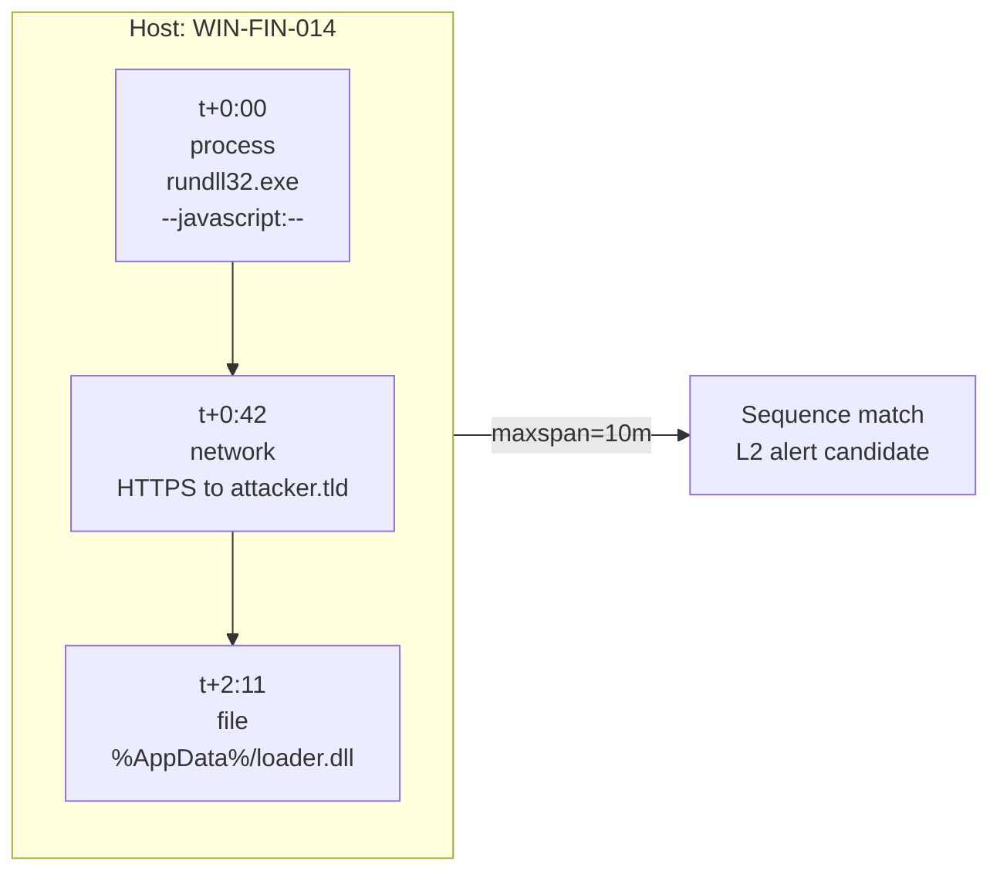
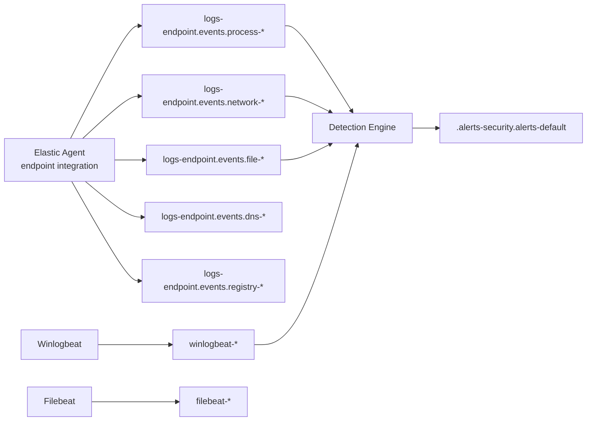

# Research Dossier — L2 SOC Module 2: Hunting with KQL, EQL, and ES|QL

> **Authoring scope.** Source material for the four reading lessons + four quizzes in **L2 Module 2** on the ION SOC platform. The course / platform stack is **Elastic + Kibana**. *KQL* in this dossier means **Kibana Query Language**, not Microsoft's Kusto. All worked queries run against Elastic indices using Lucene, KQL, EQL, or ES|QL with **ECS** field paths.
>
> **Audience.** Senior L1 / junior L2 who has finished L1 and L2 Module 1 (PEAK methodology). Knows ATT&CK technique IDs and has triaged Elastic-Security alerts at L1.
>
> **Outcomes.** By module end the L2 can: pick the right Elastic query language for a given hunt question; write multi-stage KQL filters in Discover; write EQL `sequence` queries for adversary chains; write ES|QL pipelines for stats / aggregations / joins; do an `ENRICH` lookup against a small reference index; iterate a hunt query broad-to-narrow with full audit trail.
>
> **Depth bar.** ~2,000–3,000 words per reading lesson, multiple Mermaid diagrams, real ECS field paths, worked queries against realistic Beats / Elastic-Agent indices. ~10,000 words total.

---

## 1. The Elastic query-language landscape

Elasticsearch is fifteen years old, and that age shows in the *plurality* of query languages it supports. A modern Kibana operator stares at a search bar that can be re-toggled between two languages, switches over to a Security app that prefers a third, and opens Discover's new toggle to find a fourth. Each language exists for a real reason — and for an L2 hunter, *picking the right one is half the hunt*.

### 1.1 Lucene query syntax — the original

Elasticsearch is built on Apache Lucene, and its first query language was Lucene's query string syntax. Lucene query strings are deeply expressive — full Boolean expressions, regex with anchors and character classes, fuzzy match by edit distance, proximity match by token gap, term boosting, range queries on numerics and dates. They are also famously fiddly: special characters need escaping, the rules for what constitutes a "term" depend on whether the field is analyzed, and a malformed expression can fail-open by silently turning into a free-text search.

The defining Lucene syntax pieces an L2 should recognise:

- **Field equality:** `process.name:powershell.exe`
- **Boolean:** `process.name:powershell.exe AND NOT user.name:SYSTEM` (uppercase operators)
- **Range, inclusive:** `process.pid:[100 TO 999]`
- **Range, exclusive:** `process.pid:{100 TO 999}`
- **Regex:** `process.name:/power.*\.exe/`
- **Fuzzy (edit distance):** `process.name:powershel~2`
- **Proximity (token gap on a phrase):** `"powershell encoded"~5`
- **Boost:** `process.name:powershell^2`
- **Exists/missing (legacy):** `_exists_:process.command_line`, `_missing_:process.command_line`

Lucene is the *default before KQL was introduced* (Kibana 6.3, mid-2018), and it still ships in Discover as a per-search override toggle next to the search input. Senior analysts who learned Elastic before 2018 reach for Lucene reflexively when they need regex anchors, fuzzy matching, or proximity — predicates that KQL still does not expose cleanly.

### 1.2 KQL — Kibana Query Language

KQL is Kibana's *simpler-than-Lucene* search-bar syntax, introduced in Kibana 6.3 in 2018 and made the default in 7.x. It is the language that powers the filter bar in Discover, Lens, Maps, the Security app, the Observability app, the saved-search format, and the "KQL query" input on every detection rule. It is designed to be approachable for analysts who never want to learn Lucene's quirks: lowercase Boolean operators, intuitive wildcards, friendly nested-field handling, opt-in case sensitivity, and quoted-phrase semantics that match what most users expect.

KQL is *only* a filter language. It has no aggregation, no joins, no scripting, no `if-then-else`. It produces a set of matching documents and stops. Everything else — counts, group-bys, time bucketing, lookups — is the job of a different tool (visualisations, ES|QL, the aggregations API). The L2 should understand this asymmetry: KQL is the *search bar*, not the analytics engine.

In modern Kibana (8.13+), KQL has gained one new superpower: it is callable from inside ES|QL via the `KQL("...")` function, letting an analyst write the filter half of a hunt in KQL and the aggregation half in ES|QL. This is examined in detail in §5 and §9.

### 1.3 EQL — Event Query Language

EQL went GA in Elastic Stack 7.9 (mid-2020). It is purpose-built for **security event correlation** — for the question shapes that look like *"process A then process B then file write, same host, all within five minutes"*. Sequence semantics are a first-class primitive: an EQL query named `sequence by host.name with maxspan=5m` is short, clear, and *impossible to express cleanly in any other Elastic query language*. EQL also normalises around the ECS `event.category` field, so queries like `process where ...` and `network where ...` read naturally to anyone who knows ECS.

Today, hundreds of the rules that ship in Elastic Security's prebuilt rule library are EQL rules. The MITRE ATT&CK rule library Elastic maintains uses EQL almost exclusively for the technique-level detection rules whose logic is fundamentally a behavioural chain.

### 1.4 ES|QL — Elasticsearch Query Language

ES|QL went GA in Elastic Stack 8.13, March 2024. It is the new piped-DSL — strongly resembling Microsoft Kusto's KQL (yes, same name, different language), Splunk SPL, and PromQL in shape. It ships as the default new-rule language for many Elastic Security templates from 8.14 onward, and it is the recommended default for ad-hoc analytics, threat hunting, and any cross-index or cross-cluster query.

The ES|QL pipeline shape is: `FROM <index> | WHERE <predicate> | EVAL <computed columns> | STATS <aggregations> BY <grouping> | SORT | LIMIT | KEEP | DROP`. Every `|` passes a *tabular result-set* forward, exactly like in Kusto or Splunk. ES|QL also supports `DISSECT` and `GROK` for runtime parsing of unstructured fields, `ENRICH` for joins to a small reference index, and `LOOKUP JOIN` (8.16+) for left-outer joins to a lookup index.

ES|QL absorbs much of the territory that previously required Painless scripted fields, the legacy SQL endpoint, and the aggregations API. It does *not* yet absorb EQL's `sequence` primitive — for behavioural chains across events, EQL remains the right tool.

### 1.5 The "fourth language" — Painless

Painless is Elastic's scripted-fields language. It is *not* a query language proper — it is the runtime expression language that fills in gaps when KQL/EQL/ES|QL need a computation that the schema doesn't expose directly. The L2 should recognise it (and recognise that ES|QL's `EVAL` largely replaces it for query-time computations) but not dwell on it. Hunt queries that rely on Painless are usually a code smell — the right answer is normally to add an ECS field, an ingest-pipeline enrichment, or an ES|QL `EVAL`.

### 1.6 Decision framework — which language for which hunt

| Question shape                                                                 | Best language       | Why                                                              |
| ------------------------------------------------------------------------------ | ------------------- | ---------------------------------------------------------------- |
| Filter rows: *show me events where X*                                          | **KQL**             | Search bar, simplest to type, Kibana-native                      |
| Boolean / regex / fuzzy / proximity on a single index                          | **Lucene**          | KQL still doesn't expose anchors, fuzzy, proximity               |
| Adversary behaviour chain: *A then B then C, same host, within 5m*             | **EQL**             | The only language with first-class `sequence` semantics          |
| Statistics / aggregation / pivoting / joins                                    | **ES\|QL**          | Pipelines + `STATS BY` + `ENRICH` + `LOOKUP JOIN`                |
| Cross-index / cross-cluster joins                                              | **ES\|QL**          | First-class; KQL/EQL can't really do this                        |
| Detection-rule body for tier-2 / tier-3 alerts                                 | **EQL** or **ES\|QL** | Both run as Kibana Security rule bodies                          |
| Time-series anomaly                                                            | **ES\|QL**          | Native `BUCKET()` time-bucketing in `STATS`                      |
| Quick exploration with field auto-complete / intellisense                      | **KQL**             | Discover's bar offers field auto-complete                        |
| Saved-search filter / dashboard filter                                         | **KQL**             | Saved-search format is KQL                                       |
| Embedded predicate inside an aggregation pipeline                              | **KQL inside ES\|QL** | `WHERE KQL("...")` — best of both                              |

```mermaid
flowchart TD
    Start[Hunt question] --> Q1{Filter rows<br/>or aggregate?}
    Q1 -- Filter only --> Q2{Need regex / fuzzy /<br/>proximity?}
    Q2 -- No --> KQL[KQL]
    Q2 -- Yes --> Lucene[Lucene]
    Q1 -- Aggregate --> Q3{Behavioural chain<br/>across events?}
    Q3 -- Yes --> EQL[EQL]
    Q3 -- No --> Q4{Stats / joins /<br/>cross-index<br/>cross-cluster?}
    Q4 -- Yes --> ESQL[ES&#x7C;QL]
    Q4 -- No --> ESQL
```



### 1.7 Where each language *runs* in Kibana

It helps to know the user-interface affordances per language:

- **KQL** — the search bar in Discover, Dashboard, Lens, Maps, the Security app's filter bar, the "KQL query" input on every detection rule, saved-search format, alert filter inputs.
- **Lucene** — toggle in Discover next to the search bar; the Dev Console's `_search` API as a `query_string`.
- **EQL** — Kibana Security → Timelines → "Add EQL query"; the EQL search API in Dev Console; an EQL rule body in detection-rule creation.
- **ES|QL** — Discover's *ES|QL mode* toggle (8.11+); the Dev Console `_query` API; an ES|QL rule body in detection-rule creation (8.13+).

Each language has a documented home in the Elastic docs:
- Lucene: `elastic.co/guide/en/elasticsearch/reference/current/query-dsl-query-string-query.html`
- KQL: `elastic.co/guide/en/kibana/current/kuery-query.html`
- EQL: `elastic.co/guide/en/elasticsearch/reference/current/eql-syntax.html`
- ES|QL: `elastic.co/guide/en/elasticsearch/reference/current/esql.html`
- ECS field reference: `elastic.co/guide/en/ecs/current/ecs-field-reference.html`

---

## 2. KQL fundamentals — and Lucene as the legacy fallback

KQL is the daily search-bar language. An L2 will type more KQL in a year than every other Elastic query language combined. Mastery of KQL is non-negotiable; fluency in Lucene is a senior-analyst tool kept in reserve.

### 2.1 Field equality

KQL's primary form is `field: value`. Strings can be unquoted if they have no spaces or special characters; quoted strings handle anything else.

```kql
event.action: "process_started"
host.name: "WIN-FIN-014"
process.name: powershell.exe
user.name: "Bob.Hadley"
```

Case sensitivity follows the index mapping. ECS keyword fields (`process.name`, `host.name`, `user.name`, `event.action`) are typically `keyword`-typed, which means **exact match, case-sensitive**. ECS text fields (`process.command_line.text`, `message`) are `text`-typed and run through an analyzer, so they're tokenised and case-insensitive. The same predicate `process.command_line: "powershell"` does very different things on a `keyword` versus `text` mapping. This trips up newcomers — the L2's reflex must be to *check the index mapping* (Discover → Inspect → Field type) before iterating.

### 2.2 Range queries

KQL ranges look like Lucene's:

```kql
process.pid: [100 TO 999]            // inclusive, both ends
process.pid: { 100 TO 999 }          // exclusive, both ends (8.x)
@timestamp >= "2026-04-01"           // half-open via comparator
@timestamp >= "now-7d"               // relative time
event.severity > 70 and event.severity <= 90
```

Comparator syntax (`>=`, `>`, `<=`, `<`) was added to KQL well after the initial release; older muscle memory might prefer the bracket syntax. Both are valid; comparators read more naturally for time and numeric ranges.

### 2.3 Boolean operators and grouping

KQL takes Boolean operators in lowercase or uppercase (the docs use lowercase; many analysts prefer uppercase for readability). Grouping is via `()`.

```kql
event.category: process
  and process.name: ("powershell.exe" or "pwsh.exe")
  and not user.name: ("SYSTEM" or "NT AUTHORITY*")
  and (process.command_line: *EncodedCommand* or process.command_line: *FromBase64String*)
```

Note three KQL conveniences:

- **`field: (a or b or c)`** — list match, equivalent to `field: a or field: b or field: c` but shorter.
- **`field: a*`** — wildcard.
- **`not field: value`** — negation (negation distributes over OR/AND with the usual semantics).

### 2.4 Wildcards

KQL wildcards are `*` (zero-or-more characters) and `?` (single character). They work on `keyword` fields and most `text` fields:

```kql
process.name: power*
host.name: *-PROD-*
process.command_line: *FromBase64String*
file.path: "C:\\Users\\*\\AppData\\Local\\Temp\\*.exe"
```

**Avoid leading wildcards on text fields** — `process.command_line: *cmd.exe*` on a text field forces a full-table scan and may take minutes on a multi-terabyte index. On `keyword` fields leading wildcards are *much* less expensive but still slower than prefix-only patterns. The L2 reflex: *anchor your wildcards to the front whenever possible.*

### 2.5 Exists / missing

KQL has no `_exists_:` keyword like Lucene; instead it uses the wildcard match-all on a field:

```kql
process.command_line: *           // matches docs that have process.command_line set
not process.command_line: *       // matches docs missing process.command_line
```

The ES|QL equivalent is `WHERE process.command_line IS NOT NULL`. The Lucene legacy form `_exists_:process.command_line` still works in Lucene mode but is deprecated in favour of the KQL idiom.

### 2.6 Nested fields

ECS uses two patterns for nested data: dotted **object** fields (the common case) and explicit **`nested`** mappings (used when arrays of objects must preserve same-element semantics). KQL handles them differently:

- For dotted-object fields (most ECS), use dot notation: `user.name: "alice"`, `process.parent.command_line: "*powershell*"`.
- For `nested`-mapped fields (like `email.attachments`), you may need explicit `nested:{...}` scope to enforce *same-element* matching across multiple predicates. Without it, KQL applies each predicate to *any* element of the array — so a query like `email.attachments.name: "*.docx" and email.attachments.size > 1000000` returns emails where *some* attachment is a `.docx` and *some* attachment is over 1MB, not necessarily the same one. Same-element semantics: `email.attachments:{ name: "*.docx" and size > 1000000 }`.

This is one of the most common silent over-counts an L2 will produce. The hunter's reflex: *if my query touches a `nested` field with multiple predicates, enforce same-element scope explicitly.*

### 2.7 Free-text fallback

A KQL search with no field prefix (`"powershell"`) does a full-text search across the index's `default_field` configuration. Fast, imprecise, and **rarely used in real hunts** — the matched fields depend on the index template, the result set is unpredictable, and it's nearly impossible to reproduce or pivot from. Use it for first-pass exploration only; once you know what you're looking for, anchor to a field.

### 2.8 KQL limitations and when to switch

KQL has *no* aggregation, joins, scripting, conditionals, runtime computation, or sequence semantics. The moment a hunt question goes beyond *"show me documents where X"*, the L2 should switch:

- Need counts / stats / pivots? → **ES|QL**.
- Need behavioural chain semantics? → **EQL**.
- Need regex anchors, fuzzy matching, or proximity? → **Lucene**.

### 2.9 Lucene cheat sheet

Switch in Discover via the KQL/Lucene toggle. Use it for:

```lucene
process.name:/power.*\.exe/                    // anchored regex
process.name:powershel~2                       // fuzzy edit distance ≤ 2
"powershell encoded"~5                         // proximity, terms within 5 tokens
event.action:process_started^2                 // boost (rarely useful)
_exists_:process.command_line                  // exists (legacy)
```

Lucene's `:` is *also* a field-equality operator, and Lucene's wildcards (`*`, `?`) are the same as KQL's. The biggest day-to-day Lucene differences from KQL are: anchored regex syntax (`/.../`), explicit fuzzy/proximity operators, all-uppercase Boolean operators (`AND`, `OR`, `NOT`), and the legacy `_exists_:`/`_missing_:` keywords.

```mermaid
flowchart LR
    User[L2 in Discover] --> Bar{Search bar}
    Bar -- KQL toggle --> KQL[KQL filter]
    Bar -- Lucene toggle --> Lucene[Lucene filter]
    KQL --> Hits[Document hits]
    Lucene --> Hits
    Hits --> Save[Save search<br/>or pivot to ES&#x7C;QL]
```



---

## 3. EQL — Event Query Language for behavioural chains

EQL is the most security-domain-specific of the four Elastic query languages. It exists because the question *"did A then B then C happen on the same host inside ten minutes?"* is the bread-and-butter of behavioural detection, and that question is *very* hard to express in KQL or even ES|QL. EQL solves it elegantly.

### 3.1 Event categorisation

Every EQL query is built around `event.category`. ECS normalises `event.category` to a small, well-known set: `authentication`, `configuration`, `database`, `driver`, `email`, `file`, `host`, `iam`, `intrusion_detection`, `library`, `malware`, `network`, `package`, `process`, `registry`, `session`, `threat`, `vulnerability`, `web`. EQL queries always start with one of these category names (or `any`):

```eql
process where ...
network where ...
file where ...
authentication where ...
registry where ...
any where ...
```

### 3.2 Basic predicate shape

```eql
process where process.name == "powershell.exe"
          and process.command_line : "*-EncodedCommand*"
          and not user.name == "SYSTEM"
```

Two operators do equality on strings:

- **`==`** — case-sensitive, literal, used for keyword fields and exact match.
- **`:`** — case-insensitive *like* match, supports `*` and `?` wildcards, used for substring matches and case-insensitive comparisons.

The `==` / `:` distinction is a frequent EQL bug source. *Use `==` when you want exact match on a keyword field; use `:` when you want wildcards or case-insensitivity.* Mixing them up either misses matches or matches too much.

### 3.3 Sequence — the EQL killer feature

```eql
sequence by host.name with maxspan=5m
  [ process where process.name == "rundll32.exe"
              and process.command_line : "*javascript:*" ]
  [ network where network.protocol == "https"
              and not destination.address : "*.contoso.com" ]
```

This says: *for each host, find a `rundll32.exe` process with a JavaScript command-line, then within 5 minutes find an outbound HTTPS connection that isn't to a `*.contoso.com` destination*. The `by host.name` enforces same-host correlation; `with maxspan=5m` caps the temporal window.

Multiple keys in `by`:

```eql
sequence by host.name, user.name with maxspan=10m
  [ authentication where event.action == "logged-in" and source.ip != null ]
  [ process where process.name : ("net.exe","whoami.exe","nltest.exe") ]
```

This correlates per-host *and* per-user, so a single host with multiple concurrent sessions doesn't accidentally bridge unrelated events.

### 3.4 `until` — early termination

```eql
sequence by host.name with maxspan=30m
  [ process where process.name == "powershell.exe" and process.command_line : "*-Enc*" ]
  [ network where destination.port == 4444 ]
until [ process where process.name == "MsMpEng.exe" and event.action == "termination" ]
```

`until` says: *abort this sequence if Defender is killed before the rest of the chain matches*. Useful for ruling out legitimate sequences that get interrupted by a known benign event.

### 3.5 Sample — unordered conjunction

`sample` is like `sequence` but unordered. Use it when you want *"these events all happened on the same host within window X, in any order"*:

```eql
sample by host.name
  [ process where process.name : "mimikatz*" ]
  [ file where file.name : "lsass*.dmp" ]
  [ network where destination.port == 88 and network.protocol == "kerberos" ]
```

Sample is newer than sequence and less commonly used in practice, but it's the right fit for *"these N indicators co-occurred"* hypotheses where the chronological order is undefined.

### 3.6 EQL pipes — post-processing

EQL has pipes, but they are post-aggregation only — they run *after* the matching stage. Common post-processing:

```eql
process where process.name : "powershell.exe"
| head 100
| unique host.name, user.name
| sort host.name
```

Available pipe operators: `head`, `tail`, `unique`, `sort`, `unique_count` (8.x). Unlike ES|QL pipes, EQL pipes cannot transform the matching logic — they only post-filter, sort, dedupe.

### 3.7 EQL functions worth knowing

- **String:** `concat()`, `endsWith()`, `startsWith()`, `wildcard()`, `length()`, `string()` (cast), `substring()`.
- **Numeric:** `add()`, `divide()`, `multiply()`, `subtract()`, `between()`, `number()` (cast).
- **Network:** `cidrMatch(source.ip, "10.0.0.0/8", "192.168.0.0/16")`.
- **Time:** EQL exposes `@timestamp` directly as a comparable field; relative-time comparisons use `now()`.

```eql
process where process.name : "powershell.exe"
          and length(process.command_line) > 500
          and not cidrMatch(source.ip, "10.0.0.0/8", "172.16.0.0/12")
```

### 3.8 EQL sequence visualised

A `sequence by host.name with maxspan=10m` query reads naturally as a per-host event timeline:



### 3.9 Where EQL runs

EQL runs in three places:
- **Kibana Security → Timeline → "Add EQL query"** for ad-hoc hunting.
- **Detection Engine → Create new rule → "Event Correlation"** for production rules.
- **`_eql/search` API in Dev Console** for programmatic / scripted hunts.

The MITRE ATT&CK rule library that ships with Elastic Security uses EQL extensively. Browse `Detection rules` → filter by tag `Domain: Endpoint` to see hundreds of worked examples. Reading the prebuilt rule bodies is one of the fastest ways for an L2 to internalise idiomatic EQL.

### 3.10 EQL limitations

EQL has no `STATS`, no `BUCKET`, no joins to a reference index, no cross-cluster, no full-text search functions. It is *purely* a behavioural-chain language. The moment a hunt needs aggregation or lookup, the L2 either (a) writes the EQL match-stage and feeds the matching documents into ES|QL, or (b) re-expresses the hunt entirely in ES|QL and accepts the loss of clean sequence semantics.

---

## 4. ES|QL — the piped query language

ES|QL is the new default. It went GA in March 2024 (Elastic 8.13), and from 8.14 onward many Elastic Security rule templates ship as ES|QL by default. For ad-hoc hunting, it has become the L2's primary tool for any question with a *count*, *aggregation*, *time bucket*, *join*, or *cross-index* dimension.

### 4.1 Pipeline shape

```esql
FROM logs-endpoint.events.process-*
| WHERE @timestamp > NOW() - 24h
  AND process.name == "powershell.exe"
| EVAL hour = DATE_TRUNC(1 hour, @timestamp)
| STATS event_count = COUNT() BY host.name, hour
| SORT event_count DESC
| LIMIT 100
```

Read it left-to-right: *take the process index, filter to last 24h PowerShell events, compute an `hour` column, count per host per hour, sort descending, top 100*. Every `|` passes a tabular result-set forward.

### 4.2 `FROM`

`FROM` selects an index pattern, multiple patterns, or a cross-cluster pattern:

```esql
FROM logs-endpoint.events.process-*
FROM logs-*, winlogbeat-*
FROM cluster1:logs-*, cluster2:logs-*
FROM .alerts-security.alerts-default
```

Cross-cluster search works out-of-the-box for ES|QL — much more reliably than for KQL or EQL.

### 4.3 `WHERE`

Predicate clause, idiomatically near the top of the pipeline. Operators:

- Comparison: `==`, `!=`, `<`, `>`, `<=`, `>=`
- List: `IN`, `NOT IN`
- Null: `IS NULL`, `IS NOT NULL`
- Pattern: `LIKE` (uses SQL-style `%` and `_`), `RLIKE` (real regex)

String functions usable in `WHERE`: `STARTS_WITH()`, `ENDS_WITH()`, `LENGTH()`, `TO_LOWER()`, `TO_UPPER()`, `SUBSTRING()`, `REPLACE()`, `CONCAT()`, `SPLIT()`, `TRIM()`.

```esql
| WHERE process.name IN ("powershell.exe","pwsh.exe","cmd.exe")
  AND process.command_line LIKE "%FromBase64String%"
  AND user.name IS NOT NULL
  AND NOT host.name RLIKE ".*-LAB-.*"
```

Embedded-language calls — *the* hunt-author convenience:

```esql
| WHERE KQL("process.name: powershell* and process.command_line: *Enc*")
| WHERE MATCH(process.command_line, "FromBase64String")
```

`KQL("...")` lets you paste a working KQL filter from Discover. `MATCH(field, "value")` does a full-text match against an analyzed field. Both are huge productivity wins for analysts pivoting from Discover.

### 4.4 `EVAL` — computed columns

```esql
| EVAL hour = DATE_TRUNC(1 hour, @timestamp)
| EVAL cmd_len = LENGTH(process.command_line)
| EVAL hostgrp = CASE(host.name LIKE "WIN-FIN-*", "finance",
                     host.name LIKE "WIN-HR-*",  "hr",
                     "other")
```

`EVAL` adds new columns to the result-set. Date functions: `DATE_TRUNC(interval, @timestamp)`, `DATE_DIFF(unit, start, end)`, `DATE_PARSE(format, str)`, `DATE_FORMAT(format, dt)`, `DATE_EXTRACT(part, dt)`, `BUCKET(@timestamp, interval)` (for time-series bucketing inside `STATS`). Numeric: `ABS`, `CEIL`, `FLOOR`, `ROUND`, `LOG`, `POW`. Conditional: `CASE(when, then, when, then, else)`, `COALESCE(a, b, c)`, `GREATEST`, `LEAST`.

### 4.5 `STATS` — group-and-aggregate

```esql
| STATS event_count = COUNT(),
        host_count = COUNT_DISTINCT(host.name),
        cmds = VALUES(process.command_line)
  BY user.name, BUCKET(@timestamp, 1h)
```

Aggregation functions: `COUNT()`, `COUNT_DISTINCT()`, `SUM()`, `AVG()`, `MIN()`, `MAX()`, `MEDIAN()`, `MEDIAN_ABSOLUTE_DEVIATION()`, `PERCENTILE()`, `VALUES()` (collect into array), `TOP()`, `WEIGHTED_AVG()`, `ST_CENTROID_AGG()`.

`BY` accepts multiple group keys and `BUCKET()` for time bucketing. The output table has *only* the `BY` columns and the aggregated columns — every other column is dropped. This surprises Kusto / Splunk transitions: ES|QL is strict here; if you want to keep an additional column, aggregate it (e.g. `top_pid = TOP(process.pid, 1, "asc")`) or include it in `BY`.

### 4.6 `SORT`, `LIMIT`, `KEEP`, `DROP`

```esql
| SORT event_count DESC, host.name ASC
| LIMIT 200
| KEEP @timestamp, host.name, user.name, process.command_line
| DROP fields.we.dont.want, agent.ephemeral_id
```

ES|QL has a default cap (currently 10,000 rows). If a `STATS` result genuinely needs more, use `LIMIT 100000` explicitly. Larger `LIMIT` values are bounded by `esql.query.result_truncation_max_size` cluster setting, default 10,000 — operators may need to raise this for big hunts.

### 4.7 `DISSECT` and `GROK` — runtime parsing

```esql
| DISSECT message "Process %{proc} executed by %{user}"
| GROK message "%{IP:src_ip}:%{NUMBER:src_port} -> %{IP:dst_ip}:%{NUMBER:dst_port}"
```

`DISSECT` is fast, structured, no regex (uses positional patterns). `GROK` is slower but accepts the full library of named patterns (`%{IP}`, `%{TIMESTAMP_ISO8601}`, `%{NUMBER}`, etc.). Both add the parsed fields as new columns in the pipeline.

For an L2 this is huge: messy `message` fields, third-party logs, unparsed legacy data — all become structured *at query time*, no runtime field, no ingest pipeline change.

### 4.8 `ENRICH`

`ENRICH` performs a join to a small, pre-built reference index via an *enrich policy*. The policy is defined once in the cluster (`PUT /_enrich/policy/asset_criticality`); the query then references it by name:

```esql
| ENRICH asset_criticality_lookup ON host.name
| WHERE asset_criticality == "tier-1"
```

After the enrich, every matching row has the lookup index's columns merged in. Use cases: asset-criticality lookups, threat-intel IOC matches, geolocation enrichment (when not already done at ingest), user-to-business-unit mapping.

### 4.9 `LOOKUP JOIN`

`LOOKUP JOIN` (introduced 8.16) is the inline-lookup-index alternative to `ENRICH`. Where `ENRICH` requires a pre-built policy, `LOOKUP JOIN` reads a small lookup index directly:

```esql
FROM logs-network.flow-*
| WHERE @timestamp > NOW() - 1h
| LOOKUP JOIN ip_blocklist_lookup ON destination.ip
| WHERE block_reason IS NOT NULL
```

The right-side index must be `lookup` mode (a small, fully-replicated index designed for joins) or otherwise small enough that the cluster can broadcast it. Use `ENRICH` for production hunts; `LOOKUP JOIN` for ad-hoc / one-off joins where you don't want to ship an enrich policy.

### 4.10 ES|QL pipeline visualised


### 4.11 Where ES|QL beats EQL / KQL

- **Stats and aggregations.** KQL has zero. EQL has minimal pipe-tail. ES|QL has `STATS` with the full aggregation library.
- **Cross-index / cross-cluster.** ES|QL handles arbitrary patterns; KQL/EQL are weaker here.
- **Joins / lookups.** `ENRICH` and `LOOKUP JOIN` have no real KQL/EQL equivalent.
- **Time bucketing.** `BUCKET(@timestamp, 1h)` inside `STATS` is the cleanest time-series primitive in any Elastic language.
- **Pipeline composition / readability.** Multi-stage hunts read top-to-bottom in ES|QL; the same logic in EQL needs nested predicates and pipe-tails that obscure intent.

### 4.12 Where ES|QL is *not* the right tool

- **Behavioural chains.** `sequence` has no ES|QL equivalent. EQL still wins.
- **Quick exploratory single-row filters.** KQL is faster to type; Discover's KQL bar has field auto-complete and ES|QL Discover mode is more verbose.
- **Some advanced text-analysis predicates.** Lucene's regex anchors, fuzzy, proximity remain unbeaten.
- **Saved searches and dashboard filters.** These persist as KQL.

---

## 5. Hunt-grade query craft (Elastic edition)

Knowing the four languages individually is necessary. *Crafting* hunt queries that survive iteration, perform well, and produce reproducible results is what separates an L1 who knows KQL from an L2 who can hunt.

### 5.1 The broad-to-narrow iteration pattern

A hunt query is rarely written correctly on the first attempt. The L2 reflex is **broad → narrow → enriched → disposition**, with each stage answered by a separate question:

- **Q1 — Broad.** Convert the four-element artefact (technique × attribute × asset class × time window) directly into a query. Don't try to be precise yet. Expect tens of thousands of rows.
- **Q2 — Structural exclusions.** Add the structural carve-outs: signed-binary paths, RFC1918 source IPs, known service accounts, tenant-asset patterns (`host.name LIKE "%-LAB-%"`), known software (signed Microsoft binaries, signed corporate tooling). Expect a 10× reduction.
- **Q3 — Enrichment.** Add parent-process, prior-history, ATT&CK technique enrich, asset-criticality enrich. Expect another 10× reduction and now-meaningful row attributes.
- **Q4 — Disposition.** Final filter to the actually-investigable set. Expect 5–500 rows. If you have 5,000, you're not done. If you have 0, you over-filtered — back off.

### 5.2 Runtime fields and `EVAL` as their replacement

When an ECS field doesn't exist on a document, the legacy answer was a *runtime field* — a Painless script defined either in the index template or per-search via `runtime_mappings`. Kibana Discover supports them in saved searches; Lens has a runtime-field UI.

ES|QL's `EVAL` largely obsoletes runtime fields for *query-time* computation. Instead of mapping a runtime field `cmd_len` cluster-wide, the L2 just writes:

```esql
| EVAL cmd_len = LENGTH(process.command_line)
| WHERE cmd_len > 500
```

Reserve runtime fields for cases where the computed field needs to be available *across* visualisations and dashboards (a stable per-cluster definition). Use `EVAL` for *this hunt only*.

### 5.3 Performance — the time range is the cost

The single most expensive thing in any Elastic query is an *unbounded time range*. Even on well-indexed clusters, asking for "all process events ever" hits every shard and every segment.

Always pin `@timestamp`. Idiomatically:

```kql
@timestamp >= "now-7d"
```

```eql
process where ... and @timestamp >= now() - 7d
```

```esql
| WHERE @timestamp >= NOW() - 7d
```

Other performance disciplines:

- **Anchor wildcards to the front.** `process.name: power*` is much cheaper than `process.name: *shell.exe`.
- **Use `keyword` fields for exact match.** `process.name` (keyword) is cheap. `process.name.text` (analyzed) is expensive for exact match.
- **Limit the index pattern.** `FROM logs-endpoint.events.process-*` is much cheaper than `FROM logs-*`.
- **Watch the Dev Console.** Run the query as a `_search` API call and look at `took` (milliseconds) and `_shards.total` to see how heavy the query is.

### 5.4 Row-count discipline

A senior hunter has a number in their head before they hit Run. *Five rows? Fifty? Five hundred? Five thousand? Fifty thousand?*

When the query returns 50,000 rows and you expected 50, your filter is wrong. When it returns 0 and you expected 50, your filter is also wrong. The order-of-magnitude expectation is a hunting maturity marker — and the L2 should explicitly write it next to the query in the case notes:

```text
H1: anomalous DNS volume per host, last 24h, expected ~5–20 hosts.
   ES|QL returned 23 hosts. Within expectation, proceed to Q2.
```

If the count is off by an order of magnitude, *stop and re-read the query* before iterating.

### 5.5 Common mistakes (the bug-glossary)

- **KQL wildcards are prefix-or-contains, not regex.** `process.name: power*` matches anything starting with `power` (including `powerpoint.exe`); for *exact* match write `process.name: "powershell.exe"` quoted.
- **EQL `==` versus `:`.** `==` is keyword-exact, case-sensitive. `:` is `like`-with-wildcards, case-insensitive. Use the wrong one and you either miss matches or get false matches. Default to `==` for hash/PID/static literals, `:` for substrings and case-insensitive needs.
- **ES|QL `LIKE` patterns use SQL syntax.** `%` (zero or more), `_` (single character) — *not* `*` and `?`. Use `RLIKE` for real regex.
- **Free-text mode in KQL is silent.** `"powershell"` (no field prefix) does a full-text search across configured `default_field` patterns. Looks like a substring match on `process.command_line`; isn't. Always anchor to a field in hunt queries.
- **`nested` field over-counts in KQL.** Without explicit `nested:{...}` scope, predicates apply to *any* element of an array. Same-element semantics need explicit scope.
- **ES|QL `STATS` drops every column not in `BY` or aggregated.** Surprising for newcomers expecting Kusto-style "preserve all columns".
- **ES|QL's 10,000-row default cap.** Big hunts need explicit `LIMIT 100000` and possibly `esql.query.result_truncation_max_size` raised cluster-wide.
- **Lucene's `_exists_:`/`_missing_:` versus KQL's `field:*`.** Both work in their own mode; they're not interchangeable across the toggle.
- **`@timestamp` math in EQL versus ES|QL.** EQL uses `now() - 7d` (no quotes). ES|QL uses `NOW() - 7d` (function name, uppercase). KQL uses the string `"now-7d"` (quoted).
- **Index pattern misses.** `logs-*` matches `logs-endpoint.events.process-*` but not `winlogbeat-*`. Two index conventions coexist on most ION-style stacks; the L2 must know both.

---

## 6. ECS field reference for L2 hunters

The Elastic Common Schema (ECS) is the L2's vocabulary. Every Beat / Elastic-Agent integration, every Logstash pipeline of any maturity, and every detection rule normalises to ECS field paths. This section is a consolidated reference of the fields an L2 will use most, grouped by hunt class.

### 6.1 Process events

`event.category: process`, `event.action: process_started` (or `process_started`, `process_stopped` for endpoint).

- `process.name` — basename, e.g. `"powershell.exe"`.
- `process.executable` — full path, e.g. `"C:\\Windows\\System32\\WindowsPowerShell\\v1.0\\powershell.exe"`.
- `process.command_line` — full command line (typically `keyword`; analyzed counterpart `process.command_line.text`).
- `process.pid` — PID.
- `process.entity_id` — stable cross-event correlation ID (Elastic Agent / Endpoint).
- `process.parent.name`, `process.parent.command_line`, `process.parent.pid`, `process.parent.entity_id` — parent process pivot.
- `process.hash.sha256`, `process.hash.sha1`, `process.hash.md5`.
- `process.code_signature.subject_name`, `process.code_signature.status`, `process.code_signature.trusted`.
- `process.working_directory`.
- `process.args` — array of command-line arguments (preserved as ECS list).

### 6.2 Network events

`event.category: network`.

- `network.protocol` — `"http"`, `"https"`, `"dns"`, `"kerberos"`, `"smb"`, `"ldap"`.
- `network.transport` — `"tcp"`, `"udp"`.
- `network.bytes`, `network.packets`.
- `source.ip`, `source.port`, `source.bytes`.
- `destination.ip`, `destination.port`, `destination.domain`, `destination.bytes`.
- `destination.geo.country_iso_code`, `destination.geo.continent_name`.
- `destination.as.organization.name`.
- `tls.server.ja3s`, `tls.client.ja3`.
- `url.full`, `url.domain`, `url.path`, `url.query`.

### 6.3 DNS

`event.category: network` with `network.protocol: dns`.

- `dns.question.name` — the queried domain.
- `dns.question.type` — `"A"`, `"AAAA"`, `"CNAME"`, `"TXT"`, `"MX"`.
- `dns.answers.data` — resolved values (array).
- `dns.resolved_ip` — the resolved IP(s).
- `dns.response_code` — `"NOERROR"`, `"NXDOMAIN"`, `"SERVFAIL"`.

### 6.4 File events

`event.category: file`.

- `file.path`, `file.name`, `file.extension`, `file.size`, `file.directory`.
- `file.hash.sha256`, `file.hash.sha1`, `file.hash.md5`.
- `file.code_signature.*` — same shape as `process.code_signature.*`.
- `file.created`, `file.mtime` (modification), `file.ctime` (creation).

### 6.5 Authentication / sign-in

`event.category: authentication`.

- `user.name`, `user.id`, `user.domain`, `user.email`.
- `winlog.event_id` — `4624` (logon), `4625` (failed logon), `4634` (logoff), `4648` (explicit creds), `4672` (admin priv assigned), `4688` (process create), `4768` (Kerberos TGT), `4769` (Kerberos service ticket), `4776` (NTLM auth).
- `winlog.logon.type` — numeric: `2` (interactive), `3` (network), `4` (batch), `5` (service), `7` (unlock), `9` (new credentials), `10` (RDP), `11` (cached interactive).
- `source.ip` (often only present for type-3/10 logons).
- `host.name`, `host.os.family`, `host.os.version`.
- `event.outcome` — `"success"`, `"failure"`.

### 6.6 Email

ECS email namespace was added in 8.6. Older deployments may use `winlogbeat`-specific or vendor-specific equivalents — flag this in lessons.

- `email.subject`, `email.message_id`.
- `email.from.address`, `email.to.address` (array), `email.cc.address`.
- `email.delivery_timestamp`, `email.origination_timestamp`.
- `email.attachments` — `nested` array; use `nested:{...}` scope in KQL (§2.6).
- `email.attachments.file.name`, `email.attachments.file.size`, `email.attachments.file.hash.sha256`.

### 6.7 Alerts / detection signals

- `kibana.alert.rule.name`, `kibana.alert.rule.uuid`.
- `kibana.alert.severity` — `"low"` / `"medium"` / `"high"` / `"critical"`.
- `kibana.alert.workflow_status` — `"open"` / `"acknowledged"` / `"closed"`.
- `kibana.alert.status` — `"active"` / `"recovered"`.
- `kibana.alert.original_event.*` — nested copy of the source event.
- `signal.rule.threat.tactic.id` / `threat.tactic.id`.
- `signal.rule.threat.technique.id` / `threat.technique.id`, `threat.technique.name`.
- `threat.indicator.*` — IOC indicators if the rule was an indicator-match.

### 6.8 Index patterns to know

- `logs-endpoint.events.process-*` — Elastic Agent / Endpoint process events.
- `logs-endpoint.events.network-*` — Elastic Agent network events.
- `logs-endpoint.events.file-*` — Elastic Agent file events.
- `logs-endpoint.events.dns-*` — Elastic Agent DNS events.
- `logs-endpoint.events.registry-*` — Elastic Agent registry events.
- `winlogbeat-*` — legacy Winlogbeat (Windows Event Log).
- `filebeat-*` — Filebeat log forwarding.
- `auditbeat-*` — Auditbeat / Linux auditd.
- `packetbeat-*` — Packetbeat network telemetry.
- `.alerts-security.alerts-default` — Kibana Security alerts in the default space; per-space variants exist.
- `logs-*` — wildcard matching all Elastic Agent integrations.



ECS field reference: `elastic.co/guide/en/ecs/current/ecs-field-reference.html`. The L2 should bookmark it.

---

## 7. Worked queries — five concrete hunts in three languages

This section walks five realistic hunts. Each one is shown in the language(s) that fit it best, with commentary on *why* a given language was chosen.

### 7.1 Discovery cluster (KQL filter → ES|QL aggregation)

**Hypothesis.** Reconnaissance utilities (`net.exe`, `nltest.exe`, `whoami.exe`, `ipconfig.exe`, `tasklist.exe`, `arp.exe`) co-occurring on the same host within a 5-minute window indicates discovery activity.

**Step 1 — KQL scope (Discover):**

```kql
event.category: process
  and event.action: process_started
  and process.name: ("net.exe" or "nltest.exe" or "whoami.exe" or
                     "ipconfig.exe" or "tasklist.exe" or "arp.exe")
  and @timestamp >= "now-24h"
```

This is exploratory — confirm the events exist, eyeball them in Discover, save the search.

**Step 2 — ES|QL aggregation:**

```esql
FROM logs-endpoint.events.process-*
| WHERE @timestamp > NOW() - 24h
  AND process.name IN ("net.exe","nltest.exe","whoami.exe",
                       "ipconfig.exe","tasklist.exe","arp.exe")
| STATS distinct_tools = COUNT_DISTINCT(process.name),
        cmds = VALUES(process.command_line),
        first_seen = MIN(@timestamp),
        last_seen = MAX(@timestamp)
  BY host.name, user.name, BUCKET(@timestamp, 5m)
| WHERE distinct_tools >= 3
| SORT first_seen DESC
| LIMIT 50
```

Why ES|QL here: KQL alone cannot count or group. The hunt question is *"three or more discovery tools on the same host within five minutes"* — which is a `STATS BY BUCKET()` aggregation by definition.

### 7.2 LSASS access (EQL)

**Hypothesis.** Unusual processes (rundll32, procdump, comsvcs) opening `lsass.exe` indicates credential-dumping (T1003.001).

```eql
process where event.action == "process_started"
          and process.name : "lsass.exe"
          and process.parent.name : ("rundll32.exe","procdump.exe",
                                     "comsvcs.exe","ProcessHacker.exe")
```

Why EQL: this is a single-event predicate, but the `event.category`-anchored EQL form is the idiomatic one for Elastic Security rules — and it ports directly to a detection rule body.

### 7.3 Phishing-click → execution chain (EQL `sequence`)

**Hypothesis.** A user clicked a URL that resolved to an Azure-hosted lure, the browser then spawned a script-host or shell (T1566.002 → T1059).

```eql
sequence by host.name, user.name with maxspan=10m
  [ network where event.action == "url_click_allowed"
              and url.domain : "*.azurewebsites.net" ]
  [ process where process.parent.name : ("msedge.exe","chrome.exe","firefox.exe")
              and process.name : ("powershell.exe","cmd.exe","mshta.exe",
                                  "wscript.exe","cscript.exe") ]
```

Why EQL: this *is* a two-event chain with same-host, same-user, time-bounded semantics — the `sequence` primitive is exactly the right shape. Expressing this in ES|QL would require a self-join through `LOOKUP` and lose the temporal ordering.

### 7.4 Beaconing anomaly (ES|QL with `BUCKET`)

**Hypothesis.** A host making 50+ outbound TCP connections per hour to a single destination IP, sustained over multiple hours, is beaconing.

```esql
FROM logs-network.flow-*
| WHERE @timestamp > NOW() - 30d
  AND network.transport == "tcp"
  AND destination.port IN (443, 80, 8080, 8443)
  AND NOT CIDR_MATCH(destination.ip, "10.0.0.0/8", "172.16.0.0/12", "192.168.0.0/16")
| STATS connection_count = COUNT(),
        dest_count = COUNT_DISTINCT(destination.ip),
        avg_bytes = AVG(network.bytes)
  BY host.name, destination.ip, BUCKET(@timestamp, 1h)
| WHERE connection_count > 50 AND dest_count == 1
| SORT connection_count DESC
| LIMIT 100
```

Why ES|QL: time-bucketed aggregation is the entire point of the hunt. EQL has no `BUCKET`; KQL has no aggregation at all.

### 7.5 DCSync candidate (Lucene → EQL refinement)

**Hypothesis.** `event.code: 4662` events referencing the DRSR (Directory Replication Service Remote) replication GUID `1131f6aa-9c07-11d1-f79f-00c04fc2dcd2`, from non-internal source IPs, indicate possible DCSync (T1003.006).

**Lucene scope:**

```lucene
event.code:4662 AND winlog.event_data.Properties:*"1131f6aa-9c07-11d1-f79f-00c04fc2dcd2"*
```

Why Lucene: `winlog.event_data.Properties` is a long string field where leading-wildcard contains-match is needed; Lucene's syntax handles it. KQL would also work here but Lucene's quoted-substring inside a wildcard is a hair more reliable on certain Beats mappings.

**EQL refinement:**

```eql
iam where event.code == "4662"
      and winlog.event_data.Properties : "*1131f6aa-9c07-11d1-f79f-00c04fc2dcd2*"
      and not source.ip : ("10.0.0.0/8","172.16.0.0/12","192.168.0.0/16")
      and not user.name : ("MSOL_*","krbtgt","SYSTEM")
```

Why EQL: porting to EQL gives us the prebuilt-rule shape and the easy `not user.name : (...)` carve-out for known service accounts. From here, the L2 saves the EQL as a Kibana Security candidate rule.

---

## 8. Cross-language pivots

Real hunts almost always cross language boundaries. The L2's flow:

1. **Discover (KQL)** — find candidate events. Quick auto-complete, eyeball the data, confirm the index, confirm field names.
2. **ES|QL** — copy the predicate into `WHERE KQL("...")`, add `STATS BY BUCKET()` to count and group.
3. **EQL** — wrap the same predicate inside a `sequence` to capture chain semantics.
4. **Detection rule** — promote the EQL or ES|QL body into a Kibana Security rule, hand to TIDE (Module 8).

Worked example. Hypothesis: *anomalous DNS-question volume per host in the last 7 days, where the parent process of the DNS-issuing process is unusual.*

**Step 1 — KQL exploration in Discover:**

```kql
event.category: network
  and network.protocol: dns
  and host.name: "WIN-FIN-014"
  and @timestamp >= "now-24h"
```

Eyeball the result, confirm `dns.question.name` and `host.name` are populated.

**Step 2 — ES|QL aggregation, embedding KQL:**

```esql
FROM logs-endpoint.events.dns-*
| WHERE KQL("event.category: network and network.protocol: dns")
  AND @timestamp > NOW() - 7d
| STATS qcount = COUNT(),
        unique_domains = COUNT_DISTINCT(dns.question.name)
  BY host.name, BUCKET(@timestamp, 1h)
| WHERE qcount > 5000
| SORT qcount DESC
```

**Step 3 — EQL chain:**

```eql
sequence by host.name with maxspan=5m
  [ process where process.name : "powershell.exe" and not process.parent.name : "explorer.exe" ]
  [ network where network.protocol == "dns" and dns.question.name : "*.suspect-tld.tld" ]
```

**Step 4 — Detection rule body** (EQL, copy directly into Kibana Security → Create new rule → Event correlation).

```mermaid
flowchart LR
    Discover[KQL in Discover<br/>find the artefact] -->
    ESQLAgg[ES&#x7C;QL with STATS<br/>aggregate / window] -->
    EQLChain[EQL sequence<br/>find the chain] -.detection rule.->
    Rule[Kibana Security<br/>EQL or ES&#x7C;QL rule] -->
    TIDE[TIDE submission<br/>Module 8 capstone]
```



The cross-language pivot is also the audit trail. Each query gets pasted into the hunt-tagged ION case (Module 1), so the next analyst can re-run the chain end-to-end and see exactly what scope produced what conclusion.

---

## 9. ION-specific framing for L2 hunters

This module sits inside the ION SOC platform's L2 course. ION's integrations and hunt-case workflow shape how the L2 actually uses Elastic in practice.

### 9.1 ION integrates with Elasticsearch + Kibana

ION's investigation surfaces pull from Elastic indices directly. Alerts ride on `.alerts-security.alerts-<space_id>` (per-space alert indices), and the investigation timelines pull from the ECS-normalised log streams: `winlogbeat-*`, `filebeat-*`, `logs-endpoint.events.*`, `auditbeat-*`, `packetbeat-*`.

When an analyst opens an alert in ION, ION fetches the alert document from `.alerts-security.alerts-default`, and ION's investigation panel can pivot back to Kibana Discover with a deep-link prefilled with a KQL filter. The L2's KQL fluency is what makes that pivot productive.

### 9.2 Hunt-tagged cases

ION case management has a `hunt` tag that L2 hunters use during PEAK iterations. The flow:

1. L2 opens a hunt-tagged case in ION at the start of a hunt cycle.
2. Hypothesis goes in the case description.
3. Each hunt query (KQL, EQL, ES|QL) gets pasted into the case as a comment with the row-count expectation and the actual row count.
4. Pivots, exclusions, enrichment iterations — each gets a comment.
5. Disposition (closed/escalated/promoted-to-detection) is the final case action.

This makes the case the **hunt audit trail**. When the same hunt fires three months later, the previous case is the playbook.

### 9.3 AlertPromptTemplate matcher tier 2

ION's per-rule LLM prompt system (see `project_ion_alert_prompts` memory) matches templates to alerts via a 5-tier matcher: rule_id, regex on rule name, MITRE technique, MITRE tactic, ECS group. **Tier 2 (regex)** is fed by hunt-output regexes the L2 author writes. The regex usually comes from a hunt's KQL clause or an EQL `process.command_line : "*pattern*"` substring.

**Tier 3 (technique ID)** and **Tier 4 (tactic ID)** are filled from `threat.technique.id` / `threat.tactic.id` — the same ECS fields the hunt query already used. This means the L2's hunt queries should *always* include the threat.technique annotation in case notes, so when the hunt becomes a detection rule, the prompt-matcher binds correctly.

### 9.4 TIDE / detection-engineering hand-off

Module 8 is the hunt-to-detection capstone. TIDE accepts EQL or ES|QL rule bodies for Kibana Security. The L2's hunt query becomes the candidate detection-rule body — minus the iteration-only debug stages (no `LIMIT 100`, no `EVAL` for ad-hoc commentary, full time-range), plus a tested set of suppression rules and exception lists.

The hand-off is essentially *literal*: the EQL body that produced clean hunt results becomes the EQL body of the rule. The L2's KQL/EQL/ES|QL fluency is what makes TIDE submissions ship-able without rework.

### 9.5 Bob's `/cases/{id}/similar`

ION's pgvector-based case-similarity surface (see `project_ion_pgvector` memory) embeds hunt queries semantically. ES|QL queries with rich descriptive comments rank higher in similarity — Bob's embedding model (Ollama `nomic-embed-text`) picks up the natural-language hunt-narrative text more strongly than raw query syntax.

The L2 should comment hunt queries the same way they document the hypothesis:

```esql
// Hunt H-2026-04-12: Discovery cluster co-occurrence.
// Hypothesis: 3+ discovery tools on same host within 5m indicates recon.
// Expected row-count order: ~10–50 hosts in last 24h.
// Source: PEAK iteration, dossier 2026-04-12.
FROM logs-endpoint.events.process-*
| WHERE @timestamp > NOW() - 24h
| ...
```

The narrative comments are what surface the hunt to the next analyst via similarity search.

---

## 10. Worked end-to-end hunt scenario

This capstone walks a real, ION-shaped hunt end-to-end: **anomalous outbound DNS volume per host over 30 days, with process attribution, ending in a Kibana Security candidate detection rule**.

### 10.1 Hypothesis

Compromised hosts performing DNS-tunnelling C2 issue an unusually high volume of DNS queries per hour, often to unique domains under attacker-controlled TLDs. The L2 wants to find hosts whose DNS-question rate exceeds three standard deviations above their 30-day baseline, then attribute the queries to a parent process for triage.

Expected row-count order: 5–20 hosts globally in a healthy fleet of ~5,000.

### 10.2 Step 1 — ES|QL anomaly detection

```esql
// H-2026-04-28: anomalous DNS volume per host (T1071.004 candidate).
// Hypothesis: hosts with hourly DNS-question rate > 3 SD above 30-day baseline.
// Expected order: 5-20 hosts.
FROM logs-endpoint.events.dns-*, logs-network.flow-*
| WHERE @timestamp > NOW() - 30d
  AND network.protocol == "dns"
| STATS hourly_count = COUNT()
  BY host.name, BUCKET(@timestamp, 1h)
| STATS baseline_mean = AVG(hourly_count),
        baseline_sd = MEDIAN_ABSOLUTE_DEVIATION(hourly_count),
        peak = MAX(hourly_count)
  BY host.name
| EVAL upper_threshold = baseline_mean + (3 * baseline_sd)
| WHERE peak > upper_threshold AND peak > 500
| SORT peak DESC
| LIMIT 50
```

Notes on the ES|QL:

- Two-stage `STATS` — first bucket by host+hour to get per-hour counts, then aggregate per-host across all hours to compute baseline. ES|QL handles nested aggregation cleanly.
- `MEDIAN_ABSOLUTE_DEVIATION` is more robust than standard deviation against actual anomalies — using `STDDEV` on data containing the anomaly we want to detect creates a contamination problem.
- The `peak > 500` floor avoids classifying low-volume noise hosts.

### 10.3 Step 2 — EQL process attribution

For each anomalous host from step 1, attribute the DNS volume to a process spawn chain:

```eql
sequence by host.name with maxspan=1h
  [ process where event.action == "process_started"
              and not process.parent.name : ("svchost.exe","explorer.exe","wininit.exe")
              and process.name : ("powershell.exe","pwsh.exe","cmd.exe",
                                  "wscript.exe","cscript.exe","rundll32.exe",
                                  "regsvr32.exe","mshta.exe") ]
  [ network where network.protocol == "dns" ] with runs=20
```

Notes:

- `with runs=20` says: the second event must occur 20 or more times within the maxspan. This is what attributes the DNS *volume* to the process spawn — not just one DNS event but a sustained burst.
- `not process.parent.name : (...)` carves out the legitimate parents (Windows services, explorer-launched, init); we want suspicious launches.

### 10.4 Step 3 — Kibana Security candidate detection rule

The deliverable is an EQL rule body, ready for TIDE submission:

```eql
// Rule: DNS-tunnel candidate — script host with sustained DNS burst.
// MITRE: T1071.004 (Application Layer Protocol: DNS).
// Severity: High.
// Triage: confirm host.name in step-1 anomaly result, pull process.command_line of step-2 match.
sequence by host.name, process.entity_id with maxspan=10m
  [ process where event.action == "process_started"
              and process.name : ("powershell.exe","pwsh.exe","cmd.exe",
                                  "wscript.exe","cscript.exe","rundll32.exe",
                                  "regsvr32.exe","mshta.exe")
              and not process.parent.name : ("svchost.exe","explorer.exe","wininit.exe","services.exe") ]
  [ network where network.protocol == "dns" ] with runs=30
```

Compared to the hunt query, the rule:

- Tightens the `maxspan` from 1h to 10m (a real C2 burst is fast).
- Adds `process.entity_id` to the `by` clause for stable cross-event correlation.
- Raises the `runs` floor from 20 to 30.
- Adds `services.exe` to the parent carve-out.

The L2's hunt query *becomes* the rule. That's the whole hunt-to-detection capstone in a single artefact.

### 10.5 ION-side hand-off

In ION, the hunt-tagged case for H-2026-04-28 carries:

- The PEAK hypothesis text.
- The three queries from §10.2, §10.3, §10.4.
- The row-count expectations and actuals at each step.
- The list of host.names that were investigated and dispositioned.
- The TIDE submission ID for the candidate rule.

The case becomes the audit trail; the case-similarity vector index makes it discoverable for next time; the rule, once promoted, becomes a production Kibana Security rule that — via the AlertPromptTemplate matcher — pulls the right Bob prompt for L1 triage.

```mermaid
flowchart TD
    PEAK[PEAK hypothesis<br/>L2 Module 1] --> ESQL[ES&#x7C;QL anomaly<br/>step 1]
    ESQL --> EQL[EQL chain<br/>step 2]
    EQL --> Rule[EQL detection rule<br/>step 3]
    Rule --> TIDE[TIDE submission<br/>Module 8]
    TIDE --> Production[Kibana Security<br/>production rule]
    Production --> Bob[AlertPromptTemplate<br/>matcher tier 2/3/4]
    Bob --> L1[L1 alert triage<br/>with AI assist]
```



---

## 10A. Extended performance and troubleshooting field-guide

This section is supplementary depth for the author of Reading 4 and the cross-cutting "common mistakes" callouts. It is not a separate lesson but a reference an L2 should be able to consult during real hunts.

### 10A.1 Diagnosing slow queries

Every Elastic query language runs as an Elasticsearch search request under the hood. The hunt query in Discover, the EQL rule body, the ES|QL pipeline — they all become one or more `_search`, `_eql/search`, or `_query` API calls. The L2 can — and should — open Dev Console (Kibana → Management → Dev Tools) and run the underlying API directly to see the cost.

For ES|QL:

```
POST /_query
{
  "query": "FROM logs-endpoint.events.process-* | WHERE @timestamp > NOW() - 24h | STATS c = COUNT() BY host.name | LIMIT 100"
}
```

The response includes `took` (milliseconds) and column metadata. For really expensive queries, `_query?profile=true` returns per-stage timing information.

For EQL:

```
POST /logs-*/_eql/search
{
  "query": "process where process.name : \"powershell.exe\""
}
```

Look at `took` and `hits.total.value`. EQL sequence queries can be expensive on poorly-bucketed indices; if `took` is in the tens of seconds, the time range or the `by` cardinality is too broad.

For KQL/Lucene as `_search`:

```
GET /logs-endpoint.events.process-*/_search?size=0
{
  "query": {
    "query_string": {
      "query": "process.name:powershell.exe AND @timestamp:[now-24h TO now]"
    }
  }
}
```

`size=0` is the trick: don't return documents, just the count. Useful for verifying the row-count expectation.

### 10A.2 Index-pattern hygiene

The single biggest reason ad-hoc queries are slow is that the analyst typed `logs-*` when the right pattern was `logs-endpoint.events.process-*`. The wildcard pattern `logs-*` may match dozens of indices on a busy cluster — process events, network events, file events, DNS events, registry events, plus every other Elastic Agent integration. The query plan then has to scan all of them.

Reflex:

- Filter to a narrow Elastic-Agent-integration index pattern (`logs-endpoint.events.process-*`, `logs-network.flow-*`).
- For Winlogbeat-only fleets, use `winlogbeat-*` (or `winlogbeat-7.*` if multiple major versions coexist).
- For cross-source hunts, list patterns explicitly: `FROM logs-endpoint.events.process-*, winlogbeat-*` rather than `logs-*`.
- For `.alerts-*` queries, scope to the space: `.alerts-security.alerts-default` rather than `.alerts-*`.

### 10A.3 The data-tier consideration

On clusters using ILM (Index Lifecycle Management) data tiers — hot, warm, cold, frozen — older indices are typically demoted to slower storage. A 30-day hunt that pulls from a `frozen` tier (with `searchable_snapshots`) will be dramatically slower than the equivalent hunt against hot+warm only.

If the L2 sees `took: 45000` (45s) on what should be a quick hunt, check whether the time range is hitting frozen-tier indices. Either narrow the time range or accept the slowness as the cost of historical breadth. Some clusters expose this via `index.routing.allocation.include._tier_preference` on each index — visible in Stack Management → Index Management.

### 10A.4 Mapping conflicts

Two indices with the same field name but different mappings (one `keyword`, the other `text`) cause subtle hunt failures. A KQL `process.command_line: "powershell"` returns hits from the `text`-mapped index but misses the `keyword`-mapped one (which would need `process.command_line: "powershell"` to match the *whole* field). ES|QL is stricter: it raises a runtime error on a query that touches incompatible mappings across the index pattern.

How to spot it: in Discover, click the field in the field list. If you see "conflict" badges, the field has different mappings across the matched indices. The L2 either narrows the index pattern, or uses both mappings explicitly (`process.command_line` for keyword, `process.command_line.text` for analyzed).

### 10A.5 The runtime-field escape hatch

Sometimes the field you need isn't in the mapping. Three options, in increasing cost:

- **ES|QL `EVAL`** — best for query-time computation. Free, ephemeral, scoped to the query.
- **Per-search runtime mapping** — Discover saved-search level. Ephemeral but reusable across the saved search. Defined as JSON in the saved-search payload.
- **Index-template runtime field** — cluster-wide. Most powerful (visible everywhere) but adds query-time cost on every search of the index.

Reach for `EVAL` first. Promote to a saved-search runtime field only when the same hunt is run weekly. Promote to an index-template runtime field only when the hunt is becoming part of the standard playbook.

### 10A.6 Sampling and reservoir queries

For hunts on extremely large indices where the goal is to *characterise* (not enumerate) the data, sampling matters. ES|QL has no built-in `SAMPLE` operator yet, but the equivalent is:

```esql
| WHERE RANDOM() < 0.01    // approximate 1% sample
```

EQL's `sample` keyword is *not* this — it's the unordered-conjunction operator from §3.5. Don't confuse them.

### 10A.7 Cross-cluster search caveats

ES|QL's cross-cluster support is the strongest of the four languages, but it comes with caveats:

- **Field-mapping must match** across clusters. A `host.name` mapped as `keyword` on cluster A and `text` on cluster B will fail or silently mis-match.
- **License compatibility**. Cross-cluster needs at least Platinum license tier on the local cluster (Gold for read-only). Free/Basic clusters can't initiate CCS.
- **`@timestamp` field name**. Some legacy clusters use a different timestamp field; ES|QL CCS expects `@timestamp` consistently.
- **Latency**. A query touching three clusters with WAN-distance round trips will be at the mercy of the slowest cluster.

When in doubt, run the same query against each cluster individually and compare row counts before relying on the CCS aggregate.

---

## 10B. Edge-case worked queries (extended)

A few additional worked queries that exercise corners of each language. Useful for the author of Readings 2–4 to lift into the lesson body when needed.

### 10B.1 KQL — the case-sensitivity pitfall (and `text` field workaround)

**Hypothesis.** The L2 wants every `powershell.exe` event regardless of case (some endpoints log `PowerShell.exe`, others `powershell.EXE`).

**Wrong** (will miss capitalised variants on a `keyword` field):

```kql
process.name: "powershell.exe"
```

**Right** (use the analyzed sibling field):

```kql
process.name.text: "powershell.exe"
```

Or, if no `.text` sibling exists:

```kql
process.name: ("powershell.exe" or "PowerShell.exe" or "POWERSHELL.EXE")
```

Better yet, in EQL where `:` is case-insensitive `like`:

```eql
process where process.name : "powershell.exe"
```

The L2 should default to ECS-normalised lowercased values for `process.name`, `process.executable.lowercase` (8.x ECS adds lowercase variants for many fields). When the data isn't normalised, drop to EQL or use `TO_LOWER()` in ES|QL.

### 10B.2 ES|QL — `WHERE` placement matters for performance

ES|QL pipelines should put `WHERE` *as early as possible*. Each successive stage operates on the rows the previous stage emitted, so an early filter shrinks the dataset for everything that follows.

**Slow:**

```esql
FROM logs-endpoint.events.process-*
| EVAL hour = DATE_TRUNC(1 hour, @timestamp)
| EVAL is_pwsh = process.name == "powershell.exe"
| WHERE @timestamp > NOW() - 24h AND is_pwsh
| STATS c = COUNT() BY host.name, hour
```

**Fast:**

```esql
FROM logs-endpoint.events.process-*
| WHERE @timestamp > NOW() - 24h AND process.name == "powershell.exe"
| EVAL hour = DATE_TRUNC(1 hour, @timestamp)
| STATS c = COUNT() BY host.name, hour
```

The optimiser handles many cases automatically, but predicate-pushdown for `EVAL`-derived columns is *not* one of them. If you `WHERE is_pwsh` on a derived column, the engine cannot push the filter down to the index level.

### 10B.3 EQL — `with runs` versus repeated brackets

When you want to find an event that recurs N times within a window, two patterns:

**Brackets:**

```eql
sequence by host.name with maxspan=10m
  [ network where network.protocol == "dns" ]
  [ network where network.protocol == "dns" ]
  [ network where network.protocol == "dns" ]
```

**`with runs=3`:**

```eql
sequence by host.name with maxspan=10m
  [ network where network.protocol == "dns" ] with runs=3
```

Functionally similar but the `with runs` form is much cleaner and supports any N. Use it for "burst" detection and DNS-flood patterns.

### 10B.4 ES|QL — `LOOKUP JOIN` with an inline IOC list

For a one-off hunt where the L2 has a list of suspicious IPs in their notes, a `LOOKUP JOIN` against a small lookup index beats writing a hundred-element `IN` clause:

```esql
FROM logs-network.flow-*
| WHERE @timestamp > NOW() - 7d
| LOOKUP JOIN ioc_lookup ON destination.ip
| WHERE ioc_source IS NOT NULL
| STATS hits = COUNT() BY host.name, destination.ip, ioc_source
| SORT hits DESC
```

The `ioc_lookup` index is a `lookup`-mode index with two columns: `destination.ip` (key) and `ioc_source` (value). Building it is a one-time `PUT /ioc_lookup` with `index.mode: lookup` and a CSV bulk-import. Once built, the L2 maintains it directly — adding new IOCs is a single bulk update.

### 10B.5 EQL — `until` for stop-events

A real example: a hunt for *successful* persistence implants, where we want the install steps but only if the host wasn't subsequently scanned-and-cleaned by Defender within an hour:

```eql
sequence by host.name with maxspan=1h
  [ process where process.name : "powershell.exe"
              and process.command_line : "*New-ScheduledTask*" ]
  [ registry where registry.path : "HKLM\\Software\\Microsoft\\Windows NT\\CurrentVersion\\Schedule\\TaskCache\\*" ]
until [ process where process.name : "MsMpEng.exe"
                  and event.action : "*remediation*" ]
```

This says: match the persistence-install chain, *unless* Defender remediates within the same hour. Reduces false-positives where the implant was caught.

---

## 10C. Author's note on language adoption velocity

A pragmatic observation for the lesson author: ES|QL adoption in the field is moving fast. The 8.13 GA was a year ago at writing; many production clusters are still on 8.12 or earlier and don't have ES|QL at all. The L2 lesson should:

- Lead with KQL fluency as the non-negotiable foundation (every cluster has it).
- Treat EQL as the second pillar (every cluster on 7.9+ has it; that's *every* supported cluster).
- Frame ES|QL as the future-default with a soft requirement floor of 8.13.
- Note explicitly that detection-rule bodies in production are still EQL-dominant; ES|QL detection rules are growing but not yet the majority.

This sequencing matches the actual day-to-day mix of an L2 in 2026: KQL all day, EQL several times per week, ES|QL increasingly often for analytics and the occasional new detection rule.

---

## 11. Lesson decomposition (for the author)

Lessons should map onto the dossier as follows:

**Reading 1 — *The Elastic query-language landscape* (~2,500 words).**
Sections §1 + §2 (KQL) + §2.9 (Lucene cheat sheet). End with the decision tree (Mermaid) and a two-row "you'll write this in KQL / you'll switch to ES|QL" example pair.

**Reading 2 — *KQL deep-dive: the search bar as a hunting tool* (~2,500 words).**
Section §2 in full + §5.1 (broad-to-narrow) anchored on a KQL example. Heavy on the §5.5 mistakes glossary, especially nested-field gotchas.

**Reading 3 — *EQL — sequence queries for adversary chains* (~2,500 words).**
Section §3 in full + the worked queries from §7.2, §7.3, §7.5, plus the EQL portion of §8. Mermaid timeline visual from §3.8.

**Reading 4 — *ES|QL — pipelines, stats, and joins* (~2,500 words).**
Section §4 in full + the worked queries from §7.1, §7.4, plus §10 capstone. Heavy on `STATS`, `BUCKET`, `ENRICH`. Mermaid pipeline visual from §4.10.

**Quizzes (4 × 6–10 questions).**
- Q1 (post-Reading-1): MCQs on language selection — given a hunt question, pick KQL/Lucene/EQL/ES|QL.
- Q2 (post-Reading-2): KQL syntax MCQs and short-answer "spot the bug" on KQL queries.
- Q3 (post-Reading-3): EQL `==`-vs-`:` traps, sequence-with-by traps, and an end-to-end "given this chain, write the EQL".
- Q4 (post-Reading-4): ES|QL `STATS` shape questions, `BUCKET` time-bucket questions, and an ES|QL capstone question that turns a stated hypothesis into a pipeline.

Quiz kinds: mix MCQ, multi-select, fill-in (for short query fragments), drag-to-order (for ES|QL pipeline-stage ordering), code-grade (for EQL/ES|QL completion). The L1 quiz framework supports all of these.

---

## 12. References

- Elastic — Query DSL: query string syntax (Lucene). `elastic.co/guide/en/elasticsearch/reference/current/query-dsl-query-string-query.html`
- Elastic — Kibana Query Language (KQL). `elastic.co/guide/en/kibana/current/kuery-query.html`
- Elastic — EQL syntax. `elastic.co/guide/en/elasticsearch/reference/current/eql-syntax.html`
- Elastic — EQL functions. `elastic.co/guide/en/elasticsearch/reference/current/eql-function-ref.html`
- Elastic — ES|QL overview. `elastic.co/guide/en/elasticsearch/reference/current/esql.html`
- Elastic — ES|QL functions. `elastic.co/guide/en/elasticsearch/reference/current/esql-functions-operators.html`
- Elastic — ES|QL processing commands. `elastic.co/guide/en/elasticsearch/reference/current/esql-commands.html`
- Elastic — ECS field reference. `elastic.co/guide/en/ecs/current/ecs-field-reference.html`
- Elastic — ECS event categorisation (event.category, event.kind, event.type). `elastic.co/guide/en/ecs/current/ecs-category-field-values-reference.html`
- Elastic — ENRICH and enrich policies. `elastic.co/guide/en/elasticsearch/reference/current/esql-enrich-data.html`
- Elastic — LOOKUP JOIN (8.16+). `elastic.co/guide/en/elasticsearch/reference/current/esql-lookup-join.html`
- Elastic — Detection Engine: rule types. `elastic.co/guide/en/security/current/rules-ui-create.html`
- Elastic — Prebuilt detection rules library. `elastic.co/guide/en/security/current/prebuilt-rules.html`
- MITRE ATT&CK — `attack.mitre.org` (T1003.001 LSASS, T1003.006 DCSync, T1059 Command and Scripting Interpreter, T1071.004 DNS C2, T1566.002 Spearphishing Link).
- ION memory: `project_ion_alert_prompts.md`, `project_ion_pgvector.md`, `project_ion_integrations.md`, `feedback_curriculum_workflow.md`.

---

*End of dossier. Estimated 10,000 words.*
