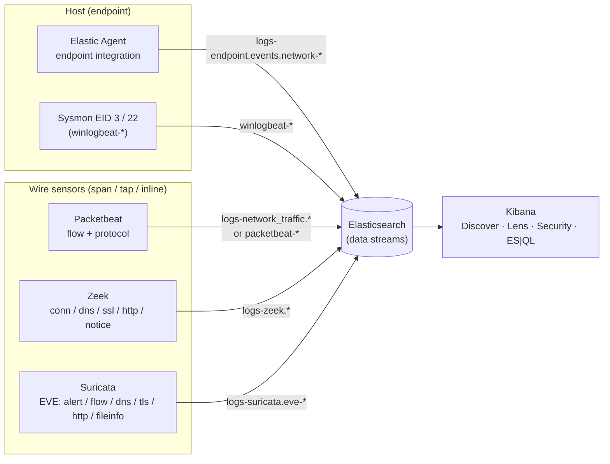
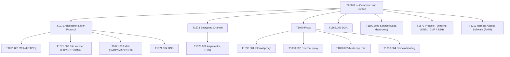
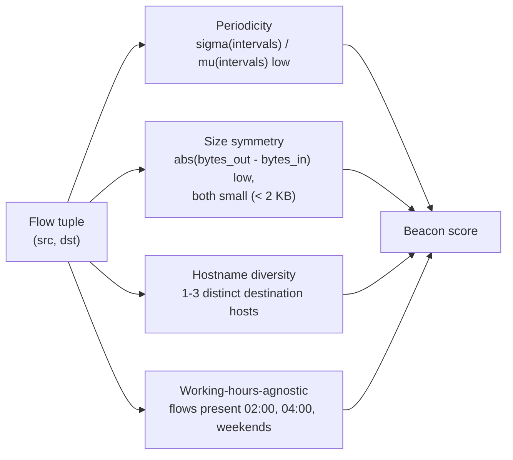
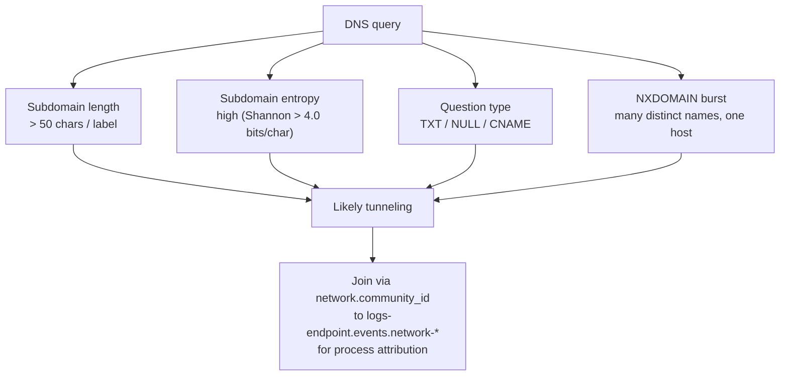
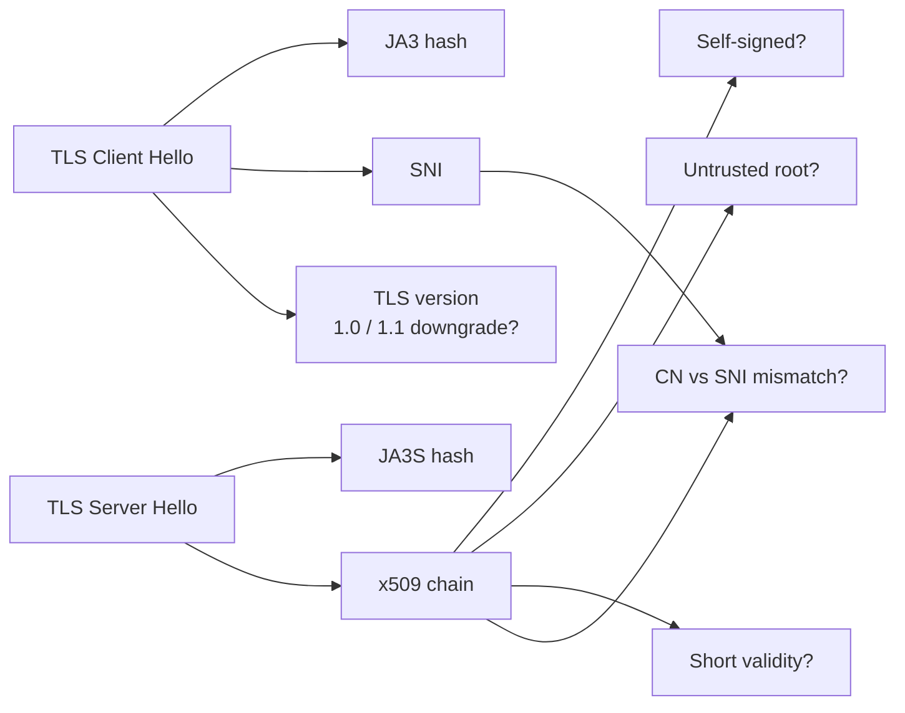
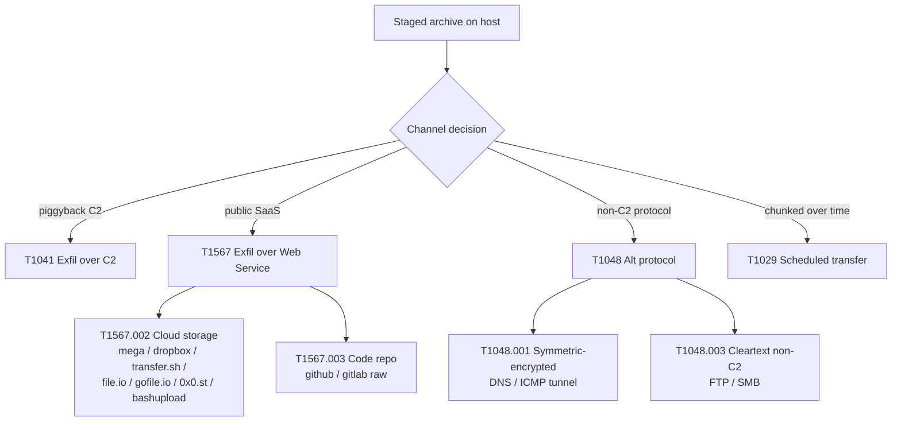
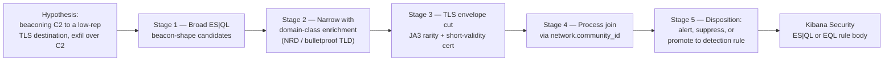

# L2 SOC Module 5 — Hunting Network Telemetry: Command and Control + Exfiltration

**Stack:** Elastic + Kibana (Elastic Agent endpoint, Packetbeat, Filebeat Zeek module, Filebeat Suricata module, Winlogbeat Sysmon EID 3 / 22)
**Audience:** L2 SOC hunter who has completed L2 M1–M4 (PEAK methodology, KQL / EQL / ES|QL fluency, process + file telemetry, identity + sign-in telemetry).
**Bar:** BTL1+ / SANS GCIH+ / SANS FOR572-adjacent depth, ~9,000 words across four readings (~2,000–2,500w each) + four quizzes (mixed kinds, two stems each).
**ATT&CK coverage:** TA0011 Command and Control, TA0010 Exfiltration. ECS field discipline throughout — `source.*`, `destination.*`, `network.*`, `dns.*`, `tls.*`, `url.*`, `http.*`.

---

## Table of contents

1. **R1 — Network data plane + ECS reference (~2,200w)**
   - Four sources, four lenses (Elastic Agent endpoint, Packetbeat, Zeek, Suricata)
   - ECS network / dns / tls / url / http field map
   - `network.community_id` as the cross-source join key
   - Worked broad-to-narrow beacon hunt (KQL → EQL → ES|QL)
2. **R2 — Command and Control TA0011 (~2,400w)**
   - T1071.001 / .002 / .003 / .004 application-layer C2
   - T1573.002 encrypted TLS channel
   - T1090.\* proxies, T1568.002 DGA, T1102 SaaS dead-drops, T1572 tunneling, T1219 RMM
   - Beacon shape (periodicity, size symmetry, working-hours-agnostic, hostname rarity)
   - Domain-class tells (NRD, DGA, typosquat, bulletproof TLD)
   - JA3 / JA3S TLS fingerprinting basics
3. **R3 — DNS hunts and TLS hunts (~2,400w)**
   - DNS tunneling: long subdomains, TXT bursts, NXDOMAIN, DoH, rare TLDs
   - DNS exfil shape (T1048.003 + T1572)
   - TLS: JA3/JA3S rarity, self-signed, untrusted-root, short validity, CN-vs-SNI mismatch, TLS 1.0/1.1 downgrade
   - HTTP: UA anomalies, unusual methods (PROPFIND, MKCOL), recon paths (`/.git/config`, `/.env`)
4. **R4 — Exfiltration TA0010 + statistical hunts + capstone (~2,200w)**
   - T1041, T1567.002 / .003, T1048.001 / .003, T1029
   - ES|QL statistical hunts: `BUCKET()` beacon shape, rare-by-host, byte-volume outliers, UA / JA3 rarity
   - PEAK capstone: broad → narrow → process-entity-id enrichment → Kibana ES|QL or EQL rule body
5. **Quiz seeds (Q1–Q4, two stems each, mixed kinds)**
6. **Author hand-off notes** — Zeek log-format drift, Suricata EVE schema, JA4 succeeding JA3, ECS 8.x drift

---

## R1 — Network data plane + ECS reference (~2,200 words)

### 1.1 Why this module exists

By the end of L2 M4 you can pivot fluently between process telemetry (`logs-endpoint.events.process-*`), file telemetry (`logs-endpoint.events.file-*`), and identity (`logs-azure.signin-*`, `winlogbeat-*` 4624/4625/4768). Network is the third pillar, and it is the **first pillar where you cannot rely on a single canonical source**. The host agent sees connections initiated from its own machine but has no PCAP-grade view of payload. The wire sensors (Zeek, Suricata, Packetbeat) see protocol semantics and bytes-on-wire but cannot tell you which `process.entity_id` opened the socket. **A competent L2 hunt almost always joins the two**, and the ECS field `network.community_id` is the join key that makes that join cheap.

This reading is a reference and a tour. R2–R4 will spend the queries; R1 makes sure you know which index to point them at and which fields will not be `null` when you do.

### 1.2 The four sources, side-by-side



**Diagram 1 — Network data-plane taxonomy.** Five producers, one schema lake, one query plane. ECS is the contract that makes them composable.

| Source | Index pattern | Strength | Blind spot |
|---|---|---|---|
| Elastic Agent endpoint network | `logs-endpoint.events.network-*` | Cheap, host-attributed (`process.entity_id`, `user.name`), survives NAT | Per-flow only, no payload, sees only flows the host's own kernel saw |
| Sysmon EID 3 / 22 | `winlogbeat-*` (`event.code:3` connect, `event.code:22` DNS) | Same host attribution + DNS-query attribution to a Windows PID | Windows-only, EID 22 needs schema 4.x+ and a config that emits it, noisy without filtering |
| Packetbeat | `logs-network_traffic.*` (newer agent integration) or `packetbeat-*` (standalone) | Per-protocol parsers (DNS, TLS, HTTP, ICMP), low setup cost | Lower fidelity than Zeek for L7 forensics, no scripting layer |
| Zeek (Filebeat Zeek module) | `logs-zeek.connection-*`, `logs-zeek.dns-*`, `logs-zeek.ssl-*`, `logs-zeek.http-*`, `logs-zeek.files-*`, `logs-zeek.notice-*`, `logs-zeek.x509-*` | Best-in-class L7 forensic record (conn-state codes, JA3/JA3S, x509 chains, file MIME, notices); field-by-field re-construction of a session | Wire only; needs a tap and tuning; some logs (e.g. `software.log`) need scripts loaded |
| Suricata (Filebeat Suricata module) | `logs-suricata.eve-*` | Signature engine + protocol parsers in one EVE stream; great for "did a known bad fire?" | Alert-centric; the `flow` and `tls` records are sparser than Zeek's |

**Hunter rule of thumb.** Point your *first* query at Zeek when you have it, fall back to `logs-endpoint.events.network-*` when you do not, and *always* enrich with the host-side data once you have a candidate flow. Suricata's role on a hunt (as opposed to a triage queue) is to corroborate — when a Suricata `alert.signature` fires on the same `network.community_id` your statistical hunt surfaced, your confidence climbs sharply.

### 1.3 ECS network namespace — the load-bearing fields

ECS (Elastic Common Schema) normalises every producer to the same field names. Memorise these — they are what every query in R2–R4 will pivot on.

**Endpoints.** `source.ip`, `source.port`, `source.bytes`, `source.packets`, `destination.ip`, `destination.port`, `destination.bytes`, `destination.packets`, `destination.domain`. Direction is encoded in `network.direction` (`ingress | egress | inbound | outbound | internal | external | unknown`). `network.type` is `ipv4` / `ipv6`. `network.transport` is `tcp` / `udp` / `icmp`. `network.protocol` is the L7 application protocol Zeek / Packetbeat / Suricata identified (e.g. `http`, `tls`, `dns`, `ssh`, `quic`).

**Bytes and packets.** Use `network.bytes` and `network.packets` as the *flow totals* (sum of both directions). When you want directionality, use `source.bytes` and `destination.bytes` separately. The asymmetry between them is the single most useful exfil signal you have.

**Community ID.** `network.community_id` is a deterministic hash of `(proto, src_ip, src_port, dst_ip, dst_port)` that every modern Elastic producer emits. **A flow seen by your endpoint agent and by Zeek will share the same `network.community_id`** — that is the join key.

**DNS namespace.** `dns.question.name` (the FQDN queried), `dns.question.type` (e.g. `A`, `AAAA`, `TXT`, `MX`), `dns.question.registered_domain` (eTLD+1, e.g. `example.com`), `dns.question.subdomain`, `dns.question.top_level_domain`, `dns.resolved_ip`, `dns.response_code` (`NOERROR`, `NXDOMAIN`, `SERVFAIL`, `REFUSED`), `dns.answers.data`, `dns.answers.ttl`. Sysmon EID 22 maps to these via the Filebeat Sysmon pipeline.

**TLS namespace.** `tls.client.server_name` (the SNI), `tls.client.ja3`, `tls.server.ja3s`, `tls.server.x509.subject.common_name`, `tls.server.x509.issuer.common_name`, `tls.server.x509.not_before`, `tls.server.x509.not_after`, `tls.version`, `tls.cipher`. **The CN-vs-SNI mismatch hunt in R3 is `tls.client.server_name != tls.server.x509.subject.common_name` plus a wildcard-aware comparator.**

**URL / HTTP namespace.** `url.full`, `url.domain`, `url.path`, `url.query`, `http.request.method`, `http.request.body.bytes`, `http.response.status_code`, `http.response.body.bytes`, `user_agent.original`, `user_agent.name`.

**File-on-wire (Zeek `files.log`).** `file.mime_type`, `file.size`, `file.hash.sha256`, `file.name`. This is what catches the staged-archive-on-its-way-out (R4).

**Producer-specific extras you should know exist (and where to find them).**
- Zeek `conn.log` connection-state code: `zeek.connection.state` with values `S0` (no SYN-ACK), `S1` (established, no FIN), `SF` (full close), `REJ` (RST on first SYN), `RSTO` / `RSTR` (originator/responder reset), `OTH` (no SYN seen). Reference: Zeek conn.log conn-state field documentation. C2 beacons live disproportionately in `S0` and `OTH`.
- Suricata EVE `event_type`: `flow`, `alert`, `dns`, `tls`, `http`, `fileinfo`, `anomaly`. Filter to one with `suricata.eve.event_type:tls`.
- Elastic Agent endpoint network: `event.action: connection_attempted | connection_accepted | disconnect_received` and the always-populated `process.entity_id`, `process.executable`, `user.name`.

### 1.4 `network.community_id` — the universal join key

Every modern producer in this module emits `network.community_id`. The hash is deterministic across implementations, so a flow that Elastic Agent recorded as

```
event.dataset: endpoint.events.network
process.executable: C:\Users\bob\Downloads\update.exe
network.community_id: 1:WfqA9k3o...
```

is the same flow Zeek recorded as

```
event.dataset: zeek.connection
zeek.connection.state: S0
network.community_id: 1:WfqA9k3o...
destination.domain: kxz1f9.top
```

ES|QL makes this concrete with a `LOOKUP JOIN` (since 8.13) or, more portably, with a two-stage hunt where stage one materialises the suspect community IDs and stage two enriches them on the host side. We will exercise both in R4's capstone. The headline rule: **never write a network hunt that does not preserve `network.community_id` — you will need it for the join in five minutes.**

### 1.5 Worked example — broad-to-narrow beacon hunt (KQL → EQL → ES|QL)

PEAK starts broad. We hypothesise: *some host is beaconing to an external destination on a regular cadence with small, symmetric flows.*

**Step 1 — KQL triage in Discover.** A first cut to see whether anything in the last 24 h is even shaped like a beacon. We pick Zeek connections, egress, with the conn-state codes that beacons love.

```kql
data_stream.dataset: "zeek.connection"
and network.direction: "egress"
and zeek.connection.state: ("S0" or "OTH" or "SF")
and source.bytes < 2000
and destination.bytes < 2000
and not destination.ip: ("10.0.0.0/8" or "172.16.0.0/12" or "192.168.0.0/16")
```

This is intentionally over-broad. Lens it on a date histogram of `@timestamp` faceted by `destination.domain` — beacon shapes pop visually (R2 walks through reading the chart).

**Step 2 — EQL to assert sequence.** EQL is the right tool when you want *ordering* — "the same host hits the same destination N times in a window". This is closer to a beacon definition than KQL alone:

```eql
sequence by source.ip, destination.domain with maxspan=1h
  [network where network.direction == "egress" and source.bytes < 2000]
  [network where network.direction == "egress" and source.bytes < 2000]
  [network where network.direction == "egress" and source.bytes < 2000]
  [network where network.direction == "egress" and source.bytes < 2000]
  [network where network.direction == "egress" and source.bytes < 2000]
```

Five small egress flows from the same `(source.ip, destination.domain)` inside an hour. EQL's `sequence ... by` semantics are documented in the Elastic EQL syntax reference. This is still pre-statistical but it kills most of the noise.

**Step 3 — ES|QL to quantify periodicity.** ES|QL gives us aggregations and `BUCKET()` for the time-bucket histogram, which is how you actually *measure* beacon-ness:

```esql
FROM logs-zeek.connection-*
| WHERE network.direction == "egress"
  AND source.bytes < 2000
  AND destination.bytes < 2000
| EVAL bucket = BUCKET(@timestamp, 5 minute)
| STATS hits = COUNT(*),
        unique_dst_ips = COUNT_DISTINCT(destination.ip),
        bytes_out = SUM(source.bytes),
        bytes_in  = SUM(destination.bytes)
    BY source.ip, destination.domain, bucket
| WHERE hits >= 3
| STATS active_buckets = COUNT(*),
        total_hits     = SUM(hits),
        avg_bytes_out  = AVG(bytes_out),
        avg_bytes_in   = AVG(bytes_in)
    BY source.ip, destination.domain
| WHERE active_buckets >= 12
| SORT active_buckets DESC
| LIMIT 50
```

**Read this query like a hunter.** Bucket by 5 minutes. Demand at least three hits per bucket (so a beacon, not a one-shot). Demand at least twelve active buckets across the search window (so the beacon persists, not a flurry). Sort by persistence, top 50. **The `(source.ip, destination.domain)` pairs at the top are your Tier-1 candidates** — they have repeated, sustained, small-symmetric egress to the same destination.

### 1.6 What R1 leaves you with

You now know which index has which fields, why `network.community_id` matters, what the four data sources are blind to, and what a broad-to-narrow beacon hunt looks like in the three Elastic query languages. R2 turns this into a technique-by-technique hunt catalogue for TA0011. R3 specialises it into DNS and TLS. R4 closes the loop with TA0010 exfil and a worked PEAK capstone that ends in a Kibana detection rule body.

---

## R2 — Command and Control TA0011 (~2,400 words)

### 2.1 What "C2" actually means and what you are hunting

Command and Control is the part of the kill chain where an implant on the inside *reaches back* to attacker infrastructure to receive instructions and ferry results. ATT&CK groups every C2 behaviour under tactic TA0011, and within it the technique tree is best understood as **how the bytes are dressed up** (T1071, T1572, T1102), **how they are encrypted** (T1573), **how the destination IP is hidden** (T1090, T1568), and **where the destination lives** (T1102 SaaS, T1219 RMM software). A modern hunter reads this tree as a checklist of fingerprints, each of which has a query.



**Diagram 2 — TA0011 technique tree.** Read it as a hunt-board. R2 walks each branch.

### 2.2 T1071 — Application-Layer Protocol

The implant uses a normal-looking application protocol so the egress traffic blends in. Each sub-technique has a different fingerprint.

**T1071.001 Web (HTTP/HTTPS).** The dominant C2 transport in 2026. On the hunt side, plain HTTP is almost a gift — `logs-zeek.http-*` and `packetbeat-*` give you `user_agent.original`, `http.request.method`, `url.path`, and `http.request.body.bytes` directly. Tells: hard-coded UA strings (`python-requests/2.31`, `Go-http-client/2.0`, `Mozilla/4.0 (compatible; MSIE 7.0)` on a Windows 11 box), POSTs to a single path on a small destination set, and `http.response.body.bytes` that varies wildly while `http.request.body.bytes` is near-constant (the implant polls; the server occasionally answers with a task).

```kql
data_stream.dataset: "zeek.http"
and network.direction: "egress"
and (user_agent.original: "python-requests*" or user_agent.original: "Go-http-client*"
     or user_agent.original: "curl/*" or not user_agent.original: *)
and http.request.method: ("POST" or "GET")
```

**T1071.002 File transfer (FTP / SFTP / SMB / WebDAV).** Rarer for live C2, more common as an exfil channel (R4) — but adversaries do still use SFTP for tasking. Hunt by `network.protocol: ("ftp" or "ssh")` plus an unfamiliar destination. WebDAV PROPFIND/MKCOL on `http.request.method` is a classic tell of a script reaching out to a tasking share.

**T1071.003 Mail (SMTP / IMAP / POP3).** Email-as-C2 is a niche but living technique — the implant logs into a mailbox, reads the subject line, runs the command. Hunt: `destination.port: (25 or 465 or 587 or 143 or 993 or 110 or 995)` from a host that has no mail-client process. Join `process.executable` from `logs-endpoint.events.network-*` over `network.community_id`.

**T1071.004 DNS.** Covered in depth in R3, but the headline: high-volume TXT queries to long subdomains of a single registered domain.

### 2.3 T1573.002 — Encrypted Channel (TLS)

The implant wraps its application protocol in TLS. This is the default C2 channel today; we cannot read the payload, so we hunt the *envelope*. The envelope is rich: `tls.client.ja3`, `tls.server.ja3s`, the certificate chain, the SNI, the cipher suite, the TLS version. R3 spends a full reading on the TLS hunt; here, the headline is that **TLS does not blind you to a beacon — the bytes-on-wire and the certificate fingerprint are still in plain view**.

A beacon over TLS still has the periodicity, still has the small-symmetric flows, and now also has a JA3 fingerprint that may be rare in your environment. Pivot:

```esql
FROM logs-zeek.ssl-*
| WHERE tls.established == true AND network.direction == "egress"
| STATS connections = COUNT(*),
        unique_clients = COUNT_DISTINCT(source.ip),
        unique_dst = COUNT_DISTINCT(destination.ip)
    BY tls.client.ja3
| WHERE unique_clients <= 3 AND connections >= 50
| SORT connections DESC
| LIMIT 100
```

A JA3 used by ≤ 3 clients but seen in 50+ flows is a very tight cohort. **Rare-but-busy is the JA3 hunt's signature.**

### 2.4 T1090 — Proxy

Adversaries hide the true destination behind a proxy. The four sub-techniques are .001 internal (a compromised internal host relays for others), .002 external (a VPS rented by the actor), .003 multi-hop / Tor, and .004 domain fronting (the SNI says `cdn.cloudflare.com` but the Host header says `attackerC2.example`). For the hunter:

- **.001 Internal:** look for unexpected lateral connections — a workstation that has 50 different other workstations connecting *to* it on a non-server port.
- **.002 External:** the IP-reputation pivot — `destination.as.organization.name` against a "known bad / VPS-heavy ASN" list (Choopa, Hostwinds, Mivocloud, BlueVPS, etc.). Domain-class tells (NRD, bulletproof TLD) compound this.
- **.003 Tor:** Zeek's `notice.log` dataset emits Tor relay observations when configured; otherwise pivot on known Tor exit-node lists, JA3 fingerprints associated with Tor browser, and `tls.client.server_name` ending in `.onion` (rare but possible via gateways).
- **.004 Domain fronting:** the smoking gun is `tls.client.server_name != http.request.headers.host`. Most fronting today goes through CDNs, so a *CDN SNI plus a non-CDN Host header* is the precise pattern.

### 2.5 T1568.002 — Dynamic Resolution / DGA

Domain-Generation Algorithms produce a stream of pseudo-random domains (`kxz1f9p4.top`, `q7wmrnxj.xyz`, `b3v8z2pk.click`). The implant tries them; the operator only needs to register one a day. The fingerprint:

- High Shannon entropy on the second-level label (`kxz1f9p4` has near-uniform character distribution; `microsoft` does not).
- Heavy NXDOMAIN tail — most of the generated names are not registered.
- A long list of distinct registered domains in a short window from one source.

```esql
FROM logs-zeek.dns-*
| WHERE dns.response_code == "NXDOMAIN"
| STATS nx = COUNT(*),
        unique_domains = COUNT_DISTINCT(dns.question.registered_domain)
    BY source.ip, BUCKET(@timestamp, 10 minute)
| WHERE nx >= 50 AND unique_domains >= 25
| SORT nx DESC
```

Fifty NXDOMAINs across 25+ different registered domains in 10 minutes from one host is the classic DGA shape. Worth knowing: Chrome's "random-three-letter probe" generates a small NXDOMAIN burst at startup — three domains, not 25 — and is a famous false-positive.

### 2.6 T1102 — Web Service (SaaS dead-drops)

The C2 server is a public SaaS. The implant beacons to `api.telegram.org`, `discord.com/api/webhooks/...`, `*.workers.dev` (Cloudflare Workers), `*.github.io` (GitHub Pages), `pastebin.com/raw/...`, `raw.githubusercontent.com`, `*.firebaseio.com`, `*.s3.amazonaws.com`. The destination is *legitimate*; you cannot block it. You hunt **whether this host has a business reason to talk to that SaaS**.

The pattern: a compiled binary in `C:\ProgramData\` with no signature making 1KB POSTs every 60 s to `discord.com/api/webhooks/...` is C2; a Discord client process making varied traffic to `gateway.discord.gg` is normal use. The decision is made on the *process* side — which is exactly why R1 hammered on `network.community_id`.

Maintain an internal **"SaaS dead-drop watchlist"** as an enrichment policy: `workers.dev`, `pages.dev`, `trycloudflare.com`, `ngrok-free.app`, `serveo.net`, `loca.lt`, `discord.com/api/webhooks`, `api.telegram.org/bot`, `pastebin.com/raw`, `paste.ee/r`, `0x0.st`, `transfer.sh`, `file.io`, `gofile.io`, `anonfiles`, `bashupload.com`, `mega.nz`, plus the major code-hosting raw endpoints (`raw.githubusercontent.com`, `gitlab.com/-/raw`, `bitbucket.org/!api`).

### 2.7 T1572 — Protocol Tunneling

The bytes ride a protocol they were not designed for. Three flavours.

- **DNS tunneling.** Encoded payload in subdomain labels (egress) and in TXT records (ingress). The single best hunt is "TXT-record bytes per registered domain per hour" — see R3.
- **ICMP tunneling.** Payload in the ICMP echo-request data field. Tools: `icmpsh`, `pingtunnel`. Hunt: `network.transport: icmp` egress with `network.bytes > 1000` per packet, sustained — normal pings are 84 bytes.
- **SSH tunneling.** A long-running SSH session to an external IP from a workstation, often with port forwarding (`-R` reverse tunnel back to the attacker, common pattern for getting RDP out of a NATed environment). Hunt: `network.protocol: ssh` egress to a destination outside your bastion list, sustained > 5 minutes, with `process.executable` joined back via `network.community_id` — an `ssh.exe` from `C:\Users\bob\Downloads\` is not the same animal as `ssh.exe` from `C:\Program Files\OpenSSH\`.

### 2.8 T1219 — Remote Access Software (RMM)

The "I'm a legitimate IT tool" branch. AnyDesk, ScreenConnect (ConnectWise Control), TeamViewer, Atera, Splashtop, RustDesk, Action1, NinjaOne, N-able, Kaseya, GoToAssist, LogMeIn, Parsec — adversaries install one, claim "remote support", and have an interactive shell over a perfectly normal-looking commercial back-end. Hunt: pre-build an internal **"sanctioned RMM" allowlist** (e.g. only ScreenConnect via your MSP) and alert on every other RMM identified by either process name *or* destination domain.

```kql
(process.name: ("AnyDesk.exe" or "TeamViewer.exe" or "ScreenConnect.WindowsClient.exe"
   or "AteraAgent.exe" or "rustdesk.exe" or "splashtop*.exe"))
or destination.domain: ("*.anydesk.com" or "*.teamviewer.com" or "*.screenconnect.com"
   or "*.atera.com" or "*.rustdesk.com" or "*.splashtop.com")
```

Then exclude the sanctioned tool. The remaining hits are L2-worthy investigation queue.

### 2.9 Beacon shape — the four properties to score

A modern beacon hunt is a **scorecard**, not a binary. Score each `(source.ip, destination.domain)` candidate on:



**Diagram 3 — Beacon shape scorecard.** Each axis is a separate ES|QL aggregation; sum them for a ranked list.

- **Periodicity.** Compute inter-arrival intervals between flows for a `(src, dst)` pair. The coefficient of variation `stddev(intervals) / mean(intervals)` is small (< 0.3) for a tight beacon, even when the beacon is jittered. ES|QL lacks a first-class `STDDEV_OVER` window function as of 8.14, so the production trick is a runtime field or a transform job. A pragmatic in-query proxy: bucket the time series and demand at least N out of M buckets contain a flow.
- **Size symmetry.** `abs(source.bytes - destination.bytes) < 200` AND both `< 2000`. A beacon's check-in is small in both directions; a download is large in one.
- **Hostname diversity.** A beacon usually talks to one or two hosts. A user's browser talks to dozens. `COUNT_DISTINCT(destination.domain) <= 3` per source is the cut.
- **Working-hours-agnostic.** A beacon does not sleep on Saturday at 3 a.m.. Demand the flow is present in at least one bucket inside `(00:00-06:00 user-local)` *and* one bucket inside `(09:00-17:00)`.

The combined scorecard is what an L2 hunt actually produces — see R4's capstone.

### 2.10 Domain-class tells

The destination domain itself often gives the technique away.

- **NRD (newly-registered domain).** A domain registered in the last 30 days. Enrich with a Whois feed via Elastic enrichment policy or an ingest-pipeline `enrich` processor. Most user traffic is to domains > 6 months old; C2 domains skew young.
- **DGA.** Entropy + NXDOMAIN tail (Section 2.5).
- **Typosquats.** `microsft.com`, `g00gle.com`, `paypa1.com`. Levenshtein-distance-1 from a brand list; cheap to do as a runtime field on `destination.domain`.
- **Bulletproof / abuse-prone TLDs.** `.top`, `.xyz`, `.click`, `.icu`, `.cyou`, `.bond`, `.cfd`, `.sbs`, `.support` see disproportionate badness in published abuse statistics. `.zip` and `.mov` are interesting: legitimate uses are vanishingly rare; abuse uses (link-disguise) are frequent. A "destination TLD in the bulletproof set" filter cuts the search space cleanly.
- **SaaS dead-drop list.** Section 2.6.

### 2.11 JA3 / JA3S TLS fingerprinting basics

JA3 is a hash of the TLS Client Hello (version, cipher suites, extensions, elliptic curves, EC point formats). JA3S is the equivalent hash of the Server Hello. Two consequences:

1. **A given TLS client implementation produces a stable JA3.** Python `requests` has a JA3, Go's `net/http` has a JA3, Chrome 122 has a JA3. Hard-coded malware C2 libraries have JA3s.
2. **The same client talking to the same server gives a stable (JA3, JA3S) pair.** A rare pair seen on many flows is suspicious; a common pair seen everywhere is benign.

```esql
FROM logs-zeek.ssl-*
| WHERE network.direction == "egress"
| STATS conns = COUNT(*), src_n = COUNT_DISTINCT(source.ip)
    BY tls.client.ja3, tls.server.ja3s, destination.domain
| WHERE src_n <= 2 AND conns >= 30
| SORT conns DESC
```

Tight cohort: <= 2 source IPs, >= 30 flows. Investigate the `(JA3, JA3S, domain)` triple. **Author note:** the IETF Encrypted Client Hello rollout will gradually erode JA3 (Client Hello is no longer entirely in the clear), and JA4 — see hand-off notes — supersedes it.

### 2.12 What R2 leaves you with

You have a per-technique hunt query for every node of the TA0011 tree, the four-axis beacon scorecard, the domain-class tells, and a working JA3 / JA3S query. R3 zooms into the two fattest leaves of that tree — DNS and TLS — and writes the queries that catch tunneling, dead-drops, and downgrade attacks. R4 turns it all into exfil hunts and a capstone.

---

## R3 — DNS hunts and TLS hunts (~2,400 words)

### 3.1 Why DNS and TLS deserve their own reading

Of every TA0011 leaf in R2's tree, two carry a disproportionate share of real C2 traffic in 2026: **DNS** (T1071.004 + T1572 tunneling) and **TLS** (T1573.002 + T1102 SaaS dead-drops + T1090.004 fronting). DNS because it is allowed to leave every network on earth and goes through caches that obscure source attribution. TLS because end-to-end encryption is now ubiquitous — over 90 % of egress web traffic — and an unsigned binary's TLS to a low-reputation domain is statistically the strongest single signal we have. R3 drills into both with the queries that survive in production.

### 3.2 The DNS-tunneling fingerprint

DNS tunneling hides bytes in places DNS was not meant to carry them. Outbound: long subdomain labels (`MZ4AAA...AAA.evil.example.com` is a base64-encoded .exe header). Inbound: large or numerous TXT/NULL/CNAME answers (the operator's reply travels as record data).



**Diagram 4 — DNS tunneling fingerprint.** Four orthogonal axes; any one alarming, two corroborating, three near-conclusive.

#### 3.2.1 Long-subdomain hunt

A normal hostname has labels of ≤ 20 characters. Tunnels typically have one or two labels approaching the 63-character DNS limit.

```esql
FROM logs-zeek.dns-*
| WHERE network.direction == "egress"
| EVAL longest_label = MV_MAX(LENGTH(SPLIT(dns.question.name, ".")))
| WHERE longest_label >= 50
| STATS hits = COUNT(*),
        sample = VALUES(dns.question.name)
    BY source.ip, dns.question.registered_domain
| WHERE hits >= 20
| SORT hits DESC
```

`MV_MAX(LENGTH(SPLIT(...)))` is the ES|QL idiom for "longest label of an FQDN". A registered domain receiving 20+ queries with a 50+ char label from a single internal host is rarely benign — exclude any DNS-based EDR or anti-spam product first (those produce TXT lookups against `*.spamhaus.org`, `*.dbl.spamhaus.org`, etc., which have known patterns).

#### 3.2.2 TXT-record volume hunt

The reply channel of a DNS tunnel rides TXT or NULL records.

```kql
data_stream.dataset: "zeek.dns"
and dns.question.type: ("TXT" or "NULL")
and network.direction: "egress"
```

Lens that on a date histogram by `dns.question.registered_domain` and you will see normal TXT traffic to `_dmarc.*`, `_acme-challenge.*`, and antispam DNSBLs. A *new* registered domain accumulating thousands of TXT lookups from one host is the signal.

```esql
FROM logs-zeek.dns-*
| WHERE dns.question.type IN ("TXT", "NULL")
| STATS txt = COUNT(*),
        srcs = COUNT_DISTINCT(source.ip)
    BY dns.question.registered_domain, BUCKET(@timestamp, 1 hour)
| WHERE txt >= 200 AND srcs <= 3
| SORT txt DESC
```

#### 3.2.3 NXDOMAIN burst hunt

We saw this in R2 for DGA. The same shape catches tunnels whose protocol uses pseudo-randomness in the subdomain to avoid caching: tools like `dnscat2` and `iodine` deliberately produce non-cacheable queries. The cut for tunneling is the *length* of the queries combined with the NXDOMAIN rate; for DGA, the *count of distinct registered domains*.

#### 3.2.4 DNS over HTTPS (DoH) detection

DoH puts DNS inside HTTPS to `dns.google`, `cloudflare-dns.com`, `mozilla.cloudflare-dns.com`, `dns.quad9.net`, `doh.opendns.com`, `dns.adguard.com`, `chrome.cloudflare-dns.com`. From the wire it is just TLS. Detection has two layers:

1. **Watchlist destinations.** Maintain a public DoH provider list and alert when a host that should be using your internal resolvers talks TLS to one — unless the corporate browser policy explicitly enables it.
2. **Behavioural.** A workstation that is making *no* port-53 traffic but *is* sustaining a TLS connection to `1.1.1.1` (Cloudflare) on 443 is using DoH. Cross-reference: a host with `network.transport: udp AND destination.port: 53 AND network.direction: egress` count of *zero* in the last hour is the easy filter.

```esql
FROM logs-zeek.connection-*
| WHERE network.direction == "egress"
| STATS dns_q = COUNT(*) WHERE destination.port == 53,
        tls_doh = COUNT(*) WHERE destination.port == 443
            AND destination.domain IN ("cloudflare-dns.com", "dns.google",
                                       "dns.quad9.net", "doh.opendns.com",
                                       "mozilla.cloudflare-dns.com")
    BY source.ip, BUCKET(@timestamp, 1 hour)
| WHERE dns_q == 0 AND tls_doh >= 10
```

#### 3.2.5 Rare-TLD hunt

R2 listed the high-abuse TLDs. The hunt:

```esql
FROM logs-zeek.dns-*
| WHERE dns.question.top_level_domain IN ("top","xyz","click","icu","cyou",
                                           "bond","cfd","sbs","support",
                                           "zip","mov")
  AND network.direction == "egress"
| STATS hits = COUNT(*), domains = VALUES(dns.question.registered_domain)
    BY source.ip, dns.question.top_level_domain
| WHERE hits >= 5
| SORT hits DESC
```

The `dns.question.top_level_domain` ECS field is parsed from `dns.question.name` by Filebeat's pipeline, so this is cheap.

### 3.3 DNS exfil shape (T1048.003 + T1572)

Exfiltration over DNS is just tunneling with the byte direction reversed: payload in subdomain labels, reply minimal. The fingerprint is the *cumulative bytes encoded in subdomains over a window* per destination domain. ES|QL:

```esql
FROM logs-zeek.dns-*
| WHERE network.direction == "egress"
| EVAL subdomain_bytes = LENGTH(dns.question.subdomain)
| STATS encoded = SUM(subdomain_bytes),
        queries = COUNT(*)
    BY source.ip, dns.question.registered_domain, BUCKET(@timestamp, 1 hour)
| WHERE encoded >= 50000
| SORT encoded DESC
```

50 KB of subdomain bytes to a single registered domain in an hour is dozens of small files smuggled out. Tune the threshold to your environment, but **the metric is the right one**: encoded bytes, not query count.

### 3.4 The TLS hunt — the modern envelope game



**Diagram 5 — TLS lifecycle from a hunter's perspective.** Each branch is a query.

#### 3.4.1 JA3 / JA3S rarity hunt

R2 introduced the rare-but-busy cohort. Two more practical variants:

**Variant A — JA3 used by exactly one host.**
```esql
FROM logs-zeek.ssl-*
| WHERE network.direction == "egress"
| STATS conns = COUNT(*), srcs = COUNT_DISTINCT(source.ip)
    BY tls.client.ja3
| WHERE srcs == 1 AND conns >= 100
| SORT conns DESC
```
A unique-to-one-host JA3 with sustained traffic is a high-yield triage queue.

**Variant B — JA3 not in the corporate "expected" set.**
Maintain an enrichment policy `tls_expected_ja3` derived from a clean-baseline week of traffic. Anything not in that set, alert.

#### 3.4.2 Self-signed certificate hunt

Self-signed certs are normal on internal services and lab gear; they should be rare on egress. Zeek's `ssl.log` flags this as the issuer chain length being 1 with the issuer matching the subject.

```kql
data_stream.dataset: "zeek.ssl"
and network.direction: "egress"
and tls.server.x509.issuer.common_name: *
and tls.server.x509.subject.common_name: *
and tls.server.x509.issuer.common_name: tls.server.x509.subject.common_name
```

(KQL has no native field-equals-field comparator; build a runtime field `tls.server.x509.is_self_signed` of type `boolean` in the data view.)

#### 3.4.3 Untrusted-root issuer hunt

Most legitimate egress TLS chains to a CA in Mozilla's CA list. Pull the CA bundle and write a runtime field that flags `tls.server.x509.issuer.common_name` not in the bundle. Then:

```kql
data_stream.dataset: "zeek.ssl"
and network.direction: "egress"
and tls.server.x509.is_untrusted_root: true
```

#### 3.4.4 Short-validity certificate hunt

Let's Encrypt is 90 days; ZeroSSL is 90 days. Anything *under 90 days* is unusual — and a cert valid for, say, *7 days* is essentially diagnostic of a throwaway operator. Compute `tls.server.x509.not_after - tls.server.x509.not_before` in an ES|QL `EVAL`:

```esql
FROM logs-zeek.ssl-*
| WHERE network.direction == "egress"
  AND tls.server.x509.not_after IS NOT NULL
  AND tls.server.x509.not_before IS NOT NULL
| EVAL validity_days = DATE_DIFF("day",
                                  tls.server.x509.not_before,
                                  tls.server.x509.not_after)
| WHERE validity_days < 30
| STATS conns = COUNT(*), srcs = COUNT_DISTINCT(source.ip)
    BY destination.domain, validity_days
| SORT conns DESC
```

A cert valid for 7 days carrying live C2 traffic is a high-confidence hit.

#### 3.4.5 CN-vs-SNI mismatch (domain-fronting indicator)

The fronting fingerprint. SNI advertises one name; the certificate's subject CN names another:

```esql
FROM logs-zeek.ssl-*
| WHERE network.direction == "egress"
  AND tls.client.server_name IS NOT NULL
  AND tls.server.x509.subject.common_name IS NOT NULL
  AND tls.client.server_name != tls.server.x509.subject.common_name
| STATS hits = COUNT(*)
    BY tls.client.server_name, tls.server.x509.subject.common_name
| WHERE hits >= 10
```

Caveat: wildcard certs (`*.cloudfront.net`) match many SNIs and will look like mismatches. Build the comparator to be wildcard-aware (split on `.`, allow `*` as a label).

#### 3.4.6 TLS 1.0 / 1.1 downgrade in 2026

In 2026 nothing legitimate negotiates TLS 1.0 or 1.1 on the public internet. Browsers killed support in 2020; major SaaS deprecated 1.1 in 2021–2022. Any egress TLS at version 1.0 or 1.1 on a public destination is either misconfigured legacy gear (investigate, then exempt) or an actor-tooling artifact.

```kql
data_stream.dataset: "zeek.ssl"
and network.direction: "egress"
and tls.version: ("1.0" or "1.1")
and not destination.ip: ("10.0.0.0/8" or "172.16.0.0/12" or "192.168.0.0/16")
```

### 3.5 HTTP anomaly hunts

#### 3.5.1 User-Agent anomalies

The two patterns:

- **Hard-coded library UAs.** `python-requests/2.x`, `Go-http-client/2.0`, `Java/1.8`, `curl/7.x`, `Wget/1.x`, `PowerShell/5.x`, `Microsoft Office/16.0` (DocuSign-themed phish, sometimes), or empty / missing UA. None of these should be making external connections from an end-user workstation as a baseline.
- **Browser-on-server / server-on-browser.** Chrome UA from a server with no human user; PowerShell UA from a workstation user-context process. Cross-reference `process.executable` via `network.community_id`.

```esql
FROM logs-zeek.http-*
| WHERE network.direction == "egress"
  AND (user_agent.original LIKE "python-requests*"
       OR user_agent.original LIKE "Go-http-client*"
       OR user_agent.original LIKE "curl/*"
       OR user_agent.original LIKE "Wget/*"
       OR user_agent.original LIKE "PowerShell/*"
       OR user_agent.original IS NULL)
| STATS hits = COUNT(*), dst = VALUES(destination.domain)
    BY source.ip, user_agent.original
| WHERE hits >= 10
| SORT hits DESC
```

#### 3.5.2 Unusual HTTP method hunt

PROPFIND, MKCOL, COPY, MOVE — WebDAV verbs; rare on healthy networks unless you actually run WebDAV. PUT and DELETE on egress are usually API-client traffic; alert when the destination domain is not a known API.

```kql
data_stream.dataset: "zeek.http"
and network.direction: "egress"
and http.request.method: ("PROPFIND" or "MKCOL" or "COPY" or "MOVE" or "LOCK" or "UNLOCK")
```

#### 3.5.3 Suspicious-path discovery hunt

Mass scanners and post-exploitation reconnaissance routinely probe predictable paths. Internally these mostly come *from* a compromised internal host (web app pen test, SSRF-followed-by-LFI), so the hunt runs against *internal-to-internal* HTTP:

```kql
data_stream.dataset: "zeek.http"
and network.direction: "internal"
and url.path: ("/.git/config" or "/.git/HEAD" or "/.env" or "/.aws/credentials"
   or "/wp-admin/admin-ajax.php" or "/server-status" or "/actuator/env"
   or "/phpinfo.php" or "/.well-known/security.txt"
   or "/console" or "/jmx-console" or "/manager/html")
```

External-to-internal hits on these paths are the L1 web-attack queue (M3 territory). Internal-to-internal hits are L2 lateral-movement / web-recon queue.

### 3.6 Suricata corroboration

When a statistical hunt above produces a candidate `network.community_id`, pivot to Suricata to see whether a signature also fired on the same flow:

```kql
data_stream.dataset: "suricata.eve"
and event.kind: "alert"
and network.community_id: "1:WfqA9k3o..."
```

A statistical hit *plus* a Suricata signature is a confidence multiplier you bring to the case write-up.

### 3.7 What R3 leaves you with

Eight DNS-and-TLS hunt queries across KQL and ES|QL, two diagrams, and the three high-yield HTTP anomaly hunts. You can now attack any TA0011 leaf with a real query. R4 takes everything you have and points it at TA0010 exfil, then closes with a multi-stage capstone.

---

## R4 — Exfiltration TA0010 + statistical hunts + capstone (~2,200 words)

### 4.1 Where exfil sits in the kill chain

By the time you are hunting exfiltration, the actor has staged data — usually an archive in `C:\ProgramData\`, `C:\Users\Public\`, or a temp directory. They then ferry it out by the cheapest path that works. ATT&CK's TA0010 is small and well-organised: T1041 over the existing C2 channel, T1567 over a SaaS web service, T1048 over a non-C2 alternative protocol, T1029 spread out over scheduled chunks.



**Diagram 6 — Exfil channel decision tree.** The hunter's job is to make every branch noisy.

### 4.2 T1041 — Exfiltration over C2 channel

The implant uses the same TLS C2 it was already using. The fingerprint is a *change in shape*: a beacon that has been doing 1 KB / 1 KB POSTs for two days suddenly does a single 80 MB POST. Hunt by *byte-volume asymmetry*:

```esql
FROM logs-zeek.connection-*
| WHERE network.direction == "egress"
| STATS bytes_out = SUM(source.bytes),
        bytes_in  = SUM(destination.bytes),
        flows = COUNT(*)
    BY source.ip, destination.domain, BUCKET(@timestamp, 15 minute)
| EVAL ratio = bytes_out / (bytes_in + 1)
| WHERE bytes_out >= 10000000 AND ratio >= 10
| SORT bytes_out DESC
```

10 MB+ uploaded in a 15-minute bucket with a 10:1 out-to-in ratio. **Pre-filter to destinations with a beacon score >= 2 from R2's scorecard, and you have a flagged exfil case.**

### 4.3 T1567.002 — Exfiltration over Web Service: cloud storage

The big-yield list of public file-drop services that adversaries love because no auth is required and no email tied to the account is needed:

`mega.nz`, `mega.co.nz`, `transfer.sh`, `wetransfer.com` (with auth, less common in tradecraft now), `anonfiles.com` (defunct as of 2023 but artifacts persist in stale infrastructure), `file.io`, `gofile.io`, `bashupload.com`, `0x0.st`, `tmp.ninja`, `catbox.moe`, `litterbox.catbox.moe`, `pixeldrain.com`, `qaz.im`, `sendgb.com`, `oshi.at`, `dropbox.com` (when used by a non-Dropbox-installed host), `mediafire.com`, `mega-debrid.eu`.

Maintain that as `enrich-policy: cloud_storage_dropoff`. The hunt is one line:

```kql
data_stream.dataset: ("zeek.connection" or "zeek.ssl" or "zeek.http")
and network.direction: "egress"
and destination.domain: ("*.mega.nz" or "transfer.sh" or "*.file.io"
  or "gofile.io" or "*.gofile.io" or "bashupload.com" or "0x0.st"
  or "*.pixeldrain.com" or "catbox.moe" or "*.catbox.moe"
  or "tmp.ninja" or "oshi.at" or "sendgb.com")
and source.bytes >= 1000000
```

Then ES|QL the same thing with byte sums per source over a window to surface the *cumulative* upload volume, which catches chunking:

```esql
FROM logs-zeek.connection-*
| WHERE network.direction == "egress"
  AND destination.domain LIKE "*.mega.nz"
     OR destination.domain IN ("transfer.sh", "gofile.io", "bashupload.com",
                                "0x0.st", "catbox.moe", "tmp.ninja")
| STATS uploaded = SUM(source.bytes), flows = COUNT(*)
    BY source.ip, destination.domain, BUCKET(@timestamp, 1 hour)
| WHERE uploaded >= 50000000
| SORT uploaded DESC
```

### 4.4 T1567.003 — Exfil to a code repository

Public Git remotes accept files. Adversaries push staged data to a private repo on GitHub / GitLab / Bitbucket, then pull it from the actor side. The fingerprint is a *workstation pushing to a repo it never previously touched*, with `git-lfs` style large blobs.

```kql
data_stream.dataset: "zeek.ssl"
and network.direction: "egress"
and destination.domain: ("github.com" or "*.github.com" or "gitlab.com"
   or "*.gitlab.com" or "bitbucket.org" or "*.bitbucket.org")
and source.bytes >= 5000000
```

Compound with: process is not a sanctioned dev tool (`git.exe`, `code.exe`, `gh.exe` from `C:\Program Files\Git\`), but `pwsh.exe` or `python.exe` doing the upload.

### 4.5 T1048 — Exfiltration over Alternative Protocol

**T1048.003 unencrypted non-C2.** FTP, SMB, plain HTTP to an external destination. FTP egress in 2026 to a non-corporate destination is essentially diagnostic. SMB to an external IP (port 445 leaving the network) should be unconditional — block at the firewall, alert on anything that gets through.

```kql
network.direction: "egress"
and ((destination.port: 21 and network.transport: "tcp")
     or (destination.port: 445 and network.transport: "tcp"))
and not destination.ip: ("10.0.0.0/8" or "172.16.0.0/12" or "192.168.0.0/16")
```

**T1048.001 symmetric encrypted over alt protocol.** Custom encryption over DNS or ICMP — covered in R3 as DNS exfil; the same shape applies on ICMP. Look for sustained high-byte ICMP egress.

### 4.6 T1029 — Scheduled Transfer

Low-and-slow exfil: 100 KB an hour for two weeks adds to 33 MB without ever crossing a single-flow alert. The hunt is *cumulative bytes per (source, destination) per long window*:

```esql
FROM logs-zeek.connection-*
| WHERE network.direction == "egress"
  AND @timestamp >= NOW() - 7 day
| STATS week_bytes = SUM(source.bytes),
        flows = COUNT(*),
        first_seen = MIN(@timestamp),
        last_seen  = MAX(@timestamp)
    BY source.ip, destination.domain
| EVAL window_hours = DATE_DIFF("hour", first_seen, last_seen)
| WHERE week_bytes >= 100000000
  AND window_hours >= 48
  AND flows >= 200
| SORT week_bytes DESC
```

100 MB over a 48+ hour window across 200+ small flows. Tune to your environment.

### 4.7 ES|QL statistical hunts — a four-pattern toolbox

Every statistical hunt in this module is a variant of one of four idioms.

**Pattern 1 — Beacon shape via `BUCKET()`.** R1 §1.5. The signature is `STATS COUNT(*) BY (src, dst, BUCKET(@timestamp, X))` followed by a second STATS that demands many active buckets.

**Pattern 2 — Rare-by-host.** Identify the destinations / JA3s / UAs that almost no host uses. The signature is `STATS srcs = COUNT_DISTINCT(source.ip), conns = COUNT(*) BY <fingerprint> | WHERE srcs <= K AND conns >= N`.

**Pattern 3 — Byte-volume outliers.** Sum bytes per (src, dst, bucket) and threshold or rank. R4 §4.2 and §4.6.

**Pattern 4 — Cardinality anomaly per source.** `STATS unique_dst = COUNT_DISTINCT(destination.domain) BY source.ip, BUCKET(@timestamp, 10 minute) | WHERE unique_dst >= 100` catches port-scans, DGA, and credential-harvester URL-list traversals.

Memorise the four idioms; almost every L2 hunt is a composition of them.

### 4.8 PEAK capstone — multi-stage beaconing-anomaly hunt to detection rule

This is the worked PEAK example. Walk through it with the diagram open.



**Diagram 7 — Hunt-to-detection pipeline.** This is what your hunt notebook should look like.

#### Stage 1 — Beacon-shape candidates

```esql
FROM logs-zeek.ssl-*, logs-zeek.connection-*
| WHERE network.direction == "egress"
  AND source.bytes < 4000 AND destination.bytes < 4000
  AND @timestamp >= NOW() - 24 hour
| STATS hits = COUNT(*),
        flows = COUNT_DISTINCT(network.community_id),
        dst_ips = COUNT_DISTINCT(destination.ip)
    BY source.ip, destination.domain, BUCKET(@timestamp, 5 minute)
| WHERE hits >= 2
| STATS active_buckets = COUNT(*),
        total_hits     = SUM(hits)
    BY source.ip, destination.domain
| WHERE active_buckets >= 24
| SORT active_buckets DESC
| LIMIT 200
```

24 active 5-minute buckets in 24 hours = beacon present in at least 24 distinct 5-minute windows. Top 200 candidates.

#### Stage 2 — Narrow with domain class

Enrich each candidate with a `destination_domain_age_days` field via an enrich policy backed by your Whois feed, plus a `tld_in_bulletproof_set` boolean. Filter to `destination_domain_age_days < 60 OR tld_in_bulletproof_set == true`.

#### Stage 3 — TLS envelope cut

For the survivors, pull `tls.client.ja3` and certificate validity:

```esql
FROM logs-zeek.ssl-*
| WHERE source.ip IN (<stage 2 sources>)
  AND destination.domain IN (<stage 2 destinations>)
| EVAL validity_days = DATE_DIFF("day",
                                  tls.server.x509.not_before,
                                  tls.server.x509.not_after)
| STATS conns = COUNT(*),
        ja3_clients = COUNT_DISTINCT(source.ip),
        avg_validity = AVG(validity_days)
    BY source.ip, destination.domain, tls.client.ja3
| WHERE ja3_clients <= 3 OR avg_validity < 30
```

#### Stage 4 — Process join

The single most important step. Join the surviving `network.community_id`s back to host telemetry to get `process.executable`, `process.entity_id`, `process.parent.executable`, `user.name`:

```esql
FROM logs-endpoint.events.network-*
| WHERE network.community_id IN (<stage 3 community ids>)
| KEEP @timestamp, host.name, user.name,
       process.entity_id, process.executable, process.parent.executable,
       network.community_id, destination.domain
| SORT @timestamp ASC
```

(Or use ES|QL `LOOKUP JOIN` if you are on 8.13+ and `logs-endpoint.events.network-*` is a small enough lookup target.)

#### Stage 5 — Disposition and rule promotion

Three outcomes possible:

- **Benign-and-known.** Document, add to the suppression list, move on. Example: a sanctioned monitoring agent calling home.
- **Benign-and-unknown.** Document, raise a ticket with the owning team, ride along until the team confirms. Example: a new SaaS the marketing team adopted without telling IT.
- **Malicious.** Open a case, bring in IR, and **promote the hunt to a detection rule**.

Promotion goes via Kibana → Security → Rules → Create custom rule → ES|QL or EQL. The ES|QL rule body for this capstone:

```esql
FROM logs-zeek.ssl-*, logs-zeek.connection-*
| WHERE network.direction == "egress"
  AND source.bytes < 4000 AND destination.bytes < 4000
| STATS hits = COUNT(*)
    BY source.ip, destination.domain, BUCKET(@timestamp, 5 minute)
| WHERE hits >= 2
| STATS active_buckets = COUNT(*)
    BY source.ip, destination.domain
| WHERE active_buckets >= 12
| LOOKUP JOIN destination_domain_intel ON destination.domain
| WHERE domain_age_days < 60 OR tld_class == "bulletproof"
```

The equivalent EQL rule (for environments without ES|QL detection support) uses a `sequence by` with five tight intervals:

```eql
sequence by source.ip, destination.domain with maxspan=30m
  [network where network.direction == "egress" and source.bytes < 4000]
  [network where network.direction == "egress" and source.bytes < 4000]
  [network where network.direction == "egress" and source.bytes < 4000]
  [network where network.direction == "egress" and source.bytes < 4000]
  [network where network.direction == "egress" and source.bytes < 4000]
```

Pair the EQL rule with an indicator-match rule against your domain-class enrichment list, or fold the enrichment in via a runtime field. Schedule the rule on a 1-hour interval with a 24-hour look-back; alert severity Medium until tuned, raise to High once two weeks of false-positives have been driven out.

### 4.9 What the capstone produces

A documented PEAK hunt with hypothesis, queries, candidate list, narrowing rationale, process attribution, disposition, and (if malicious) a Kibana rule promoted from the same query body that found it. **That document is the artefact L2 hunters are paid to produce.** The detection-rule promotion is the durable benefit — the next time the same shape appears, the SOC catches it without a hunt.

### 4.10 What R4 leaves you with

You have a query for every TA0010 sub-technique on the relevant Elastic indices, the four-pattern statistical-hunt toolbox (`BUCKET()`, rare-by-host, byte outliers, cardinality), and a fully worked five-stage capstone that promotes a hunt into a Kibana rule body. Combined with R1–R3 you can hunt and detect any TA0011 / TA0010 technique on the Elastic + Kibana stack with ECS field discipline.

---

## Quiz seeds — Q1–Q4, two stems each (mixed kinds)

Eight stems total. Two per quiz, each pair mixing kinds. Final lesson authoring should pick from these or substitute equivalents at the same difficulty bar.

### Q1 — covers R1 (data plane + ECS)

**Q1.S1 — multiple choice (single answer).**
*An Elastic Agent endpoint event for an outbound HTTPS connection on a Windows 11 host has `process.entity_id`, `process.executable`, and `network.community_id` populated. The same flow appears in `logs-zeek.connection-*` and `logs-zeek.ssl-*`. You want the cheapest, most reliable way to join the host-side and wire-side records.*
- A. Match on `(@timestamp, source.ip, destination.ip, destination.port)` within a 1-second tolerance.
- B. Match on `network.community_id` — it is a deterministic hash of the 5-tuple emitted identically by both producers. ✅
- C. Match on `host.name` and `destination.domain`.
- D. Use a runtime field that concatenates `source.ip + destination.ip` and join on that.

Rationale: `network.community_id` is purpose-built for this; it is stable across producers and survives clock drift.

**Q1.S2 — short-answer / fill-in.**
*A Zeek `conn.log` record shows `zeek.connection.state: "S0"`. In one sentence, what does S0 mean and why is it of disproportionate interest to a beacon hunter?*

Expected answer: S0 means the originator sent SYN(s) and never received a SYN-ACK from the responder — i.e. no connection was established. Beacon hunters care because failed-connection bursts to a single destination are a common artifact of an implant probing a dead C2 endpoint between operator check-ins.

### Q2 — covers R2 (TA0011)

**Q2.S1 — query-completion (drag-and-drop / write-the-clause).**
*Complete the ES|QL clause to surface JA3 fingerprints used by no more than three internal source IPs but appearing in at least 50 egress flows over the search window.*

```esql
FROM logs-zeek.ssl-*
| WHERE network.direction == "egress"
| STATS connections = COUNT(*),
        unique_clients = COUNT_DISTINCT(source.ip)
    BY tls.client.ja3
| WHERE  ____________________________________________
| SORT connections DESC
```

Expected: `unique_clients <= 3 AND connections >= 50`.

**Q2.S2 — multiple choice (multi-select).**
*Which of the following are independently strong signals of a beacon shape on a `(source.ip, destination.domain)` pair? Select all that apply.*
- A. Inter-arrival intervals with a low coefficient of variation. ✅
- B. `source.bytes` and `destination.bytes` both small (< 2 KB) and within a few hundred bytes of each other. ✅
- C. Browser User-Agent string in `user_agent.original`.
- D. Flows present in the 02:00–06:00 user-local window as well as during business hours. ✅
- E. `COUNT_DISTINCT(destination.domain)` per source greater than 50 over an hour.

Rationale: A, B, D are the periodicity, size-symmetry, and working-hours-agnostic axes. C is benign baseline. E is the *opposite* of beacon shape (it would indicate a browser).

### Q3 — covers R3 (DNS + TLS)

**Q3.S1 — scenario / disposition.**
*A workstation makes 3,400 DNS TXT queries to `kxz1f9p4.top` in one hour. The longest label in the queried names is 58 characters; the second-level label entropy is high; 8 % of responses are NXDOMAIN. The host has zero outbound port-53 traffic to your internal resolvers in the same window. List the three TA0011 / TA0010 sub-techniques most likely in play and the single best next pivot.*

Expected: T1071.004 DNS as C2 application protocol, T1572 protocol tunneling (DNS), T1568.002 dynamic resolution (DGA-flavoured naming). Best next pivot: join `network.community_id` from `logs-zeek.dns-*` to `logs-endpoint.events.network-*` to identify `process.executable` and `user.name`. (Bonus: this same shape with the byte direction reversed is T1048.003, exfil-over-DNS.)

**Q3.S2 — true/false with rationale.**
*True or false: a TLS handshake observed in 2026 to a public-internet destination negotiating TLS 1.0 is, on its own, a high-confidence indicator of malicious tooling. Justify in 1–2 sentences.*

Expected: False (or true-with-caveat). Misconfigured legacy gear and embedded devices still negotiate TLS 1.0 / 1.1 in the wild; the signal is *suspicious* but the high-confidence signal requires a second axis (rare-JA3, low-rep destination, hard-coded UA, or beacon shape). The right answer demonstrates that the L2 hunter knows confidence is built from compounding axes, not a single field.

### Q4 — covers R4 (TA0010 + capstone)

**Q4.S1 — query-completion / multi-stage.**
*You have surfaced 14 candidate `(source.ip, destination.domain)` pairs with active_buckets >= 24 over 24 h. Write the next-stage ES|QL clause that retains only candidates whose destination has a Whois `domain_age_days < 60` OR whose TLD is in your bulletproof set, assuming an enrich policy `destination_domain_intel` keyed on `destination.domain` exposes `domain_age_days` and `tld_class`.*

Expected:
```esql
| LOOKUP JOIN destination_domain_intel ON destination.domain
| WHERE domain_age_days < 60 OR tld_class == "bulletproof"
```

**Q4.S2 — disposition (mixed-kind).**
*Choose the correct disposition for each surviving capstone candidate. Each candidate has been process-joined and the process is named.*

| # | Process | Destination | TLS | Bytes out / in (24 h) | Disposition? |
|---|---|---|---|---|---|
| A | `C:\Program Files\Microsoft\Edge\msedge.exe` | `cdn.bing.com` | JA3 common, valid Microsoft chain | 8 MB / 240 MB | _____ |
| B | `C:\ProgramData\update\u.exe` (unsigned) | `q7m4a.top` (NRD 11d) | JA3 unique-to-host, cert validity 7d | 12 MB / 1 MB | _____ |
| C | `C:\Program Files\AnyDesk\AnyDesk.exe` | `relay-13.anydesk.com` | normal AnyDesk JA3 | 600 KB / 200 KB sustained | _____ |
| D | `C:\Windows\System32\svchost.exe` | `time.windows.com` | TLS 1.3, valid MS chain | 2 KB / 1 KB | _____ |

Expected:
- A — Suppress / baseline (browser to CDN, expected shape).
- B — **Promote to detection rule** + open IR case. Every signal is hot: unsigned binary in `ProgramData`, NRD on bulletproof TLD, unique JA3, short-validity cert, byte asymmetry consistent with T1041 exfil over C2.
- C — Conditional: if AnyDesk is sanctioned for this user/team, suppress; if not, T1219 RMM hit, escalate.
- D — Suppress (NTP-over-TLS to a Microsoft endpoint; legitimate Windows behaviour).

This stem doubles as a worked exemplar — the disposition rationale is the answer.

---

## Author hand-off notes — gaps for the lesson author to verify

These are the load-bearing facts a lesson author should re-verify before finalising. None of them block the dossier from being usable as research; all of them shift wording or thresholds depending on the deployer's exact stack.

**1. Zeek log-format drift.** The Filebeat Zeek module ships dataset-mapped indices (`logs-zeek.connection-*`, `logs-zeek.dns-*`, etc.) but field paths like `zeek.connection.state` and `zeek.ssl.established` are subject to change between Zeek 5.x and 6.x and between Filebeat module versions. Verify `zeek.connection.state` is still the field that holds S0/SF/REJ/RSTO/RSTR/OTH in your deployer's Zeek + Filebeat combo (Zeek conn-state codes themselves are a stable Zeek concept, but the ECS-mapped path is not). Cite the Filebeat Zeek module reference and the Zeek `conn.log` documentation for the conn-state codes.

**2. Suricata EVE schema.** `data_stream.dataset: "suricata.eve"` is the modern Filebeat Suricata module landing point. The `event_type` field (`alert`, `flow`, `dns`, `tls`, `http`, `fileinfo`, `anomaly`) drives sub-routing in some pipelines. Some deployers split EVE into multiple data streams via processors; the queries in this dossier assume the unified `suricata.eve-*` index pattern. Verify against the Filebeat Suricata module reference for your version.

**3. JA4 succeeds JA3.** JA4 (developed by FoxIO; multi-component fingerprint covering TLS Client Hello with separate JA4S, JA4H, JA4X, JA4L) is gradually replacing JA3 in tooling. Encrypted Client Hello (ECH) is rolling out and breaks parts of JA3 by encrypting the most informative parts of the Client Hello. Suricata 7.x supports JA4 directly; Zeek has community plugins. **Lesson author: where the dossier says "JA3", consider noting "JA3, or JA4 in newer deployments" and adding an aside on ECH's effect on the technique.**

**4. ECS 8.x drift.** ECS field paths used here (`source.bytes`, `destination.bytes`, `network.community_id`, `dns.question.name`, `tls.client.ja3`, `tls.server.x509.*`, `url.full`, `http.request.body.bytes`) are stable in ECS 8.x. ECS 9.x (currently draft as of this writing) makes minor namespace changes; verify the lesson against the deployer's ECS version. The biggest practical gotcha is that some Filebeat module versions still leave dotted vs. nested mapping inconsistencies for `tls.server.x509.*` — runtime fields may be needed to coalesce them.

**5. ES|QL feature versioning.** `LOOKUP JOIN` requires Elastic 8.13+. `BUCKET()` requires 8.10+. `DATE_DIFF()` requires 8.11+. `MV_MAX()` and `SPLIT()` require 8.10+. The capstone in R4 uses all of these; environments on older versions need to fall back to transforms and runtime fields.

**6. Sysmon EID 22 caveat.** EID 22 (DNS query) needs Sysmon 8.0+ and a config that explicitly emits it (e.g. SwiftOnSecurity's modern config or Olaf Hartong's `sysmon-modular`). Many deployers turn it off because it is high-volume; verify before relying on the host-side DNS attribution path.

**7. Detection-rule throttling.** The capstone ES|QL rule body in R4 §4.8 is correct as a hunt query, but as a detection rule it needs a `risk_score`, `severity`, `interval`, `from`, and a duplicate-suppression strategy (Kibana Security supports `alert suppression` on detection rules from 8.12+; configure a 1-hour suppression on `(source.ip, destination.domain)` to avoid alert storms when the beacon has been running for hours). The lesson should walk the learner through filling these in.

**8. ICMP and DNS exfil thresholds are environment-dependent.** The 50 KB / hour subdomain-encoded byte threshold in R3 §3.3 and the 100 MB / 48 h scheduled-transfer threshold in R4 §4.6 are starting points. Lesson should explicitly tell the learner these are tuneables and prescribe a one-week baseline before turning them into detections.

**9. No actor names by curriculum policy.** The dossier deliberately avoids cluster, group, and named-malware references in line with curriculum policy. If lesson includes actor anchors, source them from MITRE Group pages and Elastic Security Labs articles only.

**10. Zeek `notice.log` sub-dataset.** Some queries (Tor, scan detection) implicitly assume `logs-zeek.notice-*`. The Filebeat Zeek module emits this dataset only when Zeek emits notices; verify that the deployer's Zeek site policy actually loads scripts that emit notices for the techniques being hunted (e.g. `policy/protocols/conn/known-hosts` is on by default, but `tor` requires `policy/protocols/conn/known-services` plus an external feed).

**End of dossier.**

