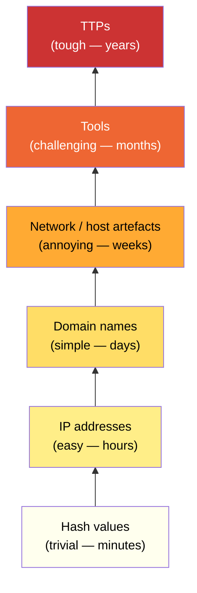
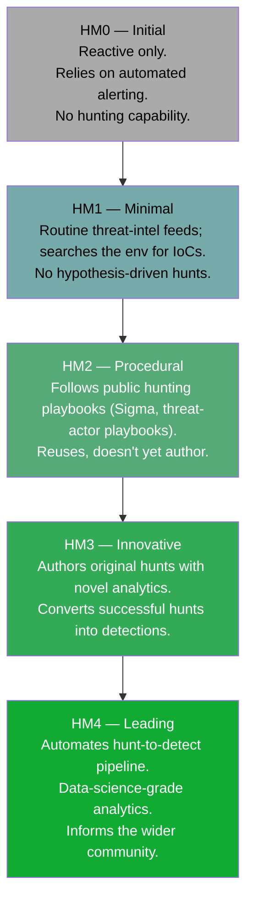
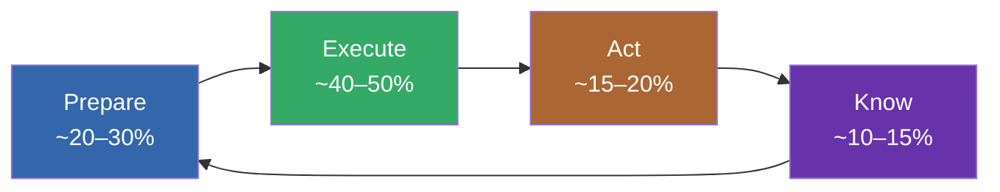
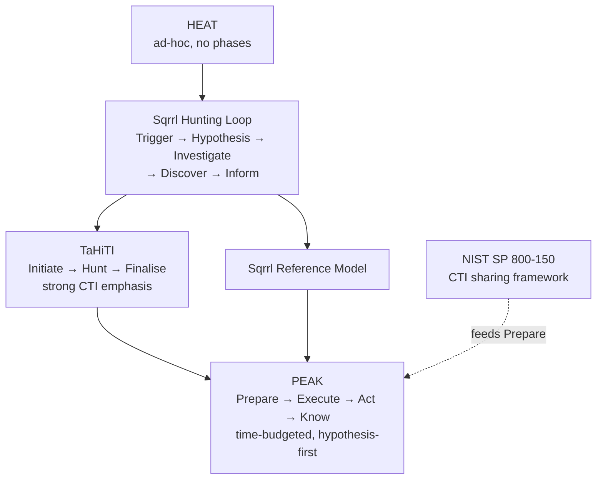
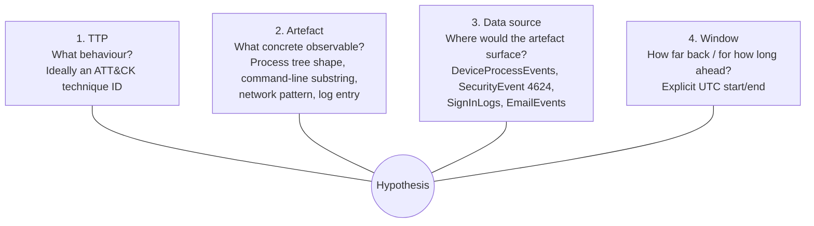
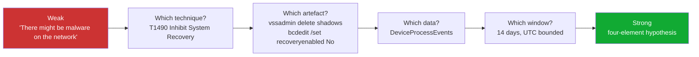
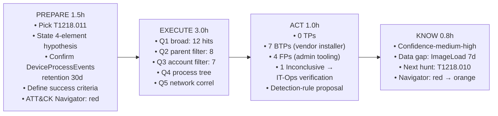
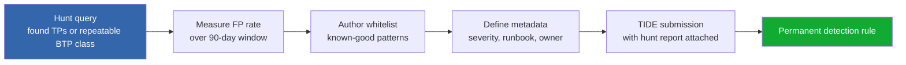
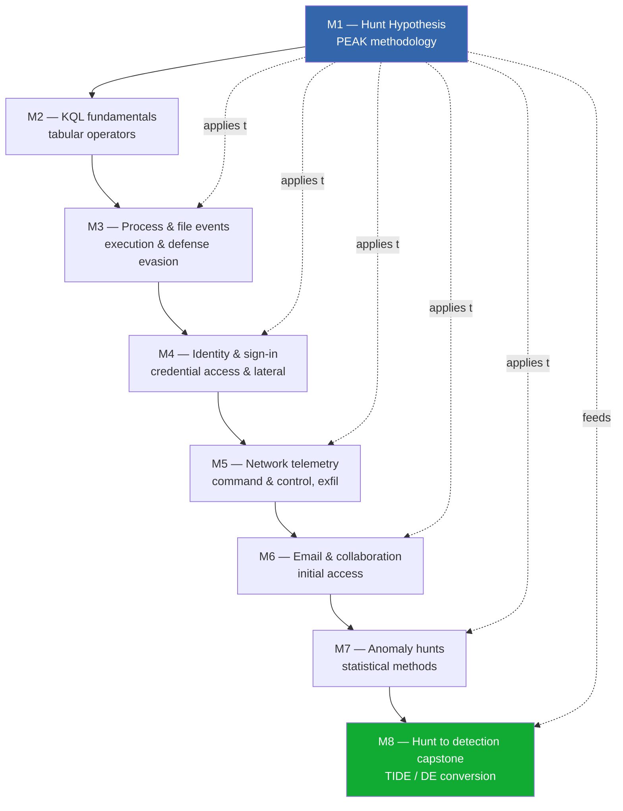
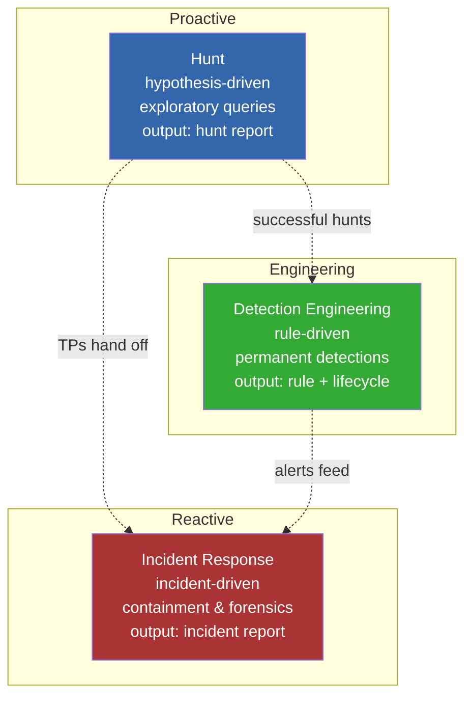

# L2 Threat Hunting — Module 1 Research Dossier

**The Hunt Hypothesis: PEAK methodology and hypothesis-driven hunting**

Audience: senior L1 / junior L2 SOC analyst. Has completed L1 *Alert Triage Fundamentals*. Reads KQL or SPL syntactically. Recognises ATT&CK technique IDs by sight. ~6 months on a SOC queue.

Depth bar: BTL1+ / SANS GCIH+ / SANS FOR578-equivalent. ~2,000–3,000 words per reading lesson plus quizzes.

Module map (8 lessons): R1 *Why hunt? The strategic frame* · R2 *PEAK end-to-end* · R3 *The hypothesis itself* · R4 *Documenting and learning from the hunt* · Q1–Q4 *mixed-kind quizzes after each reading*.

---

## Section 1 — Why hunt? The strategic frame

### 1.1 Detection alone isn't enough

Every SOC's detection layer — SIEM correlation rules, EDR analytics, NDR signatures, identity-provider risk policies — can only catch threats the team has already conceived of and engineered a rule for. That's the central limitation: a detection rule is a *hypothesis frozen in code*. Once written, it fires on the patterns it was authored to fire on, and it is silent on everything else.

L1 analysts work entirely *inside* the boundary of what has fired. Their queue is whatever the rules emit. Their job is high-throughput triage of a finite, known set of detection signatures.

L2 hunters work *outside* that boundary. The hunt's purpose is to look for adversary behaviour that no rule has caught yet — either because the rule doesn't exist, the rule was tuned away, the rule fires too noisily and was disabled, or the adversary's tradecraft is novel enough that it slipped through the analytics. Concretely, hunting:

- **Surfaces gaps in detection coverage** before a real adversary exploits them. Every gap is a free attack path until someone writes a rule.
- **Converts gaps into permanent detection rules** (closing the loop — Section 4 covers this in detail).
- **Builds analyst muscle memory** for the long-tail of ATT&CK techniques that don't fire frequently. An L1 who has only ever seen `T1059.001 PowerShell` from rule firings has weaker pattern recognition than an L2 who has hunted T1218 sub-techniques across 30 days of process-event data.
- **Provides defensible data points the CISO uses at year-end review.** "We hunted these 27 techniques in Q3. Here's our coverage layer. Here are the four detection rules born from those hunts." Hunt evidence translates directly into board-level coverage metrics.

The detection-only SOC is structurally blind to anything its rules don't fire on. Hunting is how the SOC sees with its own eyes.

There is a related framing worth giving the L2 explicitly. A common misreading among newer analysts is that hunting exists because the detection team is *bad at their job* — that if the rules were better, hunts would be redundant. This is wrong in a structural way. Detection rules are necessarily *backward-looking*: they encode patterns that have already been observed somewhere (in another org, in public reporting, in a previous incident). The space of possible adversary behaviours is open; the space of rules in production is closed and finite. No matter how skilled the detection team, the gap between those two spaces is the working surface of the hunting team. The two functions are *complementary*, not competing. A SOC that has no hunting capability is a SOC that accepts whatever portion of adversary behaviour falls outside its current rules.

The corollary the L2 should internalise: every successful hunt is *evidence the SOC is healthy*, not evidence the detection team failed. A SOC that runs a hunt against a technique and finds an active intrusion has discovered a real adversary that the detection layer didn't catch — but it has *also* discovered that its hunting layer works. That is two pieces of good news, not one piece of good news and one piece of bad news. Communicating this framing to leadership is part of the L2's work, because the alternative framing — "hunting found something the rules missed, ergo the rules are bad" — is corrosive to the detection team and ultimately to the SOC as a whole.

### 1.2 The dwell-time problem

Dwell time is the interval between an adversary's initial access and the defender's discovery of the intrusion. It is the single most important metric for understanding *why* hunting matters: a long dwell means the adversary has time to escalate, persist, exfiltrate, and destroy, and detection alone has failed to compress that interval.

The trend across the major incident-response retainer reports has been compression — and not because defenders are getting better. Two effects move in opposite directions:

- **Median dwell across all intrusion classes has fallen** from late-2010s figures of 60–90 days to 2023–2024 medians around 5–10 days. Mandiant's *M-Trends* reports document the decade-long compression curve.
- **Median dwell for ransomware-class intrusions specifically is much shorter** — often well under 24 hours from initial access to encryption deployment. CrowdStrike's *Threat Hunting Report* and Sophos's *Active Adversary Report* track this separately, and the eCrime "breakout time" (the interval between initial host compromise and lateral movement) has been measured in tens of minutes for the most operationally mature intrusion sets.

The reason median dwell looks shorter is that ransomware events self-disclose loudly when encryption fires. The cases where dwell is short are visible. The cases where dwell is long — espionage-grade tradecraft, supply-chain access, identity-provider compromise — are *invisible until something else trips the rule*. Hunting is the principal compensating control for the long-dwell cases that detection misses.

The L2 hunter's working prior is therefore: **dwell is short when the adversary is loud, and long when the adversary is quiet, and the quiet ones are the ones a hunt is most likely to surface.**

A second nuance: dwell-time medians describe central tendency, but the long-tail matters more. A SOC that catches the median ransomware intrusion at day 3 looks competent in the headline metric, but the long-tail intrusion that sat for 240 days as a quiet credential-replay foothold is the one that loses the company a board-level remediation budget. Hunting is asymmetrically valuable on the long-tail because the long-tail is, by definition, the cases the rules didn't catch. Reporting median dwell as the SOC's headline number flatters the SOC; reporting *p95 dwell* against the *cases the rules missed* tells a different story, and that story is the one hunting is structurally positioned to improve.

A third nuance specific to identity-tier intrusions: dwell on identity-provider compromises (Azure AD / Entra ID, Okta, Google Workspace) skews much longer than on endpoint-tier intrusions, because identity-tier telemetry is sparser and the attack surface is administered, not detected. Hunts in `SignInLogs`, `AuditLogs`, and `IdentityLogonEvents` for techniques like T1078.004 (Cloud Accounts), T1098 (Account Manipulation), and T1556.006 (MFA Bombing / fatigue) are the highest-leverage hunts a small SOC can run, because the rule coverage is structurally weaker and the adversary's stay is structurally longer.

> Annual sources to track: Mandiant *M-Trends* (released yearly); CrowdStrike *Global Threat Report* and *Threat Hunting Report*; Sophos *Active Adversary Report*; IBM/Verizon *Cost of a Data Breach* and *DBIR*. Dwell numbers shift year-on-year — cite the most recent figure when authoring the lesson.

### 1.3 Threat-informed defence and CTID

MITRE Engenuity's *Center for Threat-Informed Defense* (CTID) crystallised a doctrine that had been implicit in defender practice for years: **defenders should align their detection content and hunting effort with the techniques the adversaries that target their sector actually use.** Hunting random techniques in the absence of a threat profile is wasted effort; hunting techniques that your relevant adversary cluster prefers is the highest-leverage activity in the SOC.

Two practical CTID artefacts the L2 should know:

- **The Top Techniques calculator** at `top-attack-techniques.mitre-engenuity.org` — given organisation context (sector, OS mix, telemetry, security controls), surfaces a ranked list of ATT&CK techniques most likely to matter. Useful as an input to the *Prepare* phase of PEAK.
- **The Adversary Emulation Library** — open-source emulation plans (FIN6, APT29, OilRig, etc.) that describe the techniques and tooling for specific named adversaries, suitable both for purple-team exercises and as templates for threat-actor-based hunts (Section 3).

The doctrine generalises: don't hunt blind. Hunt *informed*.

### 1.4 The Pyramid of Pain reframed for hunters

David Bianco's *Pyramid of Pain* (2013) was originally a triage taxonomy: where on the pyramid does this IOC sit? L1 analysts learned it that way in the IOC Handling module. The L2 hunter learns it as a *priority surface* for hunting effort.



For triage, the bottom of the pyramid is fine — block a hash, block an IP. For hunting, the priority inverts:

- A hunt at the **hash level** is cheap to author and obsolete in a week. The adversary recompiles.
- A hunt at the **TTP level** is expensive to author (it requires understanding adversary behaviour, not just IOCs) but durable for years. Forcing a TTP detection compels the adversary to re-engineer their tradecraft, which is the most expensive thing you can make them do.

L2 hunting effort therefore concentrates at the **top three layers** of the pyramid. Hash-level hunts are reserved for current-incident response, not general hunting.

The reframing has a practical implication for query authoring. A hash-level hunt query is one line — `where SHA256 in (list)`. A TTP-level hunt query is *the artefact of the hunt itself* — it captures the adversary behaviour as a pattern, often spanning multiple data sources, multiple events, and a temporal join. The query is harder to write, but it survives the adversary recompiling, re-hosting, and renaming. The L2's craft, more than anything else, is the ability to write TTP-level queries that are tight enough to be useful and loose enough to catch variants. Modules 3 through 7 of L2 teach this craft tactic-by-tactic; Module 1 teaches *why it's worth the effort*.

### 1.5 Hunt vs incident response

Hunts and IR investigations look superficially similar — a senior analyst running queries against telemetry — but they differ in three structural ways:

| Axis | Hunt | Incident response |
|---|---|---|
| Trigger | Hypothesis | Alert / report / declared incident |
| Stance | Proactive | Reactive |
| Disposition | Convert finding to either FP-class, BTP-class, or *new* incident handed to IR | Close the existing incident |
| Timebox | Soft (PEAK time-budgets) | Hard (incident SLA, exec reporting) |
| Output artefact | Hunt report + (optionally) detection-rule proposal | Incident report + lessons learned |

The disposition rule matters: when a hunt finds a true positive that warrants response, **the hunt ends and an incident begins.** The hunter does not continue to "hunt on the incident" — that's IR's job, with chain-of-custody and containment workflows the hunt isn't structured for. The hunt report references the new incident ID and closes.

### 1.6 Hunt vs detection engineering

Detection engineering (DE) is the discipline of converting *successful* hunts into *permanent* rules. Two failure modes the L2 must avoid:

- **Authoring detections during a hunt.** Tempting — the query is right there, surely just save it as a rule? But hunts run against historical data with the analyst's eye on every result; a permanent rule fires unattended and needs FP-rate measurement, whitelist, severity, runbook, owner. Section 4.4 covers the hand-off.
- **Hunting using detection-engineering metrics.** Hunts don't fail because they have a 10% FP rate; rules do. A hunt query with 100 results, manually triaged, that finds one TP is a *win*. Don't import DE quality bars into hunt-time.

The clean separation: **the hunt produces the *idea*; detection engineering produces the *rule*.** TIDE (or your DE pipeline) is the hand-off mechanism.

### 1.7 The Hunting Maturity Model

David Bianco's *Hunting Maturity Model* (Sqrrl Data Inc., 2015) is the canonical maturity assessment for a SOC's hunting capability. Five tiers, recognise the boundaries:



Most SOCs sit between HM1 and HM2. Moving to HM3 — *original* hunts with *novel* analytics, and a working pipeline to convert findings into detections — is what L2 hunters individually unblock. The skill differential between an HM2 SOC and an HM3 SOC is captured almost entirely in the L2's ability to (a) author strong hypotheses, (b) execute the PEAK loop, and (c) document negatives credibly.

### 1.8 L2's career-defining skill

L2 hunting is the inflection point in the analyst career arc. The L1 reacts. The L2 hunts. The IR analyst contains. The detection engineer codifies. The threat-intel analyst frames. Hunting is the skill that builds the mental model for *all the downstream roles* — IR (because hunters know what adversary behaviour looks like in raw telemetry), DE (because hunts feed DE), threat intel (because hunts test intel hypotheses), red team (because hunters know what to look for, and therefore what to hide). Investing in L2 hunting compounds across roles in a way no other intermediate skill does.

There is a second-order argument worth making explicitly to the L2 student. The L1 queue is finite. On any given shift, the work-shape is bounded by the rules' fire rate, the ticket SLA, and the day's incident posture. The L2 hunt has no equivalent ceiling; the work expands to fill the depth of the analyst's curiosity and the breadth of the telemetry. Analysts who do not develop their own hunting agenda find that the queue continues to define their career — they get *better* at L1 work, not different. Analysts who develop a hunting practice early find that their own questions begin to drive the team's roadmap. By year two of an L2 role, a strong hunter is recognised not for ticket throughput but for the detection-rule corpus they have authored, the data gaps they surfaced, and the techniques they took from red coverage to green. That recognition is the visible portion of a career inflection that started invisibly in Module 1 of this course.

A third reason hunting matters is *epistemic hygiene*. The L1 mode is *responsive* — the rule fires, the analyst checks the boxes, the verdict goes in. The L2 hunt mode is *interrogative* — the analyst asks "what would I expect to see if X were true?" and writes the query. That shift from response to interrogation is the single most important cognitive move in the analyst career, and it generalises beyond security into incident management, ops engineering, and applied research. The PEAK loop is, structurally, a small applied-science loop: hypothesis, observation, disposition, retrospective. Practising it builds a habit of mind that is portable.

---

## Section 2 — The PEAK methodology end-to-end

PEAK = **Prepare → Execute → Act → Know.** Authored by Splunk's SURGe team, published 2023. Designed as a successor to the Sqrrl Hunting Loop (Bianco, 2015) and TaHiTI (ABN AMRO / Rabobank, 2018), with cleaner phase separation, explicit time-budgeting, and first-class treatment of the hypothesis as a versioned artefact.



### 2.1 Prepare

Prepare is the planning phase. Done well, it makes the rest of the hunt cheap; done badly, the hunter ends up running queries with no idea what they're looking for.

Activities:

- **Pick the hunt topic.** Inputs include recent threat intelligence (a fresh CTI report on a relevant adversary), an unusual incident debrief (a new TTP observed), a coverage gap visible on the team's ATT&CK Navigator layer, a regulatory or sector concern (a CVE in your edge appliance fleet), or simply a scheduled rotation through high-priority techniques.
- **State the hypothesis** using the four-element template (Section 3). The hypothesis is the artefact that gets reviewed, criticised, and versioned through the hunt.
- **Identify the data sources.** What tables, indices, log streams will the hunt query? Confirm coverage and retention. *Logging gaps surface here* — many hunts end before Execute because the data the hypothesis requires doesn't exist.
- **Define success.** What concrete artefact would confirm the hypothesis? What would refute it? An honest answer to "what would I conclude if I find nothing?" lives here.
- **Choose the time window** explicitly in UTC, with both start and end. *"30 days back"* is sloppy; *"2026-03-29 00:00 UTC to 2026-04-28 00:00 UTC"* is correct.
- **Document intent.** What ATT&CK techniques are in scope? What's the disposition pathway for findings? Who reviews?

Time budget: **20–30%** of the hunt. Yes, that much. The deeper Prepare is, the cheaper Execute becomes.

### 2.2 Execute

Execute is where the queries run. The discipline is *iteration with audit trail*.

Activities:

- **Translate the hypothesis to queries.** Usually KQL (Defender Advanced Hunting / Sentinel), SPL (Splunk), or EQL (Elastic). The first query is broad — usually the four-element artefact converted directly to a filter. Subsequent queries narrow.
- **Pivot from discovery to enrichment to investigation.** A hunt is a tree, not a list. Each interesting result spawns enrichment queries (who owns this host? when was this account created? what else has this process touched?) and cross-data-source joins (process event → file write → network connection).
- **Capture every meaningful query and intermediate finding.** The hunt notes are the audit trail. They matter for the retro (Know phase), for the hand-off if the hunt converts to an incident (chain-of-custody), and for the next hunter who reuses the work.

Time budget: **40–50%** of the hunt.

A worked broad-to-narrow KQL example for a Rundll32 javascript hunt against Defender Advanced Hunting:

```kusto
// Broad — every Rundll32 with javascript: in the command line, last 30 days
DeviceProcessEvents
| where Timestamp >= ago(30d)
| where FileName =~ "rundll32.exe"
| where ProcessCommandLine has "javascript:"
| project Timestamp, DeviceName, AccountName,
          ProcessCommandLine, InitiatingProcessFileName,
          InitiatingProcessCommandLine
| order by Timestamp desc

// Narrowed — exclude known admin patterns and signed installer launchers
DeviceProcessEvents
| where Timestamp >= ago(30d)
| where FileName =~ "rundll32.exe"
| where ProcessCommandLine has "javascript:"
| where InitiatingProcessFileName !in~ ("msiexec.exe", "setup.exe", "installutil.exe")
| where AccountName !startswith "svc_" and AccountName !startswith "admin_"
| project Timestamp, DeviceName, AccountName,
          ProcessCommandLine, InitiatingProcessFileName,
          InitiatingProcessCommandLine

// Enrichment — for each survivor, pull the parent process tree
DeviceProcessEvents
| where Timestamp between (ago(30d) .. now())
| where DeviceName in ("HOST-A", "HOST-B")
| where InitiatingProcessFileName =~ "rundll32.exe"
   or FileName =~ "rundll32.exe"
| project Timestamp, DeviceName, AccountName,
          ProcessId, ParentProcessId, FileName, ProcessCommandLine,
          InitiatingProcessId, InitiatingProcessFileName,
          InitiatingProcessCommandLine
| order by DeviceName, Timestamp asc
```

### 2.3 Act

Act is the disposition phase. Every result from Execute lands in one of five buckets:

- **True positive (TP)** — confirmed adversary behaviour. Hand off to IR with a hunt-discovered tag (Section 5 — ION's hunt-tagged case path).
- **Benign true positive (BTP)** — the rule's logic fired for a real reason that turned out to be benign. Record the disposition. If a class of BTPs recurs across hunts, refine the hypothesis or flag for whitelist when the hunt converts to a rule.
- **False positive (FP)** — the rule's logic fired on something that wasn't even the behaviour described. Refine the query.
- **Inconclusive** — needs out-of-band verification (change-ticket lookup, owner contact, vendor verification). Move to a side-queue with an explicit follow-up owner; don't let it fall on the floor.
- **No findings** — the hunt's negative result. Document confidence (Section 4.2).

Activities at the end of Act:

- TP → IR handoff packet, with hunt report attached.
- Successful hunt → propose detection-rule conversion (TIDE / DE — Section 4.4).
- Negative-result hunt → write the confidence-on-absence statement.
- All hunts → finalise the hunt report.

Time budget: **15–20%** of the hunt.

### 2.4 Know

Know is the retrospective. The activity that, more than any other, distinguishes HM3 SOCs from HM2 SOCs.

Activities:

- **Retro on the hunt.** What worked? What didn't? What data was missing? What query patterns are reusable?
- **Update the team's knowledge.** Hunt-report repository entry. ATT&CK Navigator coverage layer update (red → orange → green, Section 4.5). Sigma rule submission if the analytic is shareable.
- **Feed the next hunt's Prepare.** Each Know phase produces a "what I'd hunt next" line. That line is the seed of the next hunt's topic-pick.

Time budget: **10–15%** of the hunt.

### 2.4a A note on iteration within phases

PEAK is sometimes drawn as four discrete phases marching forward — Prepare, then Execute, then Act, then Know — but the lived experience of a hunt is more iterative. Mid-Execute, an analyst frequently discovers that the data source they planned to use lacks a field they need, and has to re-enter Prepare briefly to revise the hypothesis or pick a different source. Mid-Act, a single inconclusive finding may demand a fresh Execute pass to enrich it before disposition. Mid-Know, a retro insight may surface a follow-up question that triggers an immediate sub-hunt rather than waiting for a fresh Prepare cycle.

The discipline is *not* to refuse iteration — that produces brittle hunts — but to **track which phase you're in** at each moment, so the time budget remains visible. If a hunt that was supposed to spend 1.5 hours in Prepare has spent 4, the analyst should notice and either commit to the deeper Prepare (and replan the hunt's scope) or cut and proceed with what's known. The percentages above are guidance, not a contract; the *visibility* of the time spent is what matters.

A related point: PEAK is not the only valid pacing for a hunt. *Sprint hunts* — 90-minute timeboxes for specific high-value, narrow-scope hypotheses — are increasingly common in mature SOCs, especially in response to fresh threat intelligence ("CVE dropped 40 minutes ago, hunt the edge fleet now"). Sprint hunts compress all four PEAK phases into a single sitting, with the hunt report written immediately after. They are not a different methodology; they are PEAK at a different scale. The L2 should recognise the pattern when their on-call shift demands it.

### 2.5 Compare to older models

PEAK is not the first methodology. Knowing its predecessors lets the L2 read older runbooks and adapt:

- **HEAT (Hunt Evil Advanced Techniques).** Early ad-hoc model from the SANS/community circuit. No formal phase split. Mostly a vocabulary.
- **Sqrrl Hunting Loop** (Bianco, 2015). The 2015 predecessor: *Trigger → Hypothesis → Investigate → Discover → Inform.* Strongly hypothesis-centred but lacks PEAK's explicit retrospective and time-budget discipline. Implicitly assumes hunts find something — has no native treatment of the negative-result case.
- **TaHiTI (Targeted Hunting integrating Threat Intelligence).** Dutch ABN AMRO and Rabobank methodology, 2018. Three phases (*Initiate → Hunt → Finalise*) with very strong threat-intelligence side: emphasises the receive-side from a CTI team feeding the hunt agenda. PEAK's *Prepare* phase generalises TaHiTI's *Initiate*.
- **Sqrrl Cyber Threat Hunting Reference Model.** Direct predecessor to PEAK; Sqrrl's framework before Splunk acquired Sqrrl in 2018 and the SURGe team eventually published PEAK.
- **NIST SP 800-150 — *Guide to Cyber Threat Information Sharing*.** The receive-side intelligence framework that feeds Prepare. Defines how a SOC structures the consumption of external threat intel into actionable artefacts. The hunting team is one of 800-150's named consumers.

Where PEAK improves on its predecessors:

- **Cleaner phase split** with explicit time-budgeting (the percentages above are PEAK's own guidance).
- **Hypothesis becomes a first-class artefact** — versioned, criticisable, comparable across hunts.
- **Know phase makes negative results valuable.** Sqrrl's *Inform* is the closest analogue, but PEAK's framing of "confidence on absence" is sharper.
- **Compatible with detection-engineering hand-off** via TIDE / Sigma. PEAK's *Act* phase explicitly names the conversion step.



---

## Section 3 — The hypothesis: what makes one hunt-able

Everything in Sections 1 and 2 leads here. The hypothesis is the unit of work for a hunt. A strong hypothesis makes the hunt cheap and conclusive; a weak one wastes the team's day.

### 3.1 The four-element template



A *strong* hypothesis names all four. A *weak* one elides at least one — usually the data source or the window.

### 3.2 Worked good vs weak hypotheses

**Good (strong four-element):**

> *In the past 30 days, an adversary has used T1218.011 (Rundll32) with `javascript:` as the command to execute remote scriptlets on at least one endpoint, observable in `DeviceProcessEvents` where `FileName == "rundll32.exe"` and `ProcessCommandLine` contains `"javascript:"`.*

This hypothesis is queryable in one line of KQL. The yes/no answer falls out of the query. The window is bounded. The technique is specified. The observable is concrete.

**Weak:**

> *There might be malware on the network.*

Every element is missing. There is no possible query that proves or refutes this. Hunting begins by *not accepting weak hypotheses*.

**Rewrite:**

> *In the past 14 days, ransomware-affiliate behaviour matching T1490 (Inhibit System Recovery) has occurred on at least one server, observable in `DeviceProcessEvents` where `vssadmin delete shadows` or `bcdedit /set recoveryenabled No` runs.*

Now it's hunt-able.



### 3.3 SMART-style criteria

A strong hypothesis is **S**pecific, **M**easurable, **A**dversary-relevant, **R**ealistic given data, **T**ime-bounded.

- **Specific.** Names the technique, the artefact, the data source. *"Lateral movement"* fails specificity; *"T1021.002 SMB/Windows Admin Shares with anomalous `AccountName` accessing `\\hostname\C$`"* passes.
- **Measurable.** Has a clear yes/no answer when the data is queried. The query returns rows or it doesn't. Subjective measures ("might be suspicious") fail.
- **Adversary-relevant.** The technique appears in the threat profile of adversaries that target your sector. Hunting T1059.005 VBScript on a fleet that's 100% Linux is adversary-irrelevant. CTID's Top Techniques calculator is the input here.
- **Realistic given data.** The data source actually exists and has retention covering the window. Hunting 90 days back when retention is 30 fails realism. Hunting `SecurityEvent` 4688 when command-line auditing isn't enabled fails realism.
- **Time-bounded.** Explicit UTC start/end. *"Recently"* fails; *"2026-03-29 to 2026-04-28 UTC"* passes.

### 3.4 Hypothesis types

There is no single canonical taxonomy in the literature, but five hypothesis families recur consistently across SURGe, TaHiTI, and SANS FOR578 material:

| Type | Definition | Example seed |
|---|---|---|
| **TTP-based** | Pick a technique from ATT&CK and hunt for it. Most common. | "Hunt T1218.011 over 30 days." |
| **Anomaly-based** | Hunt for statistical deviation: rare-process, rare-domain, beacon-shape, longest-DNS-name-by-host. | "Surface processes seen on ≤3 hosts in the last 7 days." |
| **Situational-awareness** | Current-event-relevant patterns: a fresh CVE, a leaked zero-day, a sector incident. | "After CVE-2026-XXXX disclosure, hunt for exploitation indicators on edge appliance fleet." |
| **Threat-actor-based** | Pick a known adversary cluster, pull their ATT&CK Navigator layer, hunt for techniques they prefer that you don't have detections for. | "Hunt FIN12's preferred T1486 / T1490 / T1027 chain across last 14 days." |
| **Custom-detector-based** | Hunt for behaviour one of your team's homegrown detection ideas would have caught — *before* authoring the rule, to validate base rate and FP shape. | "Hunt for the candidate detection 'PowerShell with -enc and parent of winword.exe' over 30 days; measure FP rate; convert to rule if viable." |

Each type has a different sweet spot in the PEAK loop. TTP-based hunts plug directly into the four-element template. Anomaly-based hunts require a baselining step in Prepare. Threat-actor-based hunts demand a Navigator-layer cross-walk between adversary techniques and existing coverage.

A few worked examples by type to make the distinctions concrete:

- **TTP-based.** *"In the last 30 days, T1003.001 (LSASS Memory) has produced a process-access event with 0x1010 or 0x1410 access mask against `lsass.exe` from a non-protected-process source on at least one endpoint, observable in `DeviceEvents` ActionType `OpenProcessApiCall`."* Specific, concrete, queryable in one statement.
- **Anomaly-based.** *"In the last 7 days, a process invocation has occurred on no more than 3 endpoints and is not present in the trailing 90-day baseline; the rare process is not signed by an enterprise-known publisher."* This requires baseline construction in Prepare — usually a 90-day rollup of `DeviceProcessEvents` keyed by `SHA256` or `(FileName, IssuerName)` — before Execute can run.
- **Situational-awareness.** *"In the 14 days since CVE-2026-1234 disclosure on Vendor X edge appliance, exploitation indicators (POST to /admin/exec, UA strings matching the public PoC, outbound to known scanner IPs) have appeared in `DeviceNetworkEvents` against any host in the edge-appliance address group."* The hypothesis is bounded by the disclosure date, the vendor, and the disclosed exploitation pattern.
- **Threat-actor-based.** *"Cluster FIN7's preferred chain — T1566.001 spear-phishing attachment → T1059.005 VBScript → T1547.001 Run-key persistence → T1071.001 web protocols C2 — has executed on at least one endpoint in the last 21 days, observable across `EmailEvents`, `DeviceProcessEvents`, `DeviceRegistryEvents`, and `DeviceNetworkEvents`."* The hunt becomes a multi-data-source query joined on `DeviceId` and time, and the disposition criteria require the *chain* to be present, not any single step.
- **Custom-detector-based.** *"Candidate detection 'PowerShell -enc with parent winword.exe' will fire on at least one endpoint in the last 30 days; FP rate measurable against `DeviceProcessEvents`; baseline benign explanations enumerated."* The output is FP-rate measurement and a tuned detection-rule submission, not a TP/BTP triage list.

The taxonomy is not exhaustive — research-grade hunting (often called "discovery hunting") sits orthogonally to all five types and is sometimes treated as a sixth — but the five above cover the working agenda of an L2 in their first year.

### 3.5 The hypothesis-criticism step

Before Execute, every hypothesis goes through criticism. Four questions, asked aloud or in the hunt notes:

1. **Is the data source likely to have what we need at the resolution we need?** Process events exist; do they include command line? Sign-in events exist; do they include the IP? Network flow exists; does it include SNI?
2. **What's the FP base rate on the artefact we're looking for?** `whoami` runs everywhere, every minute, on every endpoint — hunting for raw `whoami` invocations is a noise generator. `nltest /domain_trusts` is rare and runs almost exclusively in adversary discovery sequences. Knowing the base rate is the difference between a useful hunt and an unreadable one.
3. **What variant escapes our query?** Adversary obfuscation (PowerShell `-enc`, escape characters, alternative tools), case variation, path-prefixed invocations, signed-binary proxies. Enumerate the variants you *won't* catch — they go in the residual-uncertainty statement (Section 4.2).
4. **What's our null hypothesis?** What would we conclude if we found nothing? "No findings + 95% endpoint coverage + 30-day retention + reliable telemetry → confidence-medium that this technique is not active." If you can't articulate what null means, you can't write the negative-result statement, and the hunt's value is asymmetric (only valuable if it finds something).

A hypothesis that survives criticism is hunt-able. A hypothesis that doesn't goes back to Prepare for refinement.

### 3.6 Failure modes in hypothesis authoring

Three patterns recur in hunt reviews. The L2 should recognise them in their own work:

- **Hypothesis-as-keyword.** *"Hunt for `mimikatz`."* The analyst writes a string match and calls it a hypothesis. There's no technique mapping, no artefact specification beyond the string, no statement of what the query is meant to *prove*. The query runs, returns 0 hits because every modern operator renames or reflectively-loads, and the analyst writes "no findings." Nothing was learned. Fix: state the technique (T1003.001 LSASS dump, for example), enumerate at least three artefact families (process invocation, process access with `0x1010`/`0x1410` rights to lsass.exe, MiniDumpWriteDump signatures), specify the data sources, then query.
- **Hypothesis-as-tool-list.** *"Hunt for `psexec`, `wmic`, `at.exe`, `schtasks`."* Closer to a hypothesis but still wrong. A list of tools is not an artefact specification; it conflates lateral movement (T1021), execution (T1059, T1569), and persistence (T1053). Each tool needs its own four-element treatment, because the FP base rate, parent-process expectations, and disposition pathway differ.
- **Hypothesis-as-fishing-trip.** *"Look for anomalies in process events."* No technique, no artefact, no measurable answer. This is exploratory data analysis, which is a legitimate activity *but is not a hunt* — it produces no negative-result statement, no Navigator update, and no rule candidate. Fix: turn the EDA into a baseline study with its own report (a *baseline study* is a valid Prepare output), then derive specific four-element hypotheses from the baseline's outliers.

Recognising these three failure modes in the *next analyst's* hypothesis is the reviewer-grade skill. Recognising them in *your own* hypothesis is the hunter-grade skill. The reviewer column in the hunt-report template (Section 4.1) exists to enforce both.

---

## Section 4 — Documenting and learning from the hunt

### 4.1 The hunt-report template

Every hunt produces a structured report. The L2 fills out the template *for every hunt*, including the ones that find nothing. The report is the artefact that travels — to the retro, to detection engineering, to the next hunter who picks up the same technique six months later.

```
HUNT REPORT

Hunt ID:        H-2026-0042
Title:          Rundll32 javascript abuse — 30 day TTP hunt
Hunter:         analyst@example.org
Reviewer:       senior-analyst@example.org

HYPOTHESIS (verbatim, four-element):
  In the past 30 days, an adversary has used T1218.011 (Rundll32) with
  javascript: as the command to execute remote scriptlets on at least one
  endpoint, observable in DeviceProcessEvents where FileName == "rundll32.exe"
  and ProcessCommandLine contains "javascript:".

Hypothesis type:    TTP-based
ATT&CK mapping:     TA0005 Defense Evasion / T1218 / T1218.011
Data sources:       DeviceProcessEvents (Defender Advanced Hunting)
                    DeviceImageLoadEvents (used for enrichment)
Window:             2026-03-29 00:00 UTC → 2026-04-28 00:00 UTC

QUERIES RUN:
  Q1 — broad pattern match. Result count: 12.
  Q2 — exclude msiexec/setup/installutil parents. Result count: 8.
  Q3 — exclude svc_* and admin_* accounts. Result count: 7.
  Q4 — process-tree enrichment for survivors. Result count: 7 trees.
  Q5 — DNS/network correlation by DeviceId/Timestamp. Result count: 0
       outbound to non-corporate domains.
  (queries archived in attached notebook hunt-H-2026-0042.kql)

FINDINGS:
  TPs:           0
  BTPs:          7  (outdated installer scriptlets — 6 hosts running an
                    old vendor installer that legitimately uses rundll32
                    javascript: as a launcher)
  FPs:           4  (admin tooling matched by Q1 but excluded by Q2)
  Inconclusive:  1  (proxy-tool deployment on HOST-X paired with change
                    ticket CHG-2026-1187; awaiting IT-Ops confirmation)

VERDICT ON HYPOTHESIS:    refuted (no TPs)
CONFIDENCE ON NEGATIVE:   medium-high
  — coverage 96% endpoints (4 hosts off-domain, see gap below)
  — 30-day retention confirmed across both data sources
  — query variants tested: case-insensitive, alt path prefix, embedded space
  — residual uncertainty: cannot exclude T1218.011 via:
    (a) renamed rundll32 binary
    (b) reflective-load alternatives invoking the same com objects
    (c) the 4 off-domain hosts where DeviceProcessEvents is sparse

ACTION ITEMS:
  - Detection rule proposal: H-2026-0042-DR (rundll32 javascript launcher
    with whitelist for VENDOR_X installer hashes).
  - Data gap: DeviceImageLoadEvents retention is 7 days; raise to 30.
  - Follow-up hunt: T1218.010 regsvr32 /i: scriplet abuse — same pattern
    family.

TIME SPENT BY PHASE:
  Prepare:  1.5h   (24%)
  Execute:  3.0h   (47%)
  Act:      1.0h   (16%)
  Know:     0.8h   (13%)
  Total:    6.3h
```

The template forces explicitness on every dimension that matters — the hypothesis is verbatim, the queries are archived, the disposition is bucketed, the negative is quantified, the next hunt is seeded.

### 4.2 The negative-result problem

Hunts that find nothing are valuable. Hunts that find nothing *and are documented as if they found nothing valuable* are not.

The shape of the failure is predictable: an analyst runs a hunt, finds zero TPs, writes a one-line note saying "no findings," and the hunt is read by management as wasted effort. Over time, the SOC's hunting cadence shrinks because hunts are perceived as low-yield. The HM3 muscle never develops.

The L2's discipline against this failure is the **confidence-on-absence statement**. Three components:

1. **Quantify the negative.** *"Hunted T1218.011 across 96% of endpoints (4 of 4,300 hosts off-domain), 30-day retention, queries Q1–Q5 captured. Q1 broad query produced 12 intermediate results; Q2–Q3 narrowed to 7 BTPs; Q4 enrichment confirmed BTP class; Q5 network correlation produced no outbound C2 indicators."*
2. **Quantify the data confidence.** *"Data source coverage at 96% endpoints; 30-day retention confirmed; technique fingerprint reliably surfaces in DeviceProcessEvents per Microsoft documentation and prior hunt H-2025-0119."*
3. **State the residual uncertainty.** *"This hunt does not exclude T1218.011 manifesting via: renamed binary; reflective COM-object load; the 4 off-domain hosts. Variants suggested for follow-up hunt H-2026-0043."*

A hunt with that statement attached is *not* a wasted day. It's a measured reduction in the search space, a documented data gap, and a seed for the next hunt. That's HM3 output.

There's also a communication discipline embedded in the negative-result statement that deserves explicit treatment. When a senior leader — a CISO, a SOC director, a board member — reads "no findings," they substitute a default interpretation; if the analyst hasn't supplied one, the default is "wasted." The L2's confidence-on-absence statement *substitutes a better default*: "we measured how loudly this technique would announce itself in our telemetry, and across that measurement window we did not see it; here is what that means and does not mean." That sentence is a different category of artefact from "no findings." It survives translation up the chain because it's quantitative, bounded, and honest about residual uncertainty. Practising the statement on small hunts builds the muscle for the eventual high-stakes case where the L2 must explain to a board that *the absence of evidence is not evidence of absence, but here is the bound on what we can say*. Cybersecurity is one of the rare disciplines where stating absence with calibrated confidence is itself a deliverable; the L2 hunt is the everyday venue for practising the skill.

A second pattern worth naming: **the false-confidence trap.** A hunter runs a beautifully scoped query, finds 0 hits, writes "confidence-high on absence," and moves on. Two weeks later, IR finds the technique active on a host outside the hunt's scope, and the hunt report becomes a liability — not because the hunt was wrong but because the confidence was over-claimed. The discipline is to state confidence in *bounded* terms: not "we don't have this," but "across endpoints with full DeviceProcessEvents coverage, with the variants we tested, in the window we tested, we did not find it." The list of exclusions in the residual-uncertainty statement is what makes confidence defensible. A confidence statement without exclusions is a hostage to fortune.

### 4.3 Worked end-to-end PEAK scenario: T1218.011 Rundll32 javascript

The template above came from this scenario. Here it is as the full PEAK loop:



**Prepare (1.5h).** Topic comes from a CTI report on a financially-motivated cluster using `mshta.exe` and `rundll32.exe javascript:` as initial-access launchers. Hypothesis stated four-element. Data source confirmed: `DeviceProcessEvents` exists, has command line, retention 30 days. Defines success: "any process event matching the artefact pattern, after exclusions, with no benign explanation." Window: 2026-03-29 00:00 UTC → 2026-04-28 00:00 UTC. Navigator coverage layer cell for T1218.011 currently red (no detection, no prior hunt).

**Execute (3.0h).** Query iteration:

```kusto
// Q1 — broad
DeviceProcessEvents
| where Timestamp >= datetime(2026-03-29) and Timestamp < datetime(2026-04-28)
| where FileName =~ "rundll32.exe"
| where ProcessCommandLine has "javascript:"
| project Timestamp, DeviceName, AccountName,
          ProcessCommandLine, InitiatingProcessFileName,
          InitiatingProcessCommandLine
// 12 rows

// Q2 — exclude installer parents
... | where InitiatingProcessFileName !in~
    ("msiexec.exe","setup.exe","installutil.exe","wusa.exe")
// 8 rows

// Q3 — exclude service / admin accounts
... | where AccountName !startswith "svc_"
    and AccountName !startswith "admin_"
// 7 rows

// Q4 — process-tree enrichment for the 7 survivors
DeviceProcessEvents
| where Timestamp between (datetime(2026-03-29) .. datetime(2026-04-28))
| where DeviceId in (suspect_devices)
| project Timestamp, DeviceName, AccountName,
          ProcessId, ParentProcessId, FileName, ProcessCommandLine,
          InitiatingProcessId, InitiatingProcessFileName,
          InitiatingProcessCommandLine
// → identifies all 7 as VENDOR_X installer chain

// Q5 — outbound network correlation
DeviceNetworkEvents
| where Timestamp between (datetime(2026-03-29) .. datetime(2026-04-28))
| where DeviceId in (suspect_devices)
| where InitiatingProcessFileName =~ "rundll32.exe"
| where RemoteUrl !endswith ".vendorx.com"
   and RemoteIPType == "Public"
// 0 rows — no non-vendor public-IP egress
```

**Act (1.0h).** Disposition:

- 0 TPs.
- 7 BTPs — VENDOR_X installer pattern. All seven hosts ran the same outdated installer (build 4.2.1) which uses `rundll32.exe javascript:` as a launcher. Asset confirms via VENDOR_X documentation and matches the InitiatingProcessSHA256 across all seven. Patch ticket raised with IT-Ops to push the newer build that doesn't use this pattern.
- 4 FPs — admin tooling that matched Q1 but is excluded by Q2 (the four were genuinely msiexec children).
- 1 Inconclusive — HOST-X has a `rundll32.exe javascript:` event paired in time with change ticket CHG-2026-1187 for a proxy-tool deployment. The proxy-tool vendor is not VENDOR_X. Escalated to L2 ticket queue with a request for IT-Ops verification of the change ticket's actual deployment script. Owner assigned. Ticket: ION-Hunt-H-2026-0042-INC-1.

**Know (0.8h).** Verdict: hypothesis refuted. Confidence-medium-high. Data gap discovered: `DeviceImageLoadEvents` retention is 7 days, which limits a planned follow-up hunt for COM-object load alternatives. Action: raise retention to 30 days (capacity question for SecOps). Next hunt: T1218.010 (`regsvr32 /i:`) — same family, same telemetry, expect similar BTP base rate from installer chains. Navigator coverage layer for T1218.011 updated red → orange (hunting coverage, no detection rule yet); will go green once H-2026-0042-DR is shipped.

### 4.4 Converting a successful hunt to a detection rule

(Preview of L2 Module 8 — *Hunt to Detection Capstone*.) When a hunt confirms a TTP — or, more often, when a hunt finds a recurring BTP class that warrants ongoing monitoring even if no TPs surfaced — the hunt query becomes a candidate detection rule. *Candidate*, not rule. The conversion is gated:



Five gates:

1. **Establish FP rate via a broader-window query.** Run the hunt query unfiltered over 90 days. Count expected-benign matches per day. If the rule would fire 200x/day, it's not a rule yet — it's a tuning project.
2. **Author whitelist filters** for known-good patterns identified during the hunt's BTP triage. The VENDOR_X installer chain from H-2026-0042 goes in the whitelist.
3. **Define metadata** the rule needs to function unattended: severity (low/medium/high/critical), response runbook (the L1 playbook the analyst follows on fire), owner team (who maintains the rule), data source dependency (so it's removed if the data source breaks).
4. **Submit through TIDE** (or your DE pipeline). The hunt report is attached to the submission for review context.
5. **Lifecycle.** The rule is reviewed quarterly. FP-rate drift is tracked. Sunset criteria are defined.

The L2 doesn't necessarily own all five gates — gate 5 is usually DE's responsibility — but the L2 owns the *quality of the hand-off*. A submission with a complete hunt report and identified whitelist patterns ships in a week. A submission that's just "here's a query, it found something" stalls.

### 4.5 Updating ATT&CK Navigator coverage

The team's ATT&CK Navigator coverage layer is the SOC's hunting map. Every cell in the matrix is a (tactic, technique) pair, coloured by coverage state:

- **Red** — no coverage (no detection, no prior hunt).
- **Orange** — hunting coverage (a hunt has executed in the last N days; finding-or-not).
- **Yellow** — hunting coverage *with* a candidate detection in the DE pipeline.
- **Green** — production detection rule shipped.

After each hunt, the cell colour transitions: red → orange (post-hunt), orange → yellow (post-DR-submission), yellow → green (post-rule-deployment). Layer updates feed *Prepare* for future hunts: don't re-hunt techniques where you already have green coverage *unless* the threat-actor profile changes. Do re-hunt orange cells on a rolling 90-day cadence — coverage from a hunt 12 months old is not coverage today.

### 4.5a The data-gap log

A by-product of disciplined Know-phase work is the team's *data-gap log* — a running list of "we tried to hunt X and the data wasn't there." Each entry names the data source that was missing or under-retained, the technique it would have helped surface, and the cost (in hunts foreclosed) of leaving the gap. Over a year, the data-gap log becomes the SOC's strongest argument for telemetry budget: instead of asking SecOps for "more logging," the team can point to twelve specific hunts where a specific data source was the binding constraint. That is a different conversation, and it produces a different outcome. The L2 maintains the data-gap log as a side-effect of writing the residual-uncertainty section of every hunt report; aggregating across hunts is the hunt-team-lead's responsibility.

### 4.6 The retro / lessons-learned discipline

The Know phase produces a retro. It's not a meeting; it's a section in the hunt report. Three questions:

1. **What worked?** Which queries produced the highest signal? Which Prepare investments paid off?
2. **What didn't?** Which queries were noise generators? Which Prepare investments were wasted? Which data gaps cost time?
3. **What's the next hunt?** The seed for the next hunter. One sentence, four-element if possible.

Across many hunts, the retros aggregate into a team knowledge base. Patterns emerge: "every hunt for T1218.x finds a vendor installer chain BTP" — that's a structural insight that informs every future T1218 hunt's whitelist. The HM3 SOC is the SOC where retros are read.

---

## Section 5 — ION-specific framing for L2

ION's L2 audience interacts with surfaces that L1 doesn't touch. The lesson should explicitly thread these so the student understands where the methodology lands in the platform they actually use.

### 5.1 Hunt-tagged cases

ION supports cases that don't go through the alert-queue path. They're created from a hunt report's TP-disposition step (Section 4.3), tagged `hunt-discovered`, and routed to the IR queue with the hunt report attached. The case carries the hunt ID forward, so the IR analyst can trace back the chain of reasoning.

### 5.2 The AlertPromptTemplate matcher (5-tier)

ION's per-rule LLM prompts are matched in five tiers: rule_id → regex → MITRE technique → tactic → groups. L2 hunters write templates that fire at tiers 2 (regex) or 3 (technique) — the patterns *L1 wouldn't have alerted on but a hunter has surfaced*. When a hunt finding converts to a detection rule, the L2 also authors the AlertPromptTemplate that primes Bob with the hunt's BTP/FP context, so future fires of the rule benefit from the hunt's lessons immediately. (Anthropic's Elastic Agent Skills format is the planned 6th tier — ingest first, publish later.)

### 5.3 Bob's hunt-derived reasoning

Bob's per-case reasoning increasingly cites hunt-derived patterns. When Bob says *"this matches the T1218.011 hunt finding from H-2026-0042"*, the L2 should know what hunt that was and what its BTP class was. The hunt report repository is the source of truth Bob is citing.

### 5.4 Case similarity (pgvector)

Hunts that find clusters in embedding space surface in `/cases/{id}/similar` and feed Bob's few-shot exemplars. An L2 who hunts a recurring BTP class will see those BTPs cluster in similarity space, which is itself a signal worth feeding back into the hunt's whitelist authoring.

### 5.5 Detection-engineering hand-off via TIDE

The TIDE integration (cross-compose) is where successful hunts become rules. The hand-off is automated: the hunt report (Markdown) is attached to the TIDE submission; the candidate query is the rule body; the whitelist patterns surface as TIDE rule filter clauses. The L2 owns the submission quality.

### 5.6 The hunt repository in ION

ION exposes a hunt-report repository under the L2 user surface: every hunt report submitted by an L2 lands in a searchable corpus indexed by hunt ID, technique, hypothesis-type, hunter, and verdict. The pgvector embedding pipeline that powers `/cases/{id}/similar` also indexes hunt reports, so a new hunt's hypothesis text surfaces semantically-similar prior hunts as suggested context — preventing duplicate effort and giving the new hunter a head start on the data-source list, FP classes, and BTP whitelists that earlier hunts already discovered. Practically: when an L2 starts Prepare on a fresh hunt, the platform answers "has anyone hunted this before?" without the L2 having to remember to ask.

### 5.7 Bob's role in the hunt loop

Bob — ION's AI-analyst service user — does not author hunts. The L2 is the hypothesis author; the methodology is the L2's discipline. Bob's role in the hunt loop is *triage augmentation*: when a hunt's Execute phase produces a results table, Bob can be invoked to draft a per-row disposition (TP/BTP/FP/inconclusive) using the hunt's prompt template and the AlertPromptTemplate corpus. The L2 reviews and overrides. Over time, the AIFeedback ledger captures the L2's overrides and improves Bob's hunt-time disposition accuracy, which compresses the Act phase materially. The discipline: Bob speeds the work; the L2 owns the verdict.

---

## Section 6 — Prerequisites and where this module sits

### 6.1 Prerequisites

- **L1 *Alert Triage Fundamentals* completed.** Specifically the modules on alert lifecycle, IOC handling, network telemetry, ATT&CK techniques, and escalation workflow.
- **Comfort reading KQL or SPL queries.** The L2 student is reading queries syntactically; query authoring fluency develops over Modules 2–7.
- **Recognition of ATT&CK technique IDs by sight.** "T1218.011" should evoke "Rundll32" without lookup. Module 1 expects this from L1's ATT&CK lesson.

### 6.2 Module 1's place in L2



Module 1 sets the methodology; Modules 2–7 teach the KQL and concrete hunts in each ATT&CK tactic family; Module 8 is the hunt-to-detection capstone that closes the loop into TIDE.

### 6.3 Module 1 outcome

By the end of this module, the student can:

- Frame a strong hypothesis (four-element + SMART).
- Run the PEAK loop end to end with explicit time-budgeting.
- Produce a hunt report that documents both positive and negative results.
- Hand a successful hunt off to detection engineering via TIDE.
- Update the team's ATT&CK Navigator coverage layer.

The student's KQL may still be rusty — Module 2 fixes that — but the methodology lands first because methodology without KQL is a clear thinker; KQL without methodology is a noise generator.

---

## Section 7 — Mermaid-friendly visuals (consolidated reference)

The lessons should embed at least the following diagrams. They've appeared inline above; here they are as a consolidated reference set the author lifts directly.

**1. PEAK loop with time-budgeting.** Section 2 opening diagram.

**2. Hunting Maturity Model HM0 → HM4 as a vertical pyramid.** Section 1.7.

**3. Hypothesis four-element template as a four-quadrant.** Section 3.1.

**4. Hunt vs IR vs DE Venn / comparison.**



**5. Good vs weak hypothesis rewrite flow.** Section 3.2.

**6. Hunt-report-to-detection-rule pipeline.** Section 4.4.

**7. Worked PEAK timeline for T1218.011.** Section 4.3.

---

## Section 8 — Worked end-to-end hunt scenario (consolidated)

The T1218.011 worked scenario in Section 4.3 is the canonical example. Two reasons it's the recommended worked scenario for Module 1:

- **Specific telemetry that exists in every Defender-instrumented environment.** `DeviceProcessEvents` is universal; `rundll32.exe` is universal; the `javascript:` pattern is concrete enough for a query-able artefact.
- **Meaningful negative-result case.** The hunt finds 0 TPs and 7 BTPs and is *still successful* in PEAK terms — the negative is documented, the data gap is found, the next hunt is seeded, the detection rule is proposed. That's the lesson the L2 needs to internalise.

The author should walk this scenario end-to-end with the realistic KQL queries from Section 4.3 (Q1 broad → Q2 parent filter → Q3 account filter → Q4 process-tree enrichment → Q5 network correlation), the disposition table, and the hunt report template filled out verbatim. The scenario should be the spine of *Reading 4* and the worked example referenced from the quiz items.

---

## Reading-lesson outlines (4 lessons, ~2,500 words each)

**R1 — Why hunt? The strategic frame** (~2,500w). Maps to Section 1. Covers detection-alone-isn't-enough, dwell-time problem (with current-year medians cited from M-Trends/CrowdStrike/Sophos), CTID threat-informed defence, Pyramid of Pain reframed, hunt-vs-IR-vs-DE distinctions, HMM HM0–HM4, L2's career-defining-skill framing. Visuals: HMM pyramid, Pyramid of Pain, Hunt/IR/DE Venn.

**R2 — PEAK end-to-end** (~2,800w). Maps to Section 2. Covers each phase with time budgets, comparison to Sqrrl Loop / TaHiTI / NIST 800-150, where PEAK improves. Includes the broad-to-narrow KQL example (Q1–Q3 above) as a recurring artefact. Visuals: PEAK loop diagram, predecessor-models lineage diagram.

**R3 — The hypothesis itself** (~2,400w). Maps to Section 3. Covers the four-element template, SMART criteria, good-vs-weak with a worked rewrite, the five hypothesis types, the hypothesis-criticism step. Visuals: four-element four-quadrant, weak-to-strong rewrite flow, hypothesis-types comparison table.

**R4 — Documenting and learning** (~2,500w). Maps to Section 4 + Section 5 (ION framing) + Section 8 (worked scenario). Covers the hunt-report template (verbatim), the negative-result problem with the confidence-on-absence statement, the worked T1218.011 scenario end-to-end, the conversion to TIDE detection rule, the Navigator coverage update, the retro discipline. Visuals: hunt-report-to-detection pipeline, T1218.011 PEAK timeline.

Total prose target: ~10,200 words across the four readings.

---

## Quiz outlines (4 quizzes, mixed-kind)

**Q1 — Why hunt? quiz** (~6 items). Mix of multiple-choice (HMM tier identification given a SOC description), select-all (which activities are hunting vs IR vs DE), short-answer (one sentence on dwell-time relevance to hunting), one ATT&CK-recognition prompt.

**Q2 — PEAK loop quiz** (~6 items). Phase identification given activity descriptions; ordering question (place these activities in PEAK order); time-budget rough-fit; one comparison question across PEAK / Sqrrl Loop / TaHiTI; one short-answer on why the *Know* phase matters.

**Q3 — Hypothesis quiz** (~6 items). Strong-vs-weak hypothesis identification; SMART-element identification given a hypothesis missing one element; rewrite-the-weak-hypothesis short-answer; hypothesis-type classification given five seeds; one criticism-step item.

**Q4 — Documentation quiz** (~6 items). Hunt-report-section identification; negative-result confidence-statement fill-in; conversion-to-detection gate ordering; ATT&CK Navigator colour transition given a hunt outcome; one ION-specific item (where a hunt-tagged case routes to).

Total: ~24 quiz items, mixed kinds (multiple-choice, select-all, ordering, short-answer, fill-in).

---

## Sources cited

- **David Bianco.** *Pyramid of Pain.* 2013 (blog), reposted across the SANS / Sqrrl / Splunk corpus. The canonical reference.
- **David Bianco.** *Hunting Maturity Model.* Sqrrl Data Inc., 2015. Five-tier HM0–HM4 framework.
- **David Bianco.** *Sqrrl Hunting Loop / Cyber Threat Hunting Reference Model.* Sqrrl, 2015–2018. Predecessor to PEAK.
- **Splunk SURGe (David Bianco et al.).** *PEAK Threat Hunting Framework.* 2023. Splunk blog series and SURGe research paper. Source of the PEAK acronym, phases, and time-budget guidance.
- **TaHiTI (Targeted Hunting integrating Threat Intelligence).** ABN AMRO / Rabobank, 2018. *Initiate / Hunt / Finalise* methodology with strong CTI emphasis.
- **MITRE Engenuity Center for Threat-Informed Defense (CTID).** *Top ATT&CK Techniques calculator* (`top-attack-techniques.mitre-engenuity.org`); *Adversary Emulation Library*. Practical artefacts for threat-informed defence.
- **MITRE ATT&CK.** Tactics, techniques, sub-techniques. T1218.011, T1218.010, T1490, etc.
- **NIST SP 800-150.** *Guide to Cyber Threat Information Sharing.* The receive-side framework feeding Prepare.
- **Mandiant *M-Trends* (annual).** Dwell-time medians, intrusion-set tradecraft.
- **CrowdStrike *Global Threat Report* and *Threat Hunting Report* (annual).** eCrime breakout time, ransomware dwell.
- **Sophos *Active Adversary Report* (annual).** Ransomware-class dwell specifically.
- **SANS GCIH and FOR578.** Course-material depth bar; FOR578 specifically for the threat-intelligence/hypothesis interface.
- **Microsoft Learn — Defender Advanced Hunting schema.** `DeviceProcessEvents`, `DeviceImageLoadEvents`, `DeviceNetworkEvents`, `IdentityLogonEvents`, `EmailEvents`, `SignInLogs`, `SecurityEvent`. Field paths cited above are taken from the Microsoft schema documentation.
- **Sigma project.** Open-format detection rule schema; the publish-side artefact from a successful hunt.

---

## Common pitfalls the lessons should call out

A short field-guide of failure patterns the L2 will see in their first six months and should be primed against:

- **The "let me just look around" anti-pattern.** An analyst opens a query window with no hypothesis, runs ad-hoc queries for an hour, finds nothing memorable, closes the window. There is no record. That is not a hunt; it is exploratory data analysis. EDA is fine but should be scheduled and documented as such, with the output being a baseline study or a list of candidate hypotheses for future hunts.
- **Scope creep mid-Execute.** A hunt for T1218.011 turns up an interesting `mshta.exe` invocation; the analyst pivots to mshta and forgets to finish the Rundll32 hypothesis. Two days later there is no hunt report on either technique. Discipline: capture the side-finding as a follow-up hunt seed, finish the original hunt, then plan the next.
- **The "I'll write the report later" trap.** The hunt finishes; the analyst is tired; the report sits as queries-in-a-notebook for two weeks; the context is lost; the report never lands. Discipline: the report is part of the hunt, not a follow-up. The Know phase is *when* the report gets written, not *after*.
- **Detection-rule authoring during Execute.** Tempting because the query is right there. Don't. Capture the candidate, finish the hunt, hand off through the gates in Section 4.4. Rules authored mid-hunt tend to fire badly because they were never measured against the broader baseline.
- **Confidence over-claim on absence.** Discussed in Section 4.2. The fix is structural: the hunt report's confidence-on-negative section has explicit fields for the exclusions, and the reviewer's job is to challenge them.

## Author hand-off notes

- The four readings should each open with a one-paragraph "what you'll learn" and close with a one-paragraph "what you'll do next." The transitions between R1→R2→R3→R4 are progressively concrete: R1 strategic, R2 procedural, R3 epistemic, R4 operational.
- The T1218.011 scenario is the spine. Reuse it across R2 (broad-to-narrow KQL), R3 (the hypothesis itself as the worked good example), and R4 (full PEAK loop + report template). Repetition is pedagogical here, not redundant.
- Quiz items should reference the worked scenario by hunt ID (`H-2026-0042`) where possible — it cements the report-template vocabulary.
- Where a real-world figure is cited (dwell-time median, breakout time), the author should refresh from the latest annual report at authoring time.

