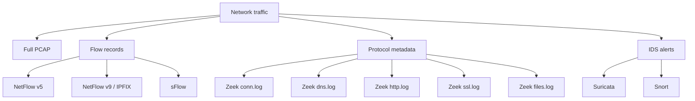
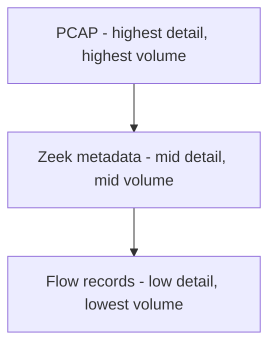
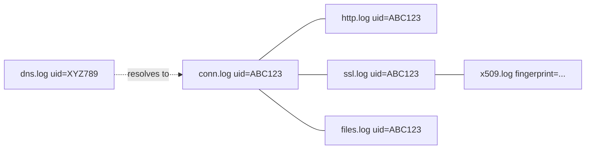
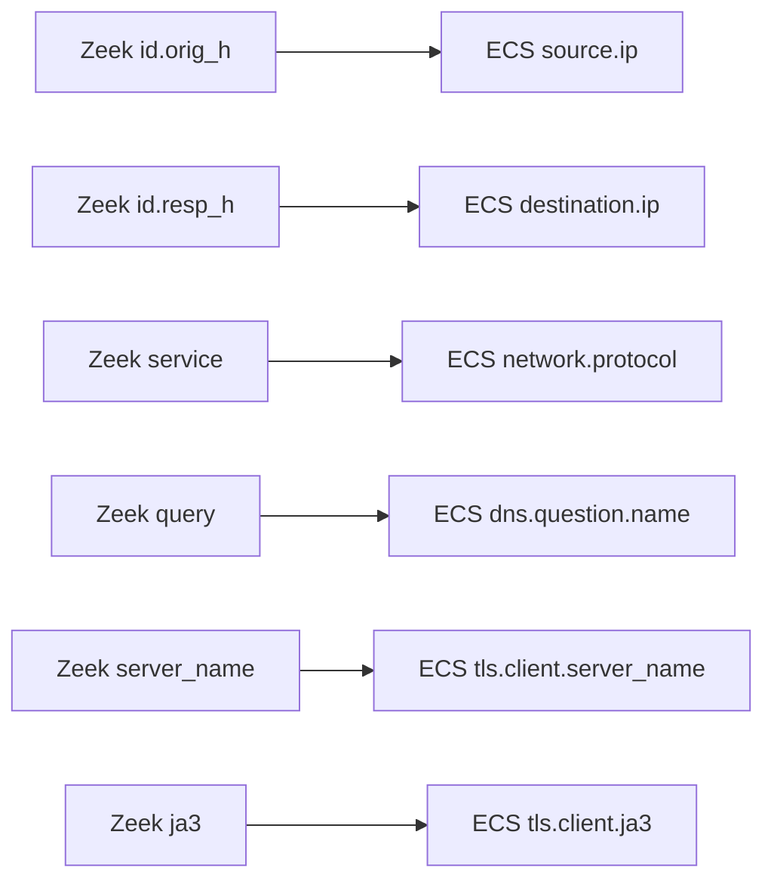
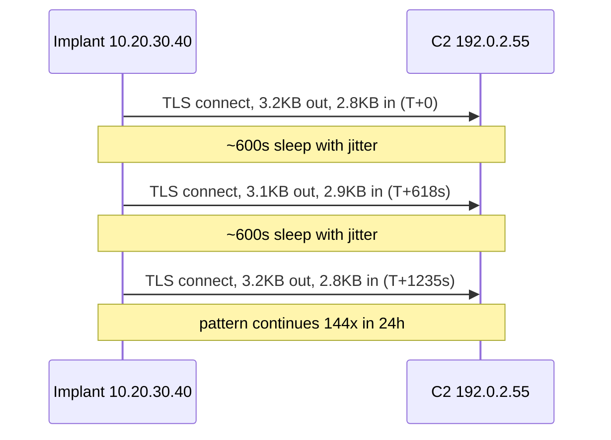
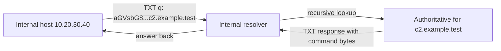
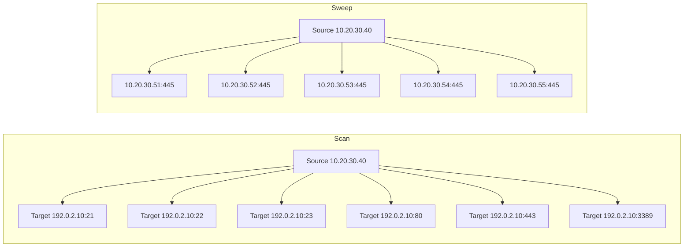
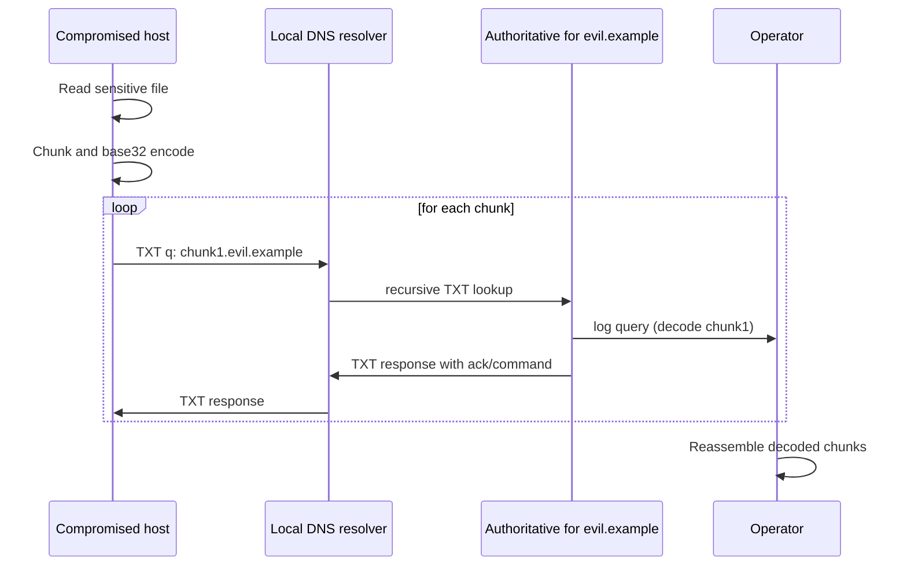

# Module 4: Network Telemetry for L1 SOC Analysts

## Module Overview

Network telemetry is the second great pillar of SOC visibility. Module 3 covered what happens *on* an endpoint — process creation, logon events, PowerShell ScriptBlock logs, the Windows Event ID catalog. This module covers what happens *between* endpoints: the packets, flows, and protocol metadata that traverse the wire. For an L1 analyst, this matters for three concrete reasons.

First, attackers don't always leave clean endpoint traces. A compromised host running a living-off-the-land tool may produce normal-looking process events while its network behavior — a slow, regular callback to an unfamiliar IP every ten minutes — screams compromise. Network telemetry is often the place where the anomaly is *visible*, even when the endpoint side looks clean. Second, network data scopes incidents. When a SIEM alert fires on one host, the network logs tell you whether that host talked to others, whether the suspicious external IP was contacted by anyone else in the estate, and whether data left the perimeter. Scoping is an L1 job, and you cannot scope without flow and DNS history. Third, network logs are durable in a way endpoint logs sometimes aren't. An attacker who clears Windows Security logs cannot retroactively unsend the packets a network sensor captured.

Where this module fits relative to Module 3: think of endpoint logs as answering "what did the host do?" and network logs as answering "what did the host *say*, to whom, when, and how often?". The two are complementary. A 4688 process-creation event for `powershell.exe` with a base64-encoded command is suspicious; correlating that event against a Zeek `conn.log` entry showing the same host immediately beaconing to a fresh AWS EC2 IP every 60 seconds is a confirmed incident.

The big-picture data sources we will cover are:

- **Full packet capture (PCAP)** — the lossless byte-for-byte recording of traffic.
- **Flow records (NetFlow, IPFIX, sFlow)** — summaries of conversations, no payload.
- **Protocol metadata logs** — Zeek's `conn`, `dns`, `http`, `ssl`, `files`, `x509` family, plus IDS alert streams from Suricata or Snort.
- **Vendor security-device logs** — proxies and next-generation firewalls (Palo Alto, Fortinet, Zscaler) that produce structured connection and policy logs.

By the end of the module you will be able to read a Zeek `conn.log` line and tell triage from noise, recognise the statistical fingerprints of beaconing and DNS tunneling, distinguish a port scan from a sweep, and map what you see on the wire to MITRE ATT&CK techniques. None of this requires you to be a packet-craft wizard. It requires you to know which fields matter and which patterns to escalate.

## Module Learning Objectives

By the end of Module 4, the learner will be able to:

- Compare full packet capture, flow records, and protocol metadata logs across cost, retention, fidelity, and privacy dimensions.
- Identify the major Zeek log families and explain what each captures.
- Read a `conn.log` entry and interpret the `conn_state` code in triage terms.
- Map Zeek field names to their Elastic Common Schema (ECS) equivalents.
- Pivot between Zeek logs using the shared connection `uid`.
- Recognise the statistical signature of beaconing and write a KQL aggregation that surfaces it.
- Identify DNS tunneling and HTTP/HTTPS C2 patterns from log evidence.
- Distinguish a port scan from a sweep and recognise common service-enumeration follow-ups.
- Detect bulk data exfiltration to common cloud-storage destinations using flow and proxy telemetry.
- Link network-side observations to the relevant MITRE ATT&CK techniques (T1046, T1041, T1048, T1071, T1572).

---

## Lesson 1 — Network Data Sources Overview

### 1.1 The three tiers of network telemetry

Network monitoring data falls into three broad tiers that trade fidelity for volume and cost. Knowing which tier you are working with — before you start triaging an alert — saves an enormous amount of time, because each tier answers a different set of questions.

**Full packet capture (PCAP)** is the byte-for-byte recording of traffic crossing a sensor. It is the gold standard for fidelity: every header, every payload byte, every retransmission. With PCAP you can replay the conversation, extract files, decode application protocols you didn't know about at capture time, and produce evidence that holds up in a legal context. PCAP is also enormous: a single 1 Gb/s link saturated for an hour produces around 450 GB. Most organisations only retain full PCAP for hours to days, often only at chokepoints (perimeter, DMZ, sensitive enclaves).

**Flow records** are statistical summaries of conversations. A flow is typically a 5-tuple — source IP, source port, destination IP, destination port, protocol — plus byte and packet counts and timestamps. Flow records do not contain payload. They are tiny compared to PCAP (a typical flow record is around 50–100 bytes) and can be retained for months or years. Flow data is excellent for "did host A ever talk to host B?", "what's the volume of east-west traffic between these subnets?", and "did anything talk to this newly-published indicator-of-compromise (IOC) IP in the last six months?". It is poor for "what did they say?".

**Protocol metadata logs** — the territory of Zeek (formerly known as Bro) — sit between PCAP and flow. The sensor parses the protocol (DNS, HTTP, TLS, SMB, etc.) on the wire and emits structured records of *what was seen*: the DNS query name, the HTTP host header and URL, the TLS server name indication, file hashes for transferred files. Metadata logs are vastly smaller than PCAP — often 0.1% of the byte volume — but capture the application-layer detail flow records discard. This tier is the L1 analyst's bread and butter.

### 1.2 Comparison table

| Property | Full PCAP | Flow records (NetFlow/IPFIX) | Protocol metadata (Zeek) | IDS alerts (Suricata) |
|---|---|---|---|---|
| Captures payload | Yes | No | Partial (extracted fields, file hashes) | Only the matching packet's context |
| Storage cost | Very high | Very low | Low to moderate | Very low |
| Typical retention | Hours to days | Months to years | Weeks to months | Months |
| Decoder needed at query time | Yes (Wireshark, tshark) | No | No | No |
| Good for retrospective hunt | Yes (if retained) | Yes | Yes | Limited (only what matched a rule) |
| Good for "did anything ever talk to X?" | Possible but slow | Excellent | Excellent | Only if a rule fired |
| Good for protocol forensics | Excellent | Poor | Good | Limited |
| Privacy footprint | Highest | Lowest | Medium | Medium |

### 1.3 NetFlow, IPFIX, and sFlow

These are the three flow-record formats you'll encounter. They are conceptually similar — summarise a conversation as a record — but differ in origin, fields, and behaviour.

**NetFlow** was developed by Cisco. Version 5 is the legacy workhorse: fixed fields, IPv4-only, no IPv6 support, no MPLS, no useful extensibility. Version 9 added templates, making the format extensible and IPv6-capable. NetFlow is unidirectional by default — a TCP connection produces two records, one per direction — though some collectors stitch the halves together.

**IPFIX (IP Flow Information Export)** is the IETF-standardised successor to NetFlow v9, defined in RFC 7011. It is template-based, vendor-neutral, and supports a rich set of information elements including application identification (when the exporter does deep inspection). For new deployments, IPFIX is the right answer.

**sFlow (sampled flow)** is fundamentally different. NetFlow/IPFIX exporters in their default modes try to record every flow. sFlow is *always sampled*: the exporter looks at, say, 1 in every 1024 packets, and exports those samples plus periodic interface counters. sFlow is cheap on switch ASICs (which is why high-density switches favour it) but you must remember the sampling rate when reasoning about volumes — a single observed packet implies roughly the sampling-rate's worth of unseen traffic.

**Sampling, exporters, and collectors.** Every flow architecture has the same three parts: an *exporter* (a router, switch, firewall, or dedicated probe that emits records), a *collector* (the central system that ingests and stores them), and an *analyser* (the SIEM, hunt UI, or query tool you actually use). Sampling — which can be configured even on NetFlow exporters under load — means each observed flow record represents *N* real flows, where *N* is the sampling rate. This matters for L1 triage: a "one connection seen" hit at 1:1000 sampling actually means somewhere around a thousand real connections, give or take. Always know your sampling rate before you call something rare.

**What flows do NOT capture.** No payload. No DNS query name. No HTTP URL. No TLS server name. No file transferred. They tell you "192.0.2.45 sent 14 MB to 198.51.100.12 over TCP/443 between 02:14 and 02:18". They do not tell you whether that 443 connection was Gmail, Slack, or a Cobalt Strike beacon.

### 1.4 Zeek

Zeek (renamed from Bro in 2018) is a network security monitor that parses traffic in real time and emits structured logs by protocol. It is not an IDS in the signature-matching sense; it is a programmable protocol decoder that produces a fact-trail of what happened on the wire. The Zeek log family an L1 analyst should recognise:

- **conn.log** — every connection attempt, successful or not. The backbone log.
- **dns.log** — every DNS query and response.
- **http.log** — every cleartext HTTP transaction (host, URI, method, status, user-agent, referrer).
- **ssl.log** — every TLS handshake (SNI, certificate chain ID, JA3 fingerprint).
- **files.log** — every file Zeek extracted from a protocol stream, with hash.
- **x509.log** — every certificate seen, with subject, issuer, validity dates.
- **smtp.log** — SMTP envelope (MAIL FROM, RCPT TO, headers).
- **ftp.log** — FTP commands and responses.
- **ssh.log** — SSH version exchange and client/server software strings.
- **weird.log** — protocol-violation events (often noise, sometimes real).
- **notice.log** — Zeek's curated "you should look at this" output, where built-in scripts raise findings.

The thing that distinguishes Zeek from raw PCAP is that Zeek has done the parsing for you. To answer "did anyone resolve `evil-c2.example`?" against PCAP you'd need to decode every DNS packet in the timeframe; against Zeek, it's a single field match on `dns.log`. To answer the same question against NetFlow, you cannot — flow records don't carry DNS query names.

### 1.5 Suricata and Snort IDS alerts

Suricata and Snort are signature-based intrusion detection systems. They watch traffic against a ruleset (Emerging Threats, Talos, custom) and emit alerts when a rule matches. In the telemetry stack they sit *alongside* Zeek, not in place of it: Zeek produces the fact-trail, Suricata produces the "this fact-trail contains a known-bad pattern" pointer.

For L1 work, IDS alerts are usually the *trigger* for an investigation, and Zeek/flow data is what you use to scope and confirm. A Suricata alert telling you "ET MALWARE Cobalt Strike Beacon Activity" on host A is the starting gun. The conn.log to see how long this has been going on and to which destinations, the dns.log to see what name resolved to that destination, and the ssl.log to grab the JA3 hash, are how you actually work the alert.

Treat IDS alerts with healthy scepticism. False-positive rates on community rules can be high, especially the heuristic ones. The default L1 question is not "is this real?" — it's "given this alert, what does Zeek/flow show, and does that corroborate?".

### 1.6 Proxy and firewall logs

Most enterprise networks force outbound HTTP/HTTPS through a forward proxy or a next-generation firewall (NGFW), and route everything through perimeter firewalls. These devices produce structured logs an L1 sees daily.

**Web proxies (Zscaler, Bluecoat, Squid)** log per-URL: timestamp, user (when integrated with directory), source IP, destination URL, host header, HTTP method, content-category, action (allow/block), bytes, user-agent. They are the easiest place to answer "did this user visit this site?" for HTTP/HTTPS, especially with SSL inspection enabled.

**Next-generation firewalls (Palo Alto Networks, Fortinet FortiGate, Check Point)** produce traffic logs (5-tuple plus app-id and bytes), URL filtering logs, threat logs (their built-in IDS hits), and decryption logs. Palo Alto's `App-ID` field is an enriched protocol identifier — it's the firewall saying "regardless of port, this looks like SSH" or "this looks like Tor".

**Perimeter firewalls without app-awareness** (older Cisco ASA, basic iptables) produce 5-tuple connection logs equivalent to NetFlow.

What an L1 sees: usually a SIEM-normalised view that has flattened proxy and firewall logs into a common schema (often ECS — covered in Lesson 2). The fields you care about are source identity (user, host), destination (IP, URL, app-id), action (allow/deny), category, and bytes.

### 1.7 Trade-offs

Designing the telemetry stack is not the L1's job, but understanding the trade-offs helps you read what's missing from a query result.

- **Cost vs fidelity.** PCAP is highest fidelity, highest cost. Flow is lowest cost, lowest fidelity. Zeek hits the practical sweet spot.
- **Retention vs volume.** Six months of flow data costs less to retain than two days of PCAP at a busy site.
- **Privacy.** PCAP captures everything, including credentials and personal data inside cleartext protocols. Many organisations restrict who can query PCAP. Zeek can be configured to drop sensitive fields. Flow has the smallest privacy footprint.
- **Encryption.** Modern TLS 1.3 with Encrypted Client Hello (ECH) limits what unencrypted-decoder Zeek can see. SNI may be hidden. JA3 still works. PCAP without keys is opaque past the handshake.

### 1.8 Diagrams

**Diagram 1 — Data-source taxonomy:**



**Diagram 2 — Detail vs volume pyramid:**



The pyramid is read top-down: PCAP at the top has the most information per event but generates the most bytes; flow at the base has the least information per event but the smallest storage footprint.

### 1.9 Quiz — Lesson 1

**Q1 (single-choice).** Which network telemetry tier is best suited to answering "did any host in the estate ever connect to 198.51.100.42 in the last 90 days?"
- a) Full PCAP
- b) NetFlow / IPFIX records
- c) Suricata alerts only
- d) Endpoint EDR logs

`correct: b` — Flow records are designed for long retention and per-conversation queries. PCAP is rarely retained 90 days; Suricata only fires on rule matches; EDR doesn't index the full network history.

**Q2 (multi-choice).** Which of the following are true about sFlow?
- a) It is always sampled
- b) It captures full packet payloads
- c) It is used by high-density switches because it's cheap on the ASIC
- d) Sampling rate must be considered when reasoning about traffic volume

`correct: a, c, d` — sFlow is statistically sampled, doesn't capture payloads, is favoured on busy switching gear, and the sampling rate is essential context when interpreting counts.

**Q3 (true/false).** Zeek is fundamentally a signature-based IDS, like Snort.

`correct: false` — Zeek is a programmable network monitor that parses protocols and emits structured logs. It is not signature-based; Suricata and Snort are. Zeek scripts can produce notices, but the core engine is a protocol decoder, not a rule matcher.

---

## Lesson 2 — Reading Zeek Logs and ECS Mapping

### 2.1 Why this lesson is the centre of the module

Zeek logs, normalised to the Elastic Common Schema, are the single most useful data source for an L1 analyst on the network side. If you learn nothing else from this module, learn the conn.log fields and the conn_state codes — they appear in nearly every network triage.

### 2.2 The conn.log fields

A `conn.log` record represents one connection (or connection attempt). The fields you must know:

- **ts** — timestamp of the connection start.
- **uid** — the *connection unique ID*. A short string like `CzZRSm4VC4P0E5VqTk`. Every other Zeek log produced for this connection (dns, http, ssl, files) shares this uid. It is the pivot key.
- **id.orig_h** — originator host (the IP that initiated the connection).
- **id.orig_p** — originator port.
- **id.resp_h** — responder host (the IP that was contacted).
- **id.resp_p** — responder port.
- **proto** — transport protocol (`tcp`, `udp`, `icmp`).
- **service** — application protocol Zeek identified (`dns`, `http`, `ssl`, `ssh`, `smb`, etc.). Empty if Zeek couldn't identify it.
- **duration** — connection duration in seconds.
- **orig_bytes** — application-layer bytes the originator sent (does not include retransmissions, headers).
- **resp_bytes** — application-layer bytes the responder sent.
- **conn_state** — the connection state code (see next section).
- **history** — a compact string describing the packet sequence. Lowercase letters are originator-side packets, uppercase are responder-side. Common: `S` (SYN), `H` (SYN+ACK), `A` (ACK), `D` (data), `F` (FIN), `R` (RST). A typical successful connection looks like `ShADdaFf`.

Example `conn.log` line (TSV, abbreviated):

```
ts=1714060800.123 uid=CzZRSm4VC4P0E5VqTk id.orig_h=10.20.30.40 id.orig_p=51234
id.resp_h=192.0.2.55 id.resp_p=443 proto=tcp service=ssl duration=14.21
orig_bytes=4502 resp_bytes=88210 conn_state=SF history=ShADadFf
```

Read it as: host 10.20.30.40 (an internal client) made an outbound TLS connection to 192.0.2.55:443, the connection lasted 14.2 seconds, the client sent 4.5 KB and received 88 KB, and the connection terminated cleanly.

### 2.3 conn_state codes that matter for triage

Zeek's `conn_state` is a two-or-three-character code summarising how the connection ended. The codes you must recognise:

- **S0** — connection attempt seen, no reply. The originator sent a SYN, the responder never answered. Strong signal of port-scanning or dead destinations.
- **S1** — connection established, not terminated. Useful as "in progress at flush time" but otherwise unremarkable.
- **SF** — normal establishment and termination. The expected state for healthy traffic.
- **REJ** — connection attempt rejected by the responder (RST). Often means "port closed".
- **RSTO** — connection established, then aborted by the *originator* with a RST. Sometimes seen on application-layer aborts.
- **RSTR** — connection established, then aborted by the *responder*. Useful: a server actively cutting off a client suggests the server didn't like what it saw.
- **OTH** — no SYN seen, mid-connection traffic only. Common on traffic Zeek joined after the handshake (e.g. long-lived connections present when the sensor started).

Triage shortcut: a host producing thousands of `S0` records to many destinations in a short window is almost always scanning. A host producing many `REJ` records to one destination is probably a misconfigured client. A `SF` to an external address with one outbound byte and 50 KB of inbound bytes is normal HTTP. A `SF` to an external address with 50 MB outbound and 2 KB inbound is an exfil candidate.

### 2.4 dns.log and suspicious queries

`dns.log` records every DNS query/response. Key fields: `uid`, `id.orig_h`, `id.resp_h`, `query`, `qtype_name` (A, AAAA, TXT, MX, etc.), `rcode_name` (NOERROR, NXDOMAIN, SERVFAIL, REFUSED), `answers`, `TTLs`.

Patterns that should make you suspicious:

- **Long subdomain labels.** A query for `aGVsbG8tdGhpcy1pcy1leGZpbA.evil.example` with 50+ characters before the parent domain is a classic DNS-tunneling shape. Legitimate CDN domains can have long labels too — context and parent-domain reputation matter.
- **NXDOMAIN bursts.** A host generating dozens of NXDOMAIN replies in a short window can be a domain-generation algorithm (DGA) at work. DGAs produce algorithmically-generated domains, most of which won't resolve, so the malware burns through NXDOMAINs until it finds the controller's live name.
- **DGA-shaped queries.** High character-entropy strings like `xkqzplmnvwert.com`, `qjxzbvwert42.net`. Modern DGAs vary; the giveaway is that the labels look statistically random, unlike English words or recognisable brand names.
- **Rare TLDs.** Heavy traffic to `.tk`, `.top`, `.xyz`, `.cf`, `.gq` correlates with abuse, though far from definitively. Use it as a weight, not a verdict.
- **TXT-record volume.** TXT records are often used for legitimate metadata (SPF, DKIM, domain validation). A single host issuing thousands of TXT queries to one parent domain over hours is much more interesting and is a hallmark of DNS tunneling tools like `dnscat2` and `iodine`.

### 2.5 http.log and ssl.log

`http.log` covers cleartext HTTP. Fields you'll use: `host`, `uri`, `method`, `status_code`, `user_agent`, `referrer`, `request_body_len`, `response_body_len`. With most traffic now TLS-encrypted, http.log is mostly relevant where SSL inspection is performed (the inspector decrypts and Zeek sees plaintext) or for legitimate cleartext (internal HTTP, captive portals, some legacy).

`ssl.log` is far more useful in a TLS-everywhere world. Fields: `version` (TLSv12, TLSv13), `cipher`, `server_name` (the SNI — the hostname the client said it wanted), `subject`, `issuer`, `validation_status`, `ja3`, `ja3s`, `established`.

**SNI (Server Name Indication)** is the unencrypted hostname in the TLS ClientHello. Until Encrypted Client Hello (ECH) deploys broadly, SNI is the analyst's window into "what site did this client claim to be visiting?". Note "claim to be" — domain fronting can lie about SNI versus the actual Host header inside, and ECH will eliminate SNI visibility entirely on networks where it's used.

**JA3 and JA3S, in non-jargon terms.** JA3 is a fingerprint of how a TLS client speaks during the handshake. The handshake includes a list of cipher suites, extensions, elliptic curves, and curve formats the client supports. Different software stacks (Chrome, Firefox, Python `requests`, Cobalt Strike, Sliver) produce subtly different lists. JA3 hashes those lists into a 32-character MD5. Two clients producing identical JA3s are probably running the same TLS library version. JA3S is the same idea on the server side. Why this matters for L1: even though the rest of the connection is encrypted, if a host is producing a JA3 that matches a known Cobalt Strike beacon's JA3, you have strong evidence of what's running, without ever decrypting the payload. JA3 is not a perfect identifier — many legitimate clients share JA3s with malware that uses the same TLS library — so use it as a strong weight, not a verdict.

### 2.6 Pivoting via uid

The `uid` field is the most powerful pivot in the Zeek stack. Every connection produces one `conn.log` record and zero or more records in protocol-specific logs, all sharing the same uid. To investigate a suspicious connection:

1. Find the `conn.log` row of interest.
2. Take the uid.
3. Query every other Zeek log for that uid. You instantly get the full story — DNS query that produced the resolved IP (often a few seconds before in dns.log, with a different uid but matching destination IP), TLS SNI and JA3 (ssl.log), files transferred (files.log).

If the original alert came from a Suricata signature, Suricata in eve.json mode emits a `flow_id` that maps to Zeek's connection key in most properly-integrated stacks, giving you the same pivot.

### 2.7 ECS field mapping

Elastic Common Schema (ECS) is a normalised field naming convention. Modern ELK stacks ingest Zeek via Filebeat's Zeek module, which renames fields into ECS. You will see both names in practice — Zeek-native in some panels, ECS in others. The mapping you must memorise:

| Zeek field | ECS field |
|---|---|
| `id.orig_h` | `source.ip` |
| `id.orig_p` | `source.port` |
| `id.resp_h` | `destination.ip` |
| `id.resp_p` | `destination.port` |
| `proto` | `network.transport` |
| `service` | `network.protocol` |
| `orig_bytes` | `source.bytes` |
| `resp_bytes` | `destination.bytes` |
| `orig_pkts` | `source.packets` |
| `resp_pkts` | `destination.packets` |
| `orig_bytes + resp_bytes` | `network.bytes` |
| `orig_pkts + resp_pkts` | `network.packets` |
| `query` (dns.log) | `dns.question.name` |
| `qtype_name` (dns.log) | `dns.question.type` |
| `rcode_name` (dns.log) | `dns.response_code` |
| `host` (http.log) | `url.domain` |
| `uri` (http.log) | `url.path` |
| `user_agent` (http.log) | `user_agent.original` |
| `server_name` (ssl.log) | `tls.client.server_name` |
| `ja3` (ssl.log) | `tls.client.ja3` |
| `ja3s` (ssl.log) | `tls.server.ja3s` |

When in doubt, ECS uses dotted, lowercase field paths and prefers `source` / `destination` over `client` / `server` for connection-level data. The TLS extension fields use `tls.*`.

### 2.8 Worked KQL examples

**Example 1 (KQL — find rare destination ports for a host).** A user reports their workstation feels sluggish. You want a quick view of any unusual outbound destination ports from that host in the last 24 hours.

```
event.dataset: "zeek.conn"
and source.ip: "10.20.30.40"
and not destination.port: (80 or 443 or 53 or 123)
and network.transport: "tcp"
```

This filters the Zeek conn dataset to the host, excludes the four most common outbound ports (HTTP, HTTPS, DNS, NTP), and limits to TCP. In Discover, sort by `@timestamp` descending and review the destination IPs and ports; expand into a Lens chart aggregating by `destination.port` to spot any port that's unexpectedly common.

**Example 2 (KQL — find DNS queries with very long subdomains).** You want to surface candidate DNS-tunneling traffic across the estate.

```
event.dataset: "zeek.dns"
and dns.question.name: *
and dns.question.type: ("TXT" or "A")
```

Then in Lens, build a table aggregating by `dns.question.name`, computing `Top values` and adding a runtime field `dns_label_length` derived from the leftmost label's character count. Sort by max label length descending. Anything above 50 characters with significant query volume warrants a closer look. (Some Elastic deployments expose `dns.question.subdomain` directly; if so, filter on its length there.)

### 2.9 Diagrams

**Diagram 1 — Zeek log family with uid pivot:**



The dashed arrow is the conceptual link from a DNS resolution (its own uid) to the resulting connection (a different uid but the destination IP matches the dns.log answers field).

**Diagram 2 — Zeek-to-ECS field mapping:**



### 2.10 Quiz — Lesson 2

**Q1 (single-choice).** A host produced 4,000 conn.log records in 60 seconds, all with `conn_state=S0`, to many different destinations. What is the most likely explanation?
- a) Heavy legitimate web browsing
- b) A TCP SYN port scan from this host
- c) Long-lived SSH session
- d) The host received many inbound connections

`correct: b` — `S0` means SYN sent with no reply, and 4,000 such attempts to varied destinations in a minute is a textbook SYN-scan fingerprint.

**Q2 (multi-choice).** Which Zeek log fields map to the listed ECS fields correctly?
- a) `id.orig_h` to `source.ip`
- b) `query` (dns.log) to `dns.question.name`
- c) `server_name` (ssl.log) to `url.domain`
- d) `ja3` (ssl.log) to `tls.client.ja3`

`correct: a, b, d` — option c is wrong: SNI maps to `tls.client.server_name`, not `url.domain` (which is for HTTP/URL host).

**Q3 (single-choice).** You have a suspicious `conn.log` row with `uid=CzZRSm4VC4P0E5VqTk`. What is the fastest way to retrieve every related Zeek event for this connection?
- a) Search every Zeek log for the source IP and timestamp
- b) Query every Zeek log dataset filtering on that uid
- c) Replay the PCAP for that timeframe
- d) Open a Suricata rule against the destination

`correct: b` — uid is the connection-level pivot key shared across all Zeek logs for that connection. Filtering on uid is exact and instant.

---

## Lesson 3 — Beaconing, DNS Tunneling, and C2 Detection

### 3.1 What beaconing is

Beaconing is a periodic check-in by an implanted agent to its command-and-control (C2) server. The agent says "I'm alive — any orders?", the server says "yes, run this" or "no, sleep". The cadence may be every 60 seconds, every 5 minutes, every hour. Mature C2 frameworks (Cobalt Strike, Sliver, Mythic, Brute Ratel) randomise the interval with *jitter* — a percentage variation around the base interval — so check-ins are not perfectly regular but cluster around an average.

Beaconing is hard to spot manually because each individual connection looks unremarkable: a small TCP/443 connection from a workstation to an external IP, tens of kilobytes, completes cleanly. The signal lives in the *aggregate*: hundreds of nearly-identical connections, regularly spaced, over hours or days.

### 3.2 The statistical signature

The shape an L1 should learn to recognise:

- **High connection count** to a single destination over a long observation window. "144 connections to 192.0.2.55 in the last 24 hours" is suspicious if the destination isn't a known service.
- **Low total byte volume per connection.** A beacon's check-in is small — a few hundred bytes to a few KB. If the C2 has work, the answer can be larger; otherwise both directions are tiny.
- **Regular interval with jitter.** Plot timestamps; look for clustering around a base period. Common beacons run 30s, 60s, 300s, 600s, 3600s. Jitter is typically 0–30%.
- **Long-lived destination.** The same destination is contacted across many hours or days, not a one-off burst.
- **Single source-destination pair.** Beaconing is usually one infected host talking to one C2 IP, not many sources to one destination.

A useful mental rule: a host that talks to one external IP **at least once every ten minutes for six hours straight**, with each connection under 10 KB total, is beaconing until proven otherwise. The proof is usually "this destination is a legitimate service" (Microsoft update endpoints, telemetry, mail clients polling).

### 3.3 Worked example — 144 connections in 24 hours

Suppose you run a daily summary query and find that workstation `10.20.30.40` had exactly 144 successful TCP/443 connections to `192.0.2.55` over the last 24 hours, with average bytes 3.2 KB out and 2.8 KB in. The pattern is suspicious because 144 connections / 24 hours = exactly one every ten minutes, with low byte volume both ways.

Sample `conn.log` shape (abbreviated):

```
ts=...T00:00:14Z src=10.20.30.40:55001 dst=192.0.2.55:443 proto=tcp service=ssl
  duration=4.1 orig_bytes=3211 resp_bytes=2855 conn_state=SF
ts=...T00:10:32Z src=10.20.30.40:55012 dst=192.0.2.55:443 proto=tcp service=ssl
  duration=4.0 orig_bytes=3198 resp_bytes=2844 conn_state=SF
ts=...T00:20:51Z src=10.20.30.40:55021 dst=192.0.2.55:443 proto=tcp service=ssl
  duration=4.2 orig_bytes=3205 resp_bytes=2861 conn_state=SF
ts=...T00:31:08Z src=10.20.30.40:55029 dst=192.0.2.55:443 proto=tcp service=ssl
  duration=3.9 orig_bytes=3220 resp_bytes=2849 conn_state=SF
[... 140 more ...]
```

Note the inter-arrival times: 618s, 619s, 617s — base 600s with ~3% jitter. Note the consistency of byte counts. Note that `conn_state=SF` for every record — clean handshake, clean close, classic beacon.

The KQL aggregation that surfaces this across the estate (Elastic ES|QL syntax for the aggregation, since KQL alone cannot produce the count):

```esql
FROM zeek-conn-*
| WHERE event.dataset == "zeek.conn"
   AND network.transport == "tcp"
   AND destination.ip IS NOT NULL
   AND NOT CIDR_MATCH(destination.ip, "10.0.0.0/8", "172.16.0.0/12", "192.168.0.0/16")
| STATS conn_count = COUNT(*),
        avg_bytes = AVG(network.bytes),
        unique_src = COUNT_DISTINCT(source.ip)
   BY source.ip, destination.ip, destination.port
| WHERE conn_count >= 50 AND avg_bytes < 20000 AND unique_src == 1
| SORT conn_count DESC
```

This returns source-destination pairs with at least 50 connections, average size under 20 KB, and a single source talking to that destination — the candidate beacon list. The L1 then walks the list, checks SNI and JA3 in `ssl.log` for the candidate connections, and looks up the destination IP against threat intelligence.

### 3.4 DNS tunneling

DNS tunneling encodes data in DNS queries and responses. Because DNS is rarely blocked, even on networks that aggressively filter web traffic, malware can use it as a covert channel for both C2 and exfiltration. Tools like `dnscat2`, `iodine`, and DNS-based modes in Cobalt Strike implement this.

The shape:

- High query volume from one source to one parent domain.
- Long subdomain labels (often 50+ characters) carrying base32/base64-encoded payload chunks.
- Frequent use of TXT record type (the spec allows up to ~255 bytes of arbitrary text in a TXT response — useful for the C2 server to send back commands).
- Sometimes A or AAAA records used for short payloads, with the IP address in the answer encoding the response.

**Worked example.** Suppose internal host `10.20.30.40` is making DNS queries to a parent domain `c2.example.test` (using `.test` because RFC 6761 reserves it for examples). The dns.log shows:

```
ts=... query=aGVsbG8tdGhpcy1pcy1jaHVuay0xLW9mLWV4ZmlsLWRhdGE.c2.example.test
       qtype=TXT rcode=NOERROR
ts=... query=Y2h1bmstMi1tb3JlLWRhdGEtaGVyZS1jb250aW51aW5n.c2.example.test
       qtype=TXT rcode=NOERROR
ts=... query=Y2h1bmstMy1ldmVuLW1vcmUtZGF0YS1iZWluZy1zZW50.c2.example.test
       qtype=TXT rcode=NOERROR
[... 800 more in a 5-minute window ...]
```

Each query has a leftmost label of around 45–50 characters of what looks like base32. All TXT type. All to the same parent domain. The query rate is roughly 3 per second — far above any user's behaviour.

KQL to find this pattern:

```
event.dataset: "zeek.dns"
and dns.question.type: "TXT"
and source.ip: *
```

Then aggregate in Lens by `source.ip` and the registered parent domain (Elastic provides `dns.question.registered_domain` when the ECS module is configured). Sort by query count descending. A single source producing thousands of TXT queries to one parent over minutes is the giveaway. Augment by computing the average leftmost-label length — anything over 30 is unusual for legitimate traffic.

### 3.5 HTTP/HTTPS C2

Before TLS dominated, HTTP-based C2 was the norm. It's still common, especially in commodity malware. The shape:

- **Low-and-slow GET/POST.** Periodic requests to one URL, small request and response bodies.
- **Suspicious user agents.** Hardcoded oddities like `Mozilla/4.0 (compatible; MSIE 6.0)` in 2026, `Python-urllib/3.9` from a host that shouldn't run scripts, or completely unique strings. Some C2 uses entirely realistic UAs to blend in — UA alone is a weak signal.
- **No Referer header.** A browser navigation almost always carries a Referer to the previous page; a script-driven beacon usually doesn't.
- **Odd content-types.** A POST body marked `application/octet-stream` from a workstation to an unfamiliar domain is more suspicious than `application/json`.
- **Request URI patterns.** Long random-looking paths, URIs with embedded base64, repeated requests to identical paths.

For HTTPS, the same principles apply but you only see the encrypted shell — connection counts, byte volumes, SNI (when present), JA3, server certificate. The interior is opaque without SSL inspection.

### 3.6 Domain fronting and CDN-hidden C2

Domain fronting was the technique of putting one (innocuous) hostname in the SNI and another (malicious) hostname in the encrypted Host header, exploiting CDNs that routed by Host. Major CDNs (Google, AWS CloudFront, Azure Front Door) have largely closed this in recent years, but the descendant pattern still appears: malware hosting C2 endpoints on legitimate cloud or CDN infrastructure so the traffic looks like normal cloud traffic.

What you'll see at L1: SNIs of `cloudfront.net`, `azureedge.net`, `cloudflare.com`, `cdn.discordapp.com`, `s3.amazonaws.com`. None of these are *automatically* bad — they cover most of the modern internet. But:

- A host beaconing to the same Cloudflare IP every ten minutes for six hours is suspicious *regardless* of the SNI.
- A workstation that has no business hitting Discord CDN suddenly making periodic requests there is suspicious.
- The destination IP plus JA3 plus interval matters more than the SNI alone.

For L1 work: don't dismiss a beacon pattern because the SNI looks legit. The shape is the signal.

### 3.7 JA3 against known-bad lists

Several public and commercial lists ship JA3 hashes associated with specific malware. Filtering Zeek `ssl.log` against these lists turns a haystack into a small candidate set. Typical workflow:

1. Subscribe to a JA3 IOC feed (or build one from your incident history).
2. Index it as an enrichment in your SIEM.
3. Alert on any internal source producing a JA3 from the bad list.

Caveat: JA3 collisions are real. The Cobalt Strike default JA3 in older versions overlaps with common Java client JA3s. Always corroborate JA3 hits with destination, interval, and conn count.

### 3.8 When to escalate

The L1 escalation criteria for suspected C2:

- **Beacon pattern confirmed** — high-count, low-byte, regular-interval connections from one internal host to one external destination, conn_state SF, over multiple hours.
- **Bad JA3 match** with corroborating shape (same host, regular interval).
- **DNS tunneling** — high TXT query rate, long subdomains, single source.
- **Known-bad destination IP or domain** that the host actually connected to (don't escalate on a query alone if the connection failed).
- **Cleartext HTTP C2 indicators** — repeating requests with hardcoded suspicious UA and no Referer.

Anything that meets two of these gets escalated to L2 with a written summary that includes: the source host, the destination(s), the time window, the connection count, the average byte volume, the JA3 (if SSL), and the supporting log query.

### 3.9 Diagrams

**Diagram 1 — Beacon timeline:**



**Diagram 2 — DNS tunneling shape:**



### 3.10 Quiz — Lesson 3

**Q1 (single-choice).** Which of these is the strongest *individual* signal of beaconing?
- a) A single TCP/443 connection to an unfamiliar IP
- b) Many TCP/443 connections, regularly spaced, low byte volume, from one source to one destination over hours
- c) A burst of a thousand connections to a thousand different destinations in 60 seconds
- d) An NXDOMAIN reply for a long subdomain

`correct: b` — beaconing's signal is the *aggregate* shape of regular, low-byte, single-target connections sustained over time.

**Q2 (multi-choice).** Which of the following are reasonable patterns for DNS tunneling?
- a) High volume of TXT queries from one source
- b) Long leftmost labels of base32/base64-looking content
- c) Many queries to one parent domain
- d) A single A-record query for `microsoft.com`

`correct: a, b, c` — option d is normal DNS.

**Q3 (true/false).** If a connection's SNI is `cloudfront.net`, the connection cannot be malicious because Cloudfront is a legitimate CDN.

`correct: false` — malware routinely hosts C2 on legitimate CDNs. The SNI alone proves nothing; the shape (interval, count, byte volume, JA3) is what you should weight.

**Q4 (short-answer).** An L1 analyst suspects beaconing. The connections in question are completing cleanly — handshake, data exchange, graceful close. What `conn_state` value should they expect to see in `conn.log` for these beacon connections, and why?

`correct: SF` — `SF` means normal establishment and termination. A successful beacon's TLS connection completes the handshake, exchanges its check-in payload, and closes cleanly, which Zeek records as `SF`. (`S0` would imply the C2 never replied; `RSTO`/`RSTR` would imply an abort, which is not the typical beacon pattern.)

---

## Lesson 4 — Reconnaissance and Exfiltration Patterns

### 4.1 Port scans

A port scan is one host probing many ports on one or a small set of targets to enumerate listening services. The technique matters because each scan style produces a different `conn.log` shape.

**TCP SYN scan ("half-open").** The scanner sends SYN, waits for the response, never completes the handshake. If the target replies SYN+ACK, the scanner sends RST and moves on (some tools just don't reply, letting the half-open connection time out). Zeek's `conn_state` will typically be **S0** (no reply, port was filtered or host down), **REJ** (RST reply, port closed), or **OTH** for unusual cases. `history` will show `S` only or `Sh` followed by a quick reset. SYN scans are noisy on the wire but don't produce server-side application logs because the handshake never finished.

**Full-connect scan.** The scanner completes the three-way handshake, then closes. `conn_state=SF` with `history=ShAfF` or similar, and very short duration with effectively no payload bytes. This style hits the target's application logs (an open port that gets a complete handshake and immediate close looks like a TCP probe), so it's cheaper to write but more visible.

**UDP scan.** UDP has no handshake. The scanner sends a UDP packet to a target port; an open port may stay silent (some apps reply, most don't), a closed port elicits an ICMP "port unreachable" reply. Zeek emits a `conn.log` for UDP traffic too; the `conn_state` is usually **S0** for no reply or **SHR** patterns for ICMP-error scenarios.

**Scan triage shortcut.** Filter `conn.log` for one source IP, time-window of minutes, group by `id.resp_p`. If you see many distinct destination ports against few destination IPs, with mostly `S0` or `REJ`, you're looking at a scan. If you see many distinct *destination IPs* on one or two ports, you're looking at a sweep.

### 4.2 Sweep vs scan

The distinction matters because the intent differs.

- **Scan**: one-to-few — a single source probing many ports on one target (or a small set). Intent: enumerate what's running on the target.
- **Sweep**: one-to-many or few-to-many — a single source (or a few) probing one specific port across a large number of targets. Intent: find every host running that service.

Common sweep targets: TCP/445 (SMB), TCP/3389 (RDP), TCP/22 (SSH), TCP/3306 (MySQL), TCP/445 + TCP/139 (older SMB), TCP/5985/5986 (WinRM). A sudden sweep for 445 from an internal host is one of the strongest indicators of lateral-movement reconnaissance, especially after a phishing-induced compromise.

### 4.3 Service enumeration after a successful scan

After a scan reveals an open port, the attacker probes the service. For an L1, the patterns to recognise:

- **SMB (TCP/445).** After connecting, the attacker negotiates the dialect and lists available shares. Zeek's `smb_files.log` and `smb_mapping.log` (when enabled) record share access. A workstation that suddenly enumerates shares on dozens of file servers is anomalous.
- **RDP (TCP/3389).** A burst of short RDP connection attempts across many hosts is a bruteforce or credential-spray attempt. RDP brute force is the most common ransomware-precursor signal there is.
- **WinRM (TCP/5985 cleartext, TCP/5986 TLS).** Less commonly enabled internally but heavily abused by frameworks like Evil-WinRM. WinRM-over-HTTP traffic from one workstation to many servers is suspicious.
- **SSH (TCP/22).** Inside Linux estates, SSH brute-force shows as many `S0`/`SF`-immediate-RSTO rows.
- **WMI (DCOM, TCP/135 + ephemeral RPC).** Legitimate but heavily abused. The hard part is that WMI uses ephemeral RPC ports allocated dynamically; you'll see TCP/135 establish then a dynamic high port follow.

### 4.4 Data exfiltration

Bulk exfiltration on the wire has a few hallmark shapes.

**Large outbound transfers.** A single internal host pushing tens of MB to hundreds of GB outbound, in one or a few sessions. The asymmetry matters — `orig_bytes` (out) substantially exceeds `resp_bytes` (in) on what was meant to be a request/response service.

**Off-hours patterns.** Heavy outbound from a workstation at 03:14 local time, when the user is asleep, is a strong signal. Some attackers deliberately schedule exfil for low-activity windows to avoid bandwidth alerts.

**Unusual destinations.** Outbound traffic to destinations the host has never talked to before, or to destinations not used by other peers. New cloud-storage destinations are particularly interesting.

**Compressed-and-encrypted blobs.** While you can't see this directly without decryption or PCAP, you can infer it from byte ratios — uniformly random-looking byte patterns over TCP/443 to a fresh destination are consistent with encrypted archive uploads.

### 4.5 Cloud-storage exfil destinations

Modern exfil increasingly targets legitimate cloud-file services because they're rarely blocked at the perimeter. The L1 watchlist:

- **mega.nz** — popular for ransomware exfil; large encrypted uploads.
- **anonfiles** (and successors when one shuts down) — anonymous file hosts with permissive upload limits.
- **Discord CDN (`cdn.discordapp.com`)** — frequently abused as a payload-and-exfil host because Discord doesn't enforce file-content checks.
- **GitHub gists / GitHub raw content** — small-volume staging, often used for second-stage payload delivery and small-blob exfil.
- **transfer.sh, file.io, wetransfer.com** — generic file-share services.
- **Pastebin and clones** — text-only, but useful for credential dumps.

**Worked KQL example — outbound bytes by destination.** Find the top destinations by outbound bytes from internal hosts in the last 24 hours, restricted to candidate exfil destinations.

```esql
FROM zeek-conn-*
| WHERE event.dataset == "zeek.conn"
   AND CIDR_MATCH(source.ip, "10.0.0.0/8", "172.16.0.0/12", "192.168.0.0/16")
   AND NOT CIDR_MATCH(destination.ip, "10.0.0.0/8", "172.16.0.0/12", "192.168.0.0/16")
| STATS total_out = SUM(source.bytes),
        total_in = SUM(destination.bytes),
        sessions = COUNT(*)
   BY source.ip, destination.ip, destination.port
| WHERE total_out > 50000000
| SORT total_out DESC
```

This finds internal-source / external-destination pairs where the cumulative outbound is over 50 MB. Cross-reference the destination IPs against reverse-DNS or the SSL `tls.client.server_name` field in a follow-up query to identify the cloud service. A workstation pushing 4 GB out to a single Mega.nz IP overnight, when the user has no Mega usage in their history, is a confirmed exfil candidate.

### 4.6 DNS exfil vs HTTP/HTTPS exfil

Both move data out, but they differ in volume and visibility.

- **DNS exfil**: low bandwidth (DNS queries are tiny), but DNS is rarely blocked. Suited to small, sensitive payloads — credentials, keys, command output. Detection: long subdomain labels, high TXT query rate, single source-to-domain pattern (covered in Lesson 3).
- **HTTP/HTTPS exfil**: high bandwidth, but more often subject to outbound filtering, decryption, and DLP. Suited to bulk exfil — archives, databases, design files. Detection: large outbound bytes on TCP/443 to unfamiliar or cloud-storage destinations.

Heuristic: DNS for stealth, HTTP/HTTPS for volume. Some campaigns use both — DNS for the C2 channel, HTTPS for the bulk pull.

### 4.7 Lateral movement on the wire

Once inside, attackers move host-to-host using the protocols already in the environment. The ports to watch:

- **SMB / TCP 445** — file-share access, named pipe operations, remote service creation. The single most-abused port for Windows lateral movement. PsExec, Impacket's `psexec.py` and `wmiexec.py` (the latter starts on 445/135 and pivots to ephemeral RPC), DCSync attacks, and most ransomware spread via SMB.
- **WinRM / TCP 5985 (HTTP) and 5986 (HTTPS)** — PowerShell remoting; the modern preferred lateral channel because it integrates with Windows policy and is less noisy than SMB on EDR.
- **RDP / TCP 3389** — interactive remote desktop. Brute-force entry plus hands-on movement. RDP usage between workstations (rather than from admin jump hosts to servers) is anomalous in most environments.
- **RPC ephemeral / TCP 49152–65535 (Windows default range)** — DCE/RPC over dynamic ports allocated via the Endpoint Mapper on TCP/135. Tools like `wmiexec` and `dcomexec` use this. Hard to alert on by port; easier to alert on the workflow (TCP/135 established then a high-port connection between the same pair within seconds).
- **LDAP / TCP 389, LDAPS / TCP 636, Global Catalog 3268/3269** — directory enumeration. Tools like BloodHound's SharpHound talk LDAP heavily; a workstation issuing thousands of LDAP queries to a domain controller is anomalous.
- **Kerberos / TCP/UDP 88** — ticket-granting traffic. Kerberoasting attacks request many service tickets; surprisingly visible if you watch ticket request volume.

For L1: a workstation that suddenly initiates SMB or WinRM connections to many *other workstations* (rather than to servers) is one of the loudest lateral-movement signals. Workstation-to-workstation administrative protocol traffic should be rare in normal operations.

### 4.8 Mapping to MITRE ATT&CK

The wire-side observations link cleanly to ATT&CK techniques. Memorise these:

- **T1046 — Network Service Discovery.** Port scans and sweeps. SMB/RDP/WinRM enumeration after initial access.
- **T1041 — Exfiltration Over C2 Channel.** Data exfiltrated through the same channel used for C2 (HTTPS beacon carrying outbound data, or DNS tunnel doing both).
- **T1048 — Exfiltration Over Alternative Protocol.** Data exfiltrated via a different protocol than the C2 — typical with ransomware operators staging on a workstation then pushing to mega.nz.
- **T1071 — Application Layer Protocol.** C2 via standard application-layer protocols (HTTP/S, DNS, SMTP). Sub-techniques: T1071.001 (Web Protocols), T1071.004 (DNS), etc.
- **T1572 — Protocol Tunneling.** DNS tunneling, HTTP-tunneled SSH, SOCKS-over-HTTPS — anything where one protocol is wrapped inside another to evade controls.

When you write up a network-side incident, leading with the ATT&CK ID gives L2 immediate context: "T1046 (port sweep on 445) followed by T1071.001 (HTTPS beacon to fresh CDN destination)" tells more in two phrases than a paragraph of prose.

### 4.9 Diagrams

**Diagram 1 — Scan vs sweep:**



**Diagram 2 — DNS exfil workflow:**



### 4.10 Quiz — Lesson 4

**Q1 (single-choice).** A single internal host produces 250 conn.log records to 250 different internal IPs, all on TCP/445, in 90 seconds, almost all `conn_state=S0` or `REJ`. What is this?
- a) A normal SMB file-share workload
- b) A port scan (one source, many ports, one target)
- c) A network sweep for SMB
- d) Beaconing

`correct: c` — many destination IPs on a single port from one source is a sweep, not a scan. The target service (445/SMB) and the absence of successful connections is consistent with reconnaissance ahead of lateral movement.

**Q2 (multi-choice).** Which of the following are commonly observed lateral-movement protocols?
- a) SMB (TCP/445)
- b) WinRM (TCP/5985 or 5986)
- c) RDP (TCP/3389)
- d) NTP (UDP/123)

`correct: a, b, c` — option d is time synchronisation and is not used for lateral movement.

**Q3 (single-choice).** Which MITRE ATT&CK technique best describes data being exfiltrated via the same HTTPS C2 channel the implant uses for command-and-control?
- a) T1046 Network Service Discovery
- b) T1041 Exfiltration Over C2 Channel
- c) T1048 Exfiltration Over Alternative Protocol
- d) T1572 Protocol Tunneling

`correct: b` — T1041 is exactly "exfil over the C2 channel". T1048 would apply if the exfil used a different channel than C2.

**Q4 (multi-choice).** Which of the following destinations should an L1 analyst weight as common cloud-exfiltration targets when reviewing high-outbound-byte sessions?
- a) `mega.nz`
- b) `cdn.discordapp.com`
- c) An internal file server
- d) `transfer.sh`

`correct: a, b, d` — internal file servers are normal destinations for internal hosts. The other three are well-known cloud-storage abuse destinations.

---

## Glossary

- **NetFlow** — Cisco-originated flow-record export protocol. v5 is legacy IPv4-only; v9 added templates and IPv6 support.
- **IPFIX** — IP Flow Information Export, the IETF-standard successor to NetFlow v9, defined in RFC 7011. Vendor-neutral and template-based.
- **sFlow** — sampled-flow export protocol; statistically samples packets and exports samples plus interface counters. Always sampled.
- **PCAP** — Packet Capture; the lossless byte-for-byte recording of traffic. Highest fidelity, highest cost.
- **Zeek** — Open-source network monitor (formerly Bro) that parses protocols and emits structured logs. Programmable rather than signature-based.
- **conn.log** — Zeek's connection log; one record per attempted connection with 5-tuple, bytes, duration, conn_state.
- **uid** — Zeek's unique connection identifier, shared across all Zeek logs for the same connection. The pivot key for investigation.
- **conn_state** — Zeek's two-or-three-character code summarising how a TCP connection ended (S0, S1, SF, REJ, RSTO, RSTR, OTH, etc.).
- **JA3** — Hash fingerprint of a TLS client's handshake parameters (cipher list, extensions, curves). 32-character MD5. Used to identify client software through encrypted traffic.
- **JA3S** — Server-side equivalent of JA3, hashed from the server's handshake response.
- **SNI** — Server Name Indication; an unencrypted TLS extension carrying the requested hostname. Visible to passive observers until ECH deploys.
- **Beacon** — A periodic check-in by a C2 implant to its controller. Characterised by regular intervals, low byte volume, and long-lived destination.
- **Jitter** — Random variation around a base interval, used by C2 frameworks to defeat exact-cadence detection.
- **DGA** — Domain Generation Algorithm; malware technique that produces large lists of algorithmic candidate domains for C2 rendezvous.
- **NXDOMAIN** — DNS response code meaning "the queried name does not exist". Bursts of NXDOMAINs from one host correlate with DGA activity.
- **Port scan** — One source probing many ports on one (or few) targets to enumerate listening services.
- **Sweep** — One source (or few) probing one specific port across many targets to find every host running that service.
- **Sampling rate** — In flow telemetry, the ratio of inspected to total packets/flows (e.g. 1:1000). Required context for interpreting flow counts.
- **Flow record** — A summary of a network conversation, typically a 5-tuple plus byte/packet counts and timestamps. Carries no payload.
- **Exporter** — The device (router, switch, firewall, dedicated probe) that emits flow records or metadata logs.
- **Collector** — The central system that ingests, stores, and indexes flow records or logs from one or more exporters.
- **Lateral movement** — The post-compromise activity of moving from one host to another within an environment, often via SMB, WinRM, RDP, or RPC.
- **Exfiltration** — The unauthorised transfer of data out of a target environment to an attacker-controlled location.
- **Fronting (domain fronting)** — Technique that placed an innocuous SNI on the outside of a TLS connection while the encrypted Host header carried a different (malicious) destination. Largely closed by major CDNs but the surrounding pattern of "C2 hosted on legitimate cloud infrastructure" persists.
- **T1041** — MITRE ATT&CK technique for "Exfiltration Over C2 Channel": data exfiltrated through the same channel used for command-and-control.

---

## References / Further Reading

- Zeek documentation — https://docs.zeek.org/en/master/
- Zeek log reference — https://docs.zeek.org/en/master/script-reference/log-files.html
- Elastic Common Schema field reference — https://www.elastic.co/guide/en/ecs/current/ecs-field-reference.html
- Elastic Common Schema, network fields — https://www.elastic.co/guide/en/ecs/current/ecs-network.html
- Elastic Common Schema, DNS fields — https://www.elastic.co/guide/en/ecs/current/ecs-dns.html
- Elastic Common Schema, TLS fields — https://www.elastic.co/guide/en/ecs/current/ecs-tls.html
- RFC 7011 — Specification of the IP Flow Information Export (IPFIX) Protocol — https://www.rfc-editor.org/rfc/rfc7011
- RFC 7012 — Information Model for IP Flow Information Export — https://www.rfc-editor.org/rfc/rfc7012
- RFC 3954 — Cisco Systems NetFlow Services Export Version 9 — https://www.rfc-editor.org/rfc/rfc3954
- RFC 3176 — InMon Corporation's sFlow — https://www.rfc-editor.org/rfc/rfc3176
- RFC 6761 — Special-Use Domain Names (the `.test` reservation) — https://www.rfc-editor.org/rfc/rfc6761
- MITRE ATT&CK T1046 Network Service Discovery — https://attack.mitre.org/techniques/T1046/
- MITRE ATT&CK T1041 Exfiltration Over C2 Channel — https://attack.mitre.org/techniques/T1041/
- MITRE ATT&CK T1048 Exfiltration Over Alternative Protocol — https://attack.mitre.org/techniques/T1048/
- MITRE ATT&CK T1071 Application Layer Protocol — https://attack.mitre.org/techniques/T1071/
- MITRE ATT&CK T1572 Protocol Tunneling — https://attack.mitre.org/techniques/T1572/
- Suricata documentation — https://docs.suricata.io/
- Snort documentation — https://www.snort.org/documents
- JA3 fingerprinting (original repository) — https://github.com/salesforce/ja3
- Blue Team Level 1 (BTL1) — Network Analysis chapter — https://www.securityblue.team/why-btl1
- SANS SEC503 Network Monitoring and Threat Detection In-Depth — https://www.sans.org/cyber-security-courses/network-monitoring-threat-detection-in-depth/
agentId: af5e06795afdb53fc (use SendMessage with to: 'af5e06795afdb53fc' to continue this agent)
<usage>total_tokens: 42364
tool_uses: 0
duration_ms: 372321</usage>