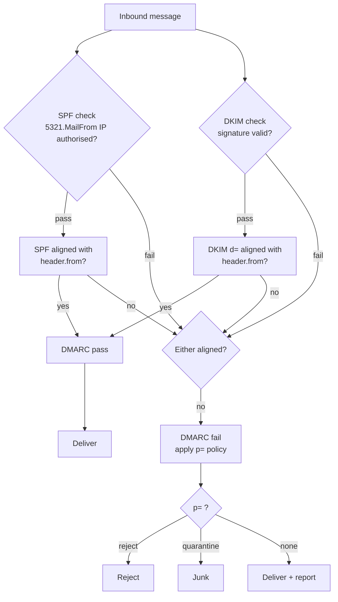
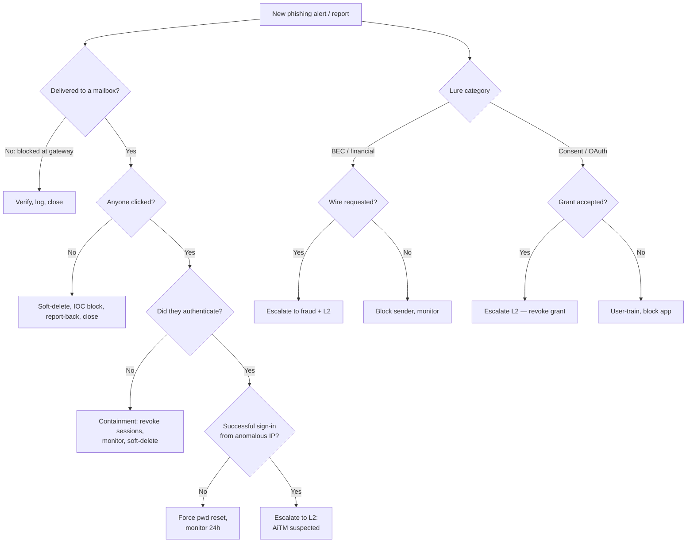
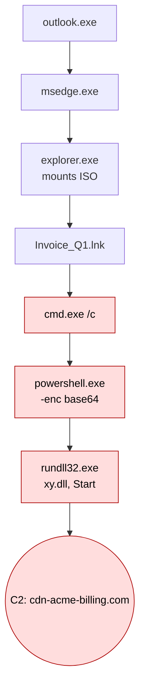
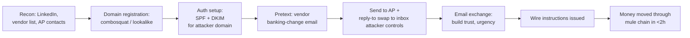
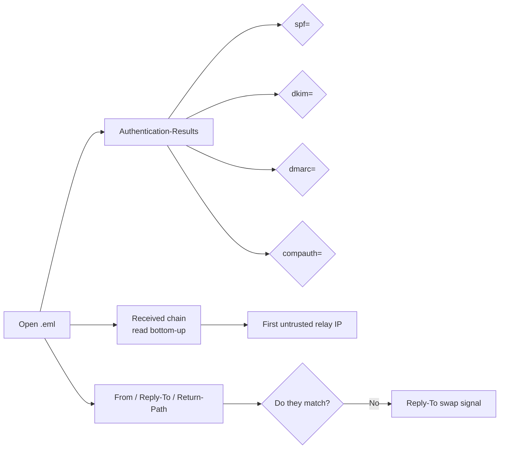

# Research Dossier: Phishing Triage (L1 SOC, Module 6)

> Source dossier for ION L1 *Alert Triage Fundamentals*, Module 6. Audience: junior SOC analyst on day-shift triage, expected to confidently work a phishing alert end-to-end and decide escalate / contain / close. Depth bar: BTL1 / SANS GCIH equivalent. Sized to author 4 reading lessons (~2,000–3,000 words each) plus 4 mixed-kind quizzes. References at end so the author can cross-check.

---

## 1. Phishing Taxonomy

Phishing is the catch-all term for socially engineered messages that try to get a victim to do something they would not do if they knew the truth — most commonly hand over credentials, click a malicious link, open a weaponised attachment, or wire money. For a triager, the *family* of phishing matters because each family produces a different set of artefacts and therefore a different triage workflow. Misclassifying a Business Email Compromise (BEC) attempt as a generic credential phish, for example, will lead the analyst to focus on URL reputation when there is no URL — and miss the wire-transfer fraud entirely.

### 1.1 Credential phishing
The classic pattern. A lure email (an invoice, a Microsoft 365 "password expires today" notice, a SharePoint share, a voicemail notification) drives the user to a landing page that mimics a real login portal. Credentials are POSTed to attacker-controlled infrastructure. Distinguishing signal: the link goes to a domain that is not the brand's real login origin (e.g., `login-microsoftonline.evilkit[.]xyz` or a compromised WordPress under `/wp-content/plugins/<name>/login.html`). M365-themed kits dominate the volume (EvilProxy, NakedPages, Caffeine, Tycoon 2FA in 2023–2025).

### 1.2 Malware delivery
The lure carries a payload — either as an attachment or via a download link. The goal is execution on the endpoint (loader → second stage → C2). Distinguishing signal: file artefact instead of, or alongside, a credential page. Common delivery primitives in 2023–2025: HTML smuggling that decodes a blob to disk inside the browser, ISO/IMG/VHD containers that bypass Mark-of-the-Web (MOTW), OneNote (.one) embedded scripts after Microsoft killed Office macros by default, .lnk shortcuts inside containers, and SVGs with embedded JavaScript.

### 1.3 Business Email Compromise (BEC)
Pure social engineering, no malware, no link. A trusted-party impersonation that asks for a financial action. Three sub-patterns the analyst will see:

- **CEO fraud / wire request** — "Hi, are you at your desk? I need you to action a wire urgently. Confidential, only deal with me." Sent from a lookalike domain or a compromised CEO mailbox.
- **Vendor invoice redirect** — Attacker has compromised the vendor's mailbox or spoofed it; sends a real-looking invoice with new banking details. ("Please update our remit-to.")
- **Payroll diversion** — HR/Payroll is targeted by an "employee" asking to change their direct-deposit account before next pay run.

Distinguishing signal: no URL, no attachment (or a benign PDF), an unusual reply-to header, and a financial verb in the body ("wire", "ACH", "remit", "direct deposit", "swift").

### 1.4 Spear phishing vs whaling
**Spear phishing** is targeted — the attacker has researched the recipient and crafts the lure with personal/organisational details (their manager's name, a real project, a real vendor). **Whaling** is spear phishing aimed specifically at executives (CFO, CEO, GC). Distinguishing signal: low volume (one or two recipients, not bulk), high specificity, often arrives mid-week and mid-day to look routine.

### 1.5 Smishing and vishing
**Smishing** = phishing via SMS. The text usually carries a short URL ("USPS-redelivery", "your bank flagged a charge") and benefits from the small screen hiding the lookalike domain. **Vishing** = phishing via voice call, increasingly with AI-cloned voices. ATT&CK now tracks voice as **T1566.004 Spearphishing Voice**. The L1 will rarely "triage" a vishing call directly but may have to investigate downstream effects (someone called IT pretending to be a user, password got reset, suspicious sign-in followed).

### 1.6 Quishing (QR-phishing)
A QR code in an email (often inside a PDF or PNG attachment) encodes the malicious URL. This evades URL-rewriting and link-reputation engines that scan body text but not images. The user scans with a phone, leaving the corporate-managed endpoint and entering an unmanaged channel. Distinguishing signal: the email body is essentially "scan the QR to view the document" — the actual URL is in the QR pixels.

### 1.7 Consent phishing (OAuth abuse)
Instead of stealing a password, the attacker registers a malicious application and tricks the user into clicking **Accept** on an OAuth consent prompt. The app receives a long-lived refresh token with scopes like `Mail.Read`, `Mail.Send`, `offline_access`, or `Files.ReadWrite.All`. No password ever changes hands; MFA is bypassed because the user authorised the app. This is why password resets alone *do not* remediate consent-phish — the analyst must revoke the OAuth grant.

### 1.8 Browser-in-the-Browser (BitB)
The phishing landing page renders a fake browser chrome (address bar, lock icon, padlock favicon) inside the actual browser viewport. A user inspecting "the URL" sees a perfectly spelled `login.microsoftonline.com` — but it is just HTML. Distinguishing signal: the visible URL is rendered as HTML elements, the real URL bar shows the attacker domain.

### 1.9 AiTM / MFA-bypass kits
Adversary-in-the-Middle reverse-proxy kits (Evilginx, EvilProxy, Modlishka, Tycoon 2FA, Mamba 2FA, Greatness) sit between the victim and the real Microsoft / Google login. The user authenticates *for real* against Microsoft, completes MFA *for real*, and the kit captures the resulting session cookie. The attacker then replays the cookie and skips MFA entirely on subsequent sessions. This is the dominant phishing pattern of 2024–2025 against MFA-protected tenants. Distinguishing signal: a real, successful MFA login from an unusual IP/UA shortly after the user clicked a link, often followed by the creation of an inbox rule and registration of a new MFA method.

### 1.10 MFA fatigue / push bombing
After credential capture, the attacker authenticates repeatedly causing the user's authenticator app to spam push prompts until the user taps Approve to make it stop. Frequently combined with a simultaneous "vishing" call from "IT" telling the user the prompts are legitimate. This is technically a Credential Access technique that follows phishing, but the L1 sees the same pattern in their queue.

---

## 2. Email Anatomy and Authentication

The single most cited mistake in junior phishing triage is reading "From" off the rendered email and not looking at headers. There are *two* From addresses in any email, and an attacker controls one of them more freely than the other.

### 2.1 RFC 5321 vs RFC 5322 — envelope vs header

- **RFC 5321 envelope sender** is the address used during the SMTP `MAIL FROM:` command. It tells receiving servers where to send a bounce. It is also called the *return path*, *bounce address*, or *5321.MailFrom*.
- **RFC 5322 header From** is the address rendered in the user's mail client (the "From: name <user@domain>" header). It is the *5322.From*.

These do not have to match. Legitimate marketing platforms (Mailchimp, Marketo, SendGrid) routinely have a 5321.MailFrom of `bounces@mailchimp.com` and a 5322.From of the customer's domain. Attackers exploit the same gap: spoof the visible header From while using a throwaway 5321.MailFrom that passes SPF for the throwaway domain.

DMARC's job (Section 2.5) is to require *alignment* between these two so an attacker can no longer freely spoof the header.

### 2.2 The Received chain
Every relay along the path prepends a `Received:` header, so the chain reads bottom-up (oldest at the bottom, freshest at the top). The earliest relay shows the originating IP. Triage tip: walk from the bottom up until you reach a relay you do not recognise.

```text
Received: from BN8PR12MB3651.namprd12.prod.outlook.com (...) by ...
 with HTTPS; Tue, 22 Apr 2026 09:14:11 +0000
Received: from mail.attacker-relay.example (mail.attacker-relay.example
 [203.0.113.42]) by mx0a-00069f02.pphosted.com (8.17.1.19/8.17.1.19)
 with ESMTP id 4Y8m3...; Tue, 22 Apr 2026 09:13:58 +0000
```

The bottom relay is what actually injected the mail into your perimeter. The IP `203.0.113.42` is the first thing the analyst should pivot on.

### 2.3 Authentication-Results header
This is the gateway's verdict, written by the first trusted hop. Reading it correctly is half the job. Example:

```text
Authentication-Results: spf=pass (sender IP is 203.0.113.42)
 smtp.mailfrom=bounces.acme-marketing.com;
 dkim=pass (signature was verified) header.d=acme.com;
 dmarc=pass action=none header.from=acme.com;
 compauth=pass reason=100
```

Compare to a forged-looking one:

```text
Authentication-Results: spf=fail (sender IP is 203.0.113.42)
 smtp.mailfrom=acmе.com;          ← cyrillic 'е'
 dkim=none (message not signed);
 dmarc=fail action=quarantine header.from=acme.com;
 compauth=fail reason=001
```

`compauth` is Microsoft's *composite authentication* result and it is a useful single-field summary. `reason=001` means the message failed explicit DMARC; `reason=000` means DMARC failed and the policy was none/quarantine; `reason=130` is "passed implicit auth"; `reason=100` is full pass. (Microsoft Learn: *Anti-spam message headers in Microsoft 365*.)

### 2.4 SPF — Sender Policy Framework (RFC 7208)
A DNS TXT record on the sending domain that lists which IPs are authorised to send mail "From" that domain at the *envelope* level (5321.MailFrom).

Example: `v=spf1 include:_spf.google.com include:spf.protection.outlook.com ip4:198.51.100.0/24 -all`

Result codes the analyst will see:

| Result | Meaning |
| ------ | ------- |
| `pass` | The IP is explicitly authorised. |
| `fail` (`-all`) | Hard fail — should be rejected. |
| `softfail` (`~all`) | Probably not authorised but accept and mark. |
| `neutral` (`?all`) | Domain owner makes no assertion. |
| `none` | No SPF record published. |
| `permerror` / `temperror` | Lookup or syntax problem; not a verdict. |

**What SPF does and doesn't catch.** It checks the *envelope*, not the visible From, so an attacker can pass SPF for `attacker.com` while putting `header.from=ceo@yourcorp.com` in the message body — SPF says nothing about that. SPF is also broken by forwarding (the forwarding server's IP isn't in your SPF), which is why SRS exists and why ARC matters.

### 2.5 DKIM — DomainKeys Identified Mail (RFC 6376)
The sending server signs selected headers + the body with a private key; a public key sits in DNS at `<selector>._domainkey.<domain>`. The receiver re-computes the signature.

A signature header looks like:

```text
DKIM-Signature: v=1; a=rsa-sha256; c=relaxed/relaxed;
 d=acme.com; s=selector1; t=1714390451;
 bh=YzNkN2YxYmE...; h=From:To:Subject:Date:Message-ID;
 b=Hk2T9...sig...==
```

Fields the triager cares about:

- `d=` — the *signing* domain. This is what DMARC alignment compares against the header From.
- `s=` — the selector. Lets a domain rotate keys (`selector1`, `selector2`, `mar2026`, etc.).
- `bh=` — body hash. If anything along the path mutates the body (some marketing platforms append unsubscribe footers), the hash breaks and DKIM fails.
- `h=` — list of signed headers. Headers *not* in this list can be added or modified downstream without breaking the signature — including a forged `From` if the attacker is clever, hence DKIM alignment + DMARC.

**DKIM replay** is the 2023+ trick: an attacker captures a legitimately DKIM-signed message and re-injects it from their own infrastructure to new recipients. Body and headers are unchanged, so DKIM still passes. Defenders increasingly pin oversigning and short key TTLs to limit the replay window.

### 2.6 DMARC — Domain-based Message Authentication, Reporting and Conformance (RFC 7489)
DMARC ties SPF and DKIM together by requiring that *at least one* of them passes *and* aligns with the header From.

DNS record example: `_dmarc.acme.com TXT "v=DMARC1; p=reject; rua=mailto:dmarc@acme.com; ruf=mailto:forensic@acme.com; pct=100; adkim=s; aspf=s"`

Field reference:

- `p=` — policy: `none` (monitor), `quarantine` (junk folder), `reject` (refuse).
- `sp=` — subdomain policy.
- `adkim=` / `aspf=` — alignment mode: `s` strict (exact match) or `r` relaxed (organisational domain match).
- `pct=` — percentage of mail to which the policy applies (used during rollout).
- `rua=` — aggregate reports go here.
- `ruf=` — forensic (per-message) reports go here. Most large senders ignore `ruf` due to privacy.
- `fo=` — failure-reporting options: `0` (default), `1` (any auth fail), `d` (DKIM fail), `s` (SPF fail).

**What it does:** stops naive header-From spoofing of a DMARC-protected domain. **What it doesn't:** stop lookalike domains, display-name spoofing, compromised legitimate accounts, or messages from domains that don't publish DMARC. A cousin-domain attack like `acme-billing.com` will pass DMARC for `acme-billing.com` perfectly happily.

**BIMI** (Brand Indicators for Message Identification) lets a DMARC-passing brand display a verified logo in the recipient's inbox. Useful for brand defence; not directly relevant to triage decisions but its absence on a "branded" mail can be a tell.

### 2.7 ARC — Authenticated Received Chain (RFC 8617)
When mail is forwarded (mailing list, alias), the forwarding server can rewrite the message and break SPF/DKIM. ARC lets the forwarder seal the original auth result so the next hop can still trust it. The analyst sees `ARC-Authentication-Results`, `ARC-Message-Signature`, and `ARC-Seal` headers. If the gateway (M365) trusts the forwarder, an ARC-pass can override a downstream SPF fail.

### 2.8 What an attacker can spoof past
- **Display-name only** ("Mike Boss <attacker@gmail.com>"): nothing in SPF/DKIM/DMARC stops this — DMARC only protects the domain part.
- **Lookalike domains** (`rnicrosoft.com`, `acme.co` not `.com`, `acmе.com` IDN): they pass auth for *their own* domain.
- **Compromised legitimate sender** (vendor mailbox takeover): SPF/DKIM/DMARC all pass; only behaviour gives it away.
- **Reply-To swap**: From says `boss@yourcorp.com`, Reply-To says `boss.private@gmail.com`. Auth on the From passes; the conversation gets diverted on reply.

---

## 3. Lure Analysis

### 3.1 Common pretexts
The lure landscape rotates seasonally but the categories are stable:

- **HR / payroll** — "your direct deposit has been updated", "review the new handbook", "tax form correction".
- **IT / M365** — "your password expires in 24 hours", "storage quota exceeded", "MFA re-registration required", "new sign-in detected".
- **Voicemail / fax / scan** — "you have a new voicemail from +44 ...", attached PDF/HTML.
- **DocuSign / Adobe Sign / OneDrive / SharePoint** — "Mike shared a document with you".
- **Courier** — "DHL/FedEx/USPS — package held, click to schedule redelivery".
- **Invoice / quote / PO** — finance-flavoured attachments.
- **Teams / Slack chat** — out-of-band IM that links to a phishing page (rising fast as tenants enable external Teams chat).
- **Calendar invite** — Google Calendar / Outlook ICS invite from an unknown sender, body contains the lure.
- **Captcha / "verify you're human"** — increasingly used as the first hop to defeat URL crawlers; the captcha proves a human is on the page, then redirects to the real lure.
- **QR code attachment** — the message is a single PNG/PDF telling the user to scan.

### 3.2 Urgency, authority, scarcity
Lures press the same psychological levers SE has always pressed: *urgency* ("today", "in the next 30 minutes"), *authority* ("from the CEO", "from IT"), *fear* ("your account will be locked", "legal action"), and *scarcity* ("only 5 spots", "expires"). A useful triage heuristic: if the email is asking the user to do something quickly *and* outside the normal channel for that request, treat it as suspicious until proved otherwise.

### 3.3 Brand impersonation tells
- **Display name vs From domain** — "Microsoft 365 Security <noreply@account-security-portal.xyz>".
- **Hover URL ≠ display URL** — visible text says `https://login.microsoftonline.com`, hover reveals `https://o365-secure-login.azurewebsites.net/...`. Note that Azure Web Apps and other cloud hosts are commonly abused because they inherit a trusted parent domain.
- **Favicon mismatch** — the landing page's favicon is missing or pixelated. Modern kits fix this, so its absence is not exonerating.
- **Logo as inline image** vs CSS — many kits embed the logo as base64 to avoid hot-link signatures.
- **Footer details** — boilerplate copy-paste, wrong copyright year, wrong support phone, wrong physical address.

### 3.4 Lookalike domains
- **Typosquats** — `mircosoft.com`, `goggle.com`, `paypa1.com` (digit 1 for letter l).
- **Combosquats** — `microsoft-login.com`, `acme-billing-portal.com`, `office365-secure.net`. The brand is present but with extra tokens.
- **Homoglyph / IDN / punycode** — Unicode characters that render like ASCII: Cyrillic `а` (U+0430) for Latin `a`, Greek `ο` for Latin `o`. The ACE encoding (`xn--...`) gives it away in headers. Tooling: `dnstwist`, `urlcrazy`, Microsoft Defender's "Look-alike Domain" detection.
- **TLD swap** — `acme.co`, `acme.io`, `acme.app` when the real one is `acme.com`.
- **Sub-domain abuse** — `acme.com.evilkit.xyz` looks legitimate at a glance because users read left-to-right.

Worked example: an analyst inspects `https://login.microsoftоnline-verify.com/auth?...` and notices the `о` in `microsoft` is U+043E. The header rendering shows the real domain as `xn--micrsft-...`. That's enough on its own to confirm the message is malicious.

---

## 4. Attachment and Link Triage

### 4.1 Risky file types

| Extension | Why it's dangerous | What to look for |
| --------- | ------------------ | ---------------- |
| `.html` / `.htm` | HTML smuggling — JS in the page assembles a payload from a base64 blob and offers it as a download. | Long base64 strings, `Blob`, `msSaveOrOpenBlob`, `URL.createObjectURL`. |
| `.iso` / `.img` / `.vhd` / `.vhdx` | Container types that historically did not propagate Mark-of-the-Web to extracted files. Microsoft now propagates MOTW from .iso (Windows 11 22H2+) but estate coverage is mixed. | LNK or EXE inside, autorun.inf is dead but icon-spoof is alive. |
| `.lnk` | Shortcut whose `Target` runs `cmd`/`powershell`/`mshta`/`rundll32` with attacker args. | Inspect with `lnkparser` / `LECmd`; look at `Arguments` and `IconLocation`. |
| `.one` (OneNote) | Can embed any OLE attachment (HTA, JS, BAT, CMD, VBS). Exploded Q1 2023 after Office macros were blocked by default. | Inspect with `pyOneNote`; look at `EmbeddedFiles`. |
| `.pdf` | Embedded JavaScript, embedded files, or just a phishing link — most modern PDF "phish" is the latter. | `pdfid.py`, `peepdf`. Look for `/JS`, `/JavaScript`, `/OpenAction`, `/EmbeddedFile`, `/URI`. |
| Office `.docm`/`.xlsm` macros | Blocked by default for Internet-zone files since 2022, but still relevant where MOTW is missing. | `oletools` (`olevba`, `oleid`). |
| `.xll` | Excel add-in DLL. Loaded with no macro warning if accepted. Now blocked-by-default in newer Office builds. | Hash + sandbox. |
| `.svg` | XML with `<script>` or `<foreignObject>`; renders inline in the browser and runs JS. | grep for `<script`, `eval`, `data:` URIs. |
| Password-protected `.zip` / `.7z` / `.rar` | Defeats most gateway sandboxes that can't unpack without the password (which is in the email body). | Note the password from the email and submit privately if needed. |
| ClickOnce `.application` / `.appref-ms` | Launches a signed-looking installer from a URL. | Inspect the `<deployment>` URL in the manifest. |
| `.msi` / `.msix` / `.appx` | Modern installer formats; some kits use signed MSIX with a leaf cert. | Verify signer chain; sandbox; look at custom actions. |
| `.url` / `.website` | Internet shortcut files. Windows resolves the icon path immediately, which has been used for SMB credential theft. | Inspect `URL=`, `IconFile=`, `WorkingDirectory=`. |

### 4.2 URL reputation triage
Free / community tooling the L1 should know:

- **VirusTotal** — multi-engine reputation, passive DNS, downloaded files history. Watch the "Relations" tab. **Public submissions are visible.**
- **urlscan.io** — fetches the URL in a sandboxed browser, screenshots the result, dumps the DOM and network traffic. Default visibility is *public*; use *unlisted* or *private* when triaging targeted lures.
- **Hybrid Analysis (Falcon Sandbox)** — file and URL detonation; combines static + dynamic.
- **abuse.ch URLhaus** — community blocklist of malware-distribution URLs; good for IOC pivots.
- **abuse.ch ThreatFox** — IOC sharing, often pre-VT.
- **OPSWAT MetaDefender** — multi-engine static for files; less common in BAU.
- **Cisco Talos / Spamhaus / SURBL** — IP/domain reputation lookups.
- **PhishTank / OpenPhish** — community phish URL lists.

### 4.3 OPSEC trap (revisited from Module 5: IOC Handling)
*If you submit an attacker-supplied URL or attachment to a public scanner, you tell the attacker that someone in your org received the lure and is investigating it.* Many kits encode the recipient (or a per-victim token) into the URL path or query. Submitting `https://kit.example/?id=abc123` to urlscan.io's public queue will appear in the kit's analytics, alerting them to burn the infrastructure or rotate the lure. **Rule of thumb:**

- **Bulk / commodity phish** (template, generic, no per-victim token) → public submission OK.
- **Targeted / spear / BEC / AiTM with per-victim token** → use *unlisted* or *private* mode; or detonate in your private sandbox; or strip identifying tokens before public submission. Module 5 covers the full taxonomy of OPSEC-safe vs unsafe IOC sharing.

### 4.4 Sandboxing — when to detonate vs static
Static analysis first if you can identify the file confidently and the lure is high-volume. Detonate in a sandbox when:

- The artefact is novel (no VT reputation).
- The triage decision turns on *behaviour* (does it call out? to where? does it write a registry key?).
- You suspect multi-stage delivery (HTML → ISO → LNK → loader) and need the chain.
- You need IOCs (C2 hostnames/IPs, dropped file hashes, named pipes, mutexes) to pivot in EDR.

Sandbox options:

- **Any.run** — interactive (the analyst can click through prompts). Community tier is public; commercial is private.
- **Joe Sandbox** — heavier static + dynamic; good behaviour graphs.
- **CAPE** — open-source Cuckoo successor; common for self-hosted.
- **Hatching Triage / Recorded Future Triage** — fast, good Yara coverage.
- **Microsoft Defender for Office 365 Detonation** — the gateway already detonates attachments and URLs (Safe Attachments, Safe Links). The verdicts surface in Threat Explorer.

---

## 5. Detection Telemetry — Email Side

When a SIEM alert says "phishing", the L1 must be able to pivot to the email source-of-truth and answer: *did the message arrive? to whom? did it deliver to the inbox? is it still there? did anyone click? was the click blocked?*

### 5.1 Microsoft 365 / Defender for Office 365
**Threat Explorer / Real-time detections** is the central pane. Filters on Sender, Recipients, Subject, URL, File, Detection technology, and Delivery action. The triager will use it to: (a) confirm scope (how many recipients), (b) check Delivery location (Inbox / Junk / Quarantine), and (c) see the URL click verdict from Safe Links.

**Email Entity Page** opens for a single message and shows headers, body preview, attachments, URLs, detection details, and an action menu (Soft delete / Hard delete / Move to junk / Submit to Microsoft). The Delivery action is one of `Delivered`, `Junked`, `Blocked`, or `Replaced`. The Latest delivery location is one of `Inbox`, `Junk`, `Quarantine`, `External`, `Failed`, `Dropped`, `Forwarded`, `On-prem`, `Deleted items`, `Unknown`.

**Quarantine** holds messages blocked at the gateway. The L1 reviews user-released messages and can release/deny pending admin approval depending on policy.

**ZAP (Zero-hour Auto Purge)** is the post-delivery action that retroactively removes a message from inboxes when the verdict updates. The trace will show `ZAP` in delivery action and a `LatestStatus` of `FilteredAsSpam`/`FilteredAsMalware`/`FilteredAsPhish`.

**Submissions API (admin)** is how the analyst reports a confirmed phish back to Microsoft for tenant-wide block + global signal improvement. (Microsoft Learn: *Submit messages to Microsoft for analysis*.)

### 5.2 Exchange Message Trace
The mail-flow log. Useful when Threat Explorer doesn't have the message (e.g., licensing tier without DfO P2). Key fields visible to the analyst:

- `Received` — timestamp.
- `SenderAddress` — 5321 envelope sender.
- `RecipientAddress` — recipient (one row per recipient).
- `Subject`.
- `Status` — `Delivered`, `FilteredAsSpam`, `Quarantined`, `Failed`, `Pending`, `Resolved`, `Expanded`.
- `MessageTraceId` (GUID) — pivot key for detailed trace.
- `MessageId` — RFC 5322 Message-ID header.
- `FromIP`, `ToIP`.
- `Connector` — which connector the message used in/out (useful for partner-domain spoof checks).
- `OrganizationId` (GUID).
- `Size`.

PowerShell example:

```powershell
Get-MessageTrace -SenderAddress "*@suspicious-domain.example" `
                 -StartDate (Get-Date).AddDays(-7) `
                 -EndDate (Get-Date) |
  Select-Object Received,SenderAddress,RecipientAddress,Subject,Status |
  Sort-Object Received |
  Format-Table -AutoSize
```

For rich detail per message use `Get-MessageTraceDetail -MessageTraceId <guid>`. The data window for the Get-MessageTrace cmdlet is typically the past 10 days; for older data use historical search.

### 5.3 Google Workspace
Equivalent capabilities, different UI:

- **Investigation tool** (Security Center) — search Gmail logs by sender, recipient, subject, URL, attachment hash; bulk actions (delete, restore, mark as phishing, send to quarantine).
- **Email log search** — lighter-weight log viewer in Admin console.
- **Show original** in Gmail — gives the full RFC 5322 source plus an authentication summary.
- **Headers** specific to Google: `X-Gm-Message-State`, `X-Google-Smtp-Source`, `Received-SPF`, `ARC-*`.

### 5.4 Third-party gateways

- **Proofpoint TAP / TRAP** — TAP is the URL/attachment sandboxing layer; TRAP automates remediation (pull from inboxes after verdict change). TRAP "auto-pull" is the equivalent of M365's ZAP.
- **Mimecast** — Targeted Threat Protection (URL Protect, Attachment Protect, Impersonation Protect). Search by message ID in the Admin console; view trace and held queue.
- **Cisco IronPort / Secure Email Gateway** — message tracking via the Web Interface; CLI: `grep`, `tail`, `findevent`.
- **Barracuda, Trend, Sophos, Abnormal Security** — each has its own console; the L1 should know which one is in front of mail in their estate.

The pivot pattern is always the same: SIEM alert → message-id or sender → email gateway console → confirm scope and delivery → containment.

---

## 6. Detection Telemetry — Endpoint and Network Side

If the user clicked, the picture extends beyond mail.

### 6.1 Proxy / CASB / SSE
- **Netskope, Zscaler ZIA, Defender for Cloud Apps, Cisco Umbrella, Cloudflare Gateway** — log every HTTP(S) request with the user, source IP, destination domain, URL category, action (allow/block), and TLS metadata. The phishing analyst's pivot: "did the user resolve and POST to the lure domain in the 30 minutes after delivery?"
- **DNS first-resolution / NX uplift** — many kits use brand-new or just-registered domains; the first internal resolution of such a domain is a strong signal.

### 6.2 EDR — process trees
The "smoking gun" of a clicked phishing link or a detonated attachment is a process chain rooted at a mail/browser process spawning something it has no business spawning. Suspicious children:

- `outlook.exe → cmd.exe / powershell.exe / wscript.exe / cscript.exe / mshta.exe / rundll32.exe / regsvr32.exe`
- `msedge.exe / chrome.exe / firefox.exe → cmd.exe / powershell.exe`
- `winword.exe / excel.exe / powerpnt.exe → powershell.exe / wscript.exe / cmd.exe`
- `explorer.exe → <something in Downloads>` immediately after a download event
- `mshta.exe https://... ` — HTA download-and-run
- `regsvr32.exe /s /n /u /i:http://... scrobj.dll` — Squiblydoo / SCT abuse
- `rundll32.exe javascript:...` — JS via rundll32

Modern EDRs (Defender XDR, CrowdStrike, SentinelOne, Carbon Black, Cortex XDR) all expose process-lineage queries. AMSI captures inline-script content (PowerShell, JScript, VBScript, Office macros) before execution, giving the analyst the actual script text to read.

### 6.3 Sysmon-equivalent fingerprints
A useful Sysmon coverage map for phishing follow-on:

- **Event ID 1 — Process Create** — parent/child chains, command line, hashes.
- **Event ID 3 — Network Connect** — browser/loader → C2.
- **Event ID 7 — Image Load** — DLL side-loading by a downloader.
- **Event ID 11 — File Create** — payload dropped to disk.
- **Event ID 15 — File Create Stream Hash (MOTW)** — Zone.Identifier ADS shows the file came from the Internet zone.
- **Event ID 22 — DNS Query** — browser/loader resolves the C2.
- **Event ID 25 — Process Tampering** — image hollowing / unmapping.

### 6.4 ECS field paths the L1 will use
ION's SIEM and most modern stacks normalise to Elastic Common Schema. Fields the phishing triager queries against repeatedly:

- `process.parent.name`, `process.name`, `process.command_line`, `process.executable`, `process.entity_id`
- `process.parent.command_line`
- `user.name`, `host.name`, `host.os.family`
- `url.original`, `url.domain`, `url.path`, `url.full`
- `dns.question.name`, `dns.question.type`, `dns.resolved_ip`
- `file.hash.sha256`, `file.path`, `file.name`, `file.extension`
- `email.subject`, `email.from.address`, `email.to.address`, `email.message_id`, `email.delivery_timestamp`
- `event.action`, `event.category`, `event.outcome`
- `network.protocol`, `destination.ip`, `destination.domain`, `tls.server.ja3s`

(Field reference: Elastic's *ECS field reference*, current schema 8.x. Note that the `email.*` namespace was added in ECS 8.6.)

### 6.5 Worked SIEM query patterns

**KQL (Defender XDR Advanced Hunting):**

```kql
// Browser/Outlook spawning script-host
DeviceProcessEvents
| where Timestamp > ago(24h)
| where InitiatingProcessFileName in~ ("outlook.exe","msedge.exe","chrome.exe","firefox.exe")
| where FileName in~ ("powershell.exe","cmd.exe","wscript.exe","cscript.exe","mshta.exe","rundll32.exe","regsvr32.exe")
| project Timestamp, DeviceName, AccountName,
          InitiatingProcessFileName, FileName, ProcessCommandLine, ReportId
```

```kql
// Pivot from a confirmed-phish URL to clicks
let badUrl = "https://o365-secure-login.azurewebsites.net/auth";
UrlClickEvents
| where Url has badUrl
| project Timestamp, AccountUpn, ActionType, NetworkMessageId, Url, ThreatTypes
| join kind=inner (
    EmailEvents
    | project NetworkMessageId, Subject, SenderFromAddress, RecipientEmailAddress, DeliveryAction
) on NetworkMessageId
```

**Elasticsearch / Lucene (ION-style):**

```text
event.category:process AND
process.parent.name:(outlook.exe OR msedge.exe OR chrome.exe) AND
process.name:(powershell.exe OR cmd.exe OR mshta.exe OR rundll32.exe OR regsvr32.exe)
```

```text
event.dataset:o365.audit AND
event.action:("UserLoggedIn" OR "Add-MailboxPermission") AND
o365.audit.ResultStatus:"Success" AND
source.geo.country_iso_code:(NG OR RU OR IR OR KP)
```

---

## 7. AiTM, OAuth Consent and MFA Fatigue

This is the biggest category of "phishing succeeded despite MFA" incidents and the L1 needs to recognise it within minutes.

### 7.1 AiTM signal in Entra ID sign-in logs
Microsoft Entra ID (Azure AD) logs every interactive and non-interactive sign-in. The triage fields:

- `userPrincipalName`, `userId`
- `appDisplayName`, `appId` (e.g., `Office 365 Exchange Online`, `Microsoft Office`, `Microsoft Authentication Broker`)
- `ipAddress`
- `deviceDetail.browser`, `deviceDetail.operatingSystem`, `deviceDetail.deviceId`
- `location.countryOrRegion`, `location.city`
- `clientAppUsed` (e.g., `Browser`, `Mobile Apps and Desktop clients`, `IMAP4`, `POP3`, `Authenticated SMTP`)
- `authenticationDetails[].authenticationMethod` (e.g., `Password`, `Mobile app notification`, `FIDO2 security key`)
- `authenticationRequirement` (`singleFactorAuthentication` / `multiFactorAuthentication`)
- `mfaDetail.authMethod`, `mfaDetail.authDetail`
- `riskState` (`none` / `confirmedSafe` / `remediated` / `dismissed` / `atRisk` / `confirmedCompromised`)
- `riskLevelAggregated`, `riskLevelDuringSignIn`
- `riskEventTypes_v2` — important values for phishing triage:
  - `unfamiliarFeatures`
  - `anonymizedIPAddress` (Tor / VPN)
  - `maliciousIPAddress`
  - `unlikelyTravel` ("impossible travel")
  - `passwordSpray`
  - `tokenIssuerAnomaly`
  - `suspiciousBrowser`
  - `riskyIPAddress`
  - `mcasImpossibleTravel`
  - `mcasFinSuspiciousInboxManipulationRules`
  - `tokenIssuedFromAnonymousIP`
  - `mcasSuspiciousOAuthAppFileDownloadActivities`
  - `anomalousToken`, `anomalousUserActivity`
- `correlationId`, `sessionId` (the latter is gold — same session ID re-used from a new IP/UA = cookie replay)

The textbook AiTM pattern in the log:

1. Real successful interactive sign-in from the user's normal IP, MFA satisfied.
2. Within minutes, a non-interactive sign-in for the same `sessionId` from a different IP / country / UA, MFA `previouslySatisfied`.
3. Inbox rule creation event in the Unified Audit Log.
4. New device or auth-method registration (T1098.005).

### 7.2 Microsoft 365 Unified Audit Log — events the L1 cares about
- `New-InboxRule` / `Set-InboxRule` — auto-forward, move-to-RSS-Feeds, delete-on-receipt.
- `Add-MailboxPermission` — granting Full Access / Send-As to another mailbox.
- `Set-Mailbox -ForwardingSmtpAddress` — forwarding at mailbox level.
- `Add-MailboxFolderPermission` — exfil via shared folder.
- `Update application` / `Add service principal` / `Consent to application` — OAuth / Enterprise App changes.
- `Add member to role` — privilege escalation post-takeover.

### 7.3 Illicit consent grant detection
When a user clicks Accept on a malicious OAuth app, three things happen:

1. The app appears in **Enterprise applications** in Entra ID.
2. A delegated permission grant is recorded (`Add delegated permission grant`).
3. A refresh token is issued to the app.

Identification queries:

```powershell
# All consent grants in the tenant — review for unfamiliar app names and risky scopes
Connect-MgGraph -Scopes "Directory.Read.All","DelegatedPermissionGrant.ReadWrite.All"
Get-MgOauth2PermissionGrant -All |
  Select-Object ClientId,ConsentType,PrincipalId,ResourceId,Scope |
  Sort-Object ClientId
```

Risky scopes the L1 should flag immediately:

- `Mail.Read`, `Mail.ReadWrite`, `Mail.Send`
- `MailboxSettings.ReadWrite` (lets the app create inbox rules without UI)
- `offline_access` (refresh-token persistence)
- `Files.ReadWrite.All`, `Sites.ReadWrite.All`
- `User.Read.All`, `Directory.Read.All`
- `Contacts.ReadWrite`

Containment of consent phish requires *revoking the app grant* (and the refresh tokens it issued), not just resetting the user's password:

```powershell
# Revoke a malicious app's permission grants tenant-wide
$badAppId = "00000000-1111-2222-3333-444444444444"
Get-MgOauth2PermissionGrant -All |
  Where-Object ClientId -eq $badAppId |
  ForEach-Object { Remove-MgOauth2PermissionGrant -OAuth2PermissionGrantId $_.Id }
# Then revoke active sessions for affected users
Revoke-MgUserSignInSession -UserId user@acme.com
```

### 7.4 Legacy auth and the `EnableImap`/`EnablePop` flags
Legacy protocols (IMAP4, POP3, SMTP AUTH, Exchange ActiveSync with basic auth, Autodiscover with basic auth) bypass MFA at the protocol level. Microsoft has deprecated basic auth for most of these but tenants still find IMAP enabled on individual mailboxes. The audit field is `Set-CASMailbox -ImapEnabled $true`. For triage, if a sign-in shows `clientAppUsed:IMAP4` for an MFA-enrolled user, treat it as suspicious.

### 7.5 The classic post-takeover BEC pivot
The single most diagnostic post-AiTM action is creation of an **inbox rule** that:

- moves messages containing finance keywords (`invoice`, `wire`, `swift`, `ach`, `payment`, `bank`, `remit`) to RSS Feeds / Conversation History / Archive,
- *and* marks them read or deletes them,
- *and* optionally auto-forwards to an external address.

The reason: the attacker wants to intercept replies to their fraudulent thread without the legitimate user noticing. Hunt query (UAL):

```text
Operations:"New-InboxRule" OR "Set-InboxRule"
| where Parameters has_any ("MoveToFolder","DeleteMessage","ForwardTo","RedirectTo","MarkAsRead")
| where Parameters has_any ("invoice","wire","swift","ach","payment","bank","remit")
```

---

## 8. User-Reported Phishing Pipeline

### 8.1 The reporting tools
- **Microsoft Report Message / Report Phishing** — built-in Outlook button; submits to the tenant Submissions queue and (if configured) to Microsoft.
- **PhishER (KnowBe4)** — orchestration layer for user-reported mail; auto-tags, runs YARA, integrates with VirusTotal/Hybrid Analysis, can push to PhishRIP for tenant-wide pull.
- **Cofense Reporter / Triage / Vision** — equivalent stack from Cofense.
- **Custom button + shared mailbox** — `phishing@yourcorp.com` / `report-spam@`. Cheaper, much higher false-positive rate, no automation.

### 8.2 Queue triage SLA
Typical L1 SLAs (reference, not gospel):

- High-volume burst (same subject ≥ 5 reports in 10 min) — investigate within 15 minutes.
- Single user report from a privileged account or VIP — within 30 minutes.
- Standard single user report — within 4 business hours.
- Bulk advertising / non-malicious — close at end-of-shift batch.

### 8.3 False-positive categories
Most user-reports are not phishing. The L1 needs to be able to dispose of these without bouncing them upstream:

- Newsletters and marketing the user opted into.
- Internal mail with unfamiliar branding (a new HR system, a new SaaS rollout).
- Cold sales outreach.
- Calendar invites from external partners.
- Mail bouncing through a forwarder that broke SPF/DKIM (auth-fail tells, real content).
- Genuine M365 / Google service notifications.

### 8.4 Confirmed-phish workflow
When a report is confirmed malicious:

1. **Scope the spread.** Mail-trace the sender / subject / URL / attachment hash across the tenant. Note all recipients and delivery locations.
2. **Pull from inboxes.** Soft-delete first, hard-delete if approved. Microsoft 365 example:

   ```powershell
   # Compliance Search + soft-delete (preferred for reversibility)
   New-ComplianceSearch -Name "Phish-2026-04-28" `
     -ExchangeLocation All `
     -ContentMatchQuery 'subject:"Action required: M365 password expires today" AND from:notify@*.azurewebsites.net'
   Start-ComplianceSearch -Identity "Phish-2026-04-28"
   New-ComplianceSearchAction -SearchName "Phish-2026-04-28" -Purge -PurgeType SoftDelete
   ```

   Or via Microsoft Graph Submissions API for tenant-wide remediation actions.

3. **Affected user containment** (only if there is a confirmed click / credential entry / token issue):
   - Revoke active sessions: `Revoke-MgUserSignInSession`.
   - Force password reset.
   - Force MFA re-registration.
   - Check inbox rules, forwarding rules, and recent mailbox permission changes.
   - Check OAuth grants for the user; revoke any unfamiliar.
   - Check `MFA methods` for newly added authenticators.
4. **IOC pivot**:
   - Domain → block at email gateway, web proxy, DNS, EDR custom IOC.
   - Sender (5321 + 5322) → block / tenant-allow-block list.
   - URL → block at proxy/CASB and Safe Links; submit to Microsoft if confirmed.
   - File hash → block in EDR.
   - Sender IP (cautiously — many shared infra hosts).
5. **Threat-hunt sweep** for any other recipients who clicked / authenticated, in the 7-day window before and after delivery.
6. **Submit to vendors** for global signal: Microsoft Submissions, Google's "Report phishing", urlscan/abuse.ch (within OPSEC limits — see §4.3).
7. **Close-out artefacts** captured: original `.eml`, headers, attachment hashes, screenshots of landing page, summary of containment actions, notification to affected user.

---

## 9. Triage Decision Framework

A junior analyst's job is to make a *defensible* decision quickly. The decision is one of three:

- **Close — benign.** Marketing, newsletter, internal mail flagged, false positive.
- **Confirm phish — contained at gateway, no click.** Quarantine + block + close + report-back to user.
- **Escalate to L2.** Real click, real auth, real cred entry, real malware execution, BEC suspected, or scope > 1 user.

### 9.1 Decision inputs the L1 must collect
- *Was it delivered?* (Threat Explorer / Message Trace)
- *Where did it land?* (Inbox / Junk / Quarantine)
- *Is it still there?* (or has ZAP / TRAP already pulled it)
- *Did anyone click?* (UrlClickEvents / proxy logs)
- *Did anyone authenticate?* (Entra ID sign-in logs for the lure landing)
- *Did anything execute?* (EDR process tree)
- *Who else got it?* (mail-trace, scope)
- *Is the recipient a privileged / VIP user?*
- *What is the lure asking for?* (cred / payment / file / OAuth)

### 9.2 Escalation criteria (escalate to L2)
- Successful sign-in attributable to the lure (AiTM token theft).
- OAuth consent granted to an unfamiliar app.
- EDR alert fires from a process descended from `outlook.exe` or `<browser>.exe`.
- Inbox / forwarding rule created in the same window as a suspicious sign-in.
- Multiple recipients (≥ 3 in your default policy, configurable) clicked.
- VIP / executive / privileged-account recipient interacted.
- BEC pattern detected (financial verb + lookalike domain + reply-to swap + outgoing thread already in progress).
- Anything novel (no IOC matches, no template matches in past 30 days).

### 9.3 L1 containment authority (typical, configurable per tenant)
- Soft-delete confirmed phish across inboxes via Compliance Search / TRAP / PhishRIP.
- Add IOC to email gateway and proxy block lists.
- Force password reset / MFA re-registration / sign-out for *one* affected user.
- Disable a user account temporarily.
- Submit to Microsoft / Google.

### 9.4 L2 territory (do not action without escalation)
- Mailbox forensics (recovery of pre-purge content, contents of inbox rules, journaling).
- OAuth grant revocation (privilege required + tenant-wide impact).
- Threat-hunt sweep across 30+ days / multiple data sources / multiple users.
- Coordinated takedown requests (registrar / hosting provider).
- Fraud-team handoff for confirmed BEC with attempted wire transfer.
- Legal hold / preservation if litigation likely.

---

## 10. MITRE ATT&CK Mapping

ATT&CK Enterprise v15+ techniques the analyst should be able to cite:

### Initial Access (TA0001)
- **T1566 — Phishing** (parent)
  - **T1566.001 — Spearphishing Attachment** — file delivery via email attachment.
  - **T1566.002 — Spearphishing Link** — URL delivery via email.
  - **T1566.003 — Spearphishing via Service** — LinkedIn DM, Twitter DM, Discord, Teams external chat.
  - **T1566.004 — Spearphishing Voice** — vishing.

### Resource Development (TA0042)
- **T1583 — Acquire Infrastructure**
  - **T1583.001 — Domains** — typosquats, lookalikes.
  - **T1583.004 — Server**
  - **T1583.006 — Web Services** — abuse of Azure Web Apps, Cloudflare Workers, Vercel, GitHub Pages, AWS S3, Firebase.
  - **T1583.008 — Malvertising**
- **T1585 — Establish Accounts**
  - **T1585.002 — Email Accounts**
  - **T1585.003 — Cloud Accounts**
- **T1587 / T1588 — Develop / Obtain Capabilities** (kits and infra rented from criminal markets)

### Defense Evasion (TA0005)
- **T1656 — Impersonation** — display-name and brand impersonation.
- **T1036 — Masquerading** — file extensions, icons, signed binaries.
- **T1027 — Obfuscated Files or Information** — HTML smuggling falls under T1027.006.

### Credential Access (TA0006)
- **T1056 — Input Capture** — browser-based credential theft on the landing page.
- **T1539 — Steal Web Session Cookie** — AiTM kits.
- **T1621 — Multi-Factor Authentication Request Generation** — push bombing.

### Persistence (TA0003)
- **T1098 — Account Manipulation**
  - **T1098.005 — Device Registration** — adversary registers their own device for MFA / Conditional Access bypass.
- **T1556 — Modify Authentication Process**
- **T1136 — Create Account** — guest account in Entra ID.
- **T1098.003 — Additional Cloud Roles**

### Collection (TA0009)
- **T1114 — Email Collection**
  - **T1114.001 — Local Email Collection**
  - **T1114.002 — Remote Email Collection**
  - **T1114.003 — Email Forwarding Rule** — the BEC textbook persistence/exfil hybrid.

### Command and Control (TA0011) — when click leads to follow-on malware
- **T1071 — Application Layer Protocol**
  - **T1071.001 — Web Protocols**
  - **T1071.004 — DNS**
- **T1102 — Web Service** (legitimate services for C2)
- **T1573 — Encrypted Channel**

### Exfiltration (TA0010)
- **T1567 — Exfiltration Over Web Service**

The analyst should be able to read an alert title like *"Suspicious inbox rule creation following anomalous sign-in"* and immediately map it to T1539 (cookie theft) → T1098.005 (device add) → T1114.003 (forwarding rule) — that's the AiTM-to-BEC pivot.

---

## 11. Worked End-to-End Scenarios

### 11.1 Scenario A — O365 credential phish via AiTM kit

**Initial alert.** Defender XDR fires "Anomalous sign-in followed by inbox rule creation" for `alex.bennett@acme.com`. Risk level High.

**Step 1 — pull the sign-in.** Entra ID sign-in logs show two events for Alex:

- 09:14 UTC, IP `198.51.100.10` (London — Alex's normal), browser Edge 124 / Windows 11, MFA satisfied via Authenticator push, `riskLevelDuringSignIn=low`.
- 09:21 UTC, IP `185.220.101.7` (anonymizedIPAddress, Tor exit), browser Chrome 122 / Linux, MFA `previouslySatisfied`, same `sessionId` as the 09:14 event, `riskEventTypes_v2=[anonymizedIPAddress, anomalousToken]`, `riskLevelDuringSignIn=high`.

**Step 2 — trace the email.** Threat Explorer for the previous 24h, recipient `alex.bennett@acme.com`. One delivered message stands out: subject *"Action Required: your Microsoft 365 password expires in 24 hours"*, sender `notify@m365-secure-tenant.azurewebsites.net`, delivered to Inbox at 09:11 UTC. URL Safe Links rewrote to `https://safelinks.protection.outlook.com/?url=https%3A%2F%2Fm365-secure-tenant.azurewebsites.net%2Fauth%3Frid%3DBENN-A1B2`. The `rid=BENN-A1B2` is a per-victim token — *do not submit this URL to public scanners.*

**Step 3 — confirm the click.** UrlClickEvents shows a click on that URL at 09:13 UTC, ActionType `ClickAllowed`, NetworkMessageId matching the email above.

**Step 4 — confirm the AiTM.** The 09:14 successful sign-in *immediately* followed the 09:13 click. Authentication-Method shows `Password` then `Mobile app notification` — the user typed creds into the kit, the kit relayed to Microsoft, Microsoft pushed real MFA, the user approved, the kit captured the cookie. Confirmed.

**Step 5 — confirm post-takeover action.** UAL filtered for `alex.bennett`:

- 09:21 — `New-InboxRule`, parameters: `Name="."`, `MoveToFolder="RSS Feeds"`, `BodyContainsWords="invoice,wire,swift,payment,remit"`, `MarkAsRead=true`.
- 09:22 — `Update user` adding a new authenticator method (Microsoft Authenticator on a different device id).

**Step 6 — escalate to L2.** Triage decision: confirmed AiTM with token theft + persistence + collection rule. Out of L1 authority for full remediation.

L1 containment actions before handover:

- Revoke sessions (`Revoke-MgUserSignInSession -UserId alex.bennett@acme.com`).
- Block sender domain at gateway.
- Submit message to Microsoft.
- Soft-delete the lure email tenant-wide via Compliance Search (other recipients hunt).
- Note the `rid=BENN-A1B2` token format and search for other variants in mail-trace (`rid=*-*`).

L2 picks up: forensic mailbox dump, OAuth grant review, expanded user-cohort hunt, fraud check on Alex's recent outbound mail, takedown request to Microsoft Azure abuse.

### 11.2 Scenario B — HTML smuggling → ISO → LNK → loader

**Initial alert.** EDR fires "PowerShell launched from LNK in mounted ISO" on `WS-FIN-014` (host: Priya Patel).

**Step 1 — process tree.**

```
explorer.exe (PID 5120)
  └─ msedge.exe (PID 7204)            [chrome download initiated]
      └─ explorer.exe (mount ISO, PID 8801)
           └─ Invoice_Q1_2026.lnk → cmd.exe (PID 9120)
               └─ powershell.exe -nop -w hidden -enc <base64>
                    └─ rundll32.exe %TEMP%\xy.dll,Start
```

The base64-decoded PowerShell does an `Invoke-WebRequest` to `https://cdn-acme-billing[.]com/upd.dll`, drops it as `%TEMP%\xy.dll`, and `rundll32`s it.

**Step 2 — back to the browser.** msedge.exe download history shows `Invoice_Q1_2026.html` from `https://acme-billing-portal.com/inv?id=PRIYA-93FA`. The HTML is 412 KB — large for an invoice page. `<script>` block contains a base64 blob and `Blob` + `msSaveOrOpenBlob` calls — classic HTML smuggling.

**Step 3 — back to the email.** Mail-trace for Priya: 11:42 UTC, sender `accounts@acme-billing-portal.com`, subject *"Q1 2026 invoice — overdue"*, delivered Inbox. Click telemetry shows `ClickAllowed` on the URL above at 11:44 UTC.

**Step 4 — auth check.**

- SPF for `acme-billing-portal.com` — passes for `203.0.113.42`. (Attacker owns the domain; SPF on attacker domain is unhelpful as a signal.)
- DKIM `d=acme-billing-portal.com` — passes.
- DMARC alignment — passes.
- *But:* `acme-billing-portal.com` is a 4-day-old domain (passive DNS). The real vendor is `acme.com`. This is a combosquat.

**Step 5 — IOCs and pivot.**

- Domain: `acme-billing-portal.com`, `cdn-acme-billing.com`.
- URL: `https://acme-billing-portal.com/inv?id=*` — note the per-victim token; strip before public submission.
- Hashes: SHA-256 of `Invoice_Q1_2026.html`, of the ISO, of `xy.dll`.
- Network: connection to `cdn-acme-billing.com` from `WS-FIN-014`.

**Step 6 — scope and escalate.**

- Mail-trace shows three other Finance users received variants with different tokens.
- EDR query for `process.parent.name:explorer.exe AND process.command_line:*Invoice_Q1*lnk` returns one match (Priya's host) — only Priya executed, others didn't open.
- Containment: isolate `WS-FIN-014` via EDR, soft-delete the four emails, block both domains at proxy/DNS/EDR, submit hashes to TI.

Escalate to L2 with: process-tree screenshot, HTML smuggling artefact, ISO contents, network captures, tentative ATT&CK chain (T1566.002 → T1027.006 → T1204.002 → T1059.001 → T1218.011).

### 11.3 Scenario C — BEC vendor invoice redirect (no malware)

**Initial alert.** Finance flags an email to the AP analyst from `mike.harris@acme.com`. Subject *"Updated banking details for our 2026 contract"*. AP is suspicious because Mike is normally the buyer-side contact at the vendor and never emails AP directly.

**Step 1 — open the headers.**

```text
From: "Mike Harris" <mike.harris@acme.com>
Reply-To: "Mike Harris" <mike.harris.acme@gmail.com>
Return-Path: <bounces@acme-corp-finance.com>
Received: from acme-corp-finance.com (mail.acme-corp-finance.com [203.0.113.99])
 by mx.acme-supplier.example with ESMTPS; Mon, 27 Apr 2026 14:02:15 +0000
Authentication-Results: spf=pass smtp.mailfrom=acme-corp-finance.com;
 dkim=pass header.d=acme-corp-finance.com;
 dmarc=fail action=quarantine header.from=acme.com;
 compauth=fail reason=001
```

Three immediate findings:

1. SPF and DKIM **pass for `acme-corp-finance.com`**, *not* for `acme.com`. The attacker owns this domain.
2. DMARC for `acme.com` — `fail action=quarantine` because `header.from=acme.com` does not align with any passing auth identity. Microsoft applied policy = quarantine, but tenant Allow rules let it through. (Common: the AP team allow-listed `*acme*` in a transport rule years ago.)
3. **Reply-To swap** — the visible From is `mike.harris@acme.com` but Reply-To is `mike.harris.acme@gmail.com`. If AP replies, they reply to Gmail.

**Step 2 — confirm lookalike.** `acme.com` is the legitimate vendor. `acme-corp-finance.com` is 11 days old per WHOIS. No prior mail-flow history with this domain.

**Step 3 — body content.**

> Hi team — please update our remit-to information on file before the next payment run. New details are attached. We've changed banks; please process Tuesday's invoice (PO-44910) to the new account. Confidential, do not discuss with the buyer side, this is being handled at director level.

The combination of new banking details + urgency + secrecy + a reply-to swap + a 11-day-old lookalike domain is BEC-vendor-redirect with very high confidence.

**Step 4 — check whether any payment has gone out.** Mail-trace and AP system: no wire issued yet (next run Tuesday).

**Step 5 — verify out of band.** Phone Mike on the number AP has on file (not the number in the email signature). Mike confirms he sent no such email. The address is forged.

**Step 6 — escalate to L2 / fraud.** L1 actions: tenant-block `acme-corp-finance.com`, soft-delete from AP inboxes (and any cc'd), submit to Microsoft, search mail-trace for the same sender pattern across the org. Notify the real `acme.com` security contact at the vendor (their domain is being abused).

ATT&CK chain: T1583.001 (lookalike domain) → T1656 (impersonation) → T1566.002 (phishing) → attempted T1657 (financial theft).

---

## 12. Mermaid-Friendly Visuals (for the lessons)

The author should embed at least the following diagrams. Reference Mermaid blocks given so the author can drop them in directly.

### 12.1 SPF / DKIM / DMARC validation flowchart



### 12.2 AiTM kit topology

```mermaid
sequenceDiagram
    actor U as User
    participant K as AiTM kit<br/>(reverse proxy)
    participant M as login.microsoftonline.com
    U->>K: GET /auth (clicked phishing link)
    K->>M: GET /auth (proxied)
    M-->>K: login form
    K-->>U: login form (rendered as if from M)
    U->>K: username + password
    K->>M: username + password
    M-->>K: MFA challenge
    K-->>U: MFA challenge
    U->>M: MFA approve (push)
    M-->>K: session cookie + ID/access tokens
    K->>K: STORE cookie + tokens
    K-->>U: redirect to real M365 (looks normal)
    Note over K: Attacker replays cookie<br/>from their own host;<br/>MFA already satisfied.
```

### 12.3 Phishing alert triage decision tree



### 12.4 Click-path on endpoint as process tree



### 12.5 BEC pretext-to-payment lifecycle



### 12.6 Post-confirmation containment checklist

```mermaid
flowchart TD
    C[Confirmed phish] --> S[Scope mail-trace<br/>tenant-wide]
    S --> P[Pull from inboxes<br/>soft-delete]
    P --> CB[Block IOCs:<br/>domain / URL / hash / sender]
    CB --> U{User clicked?}
    U -->|No| R[Report-back to user,<br/>close]
    U -->|Yes| RV[Revoke sessions,<br/>force pwd + MFA reset]
    RV --> O[Check OAuth grants,<br/>inbox rules,<br/>forwarding,<br/>MFA methods]
    O --> H[Hunt 7-day window<br/>for related activity]
    H --> SUB[Submit to Microsoft / Google,<br/>abuse.ch / VT (OPSEC-aware)]
    SUB --> CLOSE[Close ticket with<br/>artefacts attached]
```

### 12.7 (Optional) Email auth header reading order



---

## References (for the author to cross-check)

- **RFC 5321** — Simple Mail Transfer Protocol (envelope sender).
- **RFC 5322** — Internet Message Format (header From).
- **RFC 7208** — Sender Policy Framework (SPF).
- **RFC 6376** — DomainKeys Identified Mail (DKIM).
- **RFC 7489** — Domain-based Message Authentication, Reporting and Conformance (DMARC).
- **RFC 8617** — Authenticated Received Chain (ARC).
- **Microsoft Learn** — *Anti-spam message headers in Microsoft 365* (compauth reasons, X-Forefront-Antispam-Report, X-Microsoft-Antispam).
- **Microsoft Learn** — *Threat Explorer and real-time detections in Microsoft Defender for Office 365*.
- **Microsoft Learn** — *Email Entity Page in Microsoft Defender for Office 365*.
- **Microsoft Learn** — *Get-MessageTrace*, *Get-MessageTraceDetail* cmdlet references.
- **Microsoft Learn** — *Microsoft 365 Defender Advanced Hunting schema* (EmailEvents, EmailUrlInfo, UrlClickEvents, AADSignInEventsBeta, IdentityLogonEvents).
- **Microsoft Learn** — *Sign-in logs in Microsoft Entra ID* (riskEventType, riskState, conditional access result).
- **Microsoft Learn** — *Detect and Remediate Illicit Consent Grants* (Azure AD).
- **Microsoft Learn** — *Microsoft Graph API: Submissions, mailFolders, messageRule, oauth2PermissionGrant*.
- **MITRE ATT&CK** — Enterprise v15+: T1566 (and sub-techniques), T1583, T1585, T1656, T1539, T1098.005, T1556, T1114.003, T1621, T1027.006, T1218.011, T1657.
- **MITRE ATT&CK** — *Phishing for Information* (T1598) for distinguishing recon-only campaigns.
- **Elastic** — *ECS field reference* 8.x: `email.*`, `process.*`, `url.*`, `dns.*`, `file.*`.
- **Sysmon** — Mark Russinovich, *System Monitor* — event ID reference.
- **Microsoft Security Blog** — write-ups on AiTM (Storm-1167, DEV-1101 / EvilProxy / Tycoon 2FA — verify current cluster naming).
- **Cisco Talos** / **Proofpoint** / **Mandiant** — quarterly phishing-trends reports for current campaign data.
- **abuse.ch** — URLhaus / ThreatFox / MalwareBazaar usage docs.
- **urlscan.io** — *Visibility levels* (public, unlisted, private) — re-verify before recommending OPSEC behaviour.

---

## Author handover notes (gaps to fill in)

The dossier above is enough to author 4 reading + 4 quiz lessons at the BTL1 / SANS GCIH bar without further research, but a few items the author should sanity-check before claiming them in print:

- **Vendor-specific field names** for Mimecast, Proofpoint TAP/TRAP, Cisco IronPort, Barracuda, and Abnormal Security are described at category level only — I did not pull current console-screen field labels or per-product API field references. The author should verify against the vendor admin guide for whichever gateway the lesson highlights, or keep the prose vendor-agnostic and use Microsoft 365 / Google Workspace as the worked examples (they are most likely to match the learner's environment and are the references I was most precise about).
- **Microsoft AiTM threat-actor names** (Storm-1167, DEV-1101, etc.) rotate as Microsoft renames clusters; the author should verify current naming against the Microsoft Security Blog before printing them as fact. The kit names themselves (Evilginx, EvilProxy, Tycoon 2FA, Mamba 2FA, Greatness, NakedPages, Caffeine) are stable.
- **`Get-MessageTrace` data-window** — I cite "past 10 days" as the default historical window for the cmdlet; Microsoft has changed this in the past and the author should re-check the current Microsoft Learn doc for the exact value before claiming it in a quiz answer.
- **Sysmon event IDs** are stable but the *recommended config* (SwiftOnSecurity / Olaf Hartong) changes; if the lesson points learners to a config the author should pin to a current commit hash.
- **MOTW propagation through ISO** — Microsoft started propagating MOTW from .iso (Win11 22H2) and .msi (Win10/11 servicing); estate coverage is mixed and the analyst should still treat ISO/IMG/VHD as MOTW-bypass-suspect. The author should phrase this as "historically bypassed; partly fixed in newer Windows; still risky in mixed-fleet enterprises."
- **ECS `email.*` namespace** — added in ECS 8.6. If the ION SIEM is on an older schema the field paths will differ; verify against the current schema version ION ships with before pinning queries to those exact paths.
- **L1 SLA numbers** in §8.2 are illustrative defaults; the author should either present them as "typical" or replace with the SLA published in the ION runbook to keep the lesson grounded in the platform.
- **OPSEC submission guidance** — §4.3 is consistent with Module 5 (IOC Handling); if Module 5's text has shifted the author should re-align rather than letting two modules state different rules.
- **PowerShell snippets** assume `Exchange Online Management v3` and `Microsoft.Graph` PowerShell SDK installed. The author should add a "prerequisites" callout in the practical lesson rather than letting the snippets imply these are always available.
